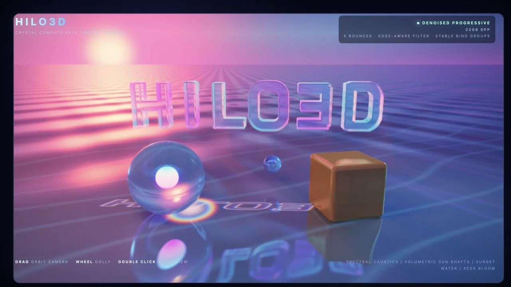

<div align="center">
  

  <p><strong>A modern Web graphics engine for production 2D and 3D experiences.</strong></p>

  <p>
    A portable RHI, validated Render Graph, and Scriptable Render Pipeline<br />
    power one shared renderer for WebGPU and WebGL 2.
  </p>

  <p>
    <a href="https://hilo3d.js.org/"><strong>Website</strong></a> ·
    <a href="https://hilo3d.js.org/examples/list.html">Examples</a> ·
    <a href="https://hilo3d.js.org/docs/">Documentation</a> ·
    <a href="https://hilo3d.js.org/docs/modules/Hilo3d.html">API</a> ·
    <a href="./README_ZH.md">简体中文</a>
  </p>

  <p>
    <a href="https://www.npmjs.com/package/hilo3d"></a>
    <a href="https://github.com/hiloteam/Hilo3d/actions/workflows/npm_test.yml"></a>
    <a href="https://github.com/hiloteam/Hilo3d/blob/dev/LICENSE"></a>
  </p>
</div>

> Hilo3D 2.0 is currently in alpha. Existing projects should review the
> [breaking changes](./CHANGELOG.md#breaking-changes) before upgrading.

## Why Hilo3D

Hilo3D keeps high-level scene authoring and low-level GPU control in the same engine. Applications
use one scene, material, render-target, and shader contract while the renderer selects a native
WebGPU path or a production WebGL 2 compatibility path.

- **One renderer, two backends** — `auto` prefers compatible WebGPU and uses WebGL 2 when WebGPU is
  unavailable. Explicit backend requests never change silently.
- **Modern materials and output** — glTF 2.0, layered PBR, HDR lighting, Bloom, tone mapping,
  transmission, volume, iridescence, clearcoat, and anisotropy.
- **2D and 3D together** — scene graph, meshes, animation, cameras, lights, shadows, sprites, text,
  batching, picking, and layered multi-camera composition.
- **GPU-driven rendering** — instancing and multi-pass rendering across both backends, plus compute,
  storage resources, and indirect workflows where WebGPU is available.
- **A frame you can shape** — a validated Render Graph and scriptable render pipeline coordinate
  shadows, scene passes, post-processing, render targets, readback, and presentation.
- **Production lifecycle** — bounded GPU caches, incremental uploads, explicit resource ownership,
  and recovery from WebGPU device loss or WebGL context loss.

## Install

```sh
npm install hilo3d
```

Hilo3D is ESM-only. It targets modern browsers with WebGPU or WebGL 2; WebGL 1 and legacy global
builds are outside the 2.0 contract.

## Create your first scene

```ts
import * as Hilo3d from 'hilo3d';

const camera = new Hilo3d.PerspectiveCamera({
    aspect: innerWidth / innerHeight,
    z: 4
});

const stage = await Hilo3d.Stage.create({
    backend: 'auto',
    container: document.querySelector('#app')!,
    camera,
    width: innerWidth,
    height: innerHeight
});

new Hilo3d.Mesh({
    geometry: new Hilo3d.BoxGeometry(),
    material: new Hilo3d.PBRMaterial({
        baseColor: new Hilo3d.Color(0.83, 0.12, 0.09)
    })
}).addTo(stage);

stage.addChild(new Hilo3d.AmbientLight({ amount: 1 }));

const ticker = new Hilo3d.Ticker(60);
ticker.addTick(stage);
ticker.start();
```

`Stage.create()` is asynchronous because backend selection and GPU initialization are asynchronous.
Use `backend: 'webgpu'` or `backend: 'webgl2'` when an application requires a specific backend.

## See the engine in motion

<table>
  <tr>
    <td width="33.33%"><a href="https://hilo3d.js.org/examples/bloom.html?backend=webgpu"></a></td>
    <td width="33.33%"><a href="https://hilo3d.js.org/examples/gltf_material_extensions.html"></a></td>
    <td width="33.33%"><a href="https://hilo3d.js.org/examples/compute_raytracing.html?backend=webgpu"></a></td>
  </tr>
  <tr>
    <td><strong>HDR Bloom</strong><br />Compute-driven light shaped through the engine post-processing pipeline.</td>
    <td><strong>glTF material extensions</strong><br />Layered Khronos assets on the shared WebGPU and WebGL 2 renderer.</td>
    <td><strong>Compute path tracing</strong><br />Progressive WebGPU tracing with denoising, caustics, and HDR output.</td>
  </tr>
</table>

[Browse the complete example gallery →](https://hilo3d.js.org/examples/list.html)

## Rendering profiles

|                     | Portable profile                                          | WebGPU profile                                            |
| ------------------- | --------------------------------------------------------- | --------------------------------------------------------- |
| Backend             | WebGPU and WebGL 2                                        | WebGPU                                                    |
| Scene and materials | Shared scene graph, PBR materials, glTF, sprites, text    | The same public engine model                              |
| Frame composition   | Render Graph, render targets, MRT, MSAA, post-processing  | The same graph with native command encoding               |
| GPU workloads       | Instancing, uniform buffers, incremental resource uploads | Compute, storage buffers/textures, indirect GPU workflows |
| Shader path         | Authored GLSL ES 3.00                                     | Preprocessed GLSL → Naga → WGSL                           |
| Recovery            | WebGL context restoration                                 | WebGPU device reacquisition and resource rebuild          |

Unsupported WebGPU-only features fail capability checks on WebGL 2 instead of being partially
emulated.

## Architecture at a glance

```text
Scene · Materials · 2D · Animation · Lights
                    │
              Shared Renderer
                    │
    Render Graph · Scriptable Render Pipeline
                    │
               Portable RHI
              ┌─────┴─────┐
           WebGPU       WebGL 2
```

The shared renderer owns scene collection, culling, sorting, instancing, shadows, post-processing,
draw preparation, and resource coordination. Production frames flow through the Render Graph and
portable RHI; backend code remains responsible only for native API execution.

Raster shaders have one GLSL ES 3.00 source of truth. WebGL 2 compiles that source directly, while
the WebGPU path preprocesses it for Naga and produces WGSL. WebGPU-only compute uses the engine's
validated `ComputeShader` contract.

Read the [rendering architecture](./documentation/RENDERING_ARCHITECTURE.md) for the complete frame,
resource, shader, and recovery contracts.

## Documentation

- [Getting started and API documentation](https://hilo3d.js.org/docs/)
- [Example gallery](https://hilo3d.js.org/examples/list.html)
- [Engineering documentation index](./documentation/README.md)
- [Rendering architecture](./documentation/RENDERING_ARCHITECTURE.md)
- [PBR, HDR, and post-processing](./documentation/PBR_AND_POST_PROCESSING.md)
- [2D rendering and multi-camera composition](./documentation/2D_RENDERING.md)
- [Scriptable render pipeline](./documentation/SCRIPTABLE_RENDER_PIPELINE_PLAN.md)
- [Breaking changes](./CHANGELOG.md#breaking-changes)

## Develop locally

Requires Node.js 20.19.0 or newer and the npm version declared by the repository.

```sh
npm ci
npm run dev
```

Useful commands:

```sh
npm run examples:dev  # run the example gallery locally
npm run typecheck     # check maintained TypeScript
npm run test          # run the test suite
npm run validate      # run the full release validation
```

See the [contributing guide](./.github/CONTRIBUTING.md) before opening a pull request.

## License

[MIT](./LICENSE) © Hilo3D contributors.
