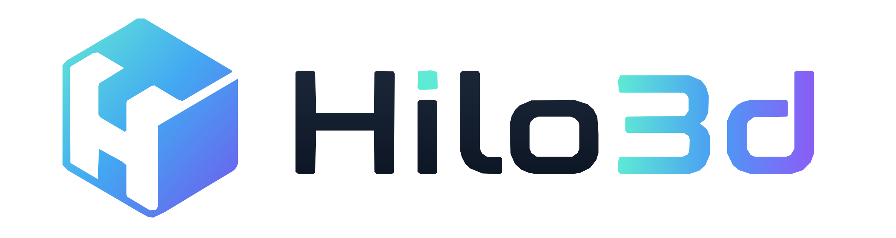

<div align="center">
  

  <p><strong>性能优先、面向 WebGPU 与 WebGL 2 的 TypeScript 3D 引擎。</strong></p>

  <p>
    <a href="https://hilo3d.js.org/"><strong>官网</strong></a> ·
    <a href="https://hilo3d.js.org/examples/index.html">示例</a> ·
    <a href="https://hilo3d.js.org/docs/">API</a> ·
    <a href="./README.md">English</a>
  </p>
</div>

> Hilo3D 2.0 处于 alpha 阶段，并有意破坏旧对象场景 API。升级前请阅读
> [破坏性变更](./CHANGELOG.md#breaking-changes)。

## 为什么选择 Hilo3D

Hilo3D 把轻量数据导向 ECS、单一共享渲染器、经过验证的 Render Graph 与可移植 RHI 组合在一起。

- 渲染、物理、交互和 gameplay 组件可以直接组合在同一个 generation-safe Entity 上。
- Transform、Hierarchy、render record、culling
  bounds、动画状态和原生物理句柄使用 sparse-set 或 packed SoA。
- 增量缓存 query 与显式 System phase 避免全场景发现和逐 Entity 动态分派。
- 渲染提取是增量的；WebGPU 与 WebGL 2 消费同一个 renderer-owned `RenderWorld`。
- `auto` 优先 WebGPU，必要时回退 WebGL 2；显式选择后端时不会静默切换。
- 共享渲染器统一负责剔除、排序、实例化、阴影、后处理、恢复和 submission-aware 资源回收。

第一版不使用通用 archetype/chunk ECS。JavaScript 对象组件放在 typed
sparse-set 中；经基准确认的数值热路径使用专门的 TypedArray SoA。

## 安装

```sh
npm install hilo3d
```

Hilo3D 采用严格 TypeScript 且只提供 ESM。支持现代 WebGPU 与 WebGL 2 浏览器；WebGL
1 和旧式全局构建不在契约内。

## 第一个场景

```ts
import {
    BasicMaterial,
    BoxGeometry,
    CameraOutput,
    Engine,
    LocalTransform,
    MeshRenderer,
    PerspectiveCamera,
    World,
    createRenderExtractionSystem,
    createTransformSystem
} from 'hilo3d';

const world = await World.create({
    systems: [createTransformSystem(), createRenderExtractionSystem()]
});

const camera = world.createEntity(LocalTransform, { position: [0, 1.5, 5] });
world.add(camera, PerspectiveCamera, {
    fov: 60,
    near: 0.1,
    far: 1000,
    aspect: innerWidth / innerHeight
});
world.add(camera, CameraOutput, { enabled: true });

const cube = world.createEntity(LocalTransform);
world.add(cube, MeshRenderer, {
    geometry: new BoxGeometry(),
    material: new BasicMaterial()
});

const engine = await Engine.create({
    backend: 'auto',
    container: document.querySelector('#app')!,
    width: innerWidth,
    height: innerHeight
});

let previous = performance.now();
function frame(now: number): void {
    engine.frame(world, now - previous);
    previous = now;
    requestAnimationFrame(frame);
}
requestAnimationFrame(frame);
```

`World` 可以脱离图形设备独立 update；`Engine`
只拥有 Canvas、Renderer、呈现与图形恢复。生命周期结束时应显式销毁二者。

Entity 默认是空的，因此逻辑或纯资源 Entity 不承担 transform 存储成本。`createEntity`
可直接接收一个初始组件；像 `LocalTransform` 这样字段全为可选的 value 可以省略空对象。

接入物理时，可把 `RigidBody`、`Collider` 与 `MeshRenderer`
加在同一个 Entity 上，不需要应用维护绑定表。

## 运行时流程

```text
World Systems
  input -> fixed physics -> update -> animation -> transform -> render extraction
                                      |
                                      v
                              packed RenderWorld
                                      |
                                      v
        Shared Renderer -> Render Graph -> portable RHI -> WebGPU / WebGL 2
```

System 执行期间请求的结构变更会延迟到显式同步点。Transform 只沿 dirty
subtree 更新，渲染提取只复制变化记录；previous transform history 仅在有效 submission 后提交。

## 渲染

两个后端共享场景数据、材质与 shader 契约、绘制准备、阴影、后处理、渲染目标和恢复流程。可移植 raster
shader 只有一份 GLSL ES 3.00 源码：WebGL 2 直接编译，WebGPU 通过 Naga 转为 WGSL。WebGPU-only
compute 使用经过验证的 `ComputeShader` WGSL 契约。

完整设计见[渲染架构](./documentation/RENDERING_ARCHITECTURE.md)、
[ECS 架构](./documentation/ECS_ARCHITECTURE_MIGRATION_PLAN.md)和[工程文档索引](./documentation/README.md)。

## 本地开发

需要 Node.js 20.19.0 或更高版本，以及仓库声明的 npm 版本。

```sh
npm ci
npm run examples:dev
npm run typecheck
npm run test
npm run validate
```

`docs/`、`dist/`、浏览器报告和 coverage 均为生成文件。

## 许可证

[MIT](./LICENSE) © Hilo3D contributors.
