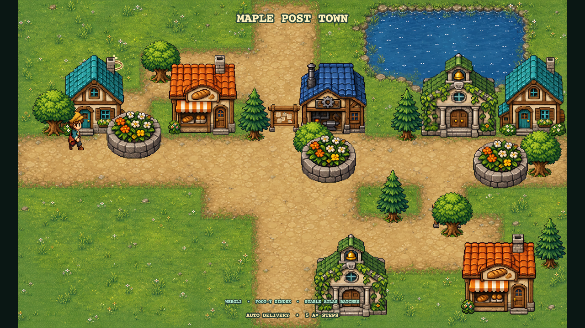
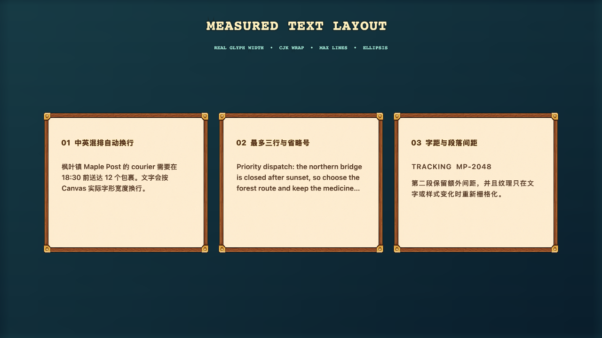
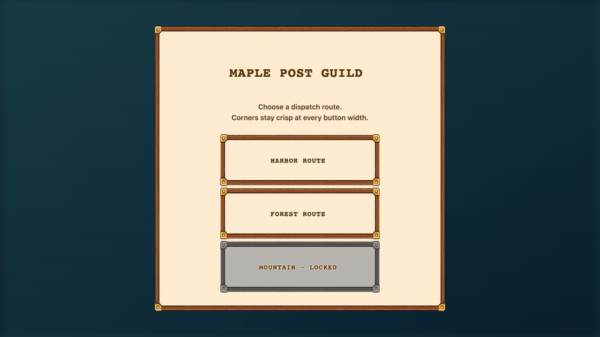

# Hilo3D 2D 渲染与多 Camera 合成

## 目标与边界

2D 不是独立后端，也不绕过现有 3D 渲染架构。`Sprite`、`Text2D` 和普通 `Mesh`
一样进入共享场景收集、Render Graph、portable RHI，再由 WebGL
2 或 WebGPU 执行。这样 layer、事件、资源恢复、纹理上传、提交 fence 和诊断都只有一套语义。

首版公共能力包括：

- 共享 quad 的 `Sprite`，支持尺寸、anchor、tint 和纹理图集 frame；
- `SpriteFrame` 序列帧动画，可设置统一帧率或逐帧 duration；
- `Sprite.setTexture()`、`setFrame()`、`setFrames()` 的原地动态换图；
- Canvas 2D 栅格化的 `Text2D`，支持实测宽度换行、CJK 断行、最多行数与 ellipsis；
- atlas-backed `SlicedSprite` 九宫格与四状态 `UiButton`；
- 复用 `Stage.enableDOMEvent()` 与 CPU raycast 的 click/pointer 事件；
- `Camera2D` 的左上角像素坐标投影；
- Node 级 `sortingLayer`、`zIndex` 与稳定场景树顺序；
- `Camera.priority`、color/depth/stencil clear 开关；
- `Camera.visibility & Node.layer` 的 32-bit layer 过滤；
- 一个应用帧、一个 Render Graph/RHI submission 内的多 Camera 合成。

## 最小用法

```ts
import {
    Camera2D,
    DEFAULT_2D_LAYER,
    PerspectiveCamera,
    Sprite,
    SpriteFrame,
    Stage,
    Texture
} from 'hilo3d';

const worldCamera = new PerspectiveCamera({
    visibility: 1,
    priority: 0,
    clearColor: true
});
const uiCamera = new Camera2D({
    width: 1280,
    height: 720,
    visibility: DEFAULT_2D_LAYER,
    priority: 100,
    clearColor: false
});
const stage = await Stage.create({
    backend: 'auto',
    width: 1280,
    height: 720,
    cameras: [uiCamera, worldCamera]
});

const atlas = new Texture({ image, flipY: true });
const sprite = new Sprite({
    frames: [
        new SpriteFrame({ texture: atlas, x: 0, y: 0, width: 64, height: 64 }),
        new SpriteFrame({ texture: atlas, x: 64, y: 0, width: 64, height: 64 })
    ],
    x: 100,
    y: 80,
    frameRate: 12,
    useHandCursor: true
});
sprite.on('click', () => {
    sprite.pause();
});
stage.addChild(sprite);
stage.enableDOMEvent('click');
```

`SpriteFrame.x/y` 始终以原始图片左上角为原点，向右/向下增长。`flipY`
属于纹理上传与后端采样策略，不改变图集帧坐标；应用代码和动画方向表都不应倒置 atlas 行号。该契约覆盖完整纹理与子矩形，并在 WebGL
2、WebGPU 真实浏览器渲染中保持一致。

运行时换图不需要操作材质：

```ts
sprite.setTexture(newTexture, { resize: true });
sprite.setFrame(newFrame, { resize: true });
sprite.setFrames(newFrames, { currentFrame: 0, autoPlay: false });
```

三个方法都会保留 Sprite 的节点、共享 Geometry、UV/size/tint 实例数组；纹理变化时自动切换到该 Texture 对应的共享
`SpriteMaterial`。仅传 `material: SpriteMaterial.forTexture(texture)`
也会从材质纹理推导初始完整 frame。

`Stage` 会在 tick 时按 `priority` 从低到高稳定排序。后绘制的高优先级 Camera 在 pointer hit
test 时先接受命中。普通 Camera 默认清 color/depth/stencil；`Camera2D`
默认保留 color、清 depth/stencil，因此可以直接叠在 3D
Camera 之后。一个 attachment 在当前应用帧还没有前序 writer 时会安全 clear，避免读取未定义的 surface 内容。

`Camera2D` 的投影原点在左上角，但 `Sprite` 和 `Text2D` 的默认 anchor 仍是中心
`(0.5, 0.5)`。按 UI 左上角坐标布局背景、面板或立绘时必须显式设置
`anchorX: 0, anchorY: 0`；保留中心 anchor 时，位置必须加上显示宽高的一半。两种坐标合同不能混用，否则真实浏览器渲染会把贴近边缘的内容裁掉一半。

`Sprite.x/y` 始终是
**anchor 在父节点局部坐标系中的位置**，不是图片左上角。父节点的 position/scale/rotation 会继续参与 world
transform；DOM pointer 坐标则由 Stage 和命中的 Camera 转换到这套 world/local 坐标。不要因为
`Camera2D` 使用左上角屏幕原点，就推断 Sprite 也默认左上角定位。

## Layer 语义

`Node.layer` 默认是 bit 0（值 `1`），`Sprite` 和 `Text2D` 默认是 bit
1（`DEFAULT_2D_LAYER`）。Camera 收集一个 Mesh 或 Light 的条件是：

```ts
(camera.visibility & node.layer) !== 0;
```

`visible` 仍是层级开关：父节点不可见会跳过整棵子树；`layer`
是逐可渲染节点的 Camera 过滤，不隐式覆盖子节点。Scriptable Render Pipeline 的 `cull()`
复用同一个 planner，因此不会出现默认 forward 与 SRP layer 语义分叉。

## Sprite batch 合同

所有默认 Sprite 共享一个单位 quad。`SpriteMaterial.forTexture(texture)` 按 Texture
identity 复用材质；UV rect、逻辑 size/anchor、tint 和 transform 都是实例数据。共享 draw-list
planner 先按 `(sortingLayer, zIndex, stable scene traversal)` 产生语义正确的显示顺序，再只合并相邻且
`geometry + material` identity 相同的 Sprite，并按 portable `MAX_INSTANCES_PER_DRAW = 128`
自动拆批。高值后绘制；相同值保持 `addChild()` 建立的场景树顺序。 `Node.layer` 是 Camera visibility
bit mask，与 `sortingLayer` 无关。

两个后端消费同一份实例合同：

- WebGL 2：模型矩阵与 Sprite 字段进入 interleaved instance vertex stream；
- WebGPU：模型矩阵进入固定 std140 `InstanceBlock`，Sprite 字段进入 instance vertex stream；
- raster shader 只有一份 GLSL ES 3.00 来源；WebGPU 继续走预处理 → Vulkan GLSL 4.50 → Naga → WGSL。

稳态动画只改已有
`Float32Array`，不重建 Geometry、Material、Shader、Pipeline 或 descriptor。当前门禁明确验证 300 个同纹理 Sprite 形成
`128 + 128 + 44` 三个 batch，并验证 planner 的高水位存储可复用。

batch 不允许跨越中间显示项：`A(atlas1), B(atlas2), C(atlas1)`
必须保留三个 draw，C 不能跨过 B 与 A 合并。性能依靠 atlas 和场景树中相邻的同材质 Sprite，而不是通过重排透明对象换取 draw
call。不要用 `SpriteMaterial.renderOrder`
排一个 Sprite；默认材质按 Texture 共享，修改材质可能同时影响多个 Sprite。

## Canvas 文字

`Text2D` 把完整标签栅格化为一个 Canvas 纹理和一个 Sprite
quad。多行、font、fill、stroke、padding、line height、`maxWidth`、实测宽度自动换行、中文断行、
`maxLines`、`overflow: 'ellipsis'`、baseline、段落间距、字间距与 backing resolution 都由 Canvas
2D 处理。Canvas 只在 `setText()` 或 `setStyle()`
时重绘；普通 tick 不读 Canvas，也不触发纹理上传。重绘会复用原 Canvas、Texture 和 SpriteMaterial
identity，只推进 Texture content
revision；因此低频更新 HUD 分数不会反复创建材质、shader 或 pipeline。

```ts
const description = new Text2D({
    text: '枫叶镇 Maple Post 的快递将在 18:30 前送达。',
    style: {
        font: '600 16px system-ui',
        maxWidth: 280,
        maxLines: 3,
        overflow: 'ellipsis',
        lineHeight: 24,
        paragraphSpacing: 8,
        letterSpacing: 0.5
    }
});
```

每个动态 `Text2D` 默认拥有自己的纹理，所以它仍是一个 draw
item，但不同标签不能像同图集 Sprite 一样合并。大量静态字形应预烘焙到同一个 font atlas，再使用普通
`Sprite`/`SpriteFrame`，以获得完整的跨文字 batch。

## Nine-slice 与按钮

`SlicedSprite` 把一个 atlas frame 分成九个相邻 Sprite。四个角保持源像素尺寸，边和中心按目标
`width`/`height` 拉伸；九个分片共享同一 Texture 的默认材质，因此排序相邻时进入同一个 Sprite instance
batch。

```ts
const panel = new SlicedSprite({
    frame: panelFrame,
    insets: { left: 24, right: 24, top: 20, bottom: 20 },
    width: 480,
    height: 260
});

const button = new UiButton({
    frames: { up, hover, down, disabled },
    insets: { left: 24, right: 24, top: 20, bottom: 20 },
    width: 260,
    height: 72,
    label: 'START'
});
stage.enableDOMEvent(['pointermove', 'pointerdown', 'pointerup', 'click']);
```

`UiButton` 复用同一组九个分片，状态变化只调用分片的
`setFrame()`，不会重建节点或实例数组。label是一个居中的
`Text2D`。禁用状态会同时关闭按钮及其分片的 pointer picking。

Nine-slice 只能保真拉伸专门为切片设计的素材。四角装饰必须完整落在 corner
insets 内；四条边的可拉伸区必须连续、等宽且没有居中的徽章、卡扣、缺口或跨切线装饰；中心区应是可重复或可均匀拉伸的平面。不能把普通装饰框随意切九块，否则边缘过渡会被拉长，最终表现为顶边、正文和底边互相脱节。至少用一个比源 frame 更宽、一个更高的真实浏览器尺寸验收。

## 点击与命中

Sprite 覆盖了单位 quad 的默认 raycast，使用实际 width、height、anchor 和 world
transform 做矩形命中，不会因为渲染几何体共享而把点击区域错误限制为 1×1。多 Camera 命中按 priority 逆序，并应用相同的 layer
mask；同一 Camera 内按 `(sortingLayer, zIndex, stable scene traversal)`
选择视觉上最上层的命中，因此被覆盖的 Sprite 不会抢走点击。被 2D Camera 隔离的 UI 也不会被 3D
Camera 抢占。

事件仍由 `Stage.enableDOMEvent()` 按需启用。不开启 DOM event 时没有 Canvas
listener 或每帧 picking 成本。

## 性能注意事项

- 同一 atlas 必须共享同一个 `SpriteMaterial`；默认构造已自动完成，应用不要为每个 Sprite 创建材质。
- 用 `sortingLayer`/`zIndex` 表达显示语义，并尽量让同 atlas Sprite 在最终顺序中保持相邻。
- 用 atlas frame 改 UV，不要为每帧动画创建 Geometry。
- 大量文本优先 font atlas；`Text2D` 更适合 HUD 标签、分数和低频变化文字。
- `Camera.priority` 数量通常很小；Stage 原地稳定排序，不创建每帧 Camera 数组。
- 多 Camera 在一个 Render Graph/RHI frame 内记录和提交，不为每个 Camera 创建独立 submission。
- 保留前序 color 的 overlay pass 直接写 single-sample surface；这是因为新建 MSAA
  attachment 无法加载已 resolve 的前序 Camera
  color。首个或显式清 color 的 Camera 仍可使用正常 MSAA。
- 如果后续 Camera 配置 `clearDepth: false` 或 `clearStencil: false`，整个 Camera
  stack 会在该帧使用 single-sample persistent
  depth/stencil，以保证前序深度或模板内容确实可 load；默认会清 depth/stencil 的 2D
  overlay 不触发这个降级。

## 示例

- [`2d_sprite_animation.html`](../examples/2d_sprite_animation.html)：序列帧月蛾、Sprite 点击暂停，以及背景 2D
  Camera、3D world Camera、2D UI Camera 的三层合成。
- [`2d_text.html`](../examples/2d_text.html)：Canvas 多行文字、描边、低频动态分数与点击换文案。
- [`2d_text_layout.html`](../examples/2d_text_layout.html)：中文/英文/数字混排的实测宽度响应式换行、最多行数、省略号、字距与段落间距。
- [`2d_ui_button.html`](../examples/2d_ui_button.html)：ImageGen 邮政公会 atlas 驱动的可拉伸面板与四状态按钮。
- [`2d_sprite_batch.html`](../examples/2d_sprite_batch.html)：单 atlas 的 4,096 Sprite；按 128
  instances 自动形成 32 个 portable Sprite batch。
- [`2d_sorting_town.html`](../examples/2d_sorting_town.html)：像素小镇中的 A* 自动寻路角色；建筑、树木与角色统一使用脚底世界 Y 作为
  `zIndex`，演示稳定顺序与相邻 atlas 合批如何兼容。







三套 “Moonlit Conservatory”、三套 “Maple Post Town”与一套 “Postal Guild
UI”美术资源由 ImageGen 生成；小镇地表以单张静态纹理上传一次，透明序列帧条与 UI 图集经过 Pillow 做色键去背、边缘消色与 alpha 检查。示例可用
`?backend=webgl2` 或 `?backend=webgpu` 显式选择后端。
