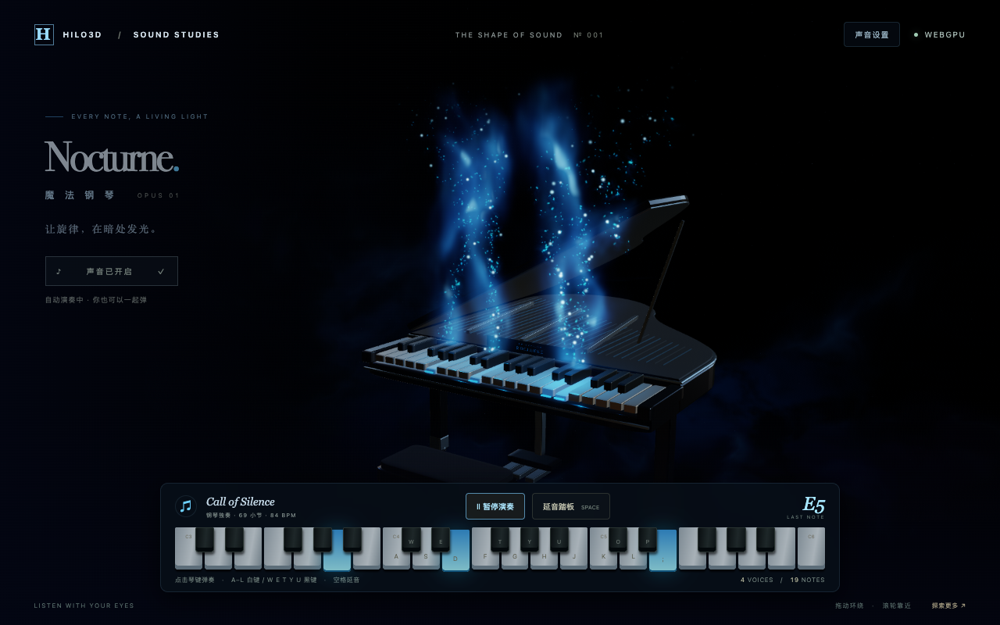

# Audio runtime

Status: **Optional `@hilo/addon-audio`, prepared for alpha.9; publication pending.** The checkout
version does not imply registry availability. See [version boundaries](./VERSIONS.md) and the
[checked consumer recipe](../test/types/recipes/audio.ts).

## Interactive piano showcase

[NOCTURNE — 魔法钢琴](../examples/audio_piano.html) presents the audio addon as a playable graphite
piano in a black room. Each played key releases its own blue bioluminescent plume: fine light dust,
sparse bright glints and flowing wisps rise above the keyboard while their light reveals the
instrument. Quiet moments retain a faint silhouette. Play with pointer or keyboard input, or start
the supplied _Call of Silence_ arrangement to hear spatial piano voices through a stereo convolution
chamber. Held keys sustain their plumes, which fade into darkness after release. The stage has no
luminous floor rings. Sound starts only after a user gesture; the scene supports both WebGL 2 and
WebGPU.

Reviewed screenshots also show the [quiet instrument](./assets/audio-piano/idle.png) and
[390-pixel-wide layout](./assets/audio-piano/mobile.png). See the
[capture notes](./assets/audio-piano/README.md) for the rendering conditions.

The visual reference is He Tongxue's physical magic piano, available on
[Bilibili](https://www.bilibili.com/video/BV1d1vUBUE54/) and
[YouTube](https://www.youtube.com/watch?v=C7D8cirnfoM). This example recreates the relationship
between individual keys and rising blue light using procedural scene geometry and shaders; it does
not bundle images or footage from the reference.

The plumes use animated procedural GLSL, with no background image. Both backends consume the same
GLSL ES 3.00 source; WebGPU artifacts follow engine preprocessing and Naga translation. These are
artistic scene effects and do not enable the renderer's froxel volumetric-lighting feature. The
effects control can disable the plumes while leaving the piano playable; the reduced-motion
preference slows or stops decorative movement.

The example-owned [`PianoMagicPlumeBlock`](../examples/shared/pianoMagicShader.ts) has a fixed
registered binding name and a 16-byte std140 layout: `vec4 u_flow` at byte offset 0 stores elapsed
seconds in its first component, with the other components reserved. A reused `Float32Array` supplies
the once-per-frame update; `UniformBuffer.set()` advances revisions only when bytes change. Vertex
colors carry each plume's seed, intensity, normalized head height and key velocity. Two three-octave
noise fields curl the blue bodies and overlapping translucent folds. Procedural UVs rise from key to
tip and do not sample managed images or render attachments.

The [plume tests](../examples/shared/pianoMagicShader.test.ts) check the block ABI, Naga translation
and real WebGL 2/WebGPU pixels. The browser showcase tests compare idle, held-chord and
released-note compositor pixels, require sustained emission beyond the lifetime of an individual
particle, and verify that higher keys move the blue columns to the right. They also toggle effects
while holding the same chord and retain native audio, interaction and lifecycle checks.

The example synthesizes piano multisamples with two velocity layers and a 2.8-second chamber
impulse, then routes playback through `@hilo/addon-audio`. It demonstrates bounded voices, per-key
spatial placement, separate dry/wet buses and score playback scheduled against the audio clock. Its
piano-like timbre combines struck-string harmonics with a felt transient.

The default piece is _Call of Silence_, transcribed from the user's
[three-page piano PDF](../examples/audio/call-of-silence.pdf). The user provided the file and
confirmed permission to use it. The [example-owned score](../examples/audio/callOfSilence.ts)
preserves all 69 measures, both hands and tied notes; the final left-hand chord is rolled upward.
The PDF has no metronome marking, so the example chooses 84 BPM as its performance tempo. Change
`CALL_OF_SILENCE_BPM` to adjust it. Selecting the score happens synchronously before scene asset
loading, creates no AudioContext and never starts playback without a user gesture.

Import a local `.mid` or `.midi` arrangement to replace the default piece; imported files and parsed
notes remain in page memory. The importer supports Standard MIDI format 0/1 with a PPQN clock, tempo
changes and sustain, up to 2 MiB. Browser tests verify the default title, local PDF link and opening
A4/C5 note callbacks alongside actual non-silent native audio sources, then import a different score
and verify that it replaces playback.

## Design and feature boundary

The runtime borrows the bounded concurrency/group approach from
[Unreal Sound Concurrency](https://dev.epicgames.com/documentation/en-us/unreal-engine/sound-concurrency-reference-guide),
and the real/virtual voice distinction from
[Unity AudioSource priority](https://docs.unity3d.com/6000.0/Documentation/ScriptReference/AudioSource-priority.html).
Hierarchical buses and snapshots follow the game-mixing model described by
[Unity Audio Mixer](https://docs.unity3d.com/6000.0/Documentation/Manual/AudioMixer.html). These are
design references, not claims of engine feature parity. DSP and scheduling follow the
[Web Audio specification](https://webaudio.github.io/web-audio-api/).

| Area        | Implemented contract                                                                                                                                                                    |
| ----------- | --------------------------------------------------------------------------------------------------------------------------------------------------------------------------------------- |
| Sources     | Shared decoded clips, weighted cues, one-shots, loop regions, seek/pause/resume, playback-rate pitch, absolute audio-clock starts and gain fades.                                       |
| Spatial     | HRTF or equal-power panning, mono spatial input, linear/inverse/exponential or monotone custom rolloff, hard maximum distance, directional cones and explicit-velocity Doppler.         |
| Mixing      | Immutable bus hierarchy, gain/low-pass/mute, atomic validated snapshots, cycle-checked post-fader sends, wet convolution buses, activity-driven ducking and optional master compressor. |
| Admission   | Bounded real/logical voices, named reject/oldest/quietest/lowest-priority concurrency, owner scopes and retrigger intervals.                                                            |
| Assets      | Bounded fetch/decode queue, URL deduplication, independent abortable waiters, PCM byte budgets, pinned LRU eviction and retry after failure.                                            |
| Music       | Independently bounded HTML media streams with browser buffering, loop, play/pause/seek, bus routing and surfaced play errors.                                                           |
| Integration | Explicit standalone lifecycle or typed Stage service, reusable Node transform providers, renderer independence and counters.                                                            |

Streaming uses a 2D media path and does not promise sample-accurate seek/loop/scheduling. Buffer
sources supply those controls. Spatial stereo clips are intentionally downmixed to mono. No
AudioWorklet synthesis graph, ambisonics, multiple simultaneous listeners, automatic geometry
propagation, music beat sequencer or editor is provided. Remaining work is tracked in the
[roadmap](./ROADMAP.md#audio-extensions).

## Ownership and browser lifecycle

Importing the addon creates no context, DOM element, fetch, timer or event listener. Constructing an
engine creates a realtime AudioContext unless an application supplies an AudioContext or
OfflineAudioContext. Only one engine may claim a context's listener at a time. Injected contexts
remain caller-owned; `destroy()` never closes them. Standalone mixers used with an engine must not
replace its routing behind its back.

`createAudioStageSystem()` publishes `AUDIO_STAGE_SERVICE`, follows the active camera and calls
`update()` after scene updates. Changing `stage.camera` changes the listener on the next update. Set
`followCamera: false` to supply a listener yourself. Setup failure destroys allocated resources.
Stage teardown destroys its audio before the renderer. Core `hilo3d` imports no audio code and
neither rendering backend contains an audio implementation.

Call `resume()` directly in a user-gesture handler and handle rejection. Context creation is not
autoplay permission. `suspend()` freezes a realtime context's audio clock and pauses current media
streams; after `resume()`, resume desired streams explicitly with `stream.play()`. Suspending a
borrowed context is an explicit operation affecting its other users. Offline contexts are driven by
`startRendering()`/`suspend(time)`, not the engine's realtime suspend/resume methods.

The application owns visibility and navigation policy. On `pagehide`, stop its ticker first. For
persisted navigation, retain the Stage/engine, suspend realtime audio and resume the ticker on
persisted `pageshow`; surface resume/autoplay errors. For final navigation, destroy the
Stage/engine. No addon visibility handler can accidentally resume a user-paused application. Destroy
is idempotent, disconnects graphs synchronously and aborts loads. `whenClosed()` observes
asynchronous closing of an owned context. A destroyed engine rejects new work; each existing voice's
`finished` promise resolves once with its terminal reason. Streaming URLs and DOM elements are owned
by each stream; caller-created blob URLs remain the caller's responsibility.

## Clock, transforms and voice policy

All playback times, fades and velocities use **seconds**, independent of Stage's millisecond delta.
The audio clock is authoritative, including when no visual frames are submitted. Call `update()`
each application frame: virtual completion, promotions, transforms, occlusion and ducking depend on
that cadence. Real buffer-source starts/stops/fades already scheduled on Web Audio do not depend on
frame timing. A stalled main thread can delay a virtual promotion; it cannot provide audio-thread
callbacks. Changes to volume automation follow the audio clock even while a voice is paused.

`when` is absolute context time; past starts begin immediately at the supplied offset. Starts
farther away than `scheduleAheadSeconds` reserve only a logical voice until an update enters that
horizon. Pausing preserves the remaining start delay and loop cursor. Playback-rate changes
re-anchor the cursor, and virtual looping voices wrap within their authored loop region. Handles
retain their identity after completion and never refer to subsequently reused voices.

`HiloAudioTransform` multiplies a node's current local matrices through its parents into one reused
matrix. It does not traverse the scene or force renderer world-matrix updates. It honors the
parent-matrix override; applications supplying custom world transforms can implement
`AudioTransform`. Forward is local -Z and up is +Y. Providers fill a reused `AudioPose`, must not
retain it and must produce finite, nondegenerate axes. Explicit source/listener velocities drive
Doppler; teleports do not infer enormous velocities. Doppler is clamped to 0.25–4 times the
requested rate. Physics occlusion is supplied by a synchronous, side-effect-free callback, bounded
and sampled round-robin. It attenuates gain and low-pass cutoff with parameter smoothing; it does
not perform raycasts itself. Fully occluded voices continue to receive eligible queries so they can
become audible again.

Priority 0 is highest, 255 lowest. Among equal priorities, larger estimated audibility wins, then
older play identity. Audibility includes distance, cone, occlusion, volume and all bus/send routes;
it excludes sidechain ducking to avoid a ducked voice repeatedly virtualizing and retriggering its
own duck. It estimates signal gain rather than measuring PCM loudness or convolution energy.

Concurrency counts scheduled, paused and virtual voices. Owner groups require an owner object and
keep retrigger history in a WeakMap. Lowest-priority stealing rejects a less important newcomer;
equal priorities steal the oldest. The global logical budget rejects new requests unless a group
replacement frees a slot. `play()` returns null for admission rejection and throws for invalid
requests. Invalid options are checked before stealing. A real stolen/virtualized source has a short
5 ms release and retains its native slot and clip pin until stopped. New voices wait for a slot;
release tails never bypass the real-voice budget.

## Mixing and resource budgets

Default limits are 32 real voices, 256 logical voices, 4 media streams, 32 buses, 64 sends, 256
concurrency groups and 64 ducking rules. Voice selection uses a reused bounded heap; stationary
sources do not create nodes or enqueue redundant spatial/filter automation during updates. DSP
chains are pooled up to the real-voice limit. BufferSource nodes are single-use by specification;
each activation necessarily creates one. Streams and mixer/reverb nodes use separate bounded budgets
and remain visible in diagnostics.

Snapshots validate all entries before scheduling any changes. Volume, mute and sidechain gains use
separate nodes. Retargeting a fade begins at its interpolated current value. A bus reverb is 100%
wet, so normally route a send into a dedicated reverb bus. Impulses must have 1, 2 or 4 channels and
match the context sample rate; cache decoding supplies that rate. Replacing an impulse or removing a
send is an explicit graph mutation, not a click-free musical transition. The master dynamics
compressor is optional and is not a brickwall limiter or a loudness-normalization guarantee.

The cache defaults to 64 MiB resident PCM, 256 resident entries, 4 concurrent fetch/decode jobs, 64
pending identities and 16 MiB per encoded response. It caps streaming response reads as well as
declared Content-Length. Each returned lease and active/retiring voice or convolution impulse pins
its clip. Release the application lease after handing the clip to a voice, or retain it for reuse.
Do not mutate shared PCM. Eviction only drops unpinned cached references; keeping raw clips/buffers
outside leases makes their retained memory application-owned and outside cache accounting.

If a decoded clip exceeds the byte budget, or all possible victims are pinned, loading rejects. It
never evicts a live voice's buffer to force success. Independent waiter cancellation leaves sibling
requests intact; the final cancellation aborts fetch. Native decode cannot be interrupted, so it
holds its admission slot until settlement and cannot publish after cancellation or teardown. The PCM
budget excludes decoder scratch, encoded response assembly, node implementation overhead,
application-owned buffers and media browser buffering. Use streams for long tracks and conservative
budgets on mobile; a decoded-byte cap is not a hard cap on the browser process's memory.

## Validation and performance evidence

The [2026-10-04 validation record](./validation/AUDIO_2026-10-04.md) records checks actually run on
this implementation and their limits.

`npm run test:audio` runs Chromium Web Audio tests, including actual OfflineAudioContext PCM,
directional stereo, attenuation, cones, Doppler, fades, loops, virtual cursors, concurrency, cache
pins/cancellation and Stage rollback. A stress contract exercises 128 logical voices across 1,000
updates with four real slots and checks that persistent nodes/source activations do not grow in
steady state. This proves bounded allocation behavior, not a cross-device CPU or latency benchmark.

`npm run test:package` installs the actual tarballs and verifies source-map content, Node ESM
imports, Bundler/NodeNext recipes, real user-gesture playback/streaming, offline PCM and teardown in
Chromium. `npm run test:addon-audio-package`, `npm run api:check`, `npm run typecheck` and
`npm run lint` cover package shape, exported signatures and source contracts. Rendering RHI/shader
checks are unchanged because this addon does not modify rendering. Hardware latency, mobile
interruption behavior and Firefox/WebKit audio quality still require device-specific evidence before
claiming broad production certification.
