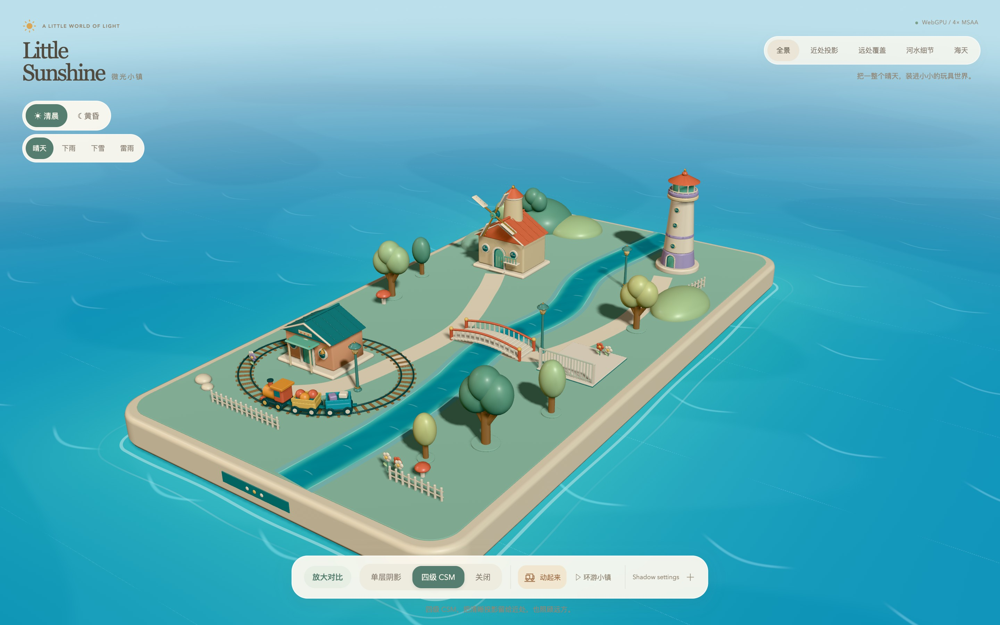
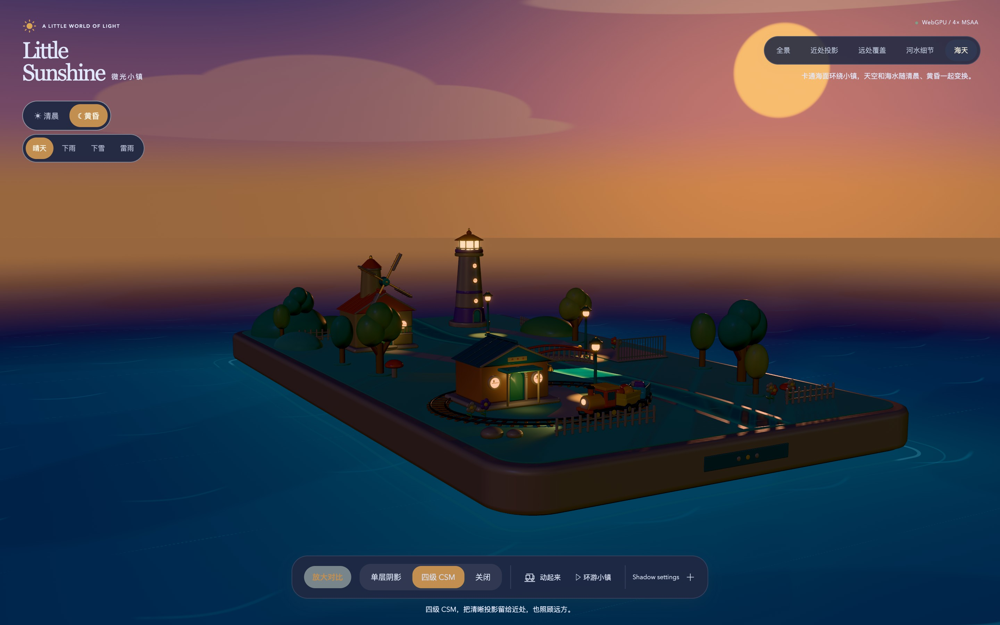
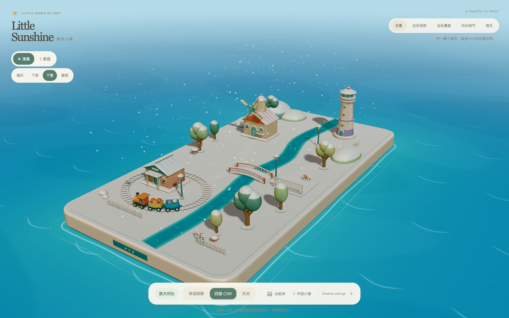
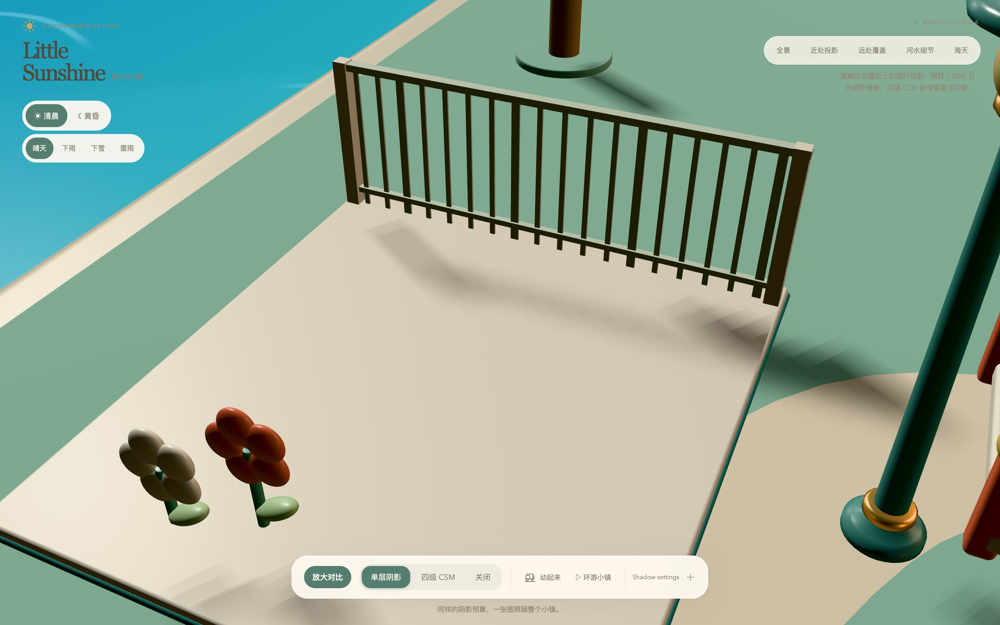
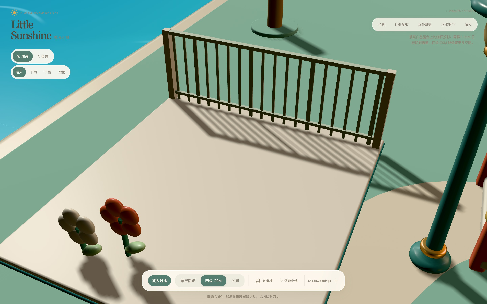

# Little Sunshine：玩具箱庭与级联阴影

[示例入口](../examples/cascaded_shadows.html)将 CSM 对比放进一个圆角玩具小镇：风车、车站、灯塔、环形小火车、河流和卡通海天共用 Hilo3D 的 Renderer、Render
Graph 与 RHI，支持 WebGL2 和 WebGPU。

## 审阅截图

以下图片在 rebase 到 `dev` 的 `0bee48d` 后，从 Chromium / Metal WebGPU 实际页面捕获。视口为 1440 ×
900，DPR 2，原生 JPEG 输出 2880 ×
1800；拍摄前暂停动画，并等待灯光过渡完成。图片作为文档展示素材保留，不是自动视觉测试基线或性能基准。

清晨全景：

黄昏海天机位：窗户、路灯、车头灯与灯塔点亮。

下雪全景：为便于审阅，通过设置面板将积雪量固定为 85%。

## 相同预算的 CSM 对比

普通视图使用单层 2048² 或四级各 1024²。点击“放大对比”进入细杆露台，使用单层 1024² 或四级各 512²：两者均为 1,048,576 个日光阴影像素，覆盖相同视距，使用相同预算对应的偏移设置。这使近处细杆阴影的分辨率差异可见。图集填充、局部灯光与绘制开销仍可能不同。

单层阴影：

四级 CSM：

## 操作与实现边界

- 动画默认启动；阴影和天气切换保留播放状态。需要同一姿态比较时，可手动暂停。
- 相机预设、环游和手势导航使用公共 `OrbitControls`。
- 黄昏按顺序渐亮窗户、三盏路灯、车头灯和灯塔。局部投影使用五盏 512²
  SpotLight，阴影视锥与每盏灯的方向、光锥和范围匹配。路灯垂直照向灯杆周围；灯光过渡独立于列车的暂停状态。
- 河水、海面、天空和天气使用可移植 GLSL ES 3.00 与注册的 std140 数据，继续经过共享渲染链。
- 积雪由真实朝上表面生成，覆盖地面、屋顶、桥面和树冠；排除火车、风车转子、玻璃和水体。运行时约 25 秒积满，停雪后约 20 秒融化，设置面板也可直接调整积雪量。
- 雷雨支持偶发及手动闪电；系统减少动态效果时禁用自动闪电。

Blender 可编辑模型、独立转子和窗灯分组见[模型说明](../examples/model/csm/README.md)。

定向浏览器测试位于
`test/ui/examples.spec.ts`，验证实际像素差异、积雪恢复、动画状态、灯光渐亮及渲染健康；WebGL2 的软件渲染用例允许较长执行时间。完整发布门禁和受控性能基准另行执行。
