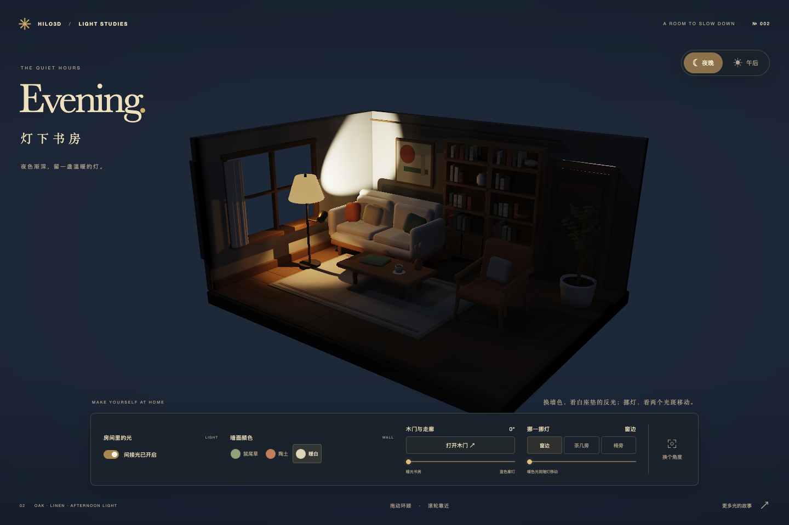
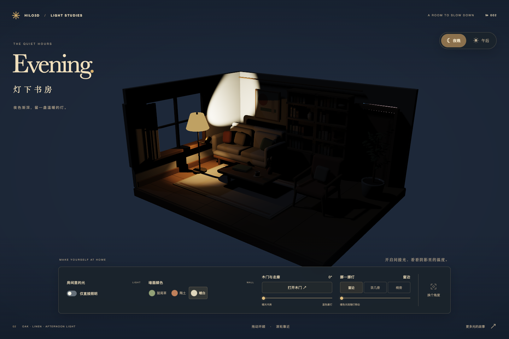
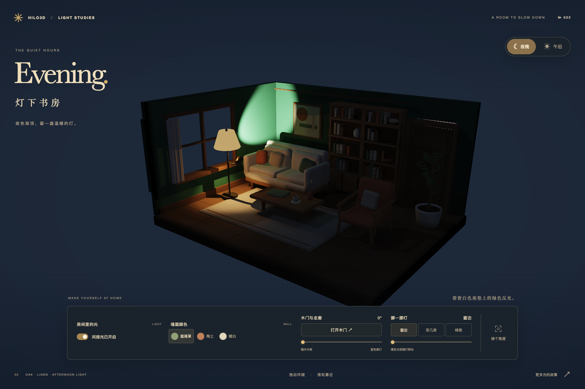
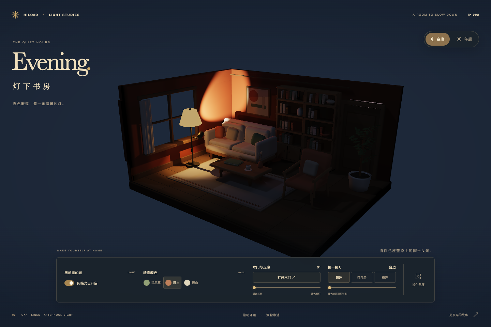

# Dynamic diffuse global illumination

The opt-in WebGPU Clustered Forward+ pipeline traces a complete, camera-independent CPU BVH from
bounded world-space irradiance probes. It transports offscreen emissive and directly illuminated
surfaces onto opaque PBR receivers. It uses the production Render Graph, storage/compute RHI and
GLSL → Naga raster path. It requires no hardware ray-tracing extension and does not add a second
renderer.

## Public entry point

```ts
const pipeline = new Hilo3d.ClusteredForwardPlusPipelineFactory({
    buckets,
    temporalAA: {},
    dynamicGlobalIllumination: {
        origin: new Hilo3d.Vector3(-3, 0.25, -2),
        spacing: new Hilo3d.Vector3(0.75, 0.65, 0.75),
        probeCounts: [9, 5, 7],
        raysPerProbe: 128,
        maxProbesPerFrame: 48,
        maxTriangles: 65_536,
        maxLights: 32,
        hysteresis: 0.9,
        bounceStrength: 0.7
    }
});

// Zero hides the contribution; probe updates continue converging.
pipeline.setDynamicGlobalIlluminationIntensity(0);
// Change the sky contribution, copying the color and restarting bounded convergence.
pipeline.setDynamicGlobalIlluminationEnvironment(new Hilo3d.Color(0.018, 0.024, 0.043));
const diagnostics = await pipeline.readDiagnostics();
```

An absent or false option creates no ray scene, probe buffer, compute pass, or hybrid surface pass.
The static creation requirements include exact buffer sizes, dispatch dimensions, nine storage
bindings for the combined GPU Scene raster ABI, and the `r32float` generation-history marker.
Explicit WebGL2 selection fails before pipeline creation. Settings are validated and snapshotted;
invalid sizes, non-finite numbers and scene/light budget overflow fail clearly.

## Scene and material contract

The internal scene compiler traverses visible scene nodes and camera layers, independent of the
camera frustum and Hi-Z visibility. It extracts indexed or non-indexed rigid triangle geometry,
including normalized, interleaved and quantized positions. Shared local geometry is cached. Exact
matrix, attribute and material snapshots detect changes; unchanged scenes retain snapshot identity
and avoid triangle allocations. Geometry membership changes rebuild a deterministic median BVH;
count-preserving geometry changes and rigid transforms refit the existing topology. Immutable
triangle/BVH dirty byte ranges allow material and rigid edits to upload only changed records. A
skipped CPU revision falls back to a complete upload; rejected submissions retry the same ranges.
Failed updates leave the previous snapshot valid.

Triangle records occupy 128 bytes and carry world positions, transformed shading normals, diffuse
reflectance, emission, sidedness and object layer. BVH nodes occupy 32 bytes and use explicit
integer child/leaf indices. The balanced tree has bounded traversal depth. GPU ray queries use
nearest-hit triangles and light visibility rays; they do not read visibility back to the CPU.

First-release transport covers opaque, static or rigid PBR surfaces and point, spot and directional
lights. Per-object light layers also apply to ray-hit lighting. Unsupported deformed, instanced,
masked, transmitting or custom-material geometry fails by default. Area lights and authored
cookie/IES spot profiles likewise require an explicit exclusion policy. `unsupported: 'exclude'`
provides a deliberate opt-out with coverage diagnostics; it does not imply those surfaces can
occlude rays correctly.

Texture-valued surfaces fail by default. `texturePolicy: 'material-factor'` explicitly uses their
constant material factors as a coarse ray-scene approximation; `'exclude'` omits them. These choices
are observable and are not described as texture-accurate transport. The maintained atelier uses
original factor-only materials so its rendered and ray-traced diffuse colors agree.

## Probe transport and visibility

Each probe stores an 8×8 octahedral irradiance field and an 8×8 directional first/second distance
moment field, plus its relocation/classification state. Rays sample the sphere and evaluate emitted
radiance, shadowed direct light and bounded feedback from the previously submitted probe field.
Radiance clamping and a feedback factor below one control bright outliers and runaway accumulation.
Each probe uses fixed, spatially decorrelated spherical quadrature. Its rays do not rotate between
static updates: irradiance, directional distance moments and relocation therefore describe the same
sampling footprint. Valid probe positions stay fixed until the scene changes. Exact submitted light
records, rather than noisy sample-luminance differences, identify real lighting changes and reset
radiance accumulation; visibility history is governed separately by geometry validity.

A strict round-robin budget updates at most `maxProbesPerFrame` probes. Unscheduled probes are
copied into the next history slot, while uninitialized probes remain invalid. Directional distance
moments, normal/view bias and visibility-weighted trilinear interpolation reduce wall leakage.
Probes inside solids or too near a surface are relocated within a bounded fraction of their cell;
relocated probes are not sampled until they have been evaluated again. Scene revisions reset
affected per-probe temporal accumulation as the scheduled updates reach them.

The volume has finite bounds and fixed resolution. Thin geometry smaller than the visibility
resolution can still require finer spacing and smaller bias. This is a diffuse solution, not glossy
reflection transport. Probe updates converge over multiple frames, and a moving light may take a
full update cycle to reach every probe. `updateCycleFrames` makes that latency explicit.

## PBR and screen-space composition

Both the fixed-bucket indirect and ordinary clustered storage PBR lanes sample the same probe buffer
in world space. Probe illumination replaces the diffuse ambient/environment baseline inside the
configured volume; direct lighting, specular lighting and emission retain their original contracts.
Unsupported Forward fallback materials do not silently become probe-aware. Combining DDGI with GTAO
or physical atmosphere requires opaque receivers registered in rigid GPU Scene buckets; the existing
ordinary clustered lane cannot share those pass bindings. An unregistered PBR receiver in that
combination fails clearly. A direct DDGI receiver also fails when its material variant budget is
exhausted, rather than losing illumination through fallback.

When SSGI is enabled alongside DDGI, an additional two-target surface pass exports the exact
outgoing probe diffuse baseline and receiver diffuse reflectance. It is separate from the normal
material/reflection MRTs, so the combination does not expand the simultaneous attachment count. The
portable SSGI trace computes a signed correction using cosine-distributed directions:

```text
coverage = sum(valid screen-hit quality) / rayCount
correction = sum(screen radiance × receiver reflectance × quality) / rayCount
             − probe diffuse baseline × coverage
final HDR = original HDR + filtered correction
```

Missed/offscreen directions preserve the probe baseline. Temporal accumulation and edge-aware
filtering retain signed values, and composition bounds negative corrections by the current probe
contribution. Hybrid intensity is bounded to a convex replacement. Screen radiance remains
view-dependent, so glossy hit radiance is an approximation; this does not claim full BRDF path
tracing. The existing standalone Forward/WebGL2 SSGI behavior is unchanged.

## Submission, recovery and ownership

Probe buffers are double buffered. The graph declares ray-scene reads, previous-probe reads,
current-probe writes and raster reads explicitly. Cursor, scene upload revision, probe slot and
submitted diagnostics advance only after a successful submission. Discarded frames do not advance
the sequence. CPU scene snapshots may be prepared early, but their GPU upload revision is committed
separately and retried after failure.

A persistent graph history marker tracks device-generation validity. Device loss recreates neutral
resources, invalidates old probe history and resumes bounded convergence; CPU-shadow scene recipes
restore uploaded geometry. Destruction uses renderer-owned, submission-aware storage resources. No
native device or command encoder crosses the RHI boundary.

## Original indoor showcase

[Atelier](../examples/dynamic_global_illumination_atelier.html) is an original Blender-authored
reading room with oak furniture, linen, books, pottery, curtains and an olive tree. It opens at
night; the afternoon preset changes direct lights, emissive surfaces and probe environment radiance
together. The [asset recipe and provenance](../examples/models/Atelier/README.md) reproduce the
model.

The stand has two modeled heads. The fabric shade opens downward; a visible brass projector lights
the painted reading alcove. Their light objects are children of the exported `ReadingEmitter` (local
−Y) and `WallWashEmitter` (local +Y), keeping source position, model axis and beam direction
consistent when the lamp moves. Emitters sit outside the solid stem and aperture geometry. The
larger painted wall is above the white seat so it can contribute actual colored diffuse reflection.
No wall-dependent tinted fill or receiver recoloring is used. The showcase uses 128 rays and at most
48 updated probes per frame.

Matched native captures measure 15–17 RGB levels of mean pigment-induced change inside the unpainted
seat with GI enabled, versus 0.1–0.2 with GI disabled. The measured rectangle excludes the wall and
interface. The final static night scene measures 0.244 RGB levels of mean adjacent-frame difference.
The earlier 1.246 capture used a different asset revision and 64 rather than 128 rays, so it does
not isolate the DDGI/TAA repairs. These are image-stability observations, not performance
measurements.

Lamp-position presets, door and wall controls exercise real light, transform and material updates.
`?test=1` uses the shared stable capture contract. The ticker stops before resource teardown and
resources survive persisted page lifecycle events.

Native WebGPU night captures use the same camera and direct lighting:

| Dynamic GI enabled                                                          | Dynamic GI disabled                                                                      |
| --------------------------------------------------------------------------- | ---------------------------------------------------------------------------------------- |
|  |  |

Wall pigment comparisons include the unpainted white furniture:

| Sage wall                                                                     | Terracotta wall                                                                     |
| ----------------------------------------------------------------------------- | ----------------------------------------------------------------------------------- |
|  |  |

## Validation and evidence

- CPU oracle tests cover nearest-hit BVH traversal, topology refits, immutable snapshots, geometry
  decoding, light layers, budget failure and explicit coverage policies.
- Controller tests cover validated options, strict update budgets, commit/discard, history
  invalidation, destruction and all three ray-count shader variants through Naga and actual WebGPU
  compute pipeline creation.
- Production rendering tests use offscreen colored emitters, material changes, moving occluders and
  dynamic lights. Both clustered PBR lanes and hybrid SSGI require real submitted pixels.
- Browser acceptance checks the authored room, GI on/off pixels, interactions after captures,
  instrumentation health and errors after teardown.

The repository's existing frozen RHI baseline remains immutable. Functional/pixel browser tests and
local timings do not substitute for an enrolled physical-GPU cross-commit DDGI performance baseline.

## Validation recorded on 2026-09-20

| Check                                                                     | Observed result                                                                 |
| ------------------------------------------------------------------------- | ------------------------------------------------------------------------------- |
| TypeScript, ESLint, formatting and modernity                              | Passed                                                                          |
| API update/check, type consumers, TypeDoc links and package consumer      | Passed                                                                          |
| DDGI/BVH/hybrid/compatibility, Clustered regression and shader guardrails | 87 tests passed                                                                 |
| Renderer architecture                                                     | 145 tests passed                                                                |
| Portable/native RHI command                                               | 216 tests passed; one pre-existing conditional test skipped                     |
| Benchmark protocol contracts                                              | 83 tests passed                                                                 |
| Example matrix and UI contracts                                           | 33 tests passed after integration with the current gallery                      |
| Atelier independent GI/wall/door/lamp/night-day pixels and teardown       | Software WebGPU and native Metal passed                                         |
| Complete `HILO3D_UI_GROUP=post-processing` WebGL2 CI lane                 | Seven tests passed                                                              |
| Native benchmark-hook functional smoke                                    | Enabled/disabled × five submitted frames, genuine timestamps, no browser errors |

The full WebGPU command initially completed with 20 passing and three failing Afterimage SSR cases.
The original static stability failure reproduced exactly on the clean starting commit `c9bcf389`
(0.11461187214611872 against 0.075, identical failure PNGs). The subsequent TAA correction now
passes that original stability case, the full jitter-cycle dark-hole case and the portrait case
without changing their tests or thresholds. The remaining rapid-orbit trail assertion reports
1.129689578714 against its original limit of 1 (previously 1.145321507761). This SSR trail gate
remains unresolved; it is separate from the atelier's DDGI/static-frame and interaction acceptance.

The full `validate`/`validate:ci` and complete physical-GPU browser matrix have not been run. The
new [DDGI evidence collector](../benchmarks/ddgi/README.md) has passed protocol tests and native
functional smoke; an isolated, committed-source performance capture and independent baseline review
remain outstanding. The currently open interactive preview is a competing GPU workload, so its
presence must not be described as an isolated performance run. Existing immutable RHI baselines were
left unchanged.

## References

The implementation follows the visibility-aware irradiance field and bounded probe-update ideas from
[Dynamic Diffuse Global Illumination with Ray-Traced Irradiance Fields](https://jcgt.org/published/0008/02/01/)
and
[Scaling Probe-Based Real-Time Dynamic Global Illumination for Production](https://jcgt.org/published/0010/02/01/).
It is an engine implementation of those principles, not an integration of NVIDIA RTXGI or a claim of
hardware ray-tracing support.
