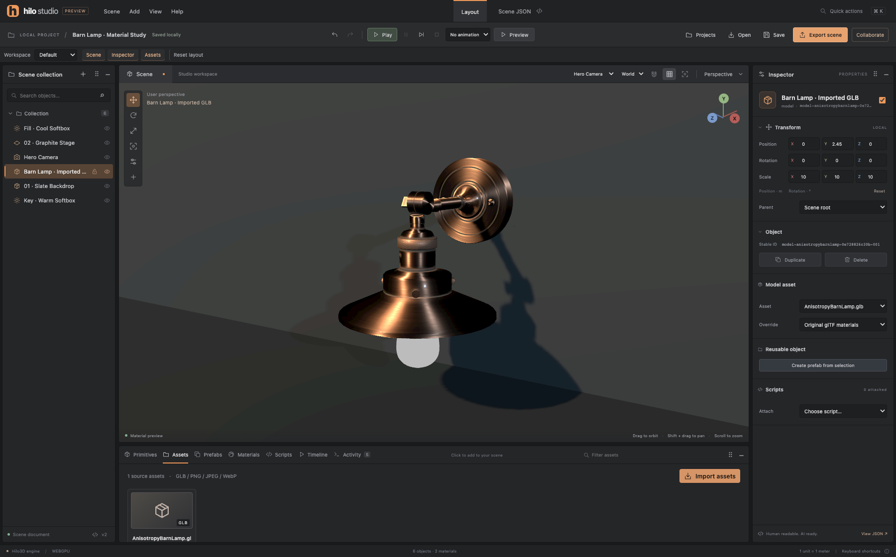

# Hilo Studio Web Editor

Hilo Studio is a local-first 3D authoring application built on the public Hilo3D engine. It uses a
Unity-style hierarchy, viewport and inspector with a Blender-inspired charcoal workspace. The
commercial-readiness work and acceptance gates are tracked in
[Editor development](./ROADMAP.md#editor-development); implementation status and executed evidence
are separate. The release-candidate evidence below applies to the local-first, self-hostable scope
documented here.



The screenshot shows the real editor rendering the repository's
[`AnisotropyBarnLamp.glb`](../examples/models/KhronosPBR/AnisotropyBarnLamp.glb) with its original
glTF materials, an authored camera and a simple lit backdrop. Model and materials by Eric Chadwick;
copyright 2023 Wayfair, LLC, licensed CC BY 4.0. See the
[asset attribution](../examples/models/KhronosPBR/ATTRIBUTION.md#anisotropybarnlampglb).

## Run and build

Use the repository's Node.js and npm versions, then install with `npm ci`.

```sh
npm run editor:dev
npm run editor:build
npm run test:editor
```

The development application is at `http://127.0.0.1:5174/editor/`. The static application is
generated under `dist-editor/`, with its entry at `editor/index.html`. Serve that directory over
HTTP; do not open the HTML directly with a file URL. Source and built applications retain the same
rendering path. Add `?backend=webgl2` or `?backend=webgpu` to select a backend explicitly; otherwise
the engine uses its documented automatic selection. An explicit WebGPU request never silently falls
back.

## GitHub Pages

The existing Pages workflow builds the editor with the documentation and examples. Merging into
`dev` publishes the static application at `https://hilo3d.js.org/editor/`; a project-subpath host
uses `/Hilo3d/editor/`. Homepage navigation includes **Editor**. All editor scripts, styles, schemas
and Naga WASM live below `editor/assets/` and use relative URLs, so the same artifact supports
either hosting layout. `npm run test:editor:pages` exercises the actual built site at both URL
layouts on WebGL2 and WebGPU, including real pixels, edits, reload persistence and teardown
diagnostics.

Pages hosts the editor frontend. Projects remain in the visitor's browser unless explicitly exported
or shared with a configured collaboration server. Run `npm run editor:server` separately behind
HTTPS and allow the exact Pages origin when enabling remote collaboration; GitHub Pages does not
execute the Node service.

## Project workflow

The **Projects** browser creates, opens, renames and copies projects; manages scenes; exports and
imports self-contained `.hilo-project.json` bundles; and restores previous revisions. A bundle
contains authored scenes, asset bytes, prefab templates/instances, script source and animation
clips. Import creates a separate local project identity rather than overwriting a matching ID.

IndexedDB is the primary local store. Writes compare the revision that was loaded against the stored
revision and atomically commit the project, summary and recovery records. The ten previous revisions
remain recoverable. Recovery lists read a separate metadata store, avoiding copies of large binary
bundles merely to show a list. The internal IndexedDB v1-to-v2 migration adds those summaries
without rewriting source bundles.

Local storage retains a lightweight scene recovery copy and workspace preferences. It is not a
replacement for project bundles: scene-only JSON does not contain external assets or project-level
authoring records. Browser storage is scoped to the origin and browser profile. Export bundles to
retain a portable backup outside the browser.

Concurrent tabs do not silently overwrite one another. A stale save reports a conflict. Reloading
the latest revision first preserves unsaved local work in a separate project; saving a copy keeps
that work under a new identity. Quota, permission, corruption and save failures remain visible. A
corrupt latest project does not erase its recovery history.

Undo and redo cover the complete authored project, including prefab operations, asset references,
scene changes and animation records. Binary payloads are interned by hash rather than copied into
every history entry. Retention is bounded to 80 entries, 128 MiB of unique raw asset bytes and 32
MiB of canonical authoring metadata. Older entries are pruned to meet these budgets; the current
snapshot is always retained. These are logical retained-byte limits, not a claim about total
JavaScript heap overhead. Persistence revisions never move backward when authored changes are
undone.

## Scene authoring

- **Hierarchy:** search, select, multi-select, show/hide and lock objects. Inspector parent
  selection supports any existing non-descendant. Deleting a hierarchy removes its descendants as
  one undoable transaction; deleting animation targets and prefab roots cleans their scene-scoped
  references.
- **Transforms:** `W`, `E` and `R` select translation, rotation and scale. Handles constrain axes,
  planes or uniform scale; world/local space and snapping are explicit. Snap increments are 0.5
  meters, 15 degrees and 0.1 scale. Escape or pointer cancellation restores the gesture's starting
  state. One completed gesture creates one history entry. Selected descendants of a selected parent
  are transformed only once.
- **Transform limits:** the scene format stores local translation, Euler rotation and scale, not
  arbitrary shear matrices. A world operation that would require unrepresentable shear beneath a
  rotated nonuniformly scaled parent is rejected with an explanation rather than approximated.
- **Viewport:** use the shared `OrbitControls` for orbit, pan and dolly. GPU picking resolves
  imported model meshes back to their authored model instance. Frame the selection, switch editor
  views or look through an authored camera. Orbit preview is a viewing aid; Play is the separate
  script and animation runtime.
- **Materials:** edit shared PBR factors and base-color, normal, metallic/roughness and emission
  maps. Material changes affect every object using that material. Color maps use the engine's sRGB
  sampling contract; numeric maps use data encoding. Authored colors use sRGB hex values and are
  converted to linear factors at the engine boundary.
- **Cameras and lights:** camera field of view and clipping planes are authored data. Directional
  lights and ambient intensity remain in the shared renderer; their behavior is not reimplemented
  per backend.

The inspector edits authored values. Previewed animation and Play transforms remain transient.
Stopping playback restores authored state. Imported model animation, skin and morph resources are
cloned per instance while immutable geometry and textures can be shared safely.

## Assets

The asset library imports binary glTF (`.glb`) models and static PNG, JPEG or WebP textures. Source
filenames, import timestamps, content hashes, optional license/attribution/source-URL metadata and
immutable source bytes travel with a project. Imports are validated before installation and commit
atomically; a failed multi-file import leaves the project unchanged. Identical source bytes are
deduplicated. Model cards instantiate real engine nodes; texture cards can apply to the selected
material.

GLB version, declared lengths, chunk boundaries and embedded images are checked. External buffer and
image URLs are rejected: portable project imports do not fetch arbitrary dependencies from the
network. Broken content, unsupported image headers or oversized resources produce visible errors.
PNG chunk checks include CRC and ordering. Before activation, imported/restored projects and shared
snapshots also pass a staged browser-codec check, including embedded GLB images; a failed decode
leaves the active project unchanged. Removing an asset is blocked while any scene, prefab or
instance merge baseline references it.

Per-asset source size is limited to 16 MiB. Images are limited to an 8192-pixel edge and 16,777,216
pixels. Projects allow 128 assets and 64 MiB of source asset bytes; portable JSON is capped at 96
MiB. The adapter reserves at most 256 MiB of base-level decoded RGBA image data for active assets,
before initiating decoders. Shared instances count once; repeated glTF texture sources are included
in the estimate. Mipmaps, geometry, frame targets and backend overhead are additional, so this
budget is not a claim that every device can render every permitted project.

Object URLs, loaders, model/texture leases and decoder work are runtime resources. Scene changes,
removal, cancellation, disposal and device resource ownership must not become serialized state.

## Prefabs

Create a prefab from a selected object hierarchy. The original selection becomes a linked instance;
additional instances receive independent node and material IDs. Each instance records its exact
baseline template and mappings, so overrides are computed from authored data rather than guessed
from names.

**Apply to template** updates the source and propagates changes to linked instances in all scenes.
Untouched transform components and properties follow the new template; instance edits remain
explicit overrides. **Revert overrides** restores the template's authored values. **Unpack** keeps
objects while removing their template link. A referenced template cannot be deleted until its
instances are unpacked. Overridden children removed from a template are retained as unpacked local
objects with a message, preventing silent data loss.

Template root identity is stable. Changing that identity requires a new template/instance rather
than an ambiguous remapping. Nested prefab links cannot overlap ownership of the same scene node.

## Animation

The timeline stores named clips with duration, frame rate, loop state and transform-channel tracks.
Keys have explicit time, value and interpolation (`linear`, `step` or `smooth`). Create keys from
authored transforms, scrub the ruler, edit selected keys, preview playback or step through frames.
Each authoring action is an undoable project change; scrubbing and playback do not write into scene
transforms.

Position, Euler rotation and scale components are separate channels. Rotation interpolation is
numeric interpolation in degrees, so explicit winding is preserved. Exact loop endpoints wrap to
zero; non-looping sampling can inspect the final key. Project validation rejects dangling targets,
duplicate channels or key times, out-of-range values and oversized clips. Horizontal key display is
virtualized; dense views ask for zooming without dropping stored keys.

## Scripts and Play

A script asset is an inert JavaScript lifecycle object expression:

```js
({
    start(ctx) {
        ctx.log('Started ' + ctx.name);
    },
    update(ctx, dt) {
        ctx.rotate(0, 30 * dt, 0);
    },
    stop(ctx) {
        ctx.log('Stopped');
    }
});
```

Attach scripts to objects explicitly. `ctx` provides `id`, `name`, `time`, read-only position,
rotation and scale, bounded key/pointer input, transform setters, `translate`, `rotate` and `log`.
Angles are degrees and `dt` is seconds. Lifecycle callbacks are synchronous; asynchronous callbacks
are rejected. Script instance state can live on the returned lifecycle object. Disabled assets do
not execute.

Play copies authored state, samples a selected clip and then applies script updates. Animation owns
its keyed channels at each sample; script updates run afterward. Pause freezes simulation, Step
advances one bounded frame, and Stop restores the authored scene. Imports, project opening and
collaboration updates never automatically execute source.

Scripts run in a dedicated Worker created by an opaque-origin sandbox frame. Its CSP denies network
connections and external script loads, and it has no host DOM or origin-storage authority. Returned
transforms are validated before reaching the viewport. Startup has a 1500 ms watchdog and update/
stop steps have a 250 ms budget; runaway work is terminated without waiting for it to yield. Script
errors are surfaced in the editor activity log.

This is an explicit local-author-code execution boundary, not a multi-tenant memory-quota service.
Arbitrary JavaScript can still allocate excessive worker memory or attempt oversized messages before
host validation. Project collaborators with permission to author scripts are trusted code authors;
shared projects do not turn imported code into automatically trusted or automatically executed code.

## Workspace and keyboard

Panels can dock left, right or below the viewport. Drag their dock handles or use their keyboard
controls; splitters support pointer dragging and arrow-key resizing. Default, Focus and Animation
presets retain their own edits. Collapsed panels remain recoverable, and narrow windows switch to
compact tabbed docks without destroying the saved wide layout. F6 cycles major regions.

`Ctrl/⌘ S` saves the current property edit; in the scene source editor it validates and applies the
source. `Ctrl/⌘ Z`, `Ctrl/⌘ Shift Z`, `Ctrl/⌘ D`, Delete, `F` and `Ctrl/⌘ K` cover history,
duplication, deletion, framing and quick actions. Input fields and timeline key editing retain their
own keyboard semantics so typing or removing a key does not delete scene objects.

## Collaboration

The **Collaborate** dialog creates and joins self-hosted project rooms. Start the companion service
with `npm run editor:server`; its default listener is loopback port 5175. The administrator
capability creates rooms and manages invitations. Each room has distinct editor and viewer
capabilities; viewer authoring controls and publication are disabled while view navigation remains
available.

Shared revisions are separate from local IndexedDB revisions. Publication uses compare-and-swap;
stale writes produce an explicit conflict instead of silently overwriting either draft. Local work
is retained across interrupted connections. Users can review/load a shared revision, keep a local
copy, or explicitly replace the reviewed shared revision. Automatic publishing is opt-in. Asset
validation that finishes late cannot replace newer local edits.

The service persists atomic room snapshots and recovery history. Administrators can list rooms,
rotate/revoke role invitations and delete rooms with explicit ID confirmation. Revocation also
invalidates in-flight writes and closes affected event streams. Credentials stay in session memory
and out of exports. The default durable directory is `~/.hilo-studio/collaboration`, outside
repository clean/build output.

This is capability-based collaboration for a self-hosted team, with explicit snapshot conflicts; it
does not claim per-user SSO or automatic CRDT merging. Deployment, TLS/origin configuration, server
quotas, backup and crash-recovery procedures are documented in the
[collaboration service guide](../editor/server/README.md).

## AI-friendly documents

Scene source uses `format: "hilo3d-scene"`, version 2, meters, top-left managed-texture UVs and Y
up. Rotations contain local x/y/z Euler components in degrees using the engine's ZYX order. A
default plane lies in XZ. Version 1 primitive scenes remain importable and are migrated to
version 2.

Stable semantic IDs key scene objects, materials, project assets, templates, instances, scripts and
clips. Parent and resource relationships are references; display names are independent. Canonical
serialization sorts records, uses fixed property order and two-space indentation, normalizes colors
and negative zero, and ends with a newline. Runtime handles, native GPU data and cache state are
never part of the authored document.

The [scene JSON Schema](../editor/scene.schema.json) and
[project JSON Schema](../editor/project.schema.json) describe the shapes; the project parser adds
cross-record checks, resource checksums, reference integrity and bounded cardinality. Scene JSON
editing is transactional: invalid source leaves the active document and history unchanged. For an
AI-assisted edit, use **Export AI workspace (.zip)**. The archive separates a small
`project.hilo.json` manifest from `scenes/*.scene.json`, `scripts/*.js`, prefab/instance/animation
JSON and binary `assets/*`. The editable manifest contains no base64 image/model data. Stable IDs
connect these files, and offline schemas plus a README travel with them. Unpack, edit the relevant
text files with your tools, then rezip and import; scripts remain inert during import.

Workspace ZIP supports stored and native Deflate entries, including common data descriptors and one
enclosing folder. Import bounds compressed and expanded sizes, verifies CRC and existing asset SHA
checks, rejects path traversal, duplicate/unsafe paths, encryption, symlinks, multi-disk and ZIP64
structures, and validates the complete project before activation. Filesystem-safe encoding preserves
otherwise valid IDs such as Windows device names. JSON bundles remain available for a single-file
backup. The editor does not connect to a hosted model or present simulated generation as a working
AI feature.

Limits include 32 scenes per project, 1,000 nodes and 256 materials per scene, eight directional
lights including hidden ones, hierarchy depth 64, 64 prefab templates, 256 prefab instances, 64
script assets and 128 animation clips. A scene source is capped at 2 MiB. New object families or
format versions require explicit validation and migration tests.

## Rendering and lifecycle boundary

All ordinary production work uses asynchronous `Stage.create()`, the shared renderer, Render Graph
and portable RHI. Camera gestures use public `OrbitControls`; GPU picking uses public `MeshPicker`;
GLB and texture adapters use public loader/resource APIs. There is no parallel renderer, native
backend shortcut or hand-authored raster WGSL tree.

Teardown stops drawing before disposing runtime resources. Persisted page transitions preserve the
editor resources and pause activity; normal teardown removes listeners, observers, object URLs,
workers, loaders and leases. Device recovery remains the engine's backend-neutral responsibility.

## Validation status

Run the smallest relevant tests during development, then the integrated editor suite and repository
checks. `npm run test:editor:server` tests the self-hosted collaboration service separately in Node.
Runtime, browser, compatibility and performance evidence must name the actual backend and platform.
Local editor measurements are not enrolled cross-commit RHI benchmark evidence. See the roadmap for
the delivered scope and remaining work.

### Release-candidate evidence — 2026-10-05

These results describe this working-tree candidate on macOS, Node.js 25.8.1 and npm 10.9.4. They are
not a claim about every platform or a substitute for the engine's complete release matrix.

| Check                               | Executed result                                                                                                                                              |
| ----------------------------------- | ------------------------------------------------------------------------------------------------------------------------------------------------------------ |
| Editor browser unit suite           | 158 tests across 19 files passed, including IndexedDB transaction completion, cancellation, recovery and stale activation.                                   |
| Editor GPU/resource suite           | 13 tests passed in a dedicated browser process, with both backends, real submissions, import failures and context recovery.                                  |
| Pages production suite              | Two tests passed, exercising root and project-subpath deployment on both backends with actual pixels, edits, reload and teardown.                            |
| Collaboration Node suite            | 15 tests across three files passed, including authentication, permissions, persistence, conflicts and administrative operations.                             |
| Integrated editor browser suite     | Seven maintained Playwright flows passed: WebGL2/WebGPU authoring and resource round trips, scripts and animation, plus CLI-backed two-client collaboration. |
| Rendering architecture              | 150 tests passed.                                                                                                                                            |
| Portable RHI                        | 217 tests passed; the separate native WebGPU lane passed three tests and skipped one capability-gated test.                                                  |
| UI contracts and scheduling         | 34 contract tests passed; 120 WebGL2 cases are assigned exactly once by the UI group checker. This is scheduling evidence, not execution of all 120 cases.   |
| Static checks and production output | Full typecheck, full ESLint, formatting and documentation checks passed. The editor production build passed.                                                 |

Chromium 149 exercised both WebGL2 and WebGPU. Firefox 151 and WebKit 26.5 exercised WebGL2 asset
import, Play/Pause/Stop and authored-state restoration. Their unavailable WebGPU adapters were
reported as unsupported, not counted as successful WebGPU runs. The minified production script
runtime passed on all three browsers, including retained worker state across dispatched persisted
page lifecycle events; this does not establish eligibility for real browser history BFCache.
Isolation probes observed no outbound requests and no script access to DOM or origin storage.
WebKit's screenshot tooling produced two capture-only style CSP rejections; the production CSP was
retained, and no application or graphics errors were observed in that authoring run.

Local Apple M3 Max measurements rendered 1,000 shared-material cubes through each backend with
approximately 13 native draws per frame. Frame-callback CPU medians were 5.7 ms for WebGL2 and 3.9
ms for WebGPU; edit-to-two-completed-frames medians were 233 ms and 206 ms. These observations
include test delivery/submission costs, do not measure GPU frame time, and are neither enrolled RHI
baselines nor cross-machine performance guarantees. The maintained collector is
[`scripts/editor/benchmark.ts`](../scripts/editor/benchmark.ts); generated local reports remain
under the ignored `reports/editor/` directory.

During MR preparation, a clean `npm run validate` attempt stopped at coverage: 2,403 tests passed
and four failed. Two editor frame/resize waits were corrected; actual editor GPU tests now run in a
dedicated required lane rather than the instrumented coverage browser. The other failures were
20-second virtual-shadow and 60-second reflection-probe GPU timeouts. The complete engine release
gate is not claimed as passing. The full physical-GPU release lane and complete example screenshot
matrix were not run for this candidate. Engine public exports were unchanged. The production build
still reports a large initial JavaScript chunk (approximately 658 kB gzip, with a separate
approximately 525 kB gzip Naga WASM); startup performance on slow networks has not been certified.
Hosted service operations, external identity providers and multi-region collaboration are outside
this self-hosted release scope.
