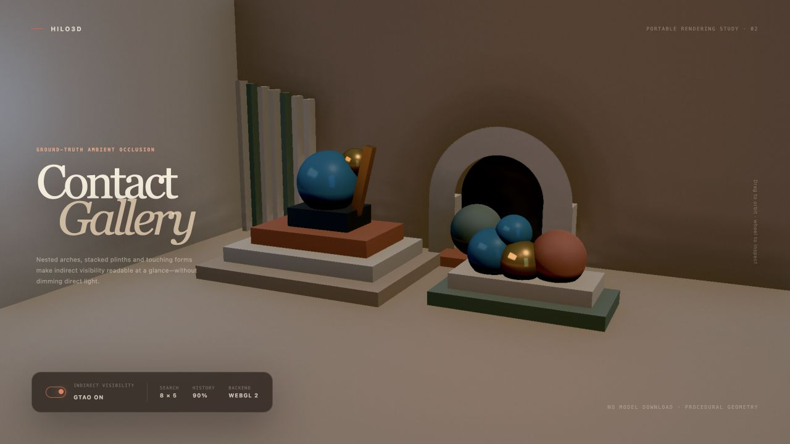

# Ground-truth ambient occlusion



Hilo3D 的 GTAO 是默认关闭、按需付费的屏幕空间环境可见度 feature。普通 Forward 在 WebGPU 与 WebGL
2 上走同一份 GLSL ES 3.00、Render Graph 和 RHI 路径；Clustered
Forward+ 复用同一 horizon、temporal、filter 与 history controller，只有已有 GPU Scene
attribute/motion producer 不同。

## 公共入口

Turnkey Forward/HDR 管线通过 `PostProcessRenderPipelineFactory` 启用：

```ts
new Hilo3d.PostProcessRenderPipelineFactory({
    groundTruthAmbientOcclusion: {
        resolutionScale: 0.5,
        radius: 2,
        falloffStart: 0.6,
        thickness: 0.05,
        directionCount: 6,
        stepCount: 4,
        power: 1.2,
        historyWeight: 0.9,
        depthThreshold: 0.03
    }
});
```

也可以把 `new GroundTruthAmbientOcclusion(options)` 放入
`ForwardRenderPipelineFactory.features`。Clustered Forward+ 使用同名 `groundTruthAmbientOcclusion`
option；该路径要求同时启用 `temporalAA`，从而复用 GPU
Scene 已融合的 motion/log-depth 输出及其 camera-cut validity。未配置或显式设为 `false`
时不创建 depth/attribute、AO transient、history 或额外 shader variant。

所有 option 都在 factory 构造时做有限区间校验。`directionCount` 只接受 4/6/8，`stepCount`
只接受 3/4/5/6，防止运行时动态循环和未经预算的 shader 变体。

## 帧编排与数据合同

普通 Forward 的 opaque 阶段固定记录：

```text
opaque depth prepass
  -> material attributes (oct view normal + roughness/metallic flags)
  -> motion + logarithmic view depth
  -> rotated horizon search at resolutionScale
  -> submission-aware temporal resolve
  -> two edge-aware spatial filters
  -> bounded depth/normal bilateral upsample
  -> opaque PBR shading with pass-global GTAO
```

depth、attribute 与 motion 都由内置 material semantic pass 生成，alpha-mask
coverage、skinning、morph 和 instancing 仍使用共享材质/几何准备路径。GTAO 不绕过 Render
Graph，也不从后端 framebuffer 抓取数据。Forward 与 Clustered 都要求可作为 attachment 且可 filterable
sample 的 `rgba16float`。

AO history/output packing 为：

| Channel | 内容                                                 |
| ------- | ---------------------------------------------------- |
| R, G    | view-space bent normal 的 signed octahedral encoding |
| B       | 0–1 ambient visibility                               |
| A       | `log2(1 + viewDepth)`，供 temporal/filter rejection  |

horizon pass 在每个 pixel 上旋转 slice 方向，双向搜索屏幕空间 horizon，按 view-space radius、thin
surface tolerance 与 distance falloff 累积遮挡，同时把未遮挡方向折入 bent
normal。空间 filter 和最终 upsample 同时限制 normal 与 log-depth 差异；所有指数、深度和累计权重都有显式有限边界，避免 NaN/Inf 传播到 PBR。

## 时域与生命周期

history 按 Camera identity 双缓冲，并且只在成功 submission 后交换。以下情况会重新初始化：

- 首帧、resize 或 history recipe 变化；
- camera transform history 失效、显著 projection 变化或提交间断；
- Clustered GPU Scene 报告 camera cut/history invalid；
- device/context recovery。

resolve 使用 current-to-previous velocity、relative log-depth reject、3×3 visibility neighborhood
clamp 与随像素速度下降的 history weight。失败帧不提交 projection、transform revision、history
index 或 eviction；长时间未使用的 Camera history 通过 graph API 回收。

## PBR 合成边界

GTAO 只改变内置 opaque PBR 的环境可见度：ambient/diffuse IBL 使用 visibility 与 bent
normal，现有 specular
AO 也读取该 visibility。方向光、点光、聚光、面光、阴影结果与 emission 不乘 GTAO，因此不会把 AO 当作全局暗角。结果通过 renderer-owned
pass-global texture 在 graph prepare 后绑定；WebGPU 使用固定 group 3 binding 0/1，WebGL
2 使用同一 reflection plan 的 combined sampler。

当前边界是：

- 只覆盖 opaque/masked surface；透明物体不写入或消费 GTAO；
- 内置 PBR 自动消费，custom material shader 必须自行定义等价的 effect contract；
- 当前只接受 full-output viewport；split viewport/multi-camera atlas 需要独立 history region 合同；
- 屏幕外几何不会参与 horizon search，这是 screen-space AO 的确定边界，不以随机 fallback 掩盖；
- Clustered 路径仍是 WebGPU high-end profile；普通 Forward 的 GTAO 明确支持 WebGPU 与 WebGL 2。

## 示例与发布门槛

[`ground_truth_ambient_occlusion.html`](../examples/ground_truth_ambient_occlusion.html)
是零模型下载的 Contact Gallery procedural 建筑展厅，使用台阶、凹槽、拱券、细柱和密集球组展示 contact
visibility。查询参数 `gtao=false` 提供相同相机、灯光和材质的无 AO 对照； `backend=webgl2|webgpu`
可显式选择后端。

发布覆盖至少包含：option/requirements 单元测试、真实 WebGL 2 与 WebGPU
graph/pipeline 生命周期、Clustered
graph 集成，以及双后端非黑屏和 on/off 像素差异的 Playwright 图形健康检查。
