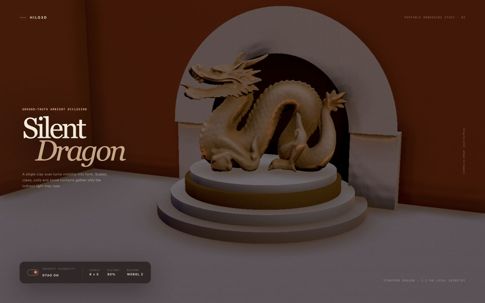

# Ground-truth ambient occlusion



Hilo3D 的 GTAO 是默认关闭、按需付费的屏幕空间环境可见度 feature。普通 Forward 在 WebGPU 与 WebGL
2 上走同一份 GLSL ES 3.00、Render Graph 和 RHI 路径；Clustered
Forward+ 复用同一 horizon、temporal、filter 与 history controller，只有已有 GPU Scene
attribute/motion producer 不同。

## 公共入口

Turnkey Forward/HDR 管线通过 `PostProcessRenderPipelineFactory` 启用：

```ts
new Hilo3d.PostProcessRenderPipelineFactory({
    groundTruthAmbientOcclusion: {
        quality: 'high',
        resolutionScale: 0.5,
        radius: 2,
        falloffStart: 0.6,
        thickness: 0.05,
        thicknessBlend: 0.5,
        intensity: 1,
        power: 1.2,
        bias: 0.035,
        contactRadiusScale: 0.2,
        contactStrength: 0.35,
        normalSource: 'hybrid',
        geometricNormalWeight: 0.65,
        bentNormalStrength: 1,
        multiBounce: 1,
        distanceFadeStart: 100,
        distanceFadeEnd: 200,
        edgeFadePixels: 2,
        historyWeight: 0.9,
        depthThreshold: 0.03,
        normalThreshold: 0.82
    }
});
```

也可以把 `new GroundTruthAmbientOcclusion(options)` 放入
`ForwardRenderPipelineFactory.features`。Clustered Forward+ 使用同名 `groundTruthAmbientOcclusion`
option；该路径要求同时启用 `temporalAA`，从而复用 GPU
Scene 已融合的 motion/log-depth 输出及其 camera-cut validity。未配置或显式设为 `false`
时不创建 depth/attribute、AO transient、history 或额外 shader variant。

所有 option 都在 factory 构造时做有限区间和交叉字段校验。`quality` 提供 `low/medium/high/ultra`
四个 sampling budget；显式 `resolutionScale`、`directionCount` 和 `stepCount`
会逐项覆盖 preset。方向数只接受 2/3/4/6/8，每侧 step 只接受 3/4/5/6/8/10/12，防止运行时动态循环和未经预算的 shader 变体。`distanceFadeEnd`
必须大于 `distanceFadeStart`。

## 帧编排与数据合同

普通 Forward 的 opaque 阶段固定记录：

```text
opaque depth prepass
  -> material attributes (oct view normal + roughness/metallic flags)
  -> motion + logarithmic view depth
  -> view-relative dual-horizon search + analytic normal-hemisphere integration
  -> closest-depth motion resolve + variance-clipped temporal accumulation
  -> two joint depth/normal bilateral filters (depth remains unfiltered)
  -> bounded depth/normal bilateral upsample or full-resolution finalize
  -> color-aware diffuse and bent-cone specular PBR composition
```

depth、attribute 与 motion 都由内置 material semantic pass 生成，alpha-mask
coverage、skinning、morph 和 instancing 仍使用共享材质/几何准备路径。GTAO 不绕过 Render
Graph，也不从后端 framebuffer 抓取数据。Forward 与 Clustered 都要求可作为 attachment 且可 filterable
sample 的 `rgba8unorm` material attributes；bent-normal AO/history 继续使用 `rgba16float`。

内部 current/history packing 为：

| Channel | 内容                                                         |
| ------- | ------------------------------------------------------------ |
| R, G    | view-space bent normal 的 signed octahedral encoding         |
| B       | 0–1 ambient visibility                                       |
| A       | `log2(1 + viewDepth)`，供 temporal/filter/upsample rejection |

交给 PBR 的 full-resolution texture 仍以 R/G 保存 signed-octahedral bent
normal、B 保存 visibility，但 A 改为 0–1 的 multi-bounce strength；内部 rejection
depth 不泄漏到 shading ABI。

horizon pass 不再用 `dot(normal, sampleDirection)` 近似遮挡。它对每条 view-relative
slice 分别搜索正负 horizon，把材质法线投影到 slice plane，并解析积分法线半球中仍可见的 angular
arc。bent normal 是可见 arc 方向的一阶矩，而不是 screen tangent 的经验偏移。主 radius 和短程 contact
radius 分别积分，再通过独立 intensity/strength 合成；angular bias、thin/solid thickness
blend、distance fade 和 screen-edge fade 有各自语义，不再依赖一个高 `power` 值同时承担所有美术控制。

默认 `hybrid` normal 以 full-resolution
depth 的最小差分重建几何法线，并与 material-attribute 法线合成；`material` 与 `geometry`
模式可用于特殊内容或诊断。普通和 reversed depth 直接用 inverse projection；renderer 开启 logarithmic
depth 时，controller 通过公开的 pipeline depth encoding 状态和相机 far 参数先恢复 view
depth，再沿 inverse-projection
ray 重建位置。该路径与 renderer 的既有合同一致：只接受 standard-Z 透视相机和有限、正值的 far
plane，并在记录阶段 fail-fast。

## 时域与生命周期

history 按 Camera identity 双缓冲，并且只在成功 submission 后交换。以下情况会重新初始化：

- 首帧、resize 或 history recipe 变化；
- camera transform history 失效、显著 projection 变化或提交间断；
- Clustered GPU Scene 报告 camera cut/history invalid；
- device/context recovery。

resolve 在 full-resolution motion texture 的 3×3 邻域选择与当前 AO depth 最接近的 point
velocity，避免线性采样跨越前后景。reprojection 同时执行 relative log-depth reject、normal
reject、3×3 visibility mean/variance clip、depth/normal confidence 和随像素速度下降的 history
weight。history 的 bent normal 先解码为向量再做 bilinear accumulation，避免直接插值 oct
encoding。空间 filter 同样先解码 bent normal，仅滤 bent/visibility，并把 center
depth 原样带到下一阶段；最终 upsample 使用未被空间滤波污染的 depth 做 joint bilateral
reconstruction。

每个 Camera identity 拥有独立 UniformBuffer 和 fullscreen pass binding，避免同一 application
frame 内多个相机后记录的 inverse projection 覆盖先记录的 command。失败帧不提交 projection、transform
revision、history index 或 eviction；长时间未使用的 Camera history 通过 graph API 回收。

## PBR 合成边界

GTAO 只改变内置 opaque PBR 的环境可见度：ambient/diffuse IBL 使用 bent
normal，并以 visibility 和 base color 计算可调强度的 multi-bounce diffuse
compensation，减少传统单通道 AO 在高反射率表面产生的无色死黑。specular IBL/SSR
fallback 使用 visibility、bent-normal cone、view reflection direction 和 roughness 得到 directional
specular
visibility。方向光、点光、聚光、面光、阴影结果与 emission 不乘 GTAO，因此不会把 AO 当作全局暗角。结果通过 renderer-owned
pass-global texture 在 graph prepare 后绑定；WebGPU 使用固定 group 3 binding 0/1，WebGL
2 使用同一 reflection plan 的 combined sampler。

当前边界是：

- 只覆盖 opaque/masked surface；透明物体不写入或消费 GTAO；
- 内置 PBR 自动消费，custom material shader 必须自行定义等价的 effect contract；
- 每次 invocation 仍要求 full-output viewport；同帧多 Camera 已隔离状态，但 split
  viewport/atlas 需要独立 history region 合同；
- 屏幕外几何不会参与 horizon search，这是 screen-space AO 的确定边界，不以随机 fallback 掩盖；
- Clustered 路径仍是 WebGPU high-end profile；普通 Forward 的 GTAO 明确支持 WebGPU 与 WebGL 2。

## 示例与发布门槛

[`ground_truth_ambient_occlusion.html`](../examples/ground_truth_ambient_occlusion.html)
是围绕仓库内置 1.2 MB Stanford Dragon 构建的 The Silent
Dragon 博物馆展陈。单色烧陶材质让鳞片、趾爪、盘曲空腔、雕塑落台与同心石台边缘成为主要 contact-visibility 读数，深色壁龛只提供次级的建筑尺度对照。按钮在同一 Stage、相机、模型和 canvas 上即时启停 GTAO，地址栏的
`gtao=false` 仅保存当前状态并作为自动化测试的初始值，不触发页面刷新。`backend=webgl2|webgpu`
可显式选择后端；窄屏使用独立相机 framing 和不遮挡主体的 UI 排版。

发布覆盖至少包含：option/requirements 单元测试、真实 WebGL 2 与 WebGPU
graph/pipeline 生命周期、Clustered
graph 集成，以及双后端非黑屏和 on/off 像素差异的 Playwright 图形健康检查。

[`gtao_acceptance_lab.html`](../examples/gtao_acceptance_lab.html)
是专用、确定性的验收 fixture，固定曝光并同时放置 90° concavity、薄片、平行窄缝、重复台阶、normal-map
surface、rough dielectric、glossy
metal、屏幕边缘对象和移动遮挡体。页面可在不重建 Stage/canvas 的情况下切换 AO、运动和 edge
view，并通过 `logDepth=true` 进入对数深度路径。Playwright 门禁覆盖 WebGL2/WebGPU health、AO on/off
material difference、运动进度、edge view、log-depth 以及双后端像素 parity budget。

## 与 Unreal GTAO 的实现对照

实现对照使用用户 fork 中 UE 5.8 的 `Engine/Shaders/Private/PostProcessAmbientOcclusion.usf` 与
`Engine/Source/Runtime/Renderer/Private/CompositionLighting/PostProcessAmbientOcclusion.cpp`。Hilo3D 现在与其共享的核心原则包括：view-relative 双侧 horizon、projected-normal
inner integral、distance/thickness heuristic、temporal phase rotation、depth-aware
upsample，以及可选择 depth-derived normal。Hilo3D 没有复制 Unreal 的 renderer-private
ABI：它保留 portable GLSL→Naga→WGSL、Render Graph/RHI、signed-oct bent normal、per-Camera
submission-aware history 和 Forward/Clustered 共享 controller。

当前 sampling 在 256 AO-pixel radius 内使用固定 budget 的 sparse depth
taps，而不是消费 Unreal 的 HZB
sampler；这是明确的性能边界，不影响上述解析积分合同。大物体数量的普通 Forward 还会付出 depth、attribute、motion 三次 semantic
prepass 的 draw cost；专项场景在 WebGL2 上保留该证据，后续若增加 fused visibility
MRT，必须作为共享 material-pass ABI 完成，不能为 GTAO 私建后端旁路。
