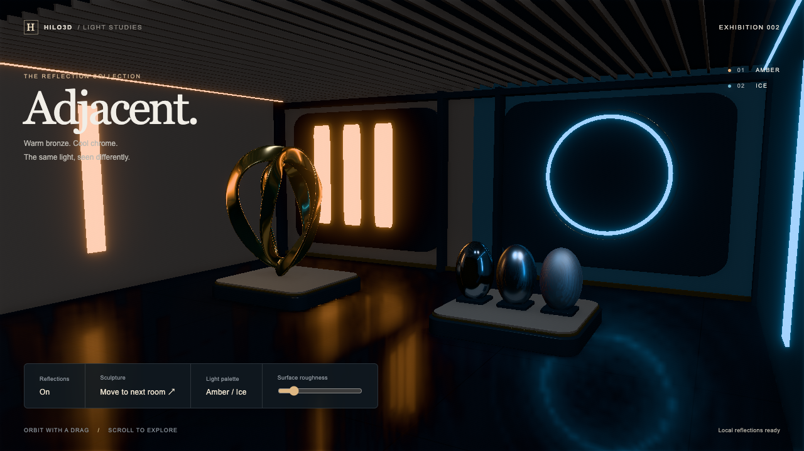

# Local specular reflections

**Unreleased source feature.** `ReflectionProbe` and `ReflectionProbePipelineFactory` add local
specular radiance to the shared PBR renderer on WebGL2 and WebGPU. This is separate from diffuse
DDGI. The implementation uses ordinary scene lists, Render Graph, portable RHI and one GLSL → Naga
raster source. It requires no compute or hardware ray-tracing capability.

The capture above uses the default production resolution (128 pixels per cube face), five roughness
bands and 64 GGX samples. The two probes declare 7,725,696 texture/depth bytes. It is a local native
WebGPU capture, not an enrolled performance baseline.

## Material and volume contract

`PBRMaterial.reflectionProbes` binds one or two distinct probes. Membership and sampler topology are
immutable. Each probe copies a finite world-space position and axis-aligned box; the position must
lie strictly inside the box. The inward smooth boundary fade is positive and no wider than half the
shortest side. Probe intensity is finite, non-negative and mutable.

The fragment shader intersects the world-space reflection ray with the box and looks up the
direction from the capture position to that intersection. Position reconstruction includes the
camera-relative render origin. Overlapping probe weights are normalized; their total coverage is
clamped to one. Uncovered directions retain the material's global environment. Intensity zero
removes that probe from selection. The common evaluator supplies ordinary PBR, layered/clearcoat IBL
and SSR material-attribute output; SSR replaces the same baseline instead of adding it twice.

Static probes accept application-owned `CubeTexture` inputs containing authored GGX-prefiltered
roughness mip levels. Linear and RGBD radiance are explicit options. A non-mipmapped cubemap has
only its base level; the engine does not claim that automatically generated box-filtered mips are
GGX prefiltering. Static textures use the existing texture upload/recovery recipes. Materials do not
destroy probe textures. Local-only IBL uses a bounded analytic split-sum fit; a global environment
continues using its existing BRDF LUT response. The same response is exported to SSR.

Unlit PBR rejects probes. The compact fixed-bucket GPU Scene material ABI does not encode local
probe bindings: registration rejects such a bucket, while ordinary compatible Clustered PBR uses its
shared direct lane. This preserves one material system and explicit eligibility. Static probes need
no capture pipeline, targets or per-frame capture work.

## Dynamic capture and budgets

Omitting `texture` creates a dynamic probe. Wrap a Forward, post-process Forward or Clustered
factory with `ReflectionProbePipelineFactory`. A dynamic probe can belong to only one live capture
runtime. The runtime allocates a six-face linear `rgba16float` atlas with `depth32float` depth, and
two filtered radiance atlases per probe. Each roughness band is an equirectangular projection with
one-pixel gutters and GGX importance sampling; fractional roughness interpolates adjacent bands.
Filtering is GPU raster work, with no CPU pixel readback or raster WGSL fork.

The validated limits are:

| Resource/work                 | Contract                                               |
| ----------------------------- | ------------------------------------------------------ |
| Resident probes               | 1–8 per runtime; explicitly authored pair per material |
| Capture resolution            | Power of two, 16–256; default 128                      |
| Roughness levels              | 2–8, at most `log2(resolution) + 1`; default 5         |
| Filter samples                | 32, 64 or 128; default 64                              |
| Scene faces                   | 1–6 per application frame; default 1                   |
| Filter bands                  | 1–8 per application frame; default 1                   |
| Resident texture/depth budget | Hard `maxResidentBytes`, default 64 MiB                |

`residentBytes` reports the declared color/depth texel footprint (excluding driver padding, the
small generation marker, shared shadows and the wrapped pipeline). Capture and filter limits are
global for this runtime, not multiplied by the number of probes. Probes complete in deterministic
round-robin order. A capture contains six faces followed by all roughness bands. The last face and
first filter may share a frame. Device limits and required HDR/depth formats are checked at
creation.

The initial capture is requested automatically. After changing lights, emissive surfaces or scene
content, call `probe.requestUpdate()`. Additional requests coalesce; an in-progress capture
completes before the newer requested revision starts. Capture faces can observe different scene
times; this is budgeted reflection capture, not a simultaneous scene snapshot. Applications
requiring a fixed snapshot must hold relevant content steady for that capture.

Captures include opaque/masked shared scene geometry, lights and shared atlas shadows. They omit
transparent/transmitting queues and meshes whose PBR material binds local reflection probes. This
explicit non-recursive visibility policy prevents feedback and self-capture. Global-environment
specular on other materials remains view dependent. There are no recursive mirrors, transparent
reflection transport, per-probe automatic scene-change tracking, volume rotation, or unbounded
bindless probe selection in this release. Box projection is an approximation for enclosed spaces; it
does not provide arbitrary planar-mirror accuracy.

## Publication and recovery

Face/filter cursors and published texture selection advance only after a valid submission. A
partially captured or filtered back buffer never replaces the front buffer. Recording, preparation,
execution or submission failure retains the last complete reflection and retries the uncommitted
work. Texture use/destruction remains submission-aware. A renderer history marker owns device
generation validity: recovery invalidates GPU-only radiance and restarts capture from face zero.
Renderer resource release rebuilds runtime-owned targets and their sampled bindings; ordinary
application targets retain their existing explicit-release contract.

Auxiliary cameras use `RenderPipelineContext.recordView()` before main-view culling. Each has its
own scoped camera, lights, shadow recording and graph handles, but participates in the same graph
and submission. The parent context is suspended during the synchronous callback. Nested auxiliary
views and promise-like callbacks fail; callback failure aborts the application frame even if the
caller catches it. Auxiliary views do not invoke or advance the wrapped main-view TAA/SSR pipeline.
Multiple main-camera invocations capture at most once per application frame; wrapped pipeline
invocation limits still apply.

Dynamic-probe materials conservatively set authored temporal reactivity to one, since changes in
reflected radiance have no geometric velocity. This sacrifices history accumulation on those
surfaces to avoid stale reflections. Finer spatial/version-aware reactivity remains an extension.

## Gallery authoring

Adjacent reuses the repository's original Blender-authored
[Orbital Bloom sculpture](../examples/models/Lumen/README.md), with warm bronze ribbons, a cool
chrome roughness sweep, recessed light panels, a luminous ring, ceiling ribs, generated stone
textures and portable GTAO contact shading. No external runtime asset download is required.

A capture-only layer reuses the sculpture's exact geometry with direct/global-lit PBR, while the
main camera sees its local-probe material. This explicit one-bounce authoring policy retains the
sculpture silhouette in reflections without recursive probe feedback. Movement, roughness and
emitter edits request new captures; the old complete reflection stays visible until publication.

The software-GPU `?test=1` profile uses half-resolution scene backing, 32-pixel faces, five bands,
64 samples, and a six-face/five-band update budget. It retains the same geometry, shaders, graph
passes, submission waits, pixel checks and post-capture interactions. `?test=1&quality=production`
keeps production resolution, six bands, 128 samples and one-face/one-band updates while enabling the
shared stable-capture control. Neither profile replaces randomness/time globally or fakes draws.

## Evidence and remaining gates

Executed commands, the clean-base SSR comparison and unrun gates are recorded in the
[2026-09-22 validation record](./validation/LOCAL_REFLECTIONS_2026-09-22.md).

- [ReflectionProbes tests](../test/spec/renderer/ReflectionProbes.test.ts) execute WebGL2 and actual
  WebGPU raster pipelines, covering volume blending, box parallax, mip selection, asymmetric
  offscreen capture rows, roughness bands, atomic publication, discarded-frame retry, resource
  release and real WebGPU device loss. Clustered SSR miss composition preserves baseline energy.
- [Auxiliary view tests](../test/spec/renderer/AuxiliaryRenderViews.test.ts) cover borrowed-context
  isolation, stale leases, nested/async callback rejection and whole-frame rollback.
- [Adjacent](../examples/local_reflections_gallery.html) provides connected rooms, a moving metal
  sculpture, a roughness sweep, offscreen illumination, light recapture and reflection toggles.
  [Browser tests](../test/ui/post-processing.spec.ts) retain real draw/submission evidence, stable
  on/off pixels, post-capture interaction, resizing and post-teardown error observation.

These are correctness contracts, not an enrolled performance baseline. Dedicated physical-device
capture-time and resident-memory budgets need independent review before a hardware-specific frame
time or production scene scale is promised. Broader capture visibility, spatial probe selection,
automatic updates and finer temporal masks remain separately scoped extensions.
