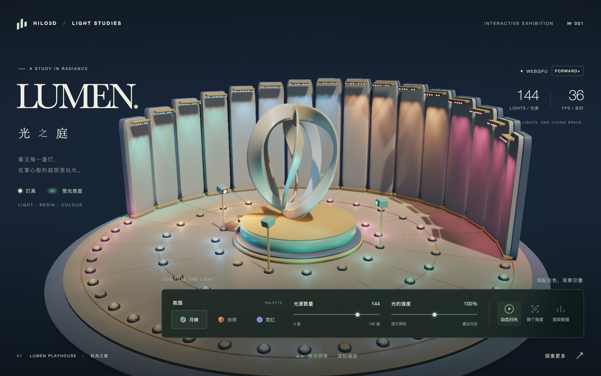
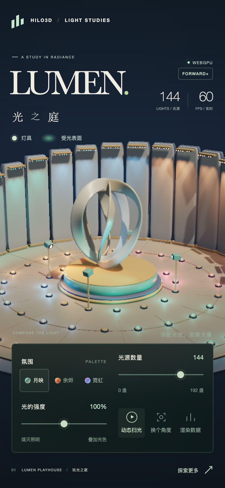

# LUMEN · 光之庭

`examples/clustered_forward_plus_lumen.html` is an original interactive lighting exhibition for the
production WebGPU `ClusteredForwardPlusPipelineFactory`. Launch it with `npm run examples:dev` and
open `/examples/clustered_forward_plus_lumen.html`.

The scene presents a miniature toy courtyard with a Blender-authored three-ribbon sculpture,
circular plinths, a continuous plaza with slender radial inlays, and sixteen rounded fins with a
varying 4.6–6.4 scene-unit height envelope. Public `PBRMaterial` instances give the platform,
architecture, and fixture bodies nonmetallic plastic and resin finishes in cream, mint, apricot, and
slate blue. The shared [`createLumenRoundedBox()` helper](../examples/shared/lumenGeometry.ts)
supplies a centered unit cube with a 0.12 edge radius for the fins and moving-head bodies.

Each fin carries one continuous light fixture near its top, containing eight fixed `SpotLight` LEDs
that wash down its face, giving 128 wall lights. Four raised moving-head `SpotLight` fixtures and
sixty recessed `PointLight` floor lamps occupy three radial bands; the outer band follows the
plaza's front semicircle. The full scene therefore has 132 spotlights and 60 point lights. Shared
wall-light housings, floor-lamp rims, and articulated spotlight heads make the emitters recognizable
within the architecture. The resin surfaces reveal the lights' footprints and overlapping colors,
with an initial light palette of muted teal, blue, apricot, and rose.

The sculpture is a local 325 KB indexed GLB with three opaque metallic/roughness materials and no
external textures. The example sets its runtime metallic factor to 0.035 and roughness to 0.32,
brightens its base color by 0.12 in red, 0.15 in green, and 0.22 in blue with each channel capped at
1, and rotates it −24 degrees around Y. These adjustments give the sculpture a pale resin finish
that responds clearly to colored illumination. The authored GLB and its original materials remain
unchanged; its source and reproducible Blender recipe are in
[`examples/models/Lumen/`](../examples/models/Lumen/README.md).

## Screenshots

Reviewed desktop and mobile captures of the final resin courtyard, taken with native Metal WebGPU at
DPR 2 and the engine's 1.5 pixel-ratio cap. Motion is paused for inspection; the FPS readout is a
local runtime observation, not benchmark evidence.



<details>
<summary>Mobile layout</summary>



</details>

## Controls and rendering

- **光源数量** selects 0–192 local lights in steps of 24; the initial count is 144. A coprime
  permutation distributes partial counts across both wall-wash LEDs and floor lights. Inactive
  lights hide their emissive bulbs while their physical housings remain in place.
- **光的强度** adjusts actual spot- and point-light illumination from 0–200%. Bulb emission remains
  unchanged so the zero setting makes it possible to distinguish glowing geometry from lighting.
- **月映 / 余烬 / 霓虹** switch the local-light colors and bulb emission together.
- **动态扫光** pauses or resumes both the gentle intensity pulse and the four spotlight heads' slow
  sweep across the sculpture and floor. The light positions stay fixed while their directions
  change; public `Node.lookAt()` keeps the visible head bodies aimed at the same moving targets.
  Pausing freezes both intensity and direction, and reduced-motion preferences start them paused.
- **换个角度**, dragging, wheel, and touch use public `OrbitControls` and `setView()`.
- **渲染数据** displays GPU cluster-link, visible-object, and overflow counters sampled every 1.5
  seconds. FPS is measured by the application ticker and is not GPU timing or benchmark evidence.

All sculpture, architecture, fixture, and bulb meshes register their actual geometry/material
identity as GPU Scene buckets. The GPU Scene has capacity for 1,536 objects. The public pipeline
uses GPU culling and indirect draws, 32-pixel light tiles, 24 logarithmic depth slices, HDR bloom,
ACES, TAA, and GTAO. Screen-space reflections are disabled, and the matte resin surfaces keep the
direct-light footprints legible. Production frames follow the shared renderer, Render Graph,
portable RHI, and WebGPU backend described in the
[rendering architecture](./RENDERING_ARCHITECTURE.md).

A single directional key light uses a 2048-pixel shared shadow-atlas slice, with bias tuned to avoid
self-shadow striping on the pale resin surfaces. The small animated head bodies do not cast shadows,
allowing the static shadow atlas to remain cached while they rotate. The stands, sculpture, and
architecture retain their directional-key shadows. The light database reports the local-light
control value **plus one**: 145 lights initially and 193 at the maximum setting. Ambient
illumination is not a database light. The diagnostic object count includes architecture, fixture
housings, bulbs, and the sculpture.

The supported backend is explicitly **WebGPU** because the scene depends on compute and storage
resources. A WebGL2 request or a failed WebGPU initialization produces a visible error. The page
does not create a fallback renderer. Normal operation caps the pipeline viewport and physical output
resolution at 2560 × 1600, limiting pixel ratio to fit, including after resize. Application FPS and
diagnostic counters are illustrative runtime observations, not enrolled performance-baseline
evidence.

## Validation

The page participates in the example catalog, Vite multi-page build, and dedicated native WebGPU
release tests through `npm run test:webgpu:native`. `?test=1` pauses automatic ticking, caps the
pipeline viewport and physical output at 960 × 600 through a matching pixel-ratio limit, and uses
lower internal effect resolution while retaining the same light capacity and rendering algorithms.
It exposes `window.__HILO3D_LUMEN_TEST_API__.settle()` for deterministic submitted frames and
diagnostic readback.

```sh
npm run typecheck
npm run lint
npm run test:ui:contract
npx playwright test test/ui/clustered-forward-plus-lumen.spec.ts --project=chromium-native-webgpu
```

The dedicated browser test checks GPU light counts, cluster associations, absence of fallback or
overflow, actual indirect draws, and pixel changes when illumination changes while bulbs keep their
emission. It also checks palettes, camera views, four moving heads, changes in their light-direction
checksum and rendered pixels during motion, exact direction stability while paused, request/console
failures, and delayed GPU validation errors. A settled screenshot is attached as `Lumen final`.

On the local macOS validation host on 2026-09-08, Chromium's SwiftShader project did not reach the
ready state within the 90-second startup budget, including a run with the reduced 960 × 600 pipeline
limit. The frozen-page trace recorded no reload or console error; initialization remained on the
pipeline loading screen. This is a software-adapter startup limitation, not a successful portable
browser result. The dedicated release test therefore runs in the physical-GPU project, as does the
Sponza lighting showcase. Native acceptance does not establish SwiftShader coverage, and neither
adapter lane constitutes enrolled benchmark evidence.
