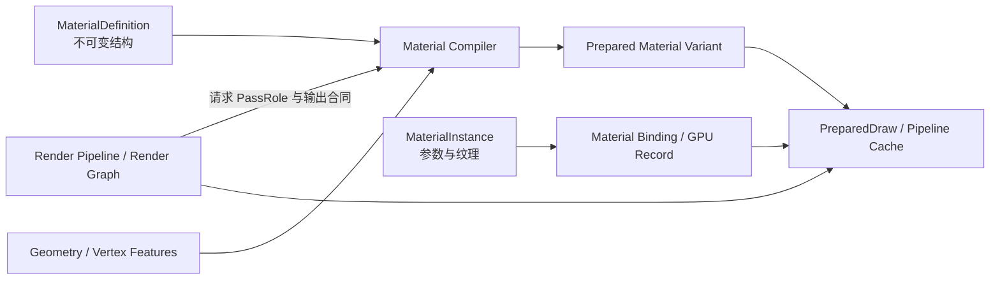

# Hilo3D 材质系统现代化设计与迁移计划

> 审计基线：`80cbdbc`（2026-08-02）。本文描述目标架构、迁移顺序和验收门槛，不把尚未实现的
> `MaterialDefinition`、通用语义 Pass 或共享 GPU Material
> Database 当作当前公共 API。当前生产事实仍以
> [`RENDERING_ARCHITECTURE.md`](./RENDERING_ARCHITECTURE.md)、源码和测试为准。

## 结论先行

Hilo3D 当前缺的不是另一套 Render
Graph、RHI 或后端，而是一层能把“材质表面描述”稳定地编译到不同渲染 Pass 和不同硬件 profile 的材质前端。

现有 Shared Renderer、Scriptable Render Pipeline、Render Graph、portable
RHI、PreparedDraw 和双后端 cache 已经能够承载现代材质系统。现有 PBR 也具备 clearcoat、anisotropy、transmission、volume、iridescence、IBL 和 HDR 等生产能力。需要改造的是当前
`Material` 同时承担参数、纹理、Shader 结构、固定功能状态、显示策略和部分 Pass 策略的单体模型。

最新的 `ClusteredForwardPlusPipelineFactory` 已经提供重要的实现原型：注册的 opaque PBR
geometry/material bucket 会生成 pipeline-local material storage record、纹理 variant、depth/color
GPU-driven pass，并通过 `pbr_surface.glsl` / `pbr_brdf.glsl`
复用普通 Forward 的表面和 BRDF。它证明了紧凑 GPU material record、dirty
upload、固定 bucket 和 light-provider 解耦可行，但当前仍限定为预注册、opaque、unskinned
metallic/roughness
PBR，且没有跨 Forward、shadow、motion、attributes 和 picking 的 Definition/Instance 与语义 Pass 合同。因此本计划不是从零重写，而是把这条已验证垂直切片抽取、泛化并接回共享 renderer。

合理的目标不是增加一个旧式 `material.passes[]`，而是建立：

1. 不可变的 `MaterialDefinition` 和只保存运行时参数的 `MaterialInstance`；
2. 由 Pipeline 请求、材质编译器解析的语义 Pass，例如 `forward`、`depth-only`、
   `shadow-caster`、`motion-vector` 和 `material-attributes`；
3. 可诊断、可预热、有界且与 Pass 输出合同关联的 Shader variant；
4. 把 pipeline-local material bucket/record 泛化为 stable material ID、dirty-range
   upload 和共享 GPU-resident material record；
5. 明确区分 coverage、transmission、compositing 的标准表面合同；
6. 每个纹理槽独立的 texture、sampler、UV、transform、channel 和 color encoding 语义。

这组能力是扩展现有 GPU Scene/Clustered Forward+ 切片，以及实现 TAA/TAAU、Material Attribute
Buffer、现代阴影和 meshlet material
binning 的共同前置层。完整的节点编辑器、任意材质层叠和 Substrate 级材质图不属于首期基础工作。

## 1. 范围、判断标准与非目标

### 1.1 进入 P0 的条件

一个材质改造项只有同时满足以下条件才进入 P0：

- 为至少两个后续现代渲染系统提供共同数据或 Shader 合同；
- 能进入现有 Shared Renderer、Render Graph、RHI、恢复和 submission 事务；
- 不要求普通 raster 绕过 GLSL ES 3.00 → Naga → WGSL 的唯一源码链；
- 不在逐 Draw 热路径增加无界分配、反射、字符串拼接或后端分支；
- 可以为 WebGPU high-end profile 提供更强 lowering，同时保持 WebGL 2 portable profile 的明确边界；
- 有兼容策略、失败策略和可执行验收，而不只是新的类型名称。

### 1.2 首期非目标

- 不推翻当前 Shared Renderer、SRP、Render Graph 或 RHI；
- 不恢复 WebGL 1、classic numeric uniform 或手写的 portable raster WGSL 镜像；
- 不把每盏灯实现为材质额外 Pass；生产光照主线仍是 Clustered Forward+；
- 不因为支持语义 Pass 就默认增加 depth prepass、attribute buffer 或额外 MRT；
- 不先实现完整传统 deferred；attribute pass 只在 GTAO、SSR、SSGI 等功能声明需要时创建；
- 不假设 WebGPU 存在桌面原生 API 等价的无限 bindless descriptor；
- 不先做完整可视化材质图、任意循环、动态分支图或无限 BSDF 层叠；
- 不要求 WebGL 2 与 WebGPU high-end profile 在 compute/storage 功能上伪对等。

## 2. 当前系统基线

### 2.1 已有能力

| 领域                           | 当前事实                                                                                     | 结论                         |
| ------------------------------ | -------------------------------------------------------------------------------------------- | ---------------------------- |
| Render Pipeline / Render Graph | SRP 可以 cull、创建 RendererList，并记录 scene、fullscreen、copy、compute 和 GPU-driven pass | 保留，作为多 Pass 唯一编排层 |
| RendererList                   | 支持 opaque/transparent/all、排序、`overrideMaterial` 和 shadow caster 过滤                  | 已能重复选择和绘制场景对象   |
| Scene Pass                     | 显式声明连续 color attachment、depth/stencil、viewport、scissor 和 graph resource access     | 已能表达管线级多 Pass        |
| Draw preparation               | `PreparedDraw`、pipeline、binding、vertex input 和 resource cache 已集中在共享 renderer      | 可作为材质编译产物的消费端   |
| Shader portable path           | GLSL ES 3.00 经统一预处理，WebGPU 通过 Naga 转为 WGSL                                        | 必须继续复用                 |
| 数据更新频率                   | WebGPU binding 已按 global/material/object/custom 分组                                       | 分层正确，需要升级数据内容   |
| PBR                            | 支持现代 glTF layered PBR、IBL、area light、transmission 和 HDR                              | 保留现有 BRDF，实现迁移适配  |
| G0/L0 材质垂直切片             | 预注册 opaque PBR 已有 material storage、variant、dirty upload 和共享 surface/BRDF           | 作为 MAT0–MAT4 原型抽取泛化  |
| 生命周期                       | 资源创建、提交、失败回滚和 device/context loss recovery 已闭环                               | 新材质资源必须接入同一事务   |

相关代码：

- [`Material.ts`](../src/material/Material.ts)
- [`PBRMaterial.ts`](../src/material/PBRMaterial.ts)
- [`Shader.ts`](../src/shader/Shader.ts)
- [`RendererList.ts`](../src/render/pipeline/RendererList.ts)
- [`SceneRenderPass.ts`](../src/render/pipeline/passes/SceneRenderPass.ts)
- [`ForwardRenderPipeline.ts`](../src/render/pipeline/ForwardRenderPipeline.ts)
- [`ClusteredForwardPlus.ts`](../src/render/pipeline/ClusteredForwardPlus.ts)
- [`MeshDrawProcessor.ts`](../src/render/renderer/MeshDrawProcessor.ts)
- [`WebGPUBindingLayout.ts`](../src/render/shader/WebGPUBindingLayout.ts)
- [`pbr_surface.glsl`](../src/shader/chunk/pbr_surface.glsl)
- [`pbr_brdf.glsl`](../src/shader/chunk/pbr_brdf.glsl)

### 2.2 当前材质对象的职责过载

`MaterialParameters` 目前混合了以下不同生命周期和所有权的数据：

- 表面数据：颜色、粗糙度、金属度、法线、发光、透射等；
- 纹理存在性和 UV 变换；
- Shader 名称、宏、`onBeforeCompile` 和自定义绑定；
- depth、cull、blend、stencil 等 pipeline state；
- render order、shadow participation 和透明队列策略；
- `useHDR`、`exposure`、`gammaCorrection` 等显示管线策略；
- `enableDrawBuffers` 等本应由 Render Pass attachment contract 决定的策略；
- 直接使用 WebGL `GLenum` 表达的公共状态。

这在小规模 forward renderer 中可工作，但不适合作为 GPU Scene、material
binning、时域 Pass 和多输出 Pass 的长期合同。尤其是：

- 材质参数更新与 Shader 结构变化没有严格类型边界；
- 一个材质只有一套全局固定功能状态，难以为 depth/shadow/motion 等 Pass 合理覆写；
- `transparent` 同时改变 blend 和 depth write，混合了 coverage、transmission 与 compositing；
- HDR、曝光和 gamma 的所有者不清晰；
- MRT 输出是材质布尔值，而不是 fragment output 与 attachment signature 的编译合同。

### 2.3 Shader variant 现状

内置材质通过 `getRenderOption()` 按纹理存在性、光照、阴影、alpha
cutoff、clearcoat、anisotropy、transmission、volume、iridescence 等条件生成宏。`Shader`
已使用碰撞安全的结构化 key 和有界 cache，这比无界字符串 cache 更可靠，但仍存在以下结构性限制：

- 变体主要在运行时按 Mesh、Material、Light、Fog 和 Geometry 状态发现；
- 没有材质资产级的合法变体清单、warmup 和缺失变体报告；
- 动态参数与真正改变 Shader topology 的静态特性没有统一 schema；
- Pass role 和 render-target output signature 不是材质变体的一等维度；
- portable Forward 仍使用固定 LightBlock/light-count 路径；G0/L0 high-end 切片已移除精确 light-count
  variant，通用材质编译器不能让这一性质回退；
- 可变公共字段迫使 Draw/Pipeline cache 额外比较大量标量以防止遗漏 dirty 标记。

G0/L0 high-end 切片已经按受支持的 PBR 纹理角色建立确定 variant key，并让 clustered light
provider 复用共享 surface/BRDF；这证明了“表面计算与光源迭代分离”可行。它仍是
`ClusteredForwardPlusPipelineFactory`
内的专用编译路径，不是能同时服务普通 Forward、shadow、motion 和 attributes 的 Definition/Pass 编译器，也没有资产级 manifest/warmup。

portable Forward 的 `MaterialBlock` 当前是 Basic、PBR 和历史字段的固定 superset。它能维持稳定 std140
ABI；G0/L0 切片则已经使用紧凑的 pipeline-local storage material
record。后续不应继续扩张前者，也不应复制后者形成第二套永久材质系统，而应让两种 backend/profile
lowering 消费同一 Definition/Instance schema。

### 2.4 纹理槽语义不足

当前材质主要依赖具体字段和两个全局 `uvMatrix`/`uvMatrix1`。glTF loader 会记录 texture
info，但主 PBR 创建路径只对 base-color texture 调用 texture
transform 解析；扩展纹理也没有一个统一的“每槽纹理语义”落点。G0/L0 切片能为固定 PBR texture
role 记录 UV0/UV1、sampler 和 texture revision，但仍消费材质级 UV
matrix，因此同样需要统一的 per-slot schema。

目标系统必须让每个 texture slot 独立描述：

```text
texture view + sampler + UV set + UV transform + channel mapping + color encoding
```

否则同一材质中不同纹理使用不同
`KHR_texture_transform`、不同 UV 集或不同色彩编码时仍会互相覆盖或依赖隐含约定。

## 3. 多 Pass 支持边界与设计决定

### 3.1 当前已经支持管线级多 Pass

当前 SRP 可以一次 cull 后创建多个 RendererList，把相同或不同对象集合记录到多个 Scene
Pass；每个 Pass 可以使用不同附件、load/store、viewport、scissor、override material 和 graph
dependency。因此以下流程不需要重做渲染框架：

```text
Shadow / Depth
    → Forward Opaque
    → Optional Motion or Material Attributes
    → Transparent
    → Post Process
    → Output
```

默认 Forward
Pipeline 已经按 shadow、opaque、transparent、post-process 和 output 组织 Pass，并提供稳定 feature
injection point。自定义 Pipeline 还可以显式记录额外 scene/fullscreen/copy/compute pass。

G0/L0 high-end factory 进一步在同一 graph 中记录 GPU-driven depth、Hi-Z、cluster
allocation、indirect color、Bloom、display 和 Forward compatibility
pass，说明复杂现代多 Pass 已经可以落在现有基础设施上。它的 depth/color 材质逻辑目前由 factory 专门构造，尚未由通用材质语义 role 解析。

### 3.2 当前缺少材质级语义多 Pass

`Mesh` 只引用一个 `Material`，`ShaderMaterial` 只持有一组 vertex/fragment
source。阴影路径通过专用 shadow material/proxy 修正部分状态；G0/L0 又维护自己的 depth/color PBR
variant。两者都没有一个统一合同让 Pipeline 询问：

- 这个材质是否支持 depth-only？
- alpha cutoff、skinning、morph 和自定义顶点变形如何在 shadow/depth/motion 中复用？
- motion-vector 或 material-attributes 要使用哪个 fragment output？
- 某个 Pass 不支持时应使用安全 fallback、跳过，还是在 graph frame 开始前失败？
- Pass-specific state 与普通 forward state 如何组成 pipeline key？

所以，当前结论是：**可以编排多 Pass，但不能把任意材质稳定地编译为多个语义 Pass。**

### 3.3 不采用有序 `material.passes[]`

不允许材质隐式决定 graph 顺序或自行创建 attachment。原因是：

- Render Graph 才拥有资源、hazard、pass culling、alias/reuse 和 submission 事务；
- 同一材质可能被多个 Camera、shadow slice、picking、reflection 或 feature pipeline 以不同顺序消费；
- 材质资产不应知道场景中是否启用 TAA、GTAO、SSR 或 shadow cache；
- 隐式材质 Pass 会使 draw 数、带宽和资源成本难以诊断；
- 旧式逐灯光附加 Pass 与现代 Forward+ 主线冲突。

正确的所有权是：



- Pipeline 决定何时绘制、画到哪里、读写哪些 graph resource；
- MaterialDefinition 决定能为哪些语义角色生成 Shader 和默认状态；
- MaterialInstance 提供参数与纹理，不决定 Pass 数量和顺序；
- Material Compiler 把 role、vertex features、target signature 和 backend profile 降低为稳定变体；
- Shared Renderer 继续负责排序、instancing、PreparedDraw、缓存和命令准备。

## 4. 现代引擎参照及 Hilo3D 落点

这里参考的是 Unity 6 当前 SRP/Render Graph/GPU Resident Drawer 和 Unreal Engine 5.8 的 Material
Instance、Mesh Drawing
Pipeline 与 Substrate，而不是 Unity 旧式 ForwardAdd 或固定 ShaderLab 多 Pass 工作流。

| 当前参照                                                                                                                                      | 值得借鉴的原则                                                      | Hilo3D 落点                                                               |
| --------------------------------------------------------------------------------------------------------------------------------------------- | ------------------------------------------------------------------- | ------------------------------------------------------------------------- |
| [Unity 6 URP Render Graph](https://docs.unity3d.com/kr/current/Manual/urp/render-graph.html)                                                  | RendererList 和 Render Graph 负责对象选择、Pass 编排和资源生命周期  | 保留当前 SRP/Graph 作为唯一编排层                                         |
| [Unity 6 GPU Resident Drawer](https://docs.unity3d.com/kr/current/Manual/urp/gpu-resident-drawer.html)                                        | GPU-resident object/material 数据、实例化和 Forward+ 需要共同设计   | stable material ID、GPU record、bucket 与 GPU Scene 协同                  |
| [Unreal Engine 5.8 Mesh Drawing Pipeline](https://dev.epicgames.com/documentation/en-us/unreal-engine/mesh-drawing-pipeline-in-unreal-engine) | Mesh 数据与 mesh pass processor 分离，Pass 选择 Shader、状态和绑定  | `MaterialPassRole` + shared draw preparation                              |
| [Unreal Engine 5.8 Material Instances](https://dev.epicgames.com/documentation/unreal-engine/instanced-materials-in-unreal-engine)            | 材质结构与运行时参数分离，参数变化不引发昂贵重编译                  | `MaterialDefinition` + `MaterialInstance`                                 |
| [Unreal Engine 5.8 Substrate](https://dev.epicgames.com/documentation/unreal-engine/overview-of-substrate-materials-in-unreal-engine)         | 物理参数、coverage/transmittance 分离、closure 分类和按平台预算简化 | 先实现小型 typed surface closure；不复制仍在演进中的完整 Substrate 复杂度 |

这些系统的共同点不是“一个材质包含很多按顺序执行的 Pass”，而是：材质先形成稳定的表面/参数描述，再由渲染 Pass 处理器选择对应 Shader、状态和资源布局。Hilo3D 应复制这种职责边界，而不是复制桌面 API 的具体 descriptor、mesh
shader 或 bindless 实现。

## 5. 目标材质模型

以下类型只表达设计合同，不承诺最终公共 API 的精确命名。

### 5.1 MaterialDefinition

`MaterialDefinition` 是不可变的 Shader 结构与资源布局描述：

- stable definition ID 和 material family；
- parameter schema、texture slot schema 和默认值；
- surface domain，例如 surface、unlit、post-process 或受控的未来 decal；
- coverage/compositing policy；
- 支持的 `MaterialPassRole`；
- 每个 role 的 Shader module、默认 pipeline state 和输出语义；
- 静态 feature mask 与允许的 backend/rendering profile；
- recovery-aware 的编译 recipe，而不是 native pipeline identity。

Definition 创建后不得原地修改结构。需要改变 normal-map topology、surface
domain、Pass 支持或资源布局时，创建/查找另一个 Definition，避免 cache 通过逐字段猜测结构是否变化。

### 5.2 MaterialInstance

`MaterialInstance` 引用一个 Definition，只保存：

- scalar/vector/matrix 参数；
- texture view 与 sampler；
- 明确允许实例覆写的 compositing/pipeline 参数；
- monotonically increasing data revision 和 dirty ranges；
- stable material ID 与 GPU record lifecycle。

普通参数更新不得改变 pipeline
layout 或触发 Shader 编译。确实需要静态切换的功能必须通过显式 feature 选择新 Definition/variant，不允许通过任意公共字段在一帧中悄悄改变布局。

### 5.3 标准表面合同

首版只需要一个紧凑的 `StandardSurface`，复用现有 PBR BRDF：

```text
base color
normal / tangent basis
metallic or F0
perceptual roughness
emissive
occlusion
coverage
transmission / attenuation / thickness / IOR
clearcoat
anisotropy
iridescence
material flags
```

必须明确分离：

- **coverage**：表面是否存在以及覆盖比例，服务 opaque、mask、alpha-to-coverage；
- **transmission**：光穿过物质时的折射、吸收和散射；
- **compositing**：结果如何与已有 scene color 合成以及是否写深度；
- **display transform**：曝光、tone
  mapping 和 gamma，归 renderer/post-process 所有，不属于 surface。

首版不需要暴露任意 closure graph。`PBRMaterial` 可以确定性映射到
`StandardSurface`；Basic/Unlit 使用独立 family 或受控的简化 lowering。

### 5.4 TextureSlot

每个纹理槽至少声明：

- logical semantic 和 Shader sample type；
- texture view、sampler 和 fallback texture；
- color encoding，例如 linear、sRGB 或 data；
- UV set、独立 transform 和可选 channel mapping；
- slot presence 是否改变 topology，还是通过默认纹理保持同一 variant；
- portable/WebGPU high-end profile 的绑定策略。

glTF 的 `KHR_texture_transform`、texCoord 和扩展纹理都应通过同一 slot
schema 进入材质，不再写入两个全局 UV 矩阵。现代 glTF 的 specular、sheen、emissive-strength、dispersion 等扩展应在 slot/surface
schema 稳定后再补，避免继续增加互相耦合的特殊字段。

### 5.5 MaterialPassRole

首批内置角色建议为：

| Role                  | 用途                                      | 首版要求                                                           |
| --------------------- | ----------------------------------------- | ------------------------------------------------------------------ |
| `forward`             | 普通 opaque/alpha-tested/transparent 表面 | 复用现有 PBR/Basic，输出合同由 active scene pass 决定              |
| `depth-only`          | depth prepass、Hi-Z 输入                  | 必须复用 deformation 和 coverage；无颜色输出                       |
| `shadow-caster`       | Shadow Atlas、未来 shadow cache/VSM       | 必须复用 deformation、双面策略和 alpha cutoff                      |
| `motion-vector`       | TAA/TAAU、motion blur、temporal rejection | 使用 current/previous transform；skinning/morph 有 previous pose   |
| `material-attributes` | GTAO、SSR、SSGI 等按需属性                | 输出 compact normal、roughness、flags；默认 Forward 路径不创建资源 |
| `picking`             | ID/selection                              | 保留 coverage 和 deformation，输出稳定 object/material ID          |

可允许命名空间化的 `user:*` role，但只有自定义 Render
Pipeline/Feature 显式请求时才会执行。Definition 不能通过注册 `user:*` role 自动向每帧插入 Pass。

### 5.6 Fallback 与失败策略

每个 role 必须有确定策略：

- `required`：缺失时在 RHI frame 开始前失败；
- `safe-fallback`：只有编译器能证明语义等价时使用通用 variant；
- `skip`：该对象在此非关键 role 中明确不参与；
- `override`：Pipeline 显式提供 override material，例如完全不依赖原表面的 debug pass。

不允许在 Shader/pipeline 创建失败后静默切换为视觉不等价的材质。自动 depth/shadow
fallback 只有在没有自定义 vertex
deformation、coverage 或 displacement 时才安全；其他情况必须要求材质提供对应 role。

## 6. Variant、绑定与 GPU Material ABI

### 6.1 稳定 variant key

材质 Shader variant key 至少包含：

```text
definition ID
+ pass role
+ static feature mask
+ vertex feature/layout class
+ fragment output / target signature
+ rendering profile
+ backend compiler profile
+ shader source revision
```

不应包含：

- base color、roughness、texture transform 等普通实例参数；
- object transform、camera、render order 等逐对象/逐帧数据；
- Clustered Forward+ 完成后的精确 light count；
- native WebGPU/WebGL object identity。

attachment format、sample count、depth convention 等真正影响 graphics pipeline 的维度进入 pipeline
key；只有影响 Shader output/precision/feature 的部分进入 Shader variant
key。两者不可继续混成一个无限增长的宏字符串。

### 6.2 Variant 发现、预热和诊断

需要同时保留开发期动态发现和生产期可控预热：

- Definition 创建时验证所有声明 role 的参数/纹理/输出布局；
- scene/glTF 加载阶段可收集 variant manifest；
- Renderer 提供异步 warmup，不在第一帧可见 Draw 时才发现全部组合；
- 缺失或非法 variant 在 prepare 阶段携带 definition/role/feature/target 上下文失败；
- diagnostics 统计 definition、instance、variant、pipeline、compile time、cache hit 和 eviction；
- variant budget 超限可观察，不通过扩大无界 cache 掩盖问题。

### 6.3 GPU Material Database

G0/L0 high-end factory 已经建立 renderer-owned、submission-aware 的 pipeline-local material storage
database：按注册 bucket 分配物理 record、跟踪材质/纹理 revision、合并 dirty range，并在 object
record 中保存逻辑 bucket/material index。MAT4 应抽取这一实现经过验证的 record packing、dirty
upload、恢复和 transaction 规则，形成跨 Forward/GPU
Scene/后续 Pass 的共享服务，而不是另建平行 database。

目标共享 material database 需要补齐：

- stable material ID；
- 按 material family/layout 分类的紧凑 record；
- static/dynamic 分区与 dirty-range/coalesced upload；
- texture/sampler binding class 或稳定 material bucket；
- device generation、recovery recipe 和 submission-aware retirement；
- object record 只携带 material ID，不复制整份材质参数；
- GPU Scene、indirect draw 和 material binning 使用同一 ID/bucket。

WebGL 2 继续通过同一逻辑 Definition/Instance 降低到 std140
UBO 与显式纹理绑定。不要为了强求相同 native 布局而阻止 WebGPU 使用 storage material
table，也不要在普通 Draw 内按 backend 分支读取不同业务字段。

第一版不要求全局 bindless。WebGPU 可以先按 texture layout/material class 分桶，复用 material bind
group 和有限 slot；只有 capability、内容规模和 benchmark 同时证明必要时，再讨论更激进的 texture
indirection。

## 7. 分阶段迁移计划

### 7.1 总表

| ID   | 工作包                                       | 优先级 | 主要输出                                                    | 工作量 | 前置依赖                  |
| ---- | -------------------------------------------- | ------ | ----------------------------------------------------------- | ------ | ------------------------- |
| MAT0 | 兼容基线、variant/draw/material diagnostics  | P0     | 当前 Forward 与 G0/L0 切片的可重复行为、数量和编译成本证据  | M      | 当前 Renderer、G0/L0      |
| MAT1 | Definition/Instance 与所有权拆分             | P0     | 不可变结构、可变数据、typed render policy、兼容 adapter     | L      | MAT0                      |
| MAT2 | 语义 Pass 编译与 fallback 合同               | P0     | forward/depth/shadow/motion/attributes/picking role         | L      | MAT1、现有 SRP            |
| MAT3 | TextureSlot、标准表面与稳定 variant pipeline | P0     | per-slot 语义、surface contract、variant manifest/warmup    | L      | MAT1、MAT2                |
| MAT4 | 共享 GPU Material Database                   | P0     | 抽取现有 WebGPU table，补 stable ID 与 WebGL 2 UBO lowering | XL     | MAT1、MAT3、F0/F1、G0/L0  |
| MAT5 | 现代渲染系统集成                             | P0→P1  | 接入 G0/L0/T0/Q0/S0，不再为每项效果复制材质判断             | XL     | MAT2–MAT4、对应路线工作包 |
| MAT6 | 高级物理材质与创作层                         | P1→P2  | 更多 glTF 扩展、受限 closure 组合、可选节点/离线编译工具    | XL     | MAT3、真实内容需求与预算  |

### 7.2 MAT0：先建立证据和兼容门禁

在改变公共对象模型前补充诊断和 fixture：

- 统计每帧 unique Material/Definition 候选、Shader variant、pipeline 和 bind-group 数；
- 记录首次编译、warm cache、SetPass/pipeline switch 和 PreparedDraw cache hit；
- 固定 Basic、PBR、ShaderMaterial、Sprite、alpha-cutout、transparent、shadow、skinning、morph、instancing、glTF
  extension 和 device recovery 行为；
- 把 `ClusteredForwardPlusPipelineFactory` 的 object/material/bucket/variant/dirty-upload
  diagnostics、100k static + 10k dynamic scale fixture 和 compatibility fallback 纳入迁移基线；
- 增加相同视觉结果下“参数变化不得编译新 Shader”的目标 fixture；
- 建立 WebGL 2/WebGPU 共享 GLSL、Naga 和真实 pipeline 的最小矩阵。

MAT0 的目的不是永久保留旧实现，而是避免迁移期间用画面近似或更大的 cache 掩盖回退。

### 7.3 MAT1：拆分结构、数据与所有权

- 内部先引入 Definition/Instance，不立即删除公共 `Material`；
- PBRMaterial/BasicMaterial/ShaderMaterial 通过 compatibility adapter 生成 Definition 和 Instance；
- 把 RHI render-state enum 与 WebGL `GLenum` 解耦；
- 把 exposure、tone mapping、gamma 和 MRT 所有权迁到 renderer/pass；
- compositing policy 显式表达 opaque、mask、blend 及其 depth-write 默认值；
- 结构变化不可变，数据变化使用 revision/dirty range；
- clone、资源枚举、destroy/recovery 和共享 texture identity 有合同测试。

完成标准：普通参数变化不改变 Definition ID、Shader variant 或 pipeline
layout；当前公开材质在兼容模式下保持像素和排序行为。

### 7.4 MAT2：建立语义 Pass

- Pipeline 通过 role 请求材质 variant，材质不创建 graph pass；
- 提取共享 vertex deformation、skinning、morph、UV 和 coverage module；
- 先迁移现有 forward/shadow，再加入 depth-only、motion-vector、material-attributes 和 picking；
- Pass state 通过 definition default + role override + pipeline override 组成不可变 descriptor；
- attachment/output signature 在 prepare 前验证；
- custom ShaderMaterial 必须显式提供 role source 或声明 fallback/skip。

完成标准：alpha-tested、double-sided、skinned、morphed 和 instanced
mesh 在 forward、shadow、depth 和 motion 中保持几何/coverage 一致；非法 role 在 RHI frame 前失败。

### 7.5 MAT3：稳定 surface、texture 和 variant 编译

- PBR 参数映射到 StandardSurface；Basic/Unlit 使用明确 family；
- 以现有 `pbr_surface.glsl` / `pbr_brdf.glsl`
  为共享表面与 light-provider 分离的源码基线，不复制第三套 PBR evaluator；
- 每个纹理槽独立 UV/transform/sampler/encoding/channel；
- 定义静态 feature 与动态 parameter 的 schema；
- variant key 加入 role/output/profile，移除与 topology 无关的数据；
- 增加 manifest、warmup、diagnostics 和 budget；
- `onBeforeCompile` 迁移到受控 Shader module/definition extension，避免任意回调破坏 cache key。

完成标准：同一 Definition 的实例只因数据不同不会增加 Shader
variant；不同纹理 transform 不再共享全局矩阵；所有 active shader
binding 都能由 schema/reflection 验证。

### 7.6 MAT4：共享 GPU-resident material data

- 从 `ClusteredForwardPlusPipelineFactory` 抽取 material record packing、revision
  tracking、dirty-range upload、submission commit/discard 和 recovery recipe；
- renderer 分配跨 pipeline 的 stable material ID，释放采用 submission-aware retirement；
- WebGPU material table 使用紧凑 family record，不再要求应用预注册 geometry/material
  identity 才能获得 material handle；
- WebGL 2 使用同一 schema 生成 std140 block 与采样器绑定；
- PreparedDraw、GPU Scene 和 indirect bucket 只消费稳定 material handle；
- material replacement、texture replacement、device loss 和 failed submission 不提交错误 revision；
- diagnostics 暴露 resident/dirty/uploaded/retired record 数和字节。

完成标准：大量共享 Definition 的 MaterialInstance 不复制 Shader/pipeline/layout；稳定帧不全量上传材质表；device
recovery 后公共实例 identity 和 material ID 合同不被静默改变。

### 7.7 MAT5：接入现代渲染路线

| 现有路线工作包 | 当前基础与材质系统需补的共享合同                                                                                 |
| -------------- | ---------------------------------------------------------------------------------------------------------------- |
| G0 GPU Scene   | 已有预注册 bucket/material record；迁移到 stable shared material ID，并扩展 alpha/变形/替换而不复制解释器        |
| L0 Forward+    | 已有 shared surface/BRDF 与 clustered light provider；改由 Definition/Pass compiler 生成完整 layered PBR variant |
| T0 TAA/TAAU    | 新增 `motion-vector` role、coverage/deformation parity、transmission/reactive policy                             |
| Q0 Attributes  | 新增 `material-attributes` role、compact normal/roughness/flags、按需 attachment signature                       |
| S0 Shadow      | 把现有 shadow proxy 迁到 `shadow-caster` role，缓存失效使用稳定 definition/material revision                     |
| M0 Meshlet     | 复用 shared material ID/range/bin 和固定 indirect bucket，不直接依赖 G0/L0 factory 私有 bucket                   |

这些集成必须继续通过 RendererList/PreparedDraw/Render Graph/RHI，不允许为 GPU
Scene、TAA 或 shadow 各建一套材质解释器。

### 7.8 MAT6：高级材质能力

只有 MAT1–MAT5 的性能和内容证据稳定后再推进：

- glTF `KHR_materials_specular`、`KHR_materials_sheen`、`KHR_materials_emissive_strength`、
  `KHR_materials_dispersion` 等扩展；
- subsurface、cloth/fuzz、thin surface、hair/eye 等独立 material family；
- 有 closure 数、纹理数、指令和带宽预算的有限 layering；
- 离线材质编译、variant stripping 和可选可视化图；
- 按 portable/high-end profile 对 closure 进行明确简化，而不是运行时静默关闭功能。

高级材质必须有成本分类和 debug view；不能因为表达能力增加而让所有像素默认支付复杂材质成本。

## 8. 兼容与公共 API 策略

建议采用内部先行、公共 API 后置的迁移：

1. 先在 renderer 内部把现有 Material 适配为 Definition/Instance；
2. 默认 Forward 快路径和当前像素结果保持不变；
3. 语义 Pass 和 GPU material handle 先作为内部合同服务现代化工作包；
4. API 成熟后再公开创建 Definition/Instance 的受控入口；
5. 旧字段只有存在明确替代项、迁移示例和至少一个发布周期后才 deprecate；
6. 删除字段前更新 TypeDoc、API report、CHANGELOG、glTF loader、examples 和类型消费测试。

初期不要求把 `Mesh.material`
改成数组。一个 Mesh 继续引用一个 MaterialInstance；submesh/multi-material 如果未来需要，应通过 geometry
primitive/submesh range 和 material slot 明确建模，而不是借多 Pass API 重复绘制整个 Mesh。

## 9. 明确拒绝的捷径

- **材质拥有有序 Pass 数组**：破坏 Render Graph 所有权，成本和资源不可诊断；
- **复制旧 Unity ForwardAdd**：逐灯光多 Pass 与 Clustered Forward+ 目标相反；
- **先做完整材质节点图**：无法先解决 Pass、variant、GPU data 和 cache 合同；
- **继续扩张单一 MaterialBlock**：阻碍紧凑 record、分类、GPU residency 和平台预算；
- **所有 feature 都做静态宏**：导致组合爆炸、warmup 失控和首次使用卡顿；
- **所有 feature 都做动态分支**：会浪费 texture
  binding、带宽和昂贵 shading；应由成本证据决定静态/动态；
- **自动生成不安全 depth/shadow variant**：自定义 deformation/coverage 会产生错误几何或漏阴影；
- **为每个后端建材质实现**：材质前端和 Shader 结构必须共享，只有 lowering/RHI 设备不同；
- **宣称 bindless/Nanite/Substrate 等价**：WebGPU 能力和浏览器资源模型不同，应描述实际数据合同和边界。

## 10. 验收门槛

### 10.1 架构门槛

- Pipeline 是 graph pass 顺序和 attachment 的唯一所有者；
- MaterialDefinition/Instance、PassRole、PreparedDraw 和 RHI 边界没有循环依赖；
- RHI core 不出现 Material、Mesh、WebGL/WebGPU native 类型；
- portable raster 继续只有 GLSL ES 3.00 源码；
- WebGPU-only storage lowering 显式 capability-gated，WebGL 2 不隐藏模拟。

### 10.2 正确性门槛

- 参数修改不错误复用旧数据，也不产生无关 Shader 编译；
- alpha cutoff、vertex deformation、skinning、morph 和 instancing 跨 Pass 一致；
- coverage、transmission 和 compositing 的组合有确定视觉 fixture；
- attachment/fragment output、uniform block、texture/sampler 和 storage
  reflection 在 prepare 前验证；
- failed graph frame 不提交 material revision、history 或 resource replacement；
- device/context loss 恢复 Definition/Instance 的公共 identity 和资源 recipe。

### 10.3 性能门槛

- 默认 Forward 路径未请求额外功能时不创建 depth/motion/attribute pass 或中间资源；
- 稳态逐 Draw 不创建 descriptor、binding array、variant string 或临时 material wrapper；
- MaterialInstance 参数变化只上传脏范围；
- 相同 Definition/layout 的实例能共享 Shader、pipeline layout 和 binding layout；
- variant、pipeline 和 material table 有明确预算和 eviction/retirement 策略；
- 共享材质编译器接管 G0/L0 后，继续保证普通场景不按精确 light count 产生新材质 variant。

### 10.4 验证矩阵

实现时按风险运行最小检查，再扩大到：

- `npm run typecheck`
- `npm run lint`
- 目标 material/shader/renderer Vitest
- `npm run test:render:architecture`
- `npm run test:rhi`
- `npm run test:webgpu`
- 受影响的 `npm run test:ui:webgl2` / `npm run test:ui:webgpu`
- 公共 API 变化时运行 `npm run api:update`、`npm run api:check`、`npm run test:types` 和
  `npm run test:package`

Shader 变更必须同时有 WebGL 2 compile/link、Naga translation 和真实 WebGPU
pipeline/browser 证据。性能结论必须使用仓库登记的跨提交 benchmark
protocol，不能用本地 smoke 输出替代基线证据。

## 11. 完成定义

材质现代化基础完成，不以“新增了 MaterialDefinition 类型”为准，而以以下端到端结果为准：

1. 当前 PBR/Basic/ShaderMaterial 能通过兼容层生成稳定 Definition/Instance；
2. Pipeline 能请求并准备 forward、depth、shadow、motion、attributes 和 picking 角色；
3. 普通参数修改不重新编译 Shader，结构修改产生可诊断、有界的 variant；
4. WebGPU 使用 stable material ID 和 dirty GPU table，WebGL 2 通过同一 schema 使用 portable UBO；
5. 现有 GPU Scene/Forward+ fixture 已迁移到共享材质合同，TAA 和 attribute
   pass 也各有一个集成 fixture；
6. 默认 Forward 路径不因新系统承担未请求 Pass、资源或逐 Draw 分配；
7. 双后端、恢复、失败回滚、API 报告和文档证据完整。

满足这些条件后，材质系统才真正成为现代渲染路线的基石，而不是在旧 `Material` 上继续叠加新的布尔字段。
