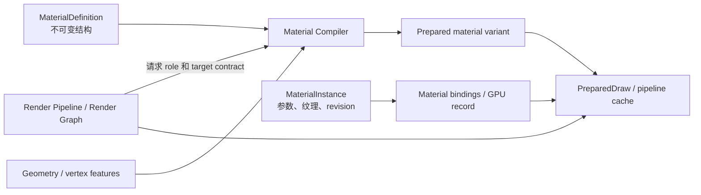

# Hilo3D 材质系统现代化架构

> 状态：当前架构文档，更新于 2026-08-10。本文描述已经进入生产路径的材质合同、明确的 breaking
> changes，以及后续演进边界。源码、测试与 [`RENDERING_ARCHITECTURE.md`](./RENDERING_ARCHITECTURE.md)
> 共同构成事实来源。

## 1. 结论

Hilo3D 的材质前端由不可变结构和可变数据两层组成：

- `MaterialDefinition` 描述 Shader topology、资源布局、静态特性、语义 Pass 和固定功能状态；
- `MaterialInstance` 保存参数、纹理槽绑定、稳定材质 ID 和数据 revision；
- renderer-local `SharedMaterialRecordDatabase`
  把实例 identity 映射为按 family/layout 分类的紧凑 GPU record；
- Render Pipeline 请求语义 `MaterialPassRole`，材质不能创建或排序 Render Graph Pass；
- Shared Renderer 将 role、geometry、target 和 backend profile 降低为 Shader、pipeline、binding 与
  `PreparedDraw`；
- WebGL2 和 WebGPU 共用材质前端、GLSL 源和反射合同，只有 RHI lowering 不同。

本次改造不保留旧 `Material` 单体 API 的兼容层。会改变 Shader topology 或 pipeline
layout 的属性必须在构造时进入 Definition；运行时只允许修改实例数据。需要切换 topology 时创建另一个材质实例，由 canonical
Definition cache 复用结构。



## 2. 所有权边界

| 所有者                         | 负责                                                                        | 不负责                             |
| ------------------------------ | --------------------------------------------------------------------------- | ---------------------------------- |
| Render Pipeline / Render Graph | Pass 顺序、attachment、资源读写、culling、submission                        | 材质参数和 Shader topology         |
| `MaterialDefinition`           | family、domain、static features、texture-slot schema、role、默认 state      | 运行时数值、Pass 顺序、native 资源 |
| `MaterialInstance`             | scalar/vector/matrix、texture slot、coverage/compositing override、revision | 修改 Definition、创建 graph pass   |
| `Mesh`                         | `renderOrder`、`castShadows`、`receiveShadows`、材质引用                    | 材质 pipeline state                |
| Renderer                       | role 解析、Shader 编译、排序、instancing、GPU record、资源和 pipeline cache | 显示变换的材质级覆写               |
| Post process / output          | exposure、tone mapping、gamma/display transform                             | 表面 BRDF                          |

`renderOrder`
和阴影参与属于对象；coverage、compositing 和固定功能状态属于材质；输出色彩变换属于 renderer/post-process。三者不得重新混入一个可变材质对象。

## 3. 公共对象模型

### 3.1 MaterialDefinition

[`MaterialDefinition.ts`](../src/material/MaterialDefinition.ts)
是结构合同。构造函数会验证并深度快照：

- stable `id`、`family`、`domain` 和 `shaderRevision`；
- `staticFeatures`；
- `coverage` 与 `compositing` 默认策略；
- 有固定 index 的 `textureSlots`；
- 每个 `MaterialPassRole` 的 Shader module、fragment output、fallback 和 pipeline state；
- 支持的 rendering profile。

Definition 构造后不可变。纹理存在性、light model、wireframe、cull mode、自定义 Shader
source、role 集合等 topology 变化必须选择新 Definition，不能靠 cache 对可变公共字段做快照猜测。

内置 Basic、PBR、Geometry 和 Sprite 材质通过 canonical definition
builder 共享相同结构实例；两个材质参数相同但数据值不同，不会因此复制 Definition。

### 3.2 MaterialInstance

[`MaterialInstance.ts`](../src/material/MaterialInstance.ts) 是唯一材质基类。每个实例具有：

- 不变的 `definition`；
- 32-bit stable `materialId` 和公开对象 `id`；
- 单调递增的 `revision`；
- 每槽 texture、UV set、transform、encoding 和 channel mapping；
- 显式 `invalidateData()`，用于引用对象的原地修改；
- texture-slot dirty set，供 renderer/database 合并上传。

`opacity`、`normalScale` 和 texture-slot API 自动推进 revision。直接修改被引用的
`Color`、matrix 或自定义 binding 数据后，调用
`invalidateData()`。revision 是数据失效合同，不参与 Shader topology key。

`BasicMaterial`、`PBRMaterial`、`GeometryMaterial` 和 `ShaderMaterial` 都是 Definition-backed
`MaterialInstance`。旧 `Material.ts`、动态 mixin/class API、运行时
`onBeforeCompile`、`shaderCacheId` 和可变 topology 字段不再存在。

### 3.3 类型化语义常量

Shader 变量名仍然是应用选择的字符串，变量绑定到的引擎语义使用类型化常量：

```ts
const material = new Hilo3d.ShaderMaterial({
    sourceRevision: 'example-v1',
    attributes: {
        a_position: Hilo3d.MaterialAttributeSemantic.POSITION,
        a_normal: Hilo3d.MaterialAttributeSemantic.NORMAL,
        a_uv: Hilo3d.MaterialAttributeSemantic.TEXCOORD_0
    },
    uniforms: {
        u_modelMatrix: Hilo3d.MaterialUniformSemantic.MODEL,
        u_baseColorMap: Hilo3d.MaterialTextureSemantic.BASE_COLOR_MAP
    },
    vs,
    fs
});
```

公共常量分为：

- `MaterialAttributeSemantic`：vertex attribute；
- `MaterialUniformSemantic`：非纹理 uniform/UBO 数据；
- `MaterialTextureSemantic`：sampled texture；
- `MaterialTextureSlot`：内置材质的稳定 texture-slot index。

`MaterialBinding` 只接受上述语义的联合类型或显式
`MaterialBindingInfo`，不再接受任意字符串。常量值保留为 GLSL/反射层使用的稳定标识，但调用方不应重复手写这些字面量。

## 4. 语义 Pass

Pipeline 通过 role 请求材质，而不是读取 `material.passes[]` 并让材质控制执行顺序。

| Role                  | 当前内置支持 | 合同                                                                                             |
| --------------------- | ------------ | ------------------------------------------------------------------------------------------------ |
| `forward`             | 是           | 普通 surface/unlit color 输出                                                                    |
| `depth-only`          | 是           | 复用 deformation 与 coverage，无 color attachment                                                |
| `shadow-caster`       | 是           | 复用 deformation、coverage、cull 和 alpha cutoff                                                 |
| `picking`             | 是           | 复用 geometry/coverage，输出稳定对象 ID                                                          |
| `motion-vector`       | 是           | opaque/masked 输出 single-sample `rgba16float` UV velocity 与 previous/current log-view-depth    |
| `material-attributes` | 是           | single-sample `rgba16float`：oct view normal、roughness、receiver/metallic packing；SSR 按需使用 |
| `user:*`              | 自定义       | 只有自定义 Pipeline 显式请求才运行                                                               |

[`MaterialCompiler.ts`](../src/material/MaterialCompiler.ts) 负责 role 解析、target
contract 验证和稳定 variant key。fallback 只有三种：

- `required`：缺失或目标不匹配时在 RHI frame 前失败；
- `safe-fallback`：仅允许无语义损失的 depth/shadow forward lowering；
- `skip`：非关键 role 明确不参与。

阴影路径直接请求 `shadow-caster`，不再创建临时 shadow proxy material。Scriptable
pipeline、fullscreen 和 GPU-driven path 必须传入显式 pipeline state，不能构造“假材质”承载状态。

## 5. Coverage、transmission 与 compositing

这三种概念互不替代：

- coverage：`opaque`、`mask` 或 `alpha-to-coverage`，决定表面是否存在；
- transmission：PBR shading 数据，需要 opaque scene texture，因此在 opaque
  copy 之后执行，但不等同于 alpha compositing；
- compositing：`opaque`、straight/premultiplied alpha、straight/premultiplied additive 或 custom
  blend；
- display transform：exposure、tone mapping 和 gamma，由 output/post-process 负责；Forward feature
  replacement 显式声明 `linear`/`srgb`，surface 边界只执行一次最终 transfer。

因此 transmissive PBR 材质可以仍属于 opaque compositing；`isTransparent`
只反映 compositing，不反映 transmission 或 alpha cutoff。`forwardQueue` 还会纳入 pass resource
dependency：需要 opaque scene texture 的材质进入 `transparent`/after-opaque
queue，但不会因此启用 blend。alpha compositing 会确定性地关闭 depth write 并应用标准 blend
preset，除非选择显式 custom compositing。

## 6. TextureSlot 与材质 UBO ABI

每个 texture slot 独立保存：

```text
texture + sampler state + UV set + mat3 transform + encoding + rgba channel mapping
```

glTF core texture 和 layered PBR extension 都通过同一 slot builder 进入材质；
`KHR_texture_transform` 不再写共享的 `uvMatrix` /
`uvMatrix1`。一个材质中的不同纹理可以安全使用不同 UV 集与变换。2D、cube 和 environment
sampler 都必须应用同一 slot encoding；尤其 LDR sRGB
IBL 必须在线性 PBR 计算前解码，不能依赖 WebGL/WebGPU 的外部图片上传颜色转换。WebGPU 的 GLSL-to-WGSL
lowering 即使只启用一个 UV 集，也必须保留 managed material sampler 调用；直接改写成裸 `texture()`
会绕过 slot transform、encoding 和 channel mapping。

WebGL2/WebGPU portable uniform ABI 分成两个 material-frequency block：

- `MaterialBlock`：432 bytes，保存 scalar/color/environment 数据；
- `MaterialTextureBlock`：1920 bytes，保存 24 个槽的 transform、UV/encoding info 和 channel
  mapping。

分块避免为 per-slot 元数据继续膨胀标量材质 ABI，也让两个 block 按最终 std140 bytes 独立更新。WebGPU
material bind group 的 binding 0/1 分别保留给两个 UBO，sampled texture/sampler pair 从 binding
2 开始；WebGL2 使用相同的固定 block registry。

WebGPU high-end 路径的 `SharedMaterialRecordDatabase` 不复制一套材质对象模型。它直接消费
`MaterialInstance.materialId` 与 `revision`，按 material identity 去重为 renderer-local dense
handle，并把 family/layout 写入稳定 record。首个 `builtin-pbr-storage-v1`
布局保存 metallic/roughness PBR 标量与 base-color/normal UV matrix；GPU
Scene 对象 record 分别持有 logical bucket 与 material handle，同一材质跨多个 geometry
bucket 不再复制 storage record。

数据库只重打包 revision 变化的 record，相邻 dirty record 合并为一个 upload。staged
revision 与 texture-slot dirtiness 只在有效 submission 后提交；失败帧保留旧 committed
revision 并在下一帧重试。底层 renderer-owned `StorageBuffer` 使用 `cpu-shadow` recipe，device
recovery 后保持公共材质 identity 和 dense handle 不变。直接修改引用型 `Color`/matrix 后仍必须调用
`invalidateData()`，不能绕过 `MaterialInstance` 的 revision 合同。

## 7. Variant 与缓存合同

稳定 variant 至少由以下维度组成：

```text
definition id
+ pass role
+ static features
+ vertex layout class
+ fragment-output / target signature
+ rendering profile
+ backend compiler profile
+ shader source revision
```

base color、roughness、opacity、texture transform、object transform、camera 和 render
order 不进入 Shader variant。普通参数修改只能更新 material data/binding，不能触发 Shader 编译。

Shared Renderer 的 Shader header
snapshot 包含 role 以及真正影响 source 的 geometry/light/fog/shadow 维度。非-forward
role 不携带 forward light、fog 或 receive-shadow 变体。结构化 collision-safe
key 和有界 cache 继续作为 Shader cache 合同。

## 8. 加载器与运行时构造

glTF loader 在创建 PBR Definition 前合并
`pbrMaterialDefaults`，再一次性构造实例。环境贴图、wireframe、cull、coverage、compositing 和 extension
topology 不能在实例创建后补写。

`PBRMaterial`
的 builder 负责 clearcoat、anisotropy、transmission、volume、IOR、iridescence 等 layered
feature。作为初始参数传入的 `Color` 会被实例拥有，避免多个 glTF 材质因共享 loader
default 对象而发生串改。

## 9. 明确的 breaking changes

- 删除旧 `Material` 类；`Mesh.material` 现在引用 `MaterialInstance`；
- 删除 `transparent`、`side`、`blendSrc`/`blendDst` 等 WebGL 风格可变状态字段；
- 删除材质级 `renderOrder`、`castShadows`、`receiveShadows`，移动到 `Mesh`；
- 删除 `useHDR`、`exposure`、`gammaCorrection` 和材质 fragment display transform；
- 删除全局 `uvMatrix` / `uvMatrix1`，改为 per-slot transform；
- 删除 `onBeforeCompile`、`shaderCacheId` 和运行时 topology mutation；
- 删除 shadow proxy material；
- `ShaderMaterial` 必须提供稳定 `sourceRevision`，额外 role 通过显式 role source 声明；
- 低层 fullscreen/GPU-driven API 接收 `MaterialPipelineState`，不接收占位材质；
- glTF renderer defaults 必须在构造前通过 `pbrMaterialDefaults` 注入；
- semantic binding 使用导出的类型化常量，不再以任意字符串作为公共合同。

这里没有兼容期或 deprecated adapter。编译错误用于暴露仍依赖旧所有权的调用点。

## 10. 当前完成度与长期路线

| 工作包                       | 状态          | 当前结果 / 下一步                                                                 |
| ---------------------------- | ------------- | --------------------------------------------------------------------------------- |
| Definition / Instance        | 已完成        | 内置与自定义材质都使用不可变结构和实例数据                                        |
| Semantic pass                | 已完成基础    | forward/depth/shadow/picking/motion 已接生产路径；attributes 待对应渲染功能实现   |
| Texture slot                 | 已完成        | 每槽 UV/transform/encoding/channel，glTF extensions 共用 builder                  |
| Typed semantics              | 已完成        | attribute/uniform/texture/slot 常量与联合类型公开                                 |
| UBO lowering                 | 已完成        | scalar 与 slot block 分离，双后端固定 ABI                                         |
| Shared GPU Material Database | 已完成（PBR） | 私有 PBR table 已抽取、共享、去重，并具备 dirty upload、提交回滚与 recovery       |
| Variant manifest / warmup    | 未完成        | 增加资产收集、异步 warmup、预算与诊断                                             |
| Motion vectors               | 已完成首版    | opaque/masked、skin/morph/instance history 与 TAA/固定比例 TAAU；透明时域策略后续 |
| Material attributes          | 已完成首版    | oct view normal/roughness/receiver/metallic ABI，SSR opt-in 时按需创建附件        |
| Advanced surface families    | 后续          | sheen/specular/dispersion、subsurface、hair 等按真实内容和预算推进                |

首个共享 GPU Material Database 已满足：

- renderer-local stable handle 保留公共 `materialId`，并按 family/layout 分类紧凑 record；
- dirty-range/coalesced upload 与 submission commit/rollback；
- recovery 后保持公共材质 identity 与 handle；
- GPU Scene 与 indirect bucket 消费同一 material handle；
- 不宣称或依赖浏览器 API 不具备的无限 bindless。

更多 surface family、variant manifest/warmup，以及统一的 WebGL2 UBO/WebGPU storage family
schema 属于后续独立工作包；shadow、motion 与首版 material-attributes 已在后续渲染工作中落地。

## 11. 架构不变量

- Pipeline/Render Graph 是 Pass 顺序、attachment 和资源 hazard 的唯一所有者；
- 普通 raster 始终走共享 renderer → Render Graph → portable RHI；
- portable raster 只有 GLSL ES 3.00 源，经 engine preprocessing → Vulkan GLSL 4.50 → Naga → WGSL；
- RHI core 不暴露 Material、Mesh、`GPU*` 或 `WebGL*` 类型；
- Definition 创建后不变，instance 数据变化不改变 resource layout；
- 非 forward role 不继承无关的 light/fog/shadow sampling；
- transmission、coverage、compositing 和 display transform 不混用；
- 默认 Forward 未请求额外功能时，不创建 motion/attribute pass 或中间资源；
- 稳态逐 Draw 不创建临时 material wrapper 或 backend-specific business descriptor；
- role/target/binding 错误必须在开始 RHI frame 或发命令前失败；
- device/context loss 通过 backend-neutral recipe 恢复，不替换公共 Definition/Instance identity。

## 12. 验证门槛

材质或 Shader 结构变化至少运行：

- `npm run typecheck`
- `npm run lint`
- 目标 material/shader/renderer Vitest
- `npm run test:render:architecture`
- `npm run test:rhi`
- `npm run test:webgpu`
- 受影响的 `npm run test:ui:webgl2` / `npm run test:ui:webgpu`
- 公共 API 变化时：`npm run api:update`、`npm run api:check`、`npm run test:types`、
  `npm run test:package`

Shader 改动必须同时覆盖 WebGL2 compile/link、Naga translation 和真实 WebGPU
pipeline/browser。性能结论只能来自登记的跨提交 benchmark protocol，不能用本地 smoke 代替基线证据。
