# Hilo3D 现代 WebGPU 渲染缺口与落地路线

> 代码审计基线：`c2092d9`（`dev`，2026-08-13）；路线状态复核：2026-08-29。F0、F1、D0、MAT0、G0/L0、T0、E0、Q0、V0/物理大气天气，以及 S0
> stable-atlas 内容缓存首版均已有生产代码和自动化证据；未登记的物理 GPU 跨提交性能基线仍不视为完成。本文只讨论面向现代 WebGPU 图形架构的增量，不把恢复旧图形 API、补传统效果清单或维持 WebGL
> 2 功能对等作为路线目标。

## 结论先行

Hilo3D 当前最强的部分是渲染底座和已经形成闭环的高画质切片：共享 Renderer、Scriptable Render
Pipeline、Render Graph、portable RHI、WebGPU/WebGL 2 双后端、Compute/Storage/Indirect
Draw、HDR/PBR、设备丢失恢复、严格帧事务、TAA/TAAU、GTAO、SSR、SSGI、自动曝光、froxel体积光以及物理大气/云均已存在。当前主要缺口不再是“能不能向 WebGPU 发命令”或“是否有现代后处理”，而是以下生产收口与虚拟化工作：

1. **材质系统后续层**：`MaterialDefinition`/`MaterialInstance`、forward/depth/shadow/picking/motion/
   material-attributes 语义 Pass、共享 surface/BRDF，以及 renderer-local、按 identity 去重且 submission-aware 的 PBR
   GPU Material Database 已落地；high-end variant
   manifest、异步 warmup、预算和诊断已经闭环，更多 surface family 仍待按内容需求扩展。详见
   [`MATERIAL_SYSTEM_MODERNIZATION.md`](./MATERIAL_SYSTEM_MODERNIZATION.md)。
2. **GPU Scene 与 GPU 可见性**：high-end profile 已让注册的普通不透明 `Mesh` 进入常驻 GPU
   database、previous-frame Hi-Z、GPU cull/LOD/compact 和固定 bucket indirect
   draw；alpha-mask 已覆盖 opacity/base-color
   coverage、depth/motion/attributes/color 一致性；skin/morph/layered PBR 使用 GPU Scene direct
   storage lane，兼容透明 PBR 保留全局排序并消费 clustered light
   list。110k 对象规模正确性 fixture 已存在，但登记的物理 GPU 跨提交性能基线仍是发布门禁。
3. **生产级 Clustered Forward+**：high-end profile 已提供 depth-driven 3D cluster、GPU
   count/prefix/write allocator、有界 overflow 与 storage-aware GGX PBR、共享 shadow-atlas
   sampling 与精确 LTC area light；完整 layered material、透明与变形材质已有 clustered-native
   consumer，Spot analytic cookie/IES 和 uint32 light-layer ABI 已接入。
4. **时域渲染框架**：recovery-aware history owner、current/previous transform、projection
   jitter、opaque/masked motion vector、原生分辨率 TAA、固定/动态 0.5–1 比例 TAAU 与 authored
   reactive mask 已落地；透明、transmission 与 GPU particle 已有隔离的 reactive/depth/history
   resurrection 策略。
5. **阴影缓存与虚拟页**：共享 Shadow Atlas、CSM、Spot/Point shadow、Clustered surface
   sampling，以及 submission-aware stable-slice 内容缓存、局部 scissored
   clear 和刚体 caster/light 精确失效已完成；GPU caster cull、receiver-driven budget 与 virtual
   shadow page residency 仍未完成。
6. **现代资源与几何虚拟化**：GPU Scene 已有 projected-radius bucket LOD，但仍没有 meshlet/cluster
   geometry streaming、KTX 2/Basis、mip
   residency、虚拟纹理或虚拟阴影页系统；SSGI 已覆盖屏幕内漫反射传输，off-screen probe/software-BVH
   fallback 仍属于 GI0。

最值得先做的不是直接复刻 Nanite 或 Lumen，而是在已经完成的 P0 功能闭环上登记物理 GPU 性能证据，再进入 S0/A0：

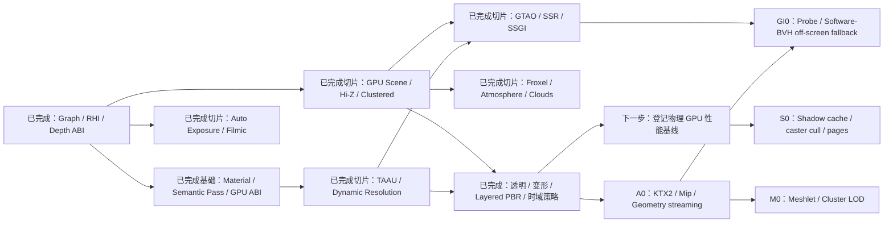

这组能力应作为明确的 **WebGPU high-end profile**。它可以继续复用共享 Scene、Render
Graph、RHI 和生命周期系统，但不应为了 WebGL 2 对等而限制设计，也不能在运行时静默关闭 pass。

### 插图阅读约定

现有技术插图用于解释主数据流和最终效果，不作为精确 API 定义；工作包中的“输入 / 核心处理 / 输出 / 首要验收”才是实施边界。没有独立插图的增量工作包也必须遵守同样的输入、生命周期和验收合同。所有流程都默认从左向右阅读：蓝色表示资源或稳定数据，紫色表示时域/计算过程，橙色表示更新、风险或预算事件，绿色表示最终可见工作集。

## 1. 盘点范围与判断标准

### 1.1 代码与文档证据

本次盘点以当前源码和测试为主，重点检查：

- [`RENDERING_ARCHITECTURE.md`](./RENDERING_ARCHITECTURE.md)：生产帧、Render
  Graph、RHI、恢复和当前边界；
- [`COMPUTE_STORAGE_IMPLEMENTATION_PLAN.md`](./COMPUTE_STORAGE_IMPLEMENTATION_PLAN.md)：Compute、Storage、GPU-driven
  raster 和验收场景；
- [`PBR_AND_POST_PROCESSING.md`](./PBR_AND_POST_PROCESSING.md)：PBR、HDR、opaque scene
  texture、Bloom 和 Color Uber；
- [`MATERIAL_SYSTEM_MODERNIZATION.md`](./MATERIAL_SYSTEM_MODERNIZATION.md)：材质审计、G0/L0 原型抽取、语义多 Pass、Definition/Instance、variant、GPU
  material ABI 和迁移门禁；
- [`TEMPORAL_RENDERING_REMEDIATION.md`](./TEMPORAL_RENDERING_REMEDIATION.md)：motion、TAA/TAAU、动态分辨率、reactive
  mask 与透明边界；
- [`GROUND_TRUTH_AMBIENT_OCCLUSION.md`](./GROUND_TRUTH_AMBIENT_OCCLUSION.md)、[`SCREEN_SPACE_REFLECTIONS.md`](./SCREEN_SPACE_REFLECTIONS.md)
  与
  [`SCREEN_SPACE_GLOBAL_ILLUMINATION.md`](./SCREEN_SPACE_GLOBAL_ILLUMINATION.md)：Q0 已实现切片及其明确限制；
- [`VOLUMETRIC_LIGHTING.md`](./VOLUMETRIC_LIGHTING.md) 与
  [`PHYSICAL_ATMOSPHERE_AND_WEATHER.md`](./PHYSICAL_ATMOSPHERE_AND_WEATHER.md)：froxel、物理大气、云、云影与曝光边界；
- [`src/render/`](../src/render)：SRP、Graph、RHI、Compute、Renderer 和 Post-processing；
- [`src/shader/`](../src/shader)、[`src/material/`](../src/material)：当前 PBR 和 shader ABI；
- [`examples/clustered_forward_plus_sponza.ts`](../examples/clustered_forward_plus_sponza.ts)、
  [`temporal_aa_observatory.ts`](../examples/temporal_aa_observatory.ts)、
  [`ground_truth_ambient_occlusion.ts`](../examples/ground_truth_ambient_occlusion.ts)、
  [`screen_space_reflections_palace.ts`](../examples/screen_space_reflections_palace.ts)、
  [`screen_space_global_illumination_chapel.ts`](../examples/screen_space_global_illumination_chapel.ts)、
  [`volumetric_neon_reliquary.ts`](../examples/volumetric_neon_reliquary.ts) 与
  [`stormfront_observatory.ts`](../examples/stormfront_observatory.ts)：当前 high-end/画质切片的浏览器验收场景。

### 1.2 “现代且可落地”的筛选规则

进入主路线的能力必须同时满足：

- 能显著减少 CPU submission、场景遍历或 draw preparation 成本，或显著提高稳定画质；
- 可以通过当前 WebGPU 的 compute、storage、indirect、texture 和 render-pass 能力实现；
- 可以进入现有 Render Graph/RHI/恢复链路，不依赖 native WebGPU bypass；
- 有明确的数据合同、失败边界、测试场景和性能证据；
- 不以 WebGL 1、classic uniform、CPU 模拟 compute 或传统效果补齐为目标。

因此，FXAA、传统 SSAO、把当前 forward 机械改写为经典 deferred、纯 CPU
LOD、逐灯光独立 pass 等不列为推荐方向。Deferred 只有在生产数据证明它优于 Clustered
Forward+ 时才值得作为特定 profile 考虑，而不是现代化的默认答案。

## 2. 当前渲染能力基线

| 领域                                 | 当前状态          | 证据与边界                                                                                                                                                                       |
| ------------------------------------ | ----------------- | -------------------------------------------------------------------------------------------------------------------------------------------------------------------------------- |
| Shared Renderer / Render Graph / RHI | 生产可用          | 单一共享前端、显式 graph、双后端、submission-aware 生命周期和恢复已经完成                                                                                                        |
| Raster PBR / HDR                     | 生产可用          | layered glTF PBR、IBL、LTC area light、transmission、`rgba16float`、Bloom、Color Uber 已接入共享路径                                                                             |
| Shadow                               | 生产缓存首版      | 统一 atlas、方向光 1–4 级 CSM、Spot/Point shadow、PCF 与 stable-slice 内容缓存；Clustered opaque surface 复用同一 atlas，仍缺 GPU caster cull、receiver-driven 分配和虚拟页      |
| Compute / Storage / Indirect         | 底座生产可用      | Direct WGSL compute、storage buffer/texture、indirect dispatch/draw、readback、恢复和 graph hazard 已闭环                                                                        |
| Material architecture                | high-end P0 完成  | Definition/Instance、语义 Pass、共享 PBR GPU record，以及 variant manifest、异步 warmup、预算和诊断已落地；更多 family 按需扩展                                                  |
| GPU-driven ordinary scene            | high-end P0 完成  | opaque/alpha-mask 走固定 bucket indirect；skin/morph/layered PBR 走 GPU Scene direct storage lane；兼容透明保留全局排序并消费 clustered light list                               |
| Forward+                             | high-end P0 完成  | 3D cluster、有界预算、storage GGX PBR、共享 shadow/LTC、透明/变形/layered consumer、analytic cookie/IES 与 uint32 light-layer ABI 已闭环                                         |
| Temporal rendering                   | high-end P0 完成  | opaque TAAU、GPU-time dynamic resolution、authored reactive，以及透明/transmission/GPU-particle 独立 short history 与 resurrection 已完成                                        |
| Exposure / display transform         | WebGPU 生产切片   | 独立 Forward `AutoExposure` 与 Clustered 集成都具备 GPU histogram、asymmetric eye adaptation、submission-aware history；`ColorUber` 有参数化 filmic，Clustered 有 compact filmic |
| Screen-space lighting                | Q0 生产切片完成   | portable Forward/Clustered GTAO 与 SSGI、WebGPU Clustered Hi-Z SSR 已完成；透明/离屏几何不参与 trace，probe/BVH fallback 待 GI0                                                  |
| Volumetrics / atmosphere             | high-end 生产切片 | WebGPU Clustered froxel、height/local fog、screen-space caster visibility、physical atmosphere LUT、aerial perspective、temporal clouds，以及 surface/froxel cloud shadow 已落地 |
| Geometry / texture streaming         | 仅 bucket LOD     | GPU Scene 已有 projected-radius geometry bucket LOD；没有 meshlet/cluster streaming、KTX 2/Basis 或 mip residency，KTX loader 仅支持 KTX 1.1 单面 2D 容器                        |
| GPU profiling / graph debugging      | 生产基线          | opt-in CPU/GPU Graph timeline、query ring、debug marker、资源 lifetime；关闭 diagnostics 且无内部 timing consumer 时不创建 query                                                 |

### 2.1 现有实现中最关键的限制

- 普通 Forward 的内置 PBR 光照仍受固定 ABI 限制：最多 8 个方向光、16 个点光、8 个聚光、8 个面光；fragment
  shader 按 active light count 循环。Clustered storage PBR 已把受支持 opaque/alpha-mask
  bucket 的局部光迭代改为有界 cluster list，但 compatibility fallback 仍服从普通 Forward 容量。见
  [`BuiltInUniformBlocks.ts`](../src/render/ubo/BuiltInUniformBlocks.ts) 和
  [`pbr_main.frag`](../src/shader/chunk/pbr_main.frag)。
- 通用 `SceneRenderPass.storageShaderVariant` 仍会替换整个 graphics
  shader，命中 instancing 时还会展开为逐 Mesh direct draw；G0/L0 专用 factory 已消费共享 PBR GPU
  record，并让 depth/motion/reactive/material-attributes/color 共用对象/材质索引。当前 native
  storage shading 的固定 indirect bucket 覆盖注册的 opaque/alpha-mask、unskinned
  PBR；skin、morph、layered 与全兼容透明队列使用 direct storage lane。未知 surface
  family 和混合 compatibility transparent queue 继续 fail closed 到共享 Forward。
- graph texture subresource view 与 persistent history 已落地；当前 history
  recipe 仍限定单 sample、单 mip、单 layer 的 2D color texture，多 subresource
  history 需要持久化 validity 后再开放。
- Direct WGSL `f16`、`subgroups`
  与 timestamp-query 已进入 capability/compiler/RHI 闭环；当前 WebGPU 标准未暴露
  `subgroup-size-control` feature，因此只记录 adapter 的 subgroup min/max，不虚构非标准 gate。
- Render Graph 每帧 Build/Compile，已有 pass culling 和跨帧 transient pool，但没有 compiled graph
  reuse 或同帧物理 alias。
- Camera/mesh/instance/skin/morph current/previous transform、history-valid ABI、projection
  jitter、motion-vector material pass、原生分辨率 TAA、固定/动态比例 TAAU 与 authored reactive
  mask 已完成；透明/transmission/GPU-particle 使用隔离的短 history、reactive/depth
  agreement 与 resurrection policy。
- Turnkey Forward 已提供 GTAO、SSGI、TemporalAA、Bloom、`AutoExposure` 与
  `ColorUber`；其中 AutoExposure 是 WebGPU compute/storage feature，支持 average/center-weighted
  metering，但没有任意 authored metering mask。SSR、froxel 和 physical atmosphere/weather 仍只集成在
  `ClusteredForwardPlusPipelineFactory`。Opaque scene
  texture 仍只支持屏幕空间 transmission，不是离屏折射场景表示。
- RHI 已有 timestamp QuerySet、pass timestamp、debug group/marker 和 Render Graph
  timeline；occlusion query 仍不在当前合同内。
- 当前 Shadow Atlas 已有跨帧 stable-slice 内容缓存，但仍不是 virtual-page residency：GPU caster
  cull、receiver-driven budget 和 page table 尚未落地；体积光也只使用 bounded screen-space caster
  visibility 与 cloud shadow，尚未采样 shared shadow atlas。
- KTX loader 明确只解析 KTX 1.1、单 face 2D；没有 KTX 2、Basis Universal transcode、mip
  residency 或带宽预算。
- 110k object / 256 light fixture 已验证 GPU-only 规模正确性、CPU record/GPU
  completion 分离和 device
  recovery，但它不是登记硬件上的不可覆盖跨提交性能基线；路线图不把该 smoke/acceptance 结果写成性能完成。

## 3. Unity / Unreal 的参照应怎样转化

Hilo3D 应借鉴这些引擎解决的问题与数据流，而不是复制其依赖 DX12/Vulkan/主机平台的具体实现。

| 参照能力                                          | 值得借鉴的原则                                                                 | Hilo3D / WebGPU 落点                                                                               |
| ------------------------------------------------- | ------------------------------------------------------------------------------ | -------------------------------------------------------------------------------------------------- |
| Unity GPU Resident Drawer / GPU Occlusion Culling | 场景对象常驻 GPU，CPU 只上传脏数据；可见性和实例合批在 GPU 完成                | 已建立 GPU Scene、previous-frame Hi-Z、compute cull/compact 与固定 bucket indirect；继续扩展适用面 |
| Unity HDRP Tile/Cluster Forward/Deferred          | 光源分配与 shading 解耦，大量局部光不进入固定 uniform array                    | 已建立 3D Clustered Forward+；透明/变形/layered 材质当前保留共享 Forward fallback                  |
| Unreal TSR                                        | motion vector、history、disocclusion、shading rejection 和动态分辨率是一个系统 | TAA/TAAU、reactive mask 与动态分辨率已完成；继续定义透明/粒子 history                              |
| Unreal Auto Exposure / Filmic Tonemapper          | HDR 亮度统计、时域适应、曝光补偿与 filmic 曲线是一个连贯的显示合同             | GPU histogram/history 与可控 filmic 已完成；任意 metering mask/扩展 diagnostics 后续               |
| Unreal Nanite                                     | cluster/meshlet、GPU culling、细粒度 LOD、流送和 material binning 协同         | 做 WebGPU meshlet pipeline 与 cluster streaming，不宣称 Nanite 等价                                |
| Unreal Virtual Shadow Maps                        | receiver-driven page request、物理页缓存、按需重绘和 clipmap                   | 先补 shadow cache/invalidations，再做 WebGPU 物理 atlas + page table 的虚拟阴影                    |
| Unreal Lumen                                      | 屏幕 trace、低频场景表示、时域积累和 fallback 组合                             | 采用 Hi-Z SSR/SSGI + probe/软件 BVH 或 SDF clipmap 的混合方案，不承诺硬件 RT                       |

Unity HDRP 本身把目标描述为面向 compute-capable 平台的混合 Tile/Cluster
Forward/Deferred 架构；Unreal 的 Nanite、VSM、Lumen 和 TSR 也分别解决几何、阴影、间接光和时域重建问题。Hilo3D 当前最接近这些能力的是 Compute/Storage/SRP 底座，尚缺的是可复用的生产系统。

## 4. WebGPU 能做什么，以及不能假装有什么

### 4.1 当前标准能力足以完成的部分

- Compute shader、workgroup memory、barrier、32-bit atomic、storage buffer/texture；
- direct/indirect dispatch，direct/indirect indexed/non-indexed draw；
- texture array、3D texture、mip/layer view、MRT、MSAA、depth sampling；
- capability-gated `shader-f16`、`subgroups` 和 `timestamp-query`；subgroup size 只读 adapter
  min/max，当前标准没有 `subgroup-size-control` feature；
- buffer/texture copy、异步 map readback、OffscreenCanvas 和 Worker 侧资源处理；
- 通过普通 texture + buffer 模拟 page table、physical atlas 和 software BVH。

这些能力足以实现 GPU Scene、Hi-Z、Clustered Forward+、TAAU、GTAO、SSR/SSGI、froxel
volumetrics、meshlet culling、GPU particle、Gaussian、纹理/几何流送和虚拟阴影 atlas。

### 4.2 当前 WebGPU 不应被假定具备的能力

- 没有标准化硬件 ray-tracing acceleration structure、ray query 或 ray-generation/miss/hit shader
  stage；
- 没有 mesh/task shader；WGSL 的可编程 stage 仍是 vertex、fragment 和 compute；
- 没有通用 bindless descriptor indexing/resource binding array；
- 没有标准 multi-draw-indirect-count；大量 material bucket 仍需要固定数量的 indirect
  call 或更粗粒度 vertex pulling；
- 没有稀疏纹理/稀疏 buffer residency；虚拟纹理和 VSM 必须自己维护 page table 与物理 atlas；
- 没有 async-compute queue、多 queue 或用户显式 barrier；只能在单 command
  scope 内依赖编码顺序和 WebGPU hazard 规则。

所以直接宣称“WebGPU Nanite”“WebGPU Lumen”会掩盖关键差异。合理目标是利用 compute + storage +
indirect 建立相同类别的数据驱动系统，并给出 WebGPU 自身的性能与画质边界。

## 5. 缺口优先级矩阵

| ID   | 能力                                                                     | 优先级 | 当前状态                                         | 工作量 | 前置依赖                                      |
| ---- | ------------------------------------------------------------------------ | ------ | ------------------------------------------------ | ------ | --------------------------------------------- |
| F0   | Graph texture subresource view、persistent texture/history               | P0     | 已完成                                           | L      | 当前 Graph/RHI                                |
| F1   | `f16`、subgroup、timestamp/query、debug marker 的 capability 与 RHI 闭环 | P0     | 已完成                                           | M      | WebGPU compiler/RHI                           |
| D0   | Reversed-Z、camera-relative rendering、current/previous frame ABI        | P0     | 已完成                                           | L      | Camera/shader ABI                             |
| MAT0 | Material Definition/Instance、语义 Pass、稳定 variant、共享 material ABI | P0     | high-end P0 完成；更多 family 后续               | XL     | 当前 Renderer/SRP 与 G0/L0 材质垂直切片       |
| G0   | GPU Scene、dirty upload、GPU frustum/Hi-Z culling、LOD/compact           | P0     | high-end P0 完成                                 | XL     | F0、D0；材质/变形扩展使用 MAT0                |
| L0   | 生产级 Clustered Forward+ + 内置 PBR storage lighting                    | P0     | high-end P0 完成                                 | XL     | F0、F1、G0；完整材质接入使用 MAT0             |
| T0   | Motion Vector、history、TAA/TAAU、dynamic resolution                     | P0     | high-end P0 完成                                 | XL     | F0、D0、MAT0                                  |
| E0   | Auto exposure、exposure history、参数化 filmic display transform         | P1     | 已完成                                           | M      | F0、compute/storage；可独立于 T0 使用         |
| Q0   | Material attribute buffer、GTAO、Hi-Z SSR、temporal SSGI                 | P1     | 已完成；off-screen fallback 属于 GI0             | XL     | MAT0、F0；Clustered 集成用 T0，SSR 用 G0 Hi-Z |
| S0   | Shadow cache/invalidation、GPU caster cull、virtual shadow pages         | P1→P2  | stable-atlas 缓存首版完成；GPU cull/虚拟页未开始 | XL     | MAT0、G0、F0、F1                              |
| V0   | Froxel volumetric fog/lighting/cloud foundation                          | P1     | 生产切片完成；atlas shadow/透明体积后续          | XL     | L0、F0；T0 可稳定最终边缘但非创建前置         |
| A0   | KTX 2/Basis、mip residency、texture/geometry streaming budget            | P1     | 未开始                                           | XL     | F0、diagnostics                               |
| M0   | Offline meshlet build、cluster LOD、GPU material bin、geometry streaming | P2     | 未开始；已有 bucket-level LOD 可复用             | XXL    | MAT0、G0、A0                                  |
| GI0  | Screen/probe/software-BVH hybrid GI                                      | P2     | 屏幕内 SSGI 已完成；off-screen 层未开始          | XXL    | T0、Q0、G0、A0                                |

`P0` 是“现代 WebGPU renderer”定义所需能力；`P1` 是高画质生产 profile；`P2`
是依赖场景规模、内容管线和长期性能投入的虚拟化能力。

实施状态：**F0、F1、D0 已完成；MAT0 的共享材质前端、shadow/motion/attributes 语义角色与 PBR GPU
Material
Database 已完成；G0/L0、T0、E0、Q0、V0/天气均已形成可运行的生产切片**。后续工作包可直接复用 subresource/history、GPU
timeline、确定的前后帧坐标 ABI、GPU Scene object/light database、共享 PBR material
handle/variant、3D cluster allocator 与现有时域/屏幕空间 controller。P0 的透明、变形、完整 layered
PBR、analytic cookie/IES、light-layer、variant
warmup 和透明/粒子时域策略已收口；尚需在登记物理 GPU 上建立不可覆盖的跨提交性能基线。S0 已完成 stable-atlas 内容缓存首版，但 GPU
caster cull、receiver budget 与虚拟页仍未开始；A0、M0 和 GI0 的 off-screen 层也尚未开始。详见
[`MATERIAL_SYSTEM_MODERNIZATION.md`](./MATERIAL_SYSTEM_MODERNIZATION.md)。

## 6. 可落地工作包

### 6.1 Milestone 0：WebGPU high-end profile 基础

#### F0：Graph subresource 与跨帧资源（已完成）

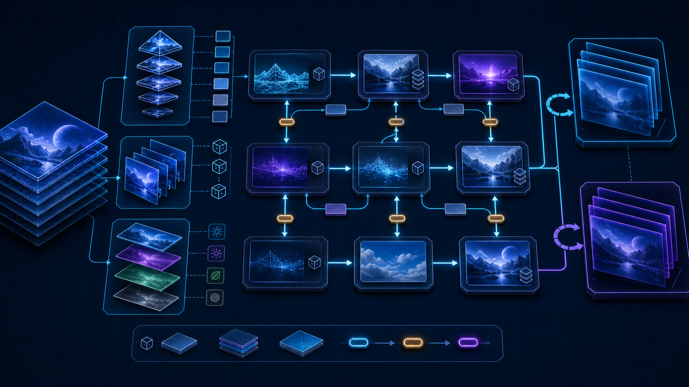

| 输入                               | 核心处理                                              | 输出                                     | 首要验收                                  |
| ---------------------------------- | ----------------------------------------------------- | ---------------------------------------- | ----------------------------------------- |
| 多 mip/layer texture、帧成功或失败 | 显式 view、subresource hazard、双/三缓冲 history 交换 | Hi-Z mip 链、稳定 history、可恢复 recipe | resize/device loss/失败 submission 不串帧 |

已落地：

- graph texture 与 texture view 分离；view 显式表达 mip、array layer 和 aspect；
- sampled、storage、attachment、copy access 都绑定 view，而不是隐含整张 texture；
- renderer-owned persistent texture recipe，不再只通过 persistent `RenderTarget` 表达跨帧资源；
- 双缓冲/三缓冲 history owner，提交成功后才交换 current/previous；失败帧回滚；
- resize、camera cut、format/quality change 和 device loss 的 history invalidation generation；
- transient texture 同帧 alias 先保留为后续优化，不能阻塞 view 正确性。

当前 history recipe fail-closed 为单 sample、单 mip、单 layer 的 2D color texture，使公开 `valid`
与完整初始化严格同义；多 mip/array/volume
history 要等 subresource-validity 能跨帧持久化后再开放。显式 graph view 本身已经支持 mip、array
layer、dimension、compatible format 和 depth/stencil aspect。

验收证据：多 mip texture 可在连续 pass 中逐级写入/采样；history 可跨帧存活、descriptor
revision 后失效、device loss 后按 recipe 重建，失败 record/submission 不交换 current/history。Render
Graph、SRP、capability、ResourceRegistry、真实 WebGPU storage-view 和 package
type-consumer 均有自动化覆盖。

#### F1：现代 WebGPU capability 与 GPU timeline（已完成）

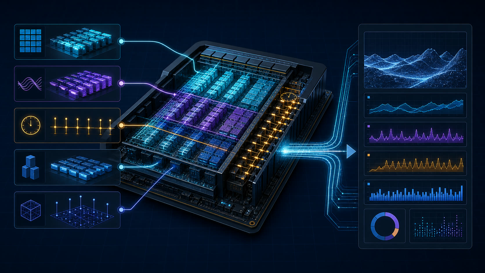

| 输入                         | 核心处理                                       | 输出                              | 首要验收                                   |
| ---------------------------- | ---------------------------------------------- | --------------------------------- | ------------------------------------------ |
| adapter features、graph pass | `f16`/subgroup gate、timestamp resolve、marker | CPU/GPU pass 时间线、能力降级路径 | 关闭 query 无热路径成本，fallback 结果一致 |

已落地：

- `RHIFeatureName`/`RendererFeatureName` 支持 `subgroups`，记录 adapter 的 subgroup
  min/max；当前标准没有 `subgroup-size-control` feature，故未把它加入可请求能力；
- 修通 Naga/Direct WGSL 的 `shader-f16` 验证和 pipeline 闭环；不支持设备继续使用 f32 kernel；
- QuerySet、timestamp write/resolve、submission-fenced asynchronous result；
- Render Graph 自动生成 pass timestamp range，结果延迟若干帧读取，生产帧不等待；
- render/compute pass debug group/marker 与 graph resource lifetime 可视化；
- exact shader-derived `minBindingSize`，消除当前调用方低报后才由 native validation 拒绝的窗口。

完成标准：同一场景可输出 CPU record/compile/prepare/execute 与 GPU
per-pass 时间线；关闭 query 时热路径不增加逐 draw 成本；subgroup/f16 kernel 必须有 f32/workgroup
fallback 和相同结果测试。

实现说明：timeline 以已注册 `RendererDiagnostics` 为开关，三槽 query/readback
ring 在 submission 完成后异步 map；槽位繁忙时报告 `saturated`，不等待 GPU。Direct WGSL
f16 保留原始 native artifact，Naga validator/writer 使用等价 f32 特化；设备没有 `shader-f16`
时 RHI 明确拒绝，pipeline 可通过 `supportsFeature()` 选择 f32/workgroup
fallback。仓库未引入新的内置 subgroup/f16 kernel，因此不存在需要伪装为双后端等价的隐式降级结果。

#### D0：现代深度与帧坐标合同（已完成）

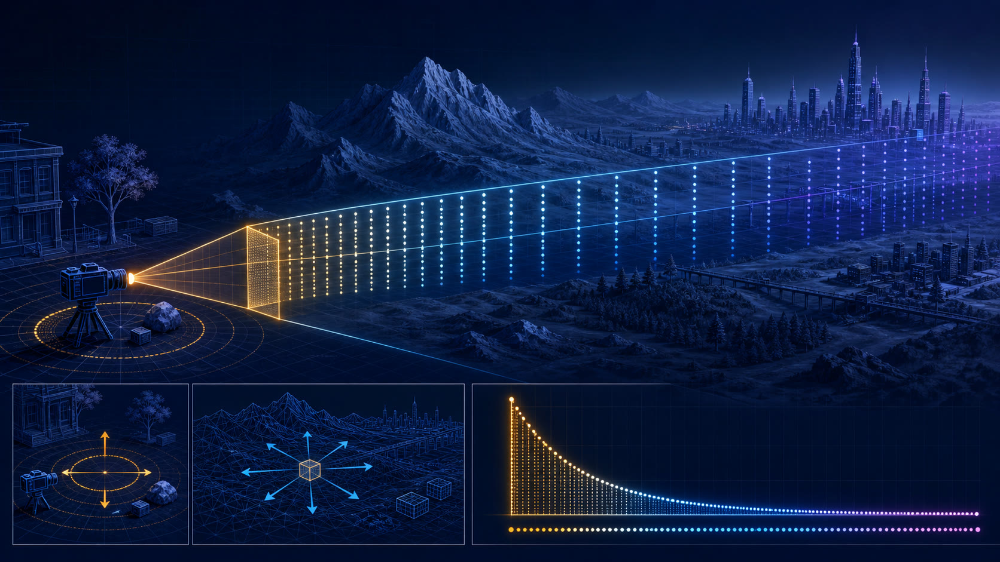

| 输入                           | 核心处理                                                | 输出                              | 首要验收                                   |
| ------------------------------ | ------------------------------------------------------- | --------------------------------- | ------------------------------------------ |
| 世界坐标、near/far、前后帧变换 | reversed-Z、floating far、camera-relative、previous ABI | 稳定深度、可靠 motion-vector 输入 | 大尺度场景无明显 z-fighting 与 origin 抖动 |

已落地：

- `renderingProfile: 'high-end'` 启用 reversed-Z camera 与 camera-relative GPU transform；portable
  profile 继续默认 standard depth，Camera 也可单独选择 `depthMode`。Perspective projection支持有限或
  `far: null` 的无限远，两后端继续共享 OpenGL clip-space shader 源；
- surface、RenderTarget、pipeline depth compare、Shadow Atlas clear/comparison
  sampler/bias 与 MeshPicker 使用同一个 depth mode；当前 RG32F
  Hi-Z 同时保存每个区块的 min/max，previous-frame occlusion 对 standard depth 读取保守最远值
  `max`、对 reversed depth 读取保守最远值 `min`，SSR 则消费完整区间，不能把 near
  reduction 当作 culling far bound；
- camera-relative 只修改每帧 GPU view/model/instance bytes；CPU scene identity、world
  matrix、culling、project/unproject 与 pointer 坐标不变。一个 application
  frame 使用同一个主相机 origin，避免多 camera/pass 改写 object UBO；
- `CameraBlock`、`ModelBlock`、`SkinningBlock`、`MorphBlock` 与 WebGPU `InstanceBlock`
  同时携带 current/previous transform；origin 与 history-valid 也进入固定 ABI；
- 首次出现、spawn 和显式 `Node.invalidateTransformHistory()`
  后 previous=current；正常 motion 读取最后一次成功 submission；失败 build/prepare/execute 回滚 pending
  history，device recovery 递增 generation。despawn 不生成 draw，重新出现按 owner
  history 或显式 invalidation 处理；skinning/morph 遵守同一提交边界。

完成标准：大 near/far 比场景不出现明显 z-fighting 回退；WebGPU/WebGL
2 共享 shader 的坐标适配不被破坏；所有 motion vector 输入都有确定的首次出现和 invalidation 行为。

验收证据：有限/无限 reversed-Z
near/far 映射、正交相机、RenderTarget 默认 clear/compare、普通与 storage-aware pipeline
cache、shadow sampler、camera-relative
packing、实例 current/previous、成功提交/失败回滚和显式 invalidation 均有合同测试；真实 WebGPU/WebGL
2 pipeline 与浏览器 lane 继续复用同一 GLSL ES 3.00 坐标适配链。

#### MAT0：材质系统前置层（共享前端与 PBR GPU Database 已完成）

| 输入                                                        | 核心处理                                                            | 输出                                             | 首要验收                                                     |
| ----------------------------------------------------------- | ------------------------------------------------------------------- | ------------------------------------------------ | ------------------------------------------------------------ |
| 当前 Material/PBR/Shader、SRP、PreparedDraw、G0/L0 材质切片 | 抽取 Definition/Instance、语义 Pass、稳定 variant、共享 material DB | material ID、pass variant、dirty upload 与兼容层 | 参数变化不重编译；跨 Pass coverage 一致；默认路径不增加 Pass |

`MaterialDefinition`/`MaterialInstance`、类型化 semantic、forward/depth/shadow/picking/motion/
material-attributes role、稳定 variant key 与双后端 UBO 已进入生产路径。renderer-local
`SharedMaterialRecordDatabase` 进一步把 `ClusteredForwardPlusPipelineFactory` 的私有 PBR
table 抽成按 family/layout 分类的共享 record：同一 material identity 跨 geometry
bucket 去重，revision 驱动 dirty record，相邻范围合并上传，提交失败会回滚 CPU committed
revision，device recovery 由 renderer-owned `cpu-shadow` recipe 重建。

MAT0 不采用有序 `material.passes[]`。Pipeline/Render
Graph 继续拥有 Pass 顺序、attachment 和资源依赖；材质只声明能为
`forward`、`depth-only`、`shadow-caster`、`motion-vector`、 `material-attributes` 与 `picking`
等语义角色生成什么 Shader、状态和绑定。motion 的 `rgba16float` velocity/log-depth + `r8unorm`
reactive MRT、material-attributes 的 oct-normal/roughness/metallic/receiver ABI，以及 shadow
coverage 都已经由生产消费者验证。当前剩余项是扩展更多 surface family，并增加 variant
manifest/warmup；它们是独立后续工作，不再阻塞 T0/Q0。完整设计、兼容策略和验收矩阵见
[`MATERIAL_SYSTEM_MODERNIZATION.md`](./MATERIAL_SYSTEM_MODERNIZATION.md)。

### 6.2 Milestone 1A：规模化场景主线

#### G0：GPU Scene

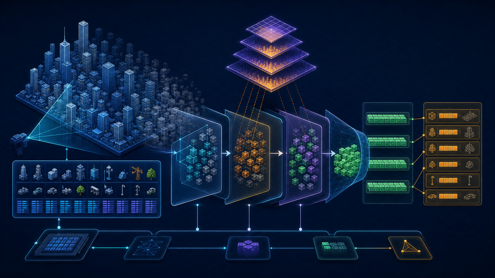

| 输入                                | 核心处理                                                   | 输出                                  | 首要验收                                        |
| ----------------------------------- | ---------------------------------------------------------- | ------------------------------------- | ----------------------------------------------- |
| 常驻对象记录、bounds、previous Hi-Z | dirty upload、frustum/occlusion/LOD、compact、bucket build | 可见实例表与固定 bucket indirect args | 生产循环零 visible-count readback，遮挡剔除有效 |

已落地的 `ClusteredForwardPlusPipelineFactory` 以注册的 geometry/material
identity 建立稳定对象槽和 LOD bucket；对象 current/previous transform、world bounds、layer 与 active
flag 以及 inverse-transpose normal basis 使用 208-byte storage record。CPU 只合并 dirty
slot/geometry/material
range，GPU 执行 frustum、按声明 viewport 专门化（最多 13 级）的 previous-frame
Hi-Z、projected-radius LOD、bucket prefix/compact，并写固定 indexed-indirect
arguments。全部 bucket 共享一份与 `maxObjects` 同阶的 compact visible table，indirect
`firstInstance` 固定为零；prefix offset 写入 256-byte 对齐的 bucket storage record，raster
draw 通过静态对齐 binding range 取得 base 后再索引 compact table。这样不要求可选
`indirect-first-instance` feature，生产帧也不读取 visible count。对象只有在 transform 与所有 LOD
bounds revision 都稳定时才使用 previous-frame occlusion。camera
cut、失败帧和提交后的时域推进分别通过 history invalidation、`frameDiscarded()` 与 `frameSubmitted()`
处理。previous-frame culling 使用同一已提交帧的 VP、view、projection 与 depth convention；RG32F
Hi-Z 同时保留区块 min/max，culling 对 standard/reversed depth 分别读取 `max`/`min`
最远值，SSR 读取完整区间。当前公开切片限定为单相机、single-sample、opaque/alpha-mask、unskinned、indexed
triangle PBR bucket GPU fast
path；alpha-mask 在 depth/motion/attributes/color 共用 base-color/opacity
coverage。符合内置 PBR 合同的 skin/morph/layered material 通过 GPU Scene direct storage
lane；全兼容 transparent queue 保持 CPU 全局 back-to-front 顺序并消费 clustered light
list。未注册 mesh、容量 overflow、混合 compatibility-transparent queue，以及运行时 material/geometry
replacement 会进入共享 Forward compatibility path，并通过 mesh identity
exclusion 避免重复绘制。真实 WebGPU scale fixture 已覆盖 100k static + 10k dynamic、256
lights、dirty dynamic upload 与 device recovery；物理 GPU 上可比较的长期性能基线仍是 G0 发布门禁。

当前切片采用稳定、后端中立的 GPU Scene 数据库合同：

- stable object ID、current/previous transform、world bounds、layer、material ID、geometry ID；
- static 与 dynamic record 分区，dirty range/coalesced upload，不每帧重传完整场景；
- geometry/material/pipeline bucket 的稳定 GPU record 与 device-loss recipe；
- compute frustum cull、previous-frame Hi-Z occlusion、screen-size/cluster LOD、visible compact；
- compute 生成每 bucket indirect arguments，普通 `Mesh` 通过 GPU-driven
  renderer-list 路径消费，不另建第二套 scene renderer；
- camera cut/disocclusion 时临时关闭 previous-frame occlusion，避免错误剔除；
- transparent object 保留全局 CPU back-to-front 排序；当前 P0 不要求 GPU radix/tile sort。

WebGPU 没有 multi-draw-indirect-count，因此第一版应控制 bucket 数量：相同 pipeline/material/geometry 聚类后，每个 bucket 发一个固定 indirect
draw；无可见实例的 bucket 由 GPU 写零 instance count。不要以为“GPU
cull”会自动消除 CPU 侧无界 draw-call 数量。

完成标准：100k static instances + 10k dynamic
instances 的确定性 fixture 已落地；生产循环没有 visible-count readback；camera cut、portrait
resize、depth-convention switch、device loss、material/geometry replacement、capacity
fallback 和 object
removal 均有恢复覆盖。尚需把该规模 fixture 纳入登记的物理 GPU 基线协议，建立可比较的 frame-time/显存回归阈值。

#### Hi-Z：深度金字塔

- previous-frame Hi-Z 服务早期 occlusion culling；
- current depth 构建 current-frame pyramid，供 SSR 和下一帧 culling；Clustered light
  allocation 与 SSGI 分别直接消费当前 depth/tile bounds，不虚构额外 Hi-Z 依赖；
- 当前每级独立 graph texture 保存 RG32F min/max；standard-Z culling 使用 conservative
  max，reversed-Z culling 使用 conservative min，SSR 使用完整 bounds；
- conservative bounds、mip selection、temporal hysteresis 和 camera-cut bypass 明确测试。

完成标准：无遮挡场景不产生 false negative；遮挡 fixture 的普通 Mesh
draw/instance 数显著下降；构建过程无逐 mip CPU 资源创建。

#### L0：生产级 Clustered Forward+

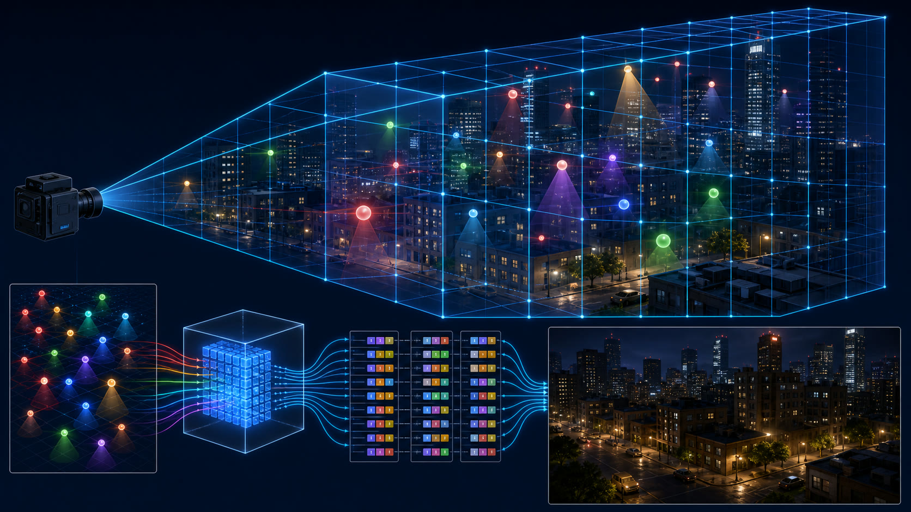

| 输入                           | 核心处理                                                      | 输出                             | 首要验收                                      |
| ------------------------------ | ------------------------------------------------------------- | -------------------------------- | --------------------------------------------- |
| depth/Hi-Z、GPU light database | 3D cluster、count/prefix/write、有界 overflow、PBR light loop | cluster light list、Forward+ HDR | 数百局部光无越界、无 light-count variant 爆炸 |

已落地切片把当前 depth 汇总为 tile depth bounds，再按 logarithmic Z slice 建立 3D
cluster。光源分配使用 count → 256-entry workgroup scan → block prefix → bounded finalize →
sentinel/`atomicMin` stable index write；全局 index budget 与 per-cluster ceiling 都有 deterministic
truncation 和 overflow counter。点光与聚光进入 cluster；方向光使用独立全局列表，空 depth
tile 不分配 index，near-plane crossing local light 使用保守 tile bounds。精确 LTC
AreaLight 使用 ordinary Forward 同源 LUT 和显式 LOD 采样并进入 global light
prefix，不做点光近似。fragment shader 只按 global directional + cluster
grid/list 迭代，不产生 light-count variant。普通 Forward 与 clustered variant 现在共用
`pbr_surface.glsl`/`pbr_brdf.glsl`；Forward+ 只替换 light-list provider 与 light
iteration，不再维护第二套材质模型。结果进入 `rgba16float` HDR、Bloom 和 ACES display
transform；`readDiagnostics()` 仅用于显式、按需的验收读回，不参与生产帧调度。当前 storage
PBR 原生覆盖 base color、metallic、roughness、combined
metallic-roughness、occlusion、emission、normal map，支持 UV0/UV1、UV
matrix、sampler 状态与 tangent-space normal；颜色阶段复用 depth prepass，non-uniform
scale 通过每对象 inverse-transpose normal basis 正确着色。alpha-mask 已让 opacity/base-color
coverage 在 depth、motion、material-attributes 和 color pass 中一致 discard。directional/spot/point
shadow light 复用 renderer 唯一 shadow atlas、shadow-first light
order 与 cascade/bias/matrix 数据；storage PBR 支持 standard/reversed depth 3×3 PCF 和逐物体
`receiveShadows`。layered PBR、skin/morph 与全兼容 transparent queue 通过 direct storage
lane 使用相同 cluster light list；Spot analytic cookie/IES 与 uint32 receiver/light
layer 在同一 light record ABI 中过滤。贴图身份或同能力 variant 的运行时变化保留 GPU path；custom
compile、transmission、parallax/environment 和混合 compatibility-transparent queue 由共享 Forward
fallback 保持功能正确；fallback 的 opaque/transparent split、shadow 录制和 transmission opaque scene
copy 已有真实 WebGPU 覆盖，并与 GPU Scene 一起写 linear HDR 后统一经过 separable
Bloom/ACES。material variant manifest 在异步创建期 warmup
Naga/pipeline，运行时 variant 按固定预算和 submission
transaction 准入，并暴露 warm/active/rejected/time diagnostics。

当前第一版没有继续扩充普通 Forward 的固定 LightBlock，而是：

- 建立 GPU light database，light record 使用 storage buffer；
- depth/Hi-Z 驱动 tile/cluster bounds，支持 3D cluster 而不只是固定 2D tile；
- count → prefix/allocate → write light index 的有界多 pass allocator；
- 明确 overflow counter、最大 index budget 和 deterministic overflow policy；
- built-in PBR 的 BRDF/material evaluation 已与 light iteration 解耦；storage-aware
  variant 复用同一 surface/BRDF chunk，只注入 clustered light
  provider，而不是要求应用重写整个 shader；
- opaque、alpha-tested、兼容透明、skin/morph 与 layered material 使用 clustered
  list；透明保留 CPU 全局排序；
- shadow index 与 AreaLight 已进入同一 light database/稳定全局前缀；Spot analytic
  cookie/IES 与 uint32 light-layer ABI 已进入固定 record；
- WebGL 2 使用独立传统 forward factory，不在 WebGPU frame 内分支或静默截断。

当前完成证据：数百动态局部光 fixture 不再生成按精确 light count 爆炸的 shader
variant；opaque/alpha-mask PBR、shared shadow atlas、AreaLight、Forward fallback
transmission、overflow 与 device recovery 有真实 WebGPU
pipeline/browser 覆盖。P0 收口测试进一步覆盖 layered/transparent/变形 clustered-native
light-list、cookie/IES/light-layer、variant budget、失败回滚与 device
recovery；剩余证据门禁是登记的物理 GPU 跨提交性能基线。

### 6.3 Milestone 1B：时域画质主线

#### T0：Motion Vector 与 History

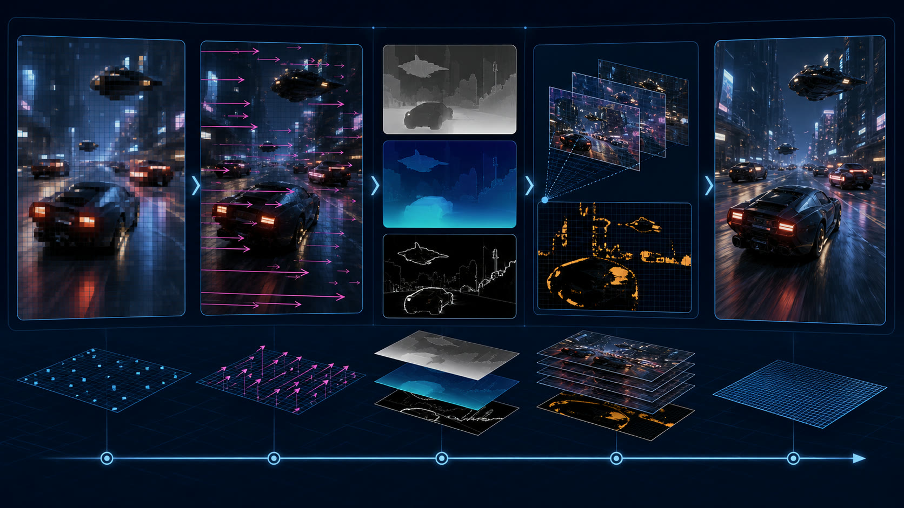

| 输入                                     | 核心处理                                                  | 输出                           | 首要验收                                  |
| ---------------------------------------- | --------------------------------------------------------- | ------------------------------ | ----------------------------------------- |
| 低分辨率当前帧、velocity、depth、history | reprojection、disocclusion、clamp、reactive mask、upscale | 稳定高分辨率画面与分辨率控制器 | camera cut 无旧帧闪回，运动物体不持续拖影 |

当前已交付 T0 的原生分辨率 TAA、固定/动态比例 TAAU 与 authored reactive
mask 切片：内置 opaque/masked Basic/PBR/Geometry 输出 single-sample `rgba16float`
velocity/previous-current log-view-depth；Camera 同时保留 jittered raster 与 non-jittered CPU
projection；`TemporalAA` 在 opaque 后、transparent/Bloom 前使用 output-resolution `rgba16float`
color history、`r32float` log-view-depth history、relative-depth rejection、YCoCg variance
clipping、motion/luminance-reactive weighting 和 resolve-only sharpen。`renderScale`
可固定为 0.5–1；WebGPU `timestamp-query` 驱动的 `dynamicResolution`
使用 EWMA、迟滞、量化步进、warmup/settling 与 min/max budget。sub-native 模式同步缩放 opaque
color/depth/motion、Hi-Z 和 cluster viewport，以 16-tap
Catmull-Rom 重建当前颜色，并输出 full-resolution
depth 供透明阶段继续组合。普通 Forward 使用独立 motion semantic pass，Clustered Forward+ 则把 GPU
Scene motion 融入 depth prepass 并记录前一已提交帧 visibility。首次出现、显隐间断、camera/projection
cut、resize、resolution-scale change、失败帧和 device recovery 均进入提交事务与 history
invalidation 验收。材质 `temporalReactiveFactor` 写 `r8unorm` MRT，resolve 以 3×3
dilation 与 luminance heuristic 共同抑制 history。transparent/transmission 与 GPU
particle 使用独立 reactive/depth short history 和衰减 resurrection，不污染 opaque history。

- opaque/alpha-tested geometry 输出 motion vector；skinning/morph 必须有 previous pose；
- camera jitter 不污染 CPU picking/frustum；提供 jittered 与 non-jittered matrix；
- color/depth history 使用 F0 persistent owner；exposure 有独立 submission-aware history，reactive
  mask 是当帧 transient attachment，不伪装成跨帧资源；
- disocclusion、relative-depth rejection、YCoCg neighborhood/variance clipping；
- opaque/masked emissive 可通过 authored/luminance
  reactivity 抑制 history；transmission、transparent 与 GPU particle 使用独立 reactive/depth/history
  policy，UI 保持在全部时域 resolve 之后；
- camera cut、FOV jump、origin shift、resize 和 resolution-scale change 重置 history。

#### TAA → TAAU → Dynamic Resolution

按以下顺序交付，避免一次性把 TSR 复杂度混在一起：

1. ~~原生分辨率 TAA，先验证 motion/history/invalidation 正确性；~~ 已完成；
2. ~~内部低分辨率到输出分辨率的 TAAU，加入 reconstruction filter 和 sharpness；~~ 已完成；
3. ~~基于 GPU timestamp 的动态分辨率控制器，带迟滞、上下限、history invalidation 和 camera/UI
   policy；~~ 已完成；
4. ~~authored reactive mask、transparency/particle history composition 和 decaying resurrection；~~
   已完成。

当前切片完成标准已经覆盖静态收敛、运动物体、camera cut、alpha-test、动态分辨率与 authored
reactive；动态分辨率不改变 UI/透明组合的输出分辨率。透明、transmission 和 GPU particle 不进入 opaque
history，而是使用各自 output-resolution color/mask/depth short history、depth agreement、reactive
coverage 和衰减 resurrection；失败提交与 device recovery 遵守同一事务边界。

#### E0：Auto Exposure 与 Filmic Display Transform（已完成）

| 输入                                               | 核心处理                                                            | 输出                                 | 首要验收                                     |
| -------------------------------------------------- | ------------------------------------------------------------------- | ------------------------------------ | -------------------------------------------- |
| 线性 HDR scene color、上一帧 exposure、camera 状态 | log-luminance histogram、percentile metering、时域适应、filmic 曲线 | GPU exposure history、稳定的显示变换 | 无逐帧 CPU readback，camera cut 不闪曝光旧值 |

已落地：

- `AutoExposureController` 从 tone mapping 前的线性 HDR scene color 构建 256-bin log-luminance
  histogram，在 GPU 上完成 percentile clipping、middle-gray 求解与 EV-space asymmetric eye
  adaptation；生产帧没有逐帧 CPU readback；
- `AutoExposure` 可作为 `ForwardRenderPipelineFactory` 的 WebGPU compute/storage feature 使用，
  `ClusteredForwardPlusPipelineFactory.autoExposure` 复用同一 controller；普通手动
  `ColorUber.exposure` 与 PBR Neutral 默认值不变；
- immutable options 已覆盖 log-luminance range、low/high percentile、min/max EV、compensation、key
  value、speed up/down、sample stride，以及 `average | center-weighted`
  metering。当前没有任意 authored metering-mask texture，不能把旧规划中的“可选 mask”写成已实现；
- 1×1 `rgba16float` exposure
  history 由 renderer-owned 双缓冲 recipe 管理，只在有效 submission 后交换；Camera
  identity/transform discontinuity、显式上游 invalid、resize/recipe change 与 device
  recovery 都会重新初始化，失败帧不推进 camera/timestamp/history；
- 普通 Forward 在 HDR
  post-process 后、display 前应用 exposure；Clustered 在 TAA/TAAU 与 transparent 合成后测光，并让 Bloom/emissive 与 display 使用同一 adapted
  multiplier。TAA history 保存未曝光线性 HDR，因此不需要在 exposure 变化时重标旧 history；
- `ColorUber` 已增加参数化 `filmic` slope/toe/shoulder/black clip/white clip，同时保留 PBR
  Neutral、ACES、Reinhard 与 `none`；Clustered display 提供 ACES 与 compact filmic；
- diagnostics 只在显式调用时 readback `actualEV`、`targetEV`、average luminance 与 sample
  count；当前不公开完整 histogram、history generation 或 reset reason。

完成证据包括 option/requirements、history 提交/回滚和真实 WebGPU pipeline/browser 集成；Stormfront
Observatory 同时覆盖 atmosphere、cloud、auto exposure、filmic
display 与运行中参数交互。任意 metering mask、公开 histogram 可视化和更细 reset
diagnostics 是后续增强，不属于 E0 已完成合同。

### 6.4 Milestone 2：现代高画质系统

#### Q0：Material Attribute Buffer + GTAO / SSR / SSGI（已完成）

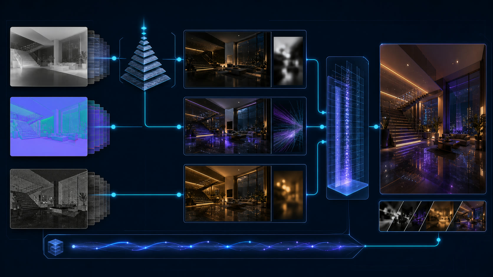

| 输入                                     | 核心处理                                             | 输出                          | 首要验收                                |
| ---------------------------------------- | ---------------------------------------------------- | ----------------------------- | --------------------------------------- |
| depth pyramid、normal、roughness、motion | horizon AO、hierarchical ray march、temporal denoise | GTAO、带置信度 SSR、时域 SSGI | 屏幕边缘/反遮挡降级确定，默认路径不付费 |

不建议先做完整传统 G-buffer deferred。Forward+ 的按需 attribute pass/MRT 已由 SSR 首次落地：

- compact octahedral view normal + perceptual roughness + receiver/metallic flags（已完成）；
- motion vector 与 linear/reversed depth；
- GTAO 使用 rotated horizon search、bent normal、half-resolution submission-aware temporal
  denoise 与有界 depth/normal upsample；普通 Forward 覆盖 WebGPU/WebGL 2，Clustered 复用 GPU Scene
  attribute/motion producer（已完成）；
- SSR 使用 RG32F min/max Hi-Z hierarchical ray march、roughness cone、hit confidence、temporal
  resolve，并在 TAA/TAAU 前合成（已完成）；
- SSGI 复用 material attributes、motion/log-depth 与 history，直接对当前 scene depth 做 stochastic
  view-space diffuse trace，不依赖 Hi-Z；screen-edge、off-screen 与 disocclusion 均有确定降级；
- effect 只在声明需要时创建 attribute/history
  resource，默认 Forward/Clustered 快路径不付费（GTAO、SSR、SSGI 已验证）。

当前 SSR 的 screen-edge/off-screen fallback 是确定性零贡献；GTAO 的屏幕外遮挡同样不参与 horizon
search。SSGI 已完成屏幕内时域漫反射传输，但屏幕外/被遮挡 geometry 仍是零贡献；probe/BVH/SDF
off-screen GI 补偿属于 GI0，而不是未完成的 Q0。实现与上线证据见
[`GROUND_TRUTH_AMBIENT_OCCLUSION.md`](./GROUND_TRUTH_AMBIENT_OCCLUSION.md) 与
[`SCREEN_SPACE_REFLECTIONS.md`](./SCREEN_SPACE_REFLECTIONS.md)、
[`SCREEN_SPACE_GLOBAL_ILLUMINATION.md`](./SCREEN_SPACE_GLOBAL_ILLUMINATION.md)。

这里推荐 GTAO/temporal AO，而不是补传统 SSAO；推荐 hierarchical SSR/temporal
SSGI，而不是单帧固定步长 ray march。

#### S0：现代阴影（生产缓存首版已完成；GPU cull / 虚拟页未开始）

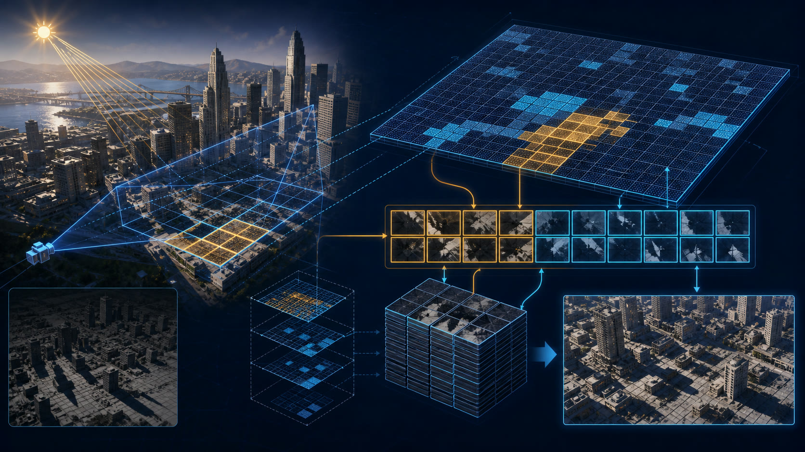

| 输入                                       | 核心处理                                                      | 输出                           | 首要验收                               |
| ------------------------------------------ | ------------------------------------------------------------- | ------------------------------ | -------------------------------------- |
| receiver/caster 可见性、light dirty region | stable atlas、page request、physical allocation、invalidation | 缓存阴影页与按需更新 draw list | 静态页不重绘，动态 caster 只失效相交页 |

分两层推进：

1. **生产缓存层**：shadow caster GPU culling、static/dynamic invalidation、stable atlas
   tile、按灯光预算更新、receiver-driven resolution、远近级更新频率；
2. **虚拟阴影层**：directional clipmap/local-light virtual page table、depth/receiver 分析产生 page
   request、physical page allocation、per-page draw list、submission 后提交 residency。

当前已交付第一层中的 stable atlas content cache、static/dynamic exact invalidation、slice-local
scissored depth clear、submission commit/rollback、recovery invalidation 和
`RendererDiagnostics.caches.shadowAtlas`。静态 slice 不再记录 Shadow Pass；移动 local
light 只重绘对应 face，刚体 caster 用 shadow-camera bounds 把失效限制到相交 slice。geometry
bounds 变化、skin/morph 目前保守失效相关全部 slice。GPU caster culling、receiver-driven
resolution/update budget 和远近级更新频率仍是第一层剩余工作，不能由当前 CPU-side exact
invalidation 冒充。

这里的 virtual shadow
page 不等同于 SVT/RVT。SVT 是从磁盘按 tile 流送纹理，RVT 是运行时生成并缓存材质或地形 shading 数据；两者可以承载 lightmap 或 shadow
factor 等数据，但不能直接替代动态 shadow rendering。VSM 才是把 shadow
map 自身分页、请求、缓存和失效的系统，并且本质上仍是 shadow map。

WebGPU 没有 sparse texture；虚拟页必须落到普通 depth
atlas。第一层一旦完成即可降低当前“有变化就重画 atlas”的成本，并为第二层提供正确的 invalidation 和 residency 数据。

完成标准：静态 camera/light 的 cached page 不重绘；动态物体只失效相交页；page budget
overflow可观测且有确定降级；不能把缺页当成“无阴影”而产生随机闪烁。

#### V0：Froxel Volumetrics 与天气基础（生产切片已完成）

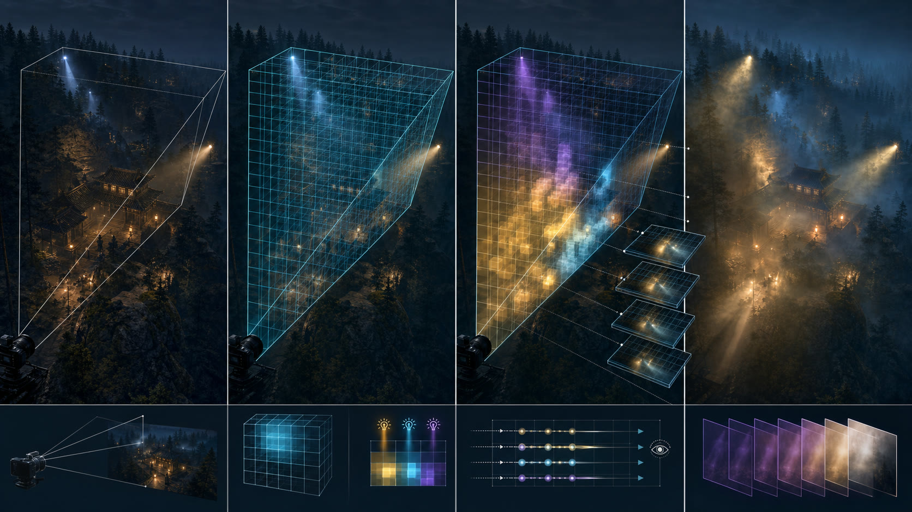

| 输入                                         | 核心处理                                                    | 输出                       | 首要验收                                  |
| -------------------------------------------- | ----------------------------------------------------------- | -------------------------- | ----------------------------------------- |
| cluster lights、screen/cloud visibility、fog | froxel injection、column integration、temporal reprojection | 雾、局部光束、云与大气层次 | camera/light 移动无明显 trail，预算可分档 |

当前已交付 V0 的首个生产 WebGPU high-end 切片：local-light allocator 在启用时覆盖完整相机 cluster
volume，directional/point/spot light 与 exponential height fog、sphere/box local fog 注入 tiled
`rgba16float` froxel atlas，随后按 column 累积 radiance/transmittance，以 opaque
depth 常数次重建并执行 previous-view reprojection、depth/reactive temporal resolve 与 linear HDR
composition。bounded screen-space visibility 让当前 Camera 可见的动态 caster 切断光束；共享 surface
shadow atlas 不直接进入 froxel，体积阴影当前由 bounded screen-space caster visibility 与 atmosphere
cloud shadow 提供。physical atmosphere LUT、aerial perspective、quality-tier fractional-resolution
temporal cloud、surface/froxel cloud shadow 与 directional
coupling 已完成；透明体积 history 和 shared shadow-atlas volumetric
sampling 仍是明确后续边界。完整合同与证据见 [`VOLUMETRIC_LIGHTING.md`](./VOLUMETRIC_LIGHTING.md)。

- camera-aligned froxel grid、cluster light injection 与 screen/cloud-shadowed scattering；
- height fog/local volume/anisotropy、physical atmosphere、volumetric cloud 与 cloud shadow；
- half/quarter resolution integration + temporal reprojection + blue-noise sampling；
- 与 TAAU、transparent、sky、exposure 和 camera cut 的组合顺序固定；
- Z slice 平铺进 dimension-validated `rgba16float` 2D atlas；当前实现没有宣称使用 3D
  texture 或 2D-array froxel resource。

当前完成标准覆盖 directional/point/spot 注入、局部雾体、screen-space caster
visibility、云影、camera/light 移动 history、质量分档和 device recovery。shared shadow-atlas
sampling、AreaLight 体积近似与透明介质参与需要独立 ABI/像素/性能证据，不能由现有 screen-space
visibility 冒充。

### 6.5 Milestone 3：几何、资源与间接光虚拟化

#### A0：现代资源流送（未开始）

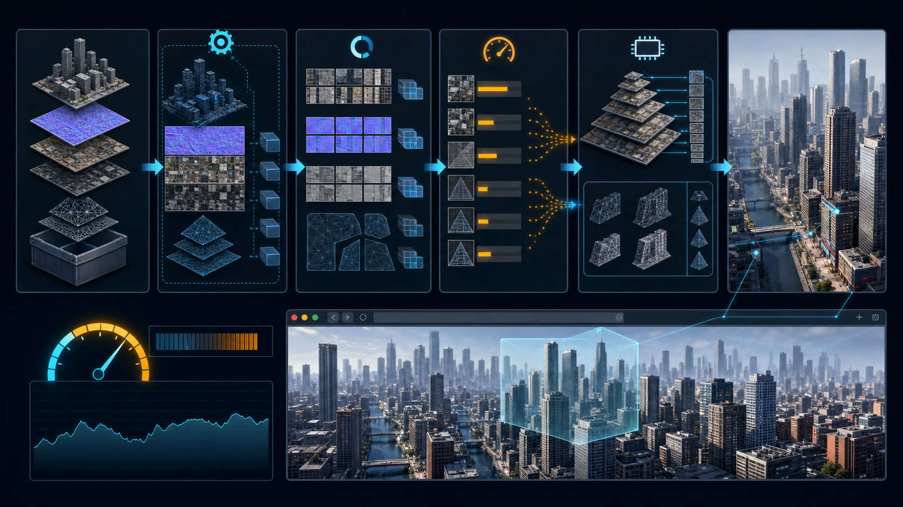

| 输入                                | 核心处理                                              | 输出                                   | 首要验收                                 |
| ----------------------------------- | ----------------------------------------------------- | -------------------------------------- | ---------------------------------------- |
| glTF、KTX2/Basis、meshopt、网络字节 | Worker decode、优先级队列、分帧 upload、LRU/residency | resident mip/geometry pages、LOD clamp | 冷启动/teleport 可取消，上传不击穿帧预算 |

- KTX 2 + Basis Universal transcode，根据 BC/ETC2/ASTC capability 选择目标格式；
- `EXT_meshopt_compression` 或等价严格类型/WASM 解码路径；
- Worker 中 fetch/decode，主线程只提交 immutable upload；
- texture mip residency、sampler LOD clamp、带宽/显存/在途 upload budget；
- geometry page residency、优先级、取消、LRU 与 submission-aware destroy；
- diagnostics 暴露 requested/resident/in-flight/evicted bytes，不猜测浏览器不可见的真实 VRAM。

#### M0：WebGPU meshlet/cluster geometry（未开始）

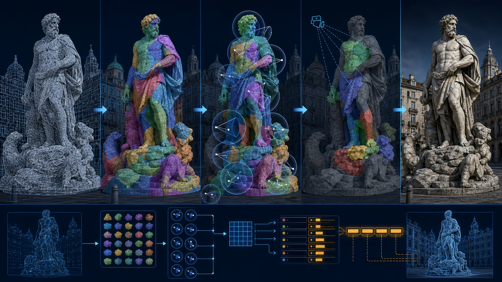

| 输入                                | 核心处理                                                 | 输出                                     | 首要验收                                  |
| ----------------------------------- | -------------------------------------------------------- | ---------------------------------------- | ----------------------------------------- |
| 离线 cluster hierarchy、bounds/cone | GPU LOD、frustum/Hi-Z/cone cull、compact、vertex pulling | 可见 meshlet 与固定 bucket indirect draw | GPU 时间/带宽收益可证，不依赖 mesh shader |

- 离线构建 meshlet、bounds/cone、cluster hierarchy、material ranges 和 streaming page；
- GPUScene compute 选择 cluster LOD、frustum/Hi-Z/cone cull、compact visible cluster；
- vertex pulling + fixed material/pipeline bucket indirect draw；
- 无 mesh shader 时用 compute 生成 visible index/vertex work，控制重复变换和 buffer 带宽；
- 静态 mesh 先落地，skinning/morph/alpha-tested geometry 作为独立扩展，不在首版假装全覆盖。

这是一条 “Nanite-class problem” 的 WebGPU 解法，但不是 Nanite 等价实现。必须用真实内容、GPU
timestamp、streaming bytes、cluster rejection 和 shading cost 证明收益。

#### GI0：WebGPU 可落地的混合 GI（仅屏幕内 SSGI 已完成）

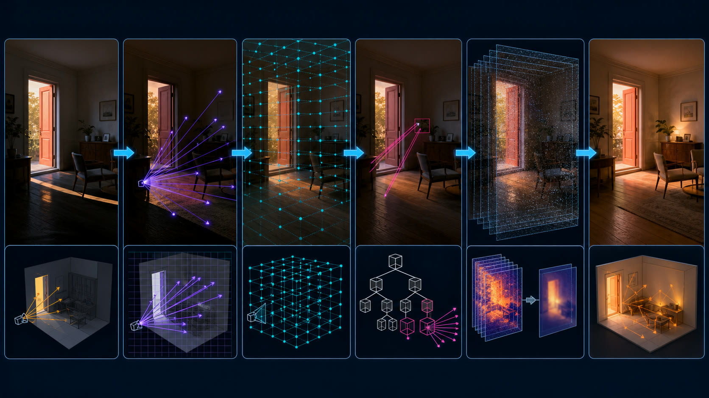

| 输入                                  | 核心处理                                                | 输出                                         | 首要验收                              |
| ------------------------------------- | ------------------------------------------------------- | -------------------------------------------- | ------------------------------------- |
| depth/normal/history、probe、软件 BVH | screen trace、probe fallback、少量 compute ray、denoise | 稳定 diffuse indirect 与 off-screen fallback | 动态光/几何可更新，不宣称硬件 RT 能力 |

建议组合顺序：

1. ~~Hi-Z SSR + temporal SSGI，先覆盖屏幕内高频信息；~~ 已由 Q0 完成；
2. 动态 probe grid/DDGI，保存低频 diffuse irradiance 与 visibility；
3. 只有在内容需要且基准可接受时，再加入 software BVH 或 SDF clipmap trace；
4. probe/software trace 作为 off-screen fallback，不能冒充硬件 ray tracing。

SDF 不单独前移为近期 milestone。只有同时满足以下准入门槛，才在 GI0 下启动 `SDF0`
探索并考虑公共 provider：

- 真实产品需要 screen-space 方法无法覆盖的 off-screen
  AO/GI/visibility，且 Q0 的 GTAO/SSGI 已有对照基线；
- offline mesh-to-SDF baker 明确定义 watertight、thin surface、two-sided、masked
  foliage、压缩、版本和 Worker/CI 产物合同；
- per-object SDF、global clipmap composition、局部失效、camera teleport 和 device
  recovery 在移动与桌面代表设备上都有体积内存、更新带宽和 cone/ray-march 时间证据；
- 首版限定 static/rigid mesh，skinning/morph 不用每帧重烘焙或低质量占位假装支持；
- 至少两个生产消费者能够复用同一场景表示，例如 off-screen AO 与 GI
  fallback；在此之前保持内部实验接口，不公开最低公分母式 `SDFProvider`。

仓库已有 compute path tracing example，证明 WGSL 可以做 BVH/光线类工作，但 progressive full-frame
path
tracing 与实时动态场景 GI 的更新、加速结构、降噪和 residency 成本不是同一个问题。GI0 必须单独建立动态 geometry、skinning、light
change、camera cut 和降噪证据。

## 7. 推荐的现代 WebGPU 帧

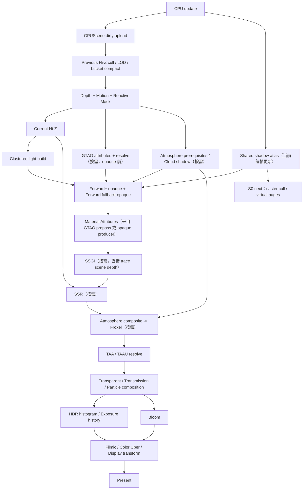

关键约束：

- 普通场景、GPU-driven scene、shadow、screen effect 和 post-processing 仍进入同一个 Render Graph；
- graph access 是唯一 hazard 来源，不向应用公开 native encoder/barrier；
- WebGPU-only pipeline 通过创建前 requirements 排除 WebGL 2，不在热路径查询 backend；
- CPU 不读取 visible count、cluster list、indirect args、virtual page request 或 temporal
  statistics；auto exposure 同样不能依赖逐帧 CPU readback；
- history、exposure、未来 residency 与 resource revision 只在有效 submission 后 commit；当前 Shadow
  Atlas 尚无跨帧内容 residency。

## 8. 主要代码落点

| 领域              | 当前代码入口                                                              | 仍需增量                                                                            |
| ----------------- | ------------------------------------------------------------------------- | ----------------------------------------------------------------------------------- |
| Public capability | `src/render/Renderer.ts`、`src/render/pipeline/RenderPipeline.ts`         | streaming/residency 与未来 S0/M0/GI0 的窄化 capability/requirements                 |
| RHI core          | `src/render/rhi/core/`                                                    | 保持 native type 不越界；仅在具体消费者需要时增加新 query/format/use 合同           |
| WebGPU backend    | `src/render/rhi/backends/webgpu/`                                         | 为 streaming/page/meshlet 消费者补精确 feature/limit 映射，不建立 bypass            |
| Render Graph      | `src/render/graph/`、`src/render/pipeline/ScriptableRenderGraph.ts`       | multi-subresource history validity、compiled graph reuse、证据充分后的同帧 alias    |
| Shader compiler   | `src/render/shader/`、`src/render/compute/`                               | 新 surface family、meshlet/streaming kernel；继续遵守 GLSL/Naga 与 Direct WGSL 边界 |
| Shared renderer   | `src/render/renderer/`、`src/render/pipeline/ClusteredForwardPlus.ts`     | shadow residency、GPU caster cull 与未来 meshlet/streaming consumer                 |
| Pipeline features | `src/render/pipeline/`、`src/render/postprocessing/`                      | volumetric atlas shadow、未来 probe/off-screen GI                                   |
| Camera/frame ABI  | `src/camera/`、`src/render/ubo/BuiltInUniformBlocks.ts`                   | 当前 D0 已完成；新增空间表示必须复用现有 current/previous/origin transaction        |
| Assets            | `src/loader/`、`src/texture/`、`src/geometry/`                            | KTX 2/Basis、meshopt/meshlet metadata、residency 与 streaming budget                |
| Diagnostics       | `RendererDiagnostics`、RHI diagnostics、`ClusteredForwardPlusDiagnostics` | resident/in-flight/evicted bytes、shadow page、warmup queue 与登记物理 GPU baseline |

任何公共 API 变更仍需遵循仓库规则：测试、TypeDoc、`CHANGELOG.md`、API
report、类型消费和 package 验证必须同版本完成。

## 9. 验证与性能门禁

### 9.1 每个系统都要有三类证据

1. **合同测试**：capability、descriptor、graph hazard、scope、rollback、device loss 和 negative
   backend；
2. **真实 WebGPU 浏览器测试**：pipeline creation、像素/结果、camera cut、resize、reload 和恢复；
3. **不可覆盖性能基线**：固定硬件/浏览器/驱动，记录 CPU phase、GPU pass、upload bytes、resident
   bytes、draw/dispatch 和 cache hit。

### 9.2 当前代表场景与剩余证据

- **GPU Scene 已有**：100k static + 10k dynamic、256 lights、dirty upload、Hi-Z/LOD、device
  recovery 与 CPU record/GPU batch
  completion 分离。**仍缺**：登记物理 GPU 上不可覆盖的跨提交 frame-time/显存阈值；
- **Clustered Forward+ 已有**：Sponza 数百局部光、deterministic overflow、shared
  directional/spot/point shadow、LTC AreaLight、alpha-mask、fallback transmission，以及 P0
  fixture 的 transparent/deformed/layered clustered-native、cookie/IES/ light-layer、variant
  rollback/recovery 像素证据。**仍缺**：登记物理 GPU 性能基线；
- **TAAU 已有**：Temporal Observatory 的收敛、camera
  cut、固定/动态 scale、alpha-mask、emissive 与 authored reactive，以及 P0
  fixture 的 transparent/particle/transmission history/resurrection；
- **E0 已有**：Stormfront Observatory 的大气明暗跨度、auto exposure、filmic、云/风暴交互与 GPU
  health；option/历史测试覆盖 EV 上下限和 camera continuity。任意 authored metering
  mask 只有在新增 API 时才需要新 fixture；
- **Q0 已有**：Silent Dragon GTAO、Afterimage SSR、Prismatic Vespers
  SSGI 的 on/off 像素、时域与双后端/ WebGPU 边界。**仍缺**：GI0 的 off-screen probe/BVH
  fallback，不属于 Q0 回补；
- **V0 已有**：Neon Reliquary froxel 与 Stormfront
  atmosphere/cloud/cloud-shadow 场景。**仍缺**：shared shadow-atlas volumetric
  sampling、透明介质参与和对应性能证据；
- **Streaming 未有**：后续场景需覆盖低带宽冷启动、快速 teleport、取消、内存压力与 device loss；
- **Shadow cache 已有首版**：单元/生产接线覆盖静态 hit、local-light face 局部失效、失败回滚、atlas
  detach 与 recovery；**仍缺** GPU caster cull、receiver/update
  budget、快速 camera 压力场景与 virtual page overflow。

不能把验收 example 的“算法跑通”当成 production baseline，也不能通过 CPU readback visible
count 来驱动下一步 draw。功能完成必须同时回答：更少的 CPU work、更稳定的 GPU
time、确定的资源预算和失败时的可观察行为。

## 10. 明确不进入当前路线的内容

- 不为“功能多”而补 FXAA、传统 SSAO、固定步长 SSR 或逐灯光 pass；
- 不先做经典 deferred renderer 重写；优先复用当前 PBR/transparent 的 Clustered Forward+；
- 不为了 WebGL 2 对等而限制 WebGPU storage/compute/indirect 设计；
- 不用 texture-backed SSBO、transform feedback、fragment compute 或 CPU fallback 模拟 WebGPU；
- 不公开 native WebGPU device/buffer/encoder 作为常规功能入口；
- 不承诺硬件 ray tracing、mesh shader、bindless、sparse residency、async compute 或 multi-queue；
- 不为尚不存在的硬件 RT 路径预先公开最低公分母式 trace
  provider；先定义 AO、reflection、shadow 和 GI 各自的 graph
  resource/output 合同，等至少两种生产实现存在后再抽象公共查询层；
- 不把 compute path-tracing demo 当作实时 Lumen 替代；
- 不在缺少 streaming、material binning、可见性和真实性能证据时宣传 Nanite/VSM 等价能力。

## 11. 推荐实施顺序

历史完成链已经包括 F0、F1、D0、MAT0、G0/L0、T0、E0、Q0 与 V0/天气。接下来不应重新排期这些能力，建议按以下可独立验收的变更链推进：

1. **登记 G0/L0 物理 GPU baseline**：把现有 110k object / 256 light
   fixture 纳入固定 hardware/browser/driver 的不可覆盖跨提交协议，先锁定 CPU record、GPU
   pass、upload 与显存阈值；
2. **S0 生产缓存层**：stable atlas content cache、static/dynamic exact
   invalidation 和局部 clear 已完成；继续补 GPU caster
   cull 与 receiver/budget 更新，只有第一层证明收益后再进入 virtual shadow page；
3. **A0 资源流送**：KTX 2/Basis + capability-driven transcode、Worker decode、mip
   residency、上传/内存/in-flight budget；随后再增加 geometry page/meshopt；
4. **M0 meshlet/cluster geometry**：复用 GPU Scene、bucket LOD 与 A0 residency，先限定 static rigid
   mesh，以真实内容证明 cull/带宽收益；
5. **GI0 off-screen 层**：在已完成 SSGI 基线上按产品需要评估 probe grid，再决定 software BVH/SDF
   clipmap；virtual texture 和完整 virtual shadow 同样以真实内容/预算决定，不预先公开空 provider。

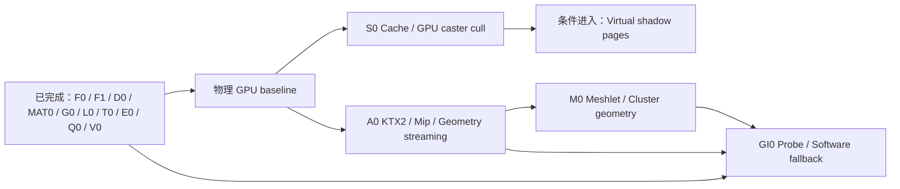

当前引擎已经覆盖通用材质前端、P0 GPU
Scene/Clustered 适用面、时域画质和多项 high-end 屏幕/体积效果；功能 P0 已收口，尚需登记物理 GPU 性能证据。S0/A0 是下一阶段 P1 主线，M0/GI0/完整虚拟页必须继续由真实内容、硬件预算和跨提交证据驱动。

## 12. 外部参照

- [WebGPU specification：Feature Index](https://www.w3.org/TR/webgpu/#feature-index)
- [WGSL specification：Shader Stage Attributes](https://www.w3.org/TR/WGSL/#shader-stage-attr)
- [Unity 6 当前文档：URP Render Graph](https://docs.unity3d.com/kr/current/Manual/urp/render-graph.html)
- [Unity 6 当前文档：GPU Resident Drawer](https://docs.unity3d.com/kr/current/Manual/urp/gpu-resident-drawer.html)
- [Unreal Engine 5.8：Mesh Drawing Pipeline](https://dev.epicgames.com/documentation/en-us/unreal-engine/mesh-drawing-pipeline-in-unreal-engine)
- [Unreal Engine 5.8：Material Instances](https://dev.epicgames.com/documentation/unreal-engine/instanced-materials-in-unreal-engine)
- [Unreal Engine 5.8：Substrate Materials](https://dev.epicgames.com/documentation/en-us/unreal-engine/overview-of-substrate-materials-in-unreal-engine)
- [Unreal Engine：Nanite Virtualized Geometry](https://dev.epicgames.com/documentation/unreal-engine/nanite-in-unreal-engine?lang=en-US)
- [Unreal Engine：Virtual Shadow Maps](https://dev.epicgames.com/documentation/en-us/unreal-engine/virtual-shadow-maps-in-unreal-engine)
- [Unreal Engine：Temporal Super Resolution](https://dev.epicgames.com/documentation/en-us/unreal-engine/temporal-super-resolution-in-unreal-engine)
- [Unreal Engine：Auto Exposure / Eye Adaptation](https://dev.epicgames.com/documentation/en-us/unreal-engine/auto-exposure-in-unreal-engine)
- [Unreal Engine：Color Grading 与 Filmic Tonemapper](https://dev.epicgames.com/documentation/en-us/unreal-engine/color-grading-and-the-filmic-tonemapper-in-unreal-engine)
- [Unreal Engine：Streaming Virtual Texturing](https://dev.epicgames.com/documentation/unreal-engine/streaming-virtual-texturing-in-unreal-engine?lang=en-US)
- [Unreal Engine：Runtime Virtual Texturing](https://dev.epicgames.com/documentation/en-us/unreal-engine/runtime-virtual-texturing-in-unreal-engine)
- [Unreal Engine：Mesh Distance Fields](https://dev.epicgames.com/documentation/unreal-engine/mesh-distance-fields-in-unreal-engine?lang=en-US)
- [Unreal Engine：Lumen Technical Details](https://dev.epicgames.com/documentation/en-us/unreal-engine/lumen-technical-details-in-unreal-engine)
- [Unreal Engine：高级渲染功能的硬件与 Shader Model 要求](https://dev.epicgames.com/documentation/unreal-engine/hardware-and-software-specifications-for-unreal-engine?lang=en-US)
