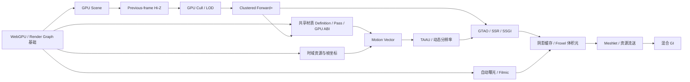
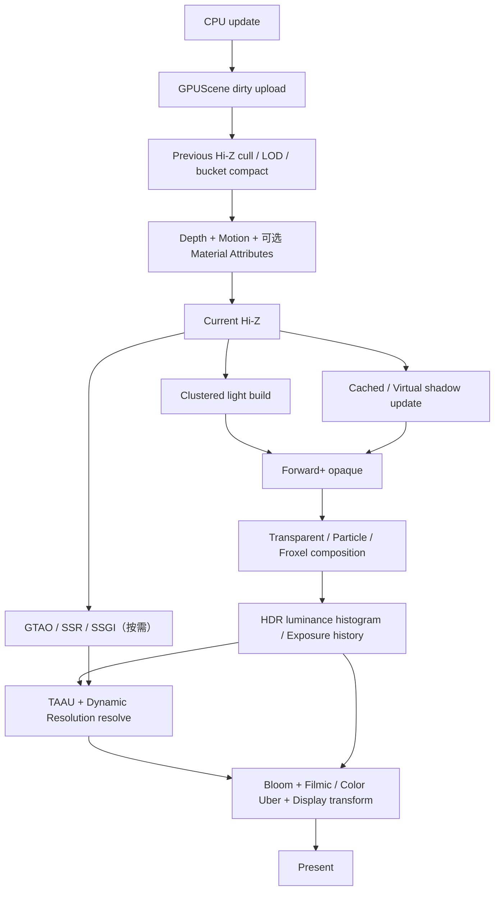
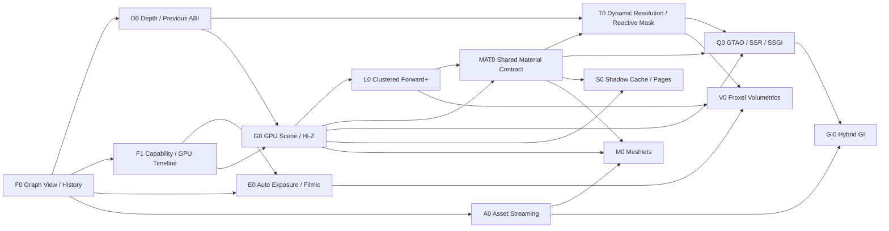

# Hilo3D 现代 WebGPU 渲染缺口与落地路线

> 审计基线：`902b9a7`（2026-08-01）；实施状态更新：2026-08-10，F0、F1、D0、G0/L0 的 WebGPU
> high-end 不透明场景切片，以及 MAT0 的 Definition/Instance、语义 Pass 基础与共享 PBR GPU Material
> Database 已落地。本文只讨论面向现代 WebGPU 图形架构的增量，不把恢复旧图形 API、补传统效果清单或维持 WebGL
> 2 功能对等作为路线目标。

## 结论先行

Hilo3D 当前最强的部分是渲染底座：共享 Renderer、Scriptable Render Pipeline、Render Graph、portable
RHI、WebGPU/WebGL 2 双后端、Compute/Storage/Indirect
Draw、HDR/PBR、设备丢失恢复和严格的帧事务都已经存在。当前主要缺口不在“能不能向 WebGPU 发命令”，而在以下六个生产级系统：

1. **材质系统后续层**：`MaterialDefinition`/`MaterialInstance`、forward/depth/shadow/picking 语义 Pass、共享 surface/BRDF，以及 renderer-local、按 identity 去重且 submission-aware 的 PBR
   GPU Material Database 与内置 motion role 已落地；attributes role、更多 surface family、variant
   manifest/warmup 与跨 shadow/时域消费者仍待完成。详见
   [`MATERIAL_SYSTEM_MODERNIZATION.md`](./MATERIAL_SYSTEM_MODERNIZATION.md)。
2. **GPU Scene 与 GPU 可见性**：high-end profile 已让注册的普通不透明 `Mesh` 进入常驻 GPU
   database、previous-frame Hi-Z、GPU cull/LOD/compact 和固定 bucket indirect
   draw；透明、蒙皮、morph、alpha-test 和 100k/10k 性能基线仍是后续完成门禁。
3. **生产级 Clustered Forward+**：high-end profile 已提供 depth-driven 3D cluster、GPU
   count/prefix/write allocator、有界 overflow 与 storage-aware GGX
   PBR；完整材质层、阴影、cookie/IES、精确 area-light 和透明路径仍需接入。
4. **时域渲染框架**：recovery-aware history owner、current/previous transform、projection
   jitter、opaque/masked motion
   vector、原生分辨率 TAA 与固定 0.5–1 比例 TAAU 已落地；动态分辨率、authored reactive
   mask 和透明时域策略仍未完成。
5. **自动曝光与可控显示变换**：已有手动 EV exposure、PBR Neutral、ACES fitted、Reinhard 和 Color
   Uber，但没有 GPU 亮度统计、eye adaptation、exposure history 或参数化 filmic toe/shoulder。
6. **现代资源与几何虚拟化**：已有 mip/array/aspect subresource graph view，但仍没有 GPU
   meshlet/LOD、纹理流送、KTX 2/Basis、虚拟纹理或虚拟阴影页系统。

最值得先做的不是直接复刻 Nanite 或 Lumen，而是在已经完成的 MAT0 与 T0 固定比例 TAAU 切片上推进 dynamic
resolution/authored reactive
mask，同时继续完成 G0/L0 的剩余门禁。E0 是可独立交付的显示质量切片，可以复用已经完成的 F0/F1，但不能抢占或阻塞这些主线：

这组能力应作为明确的 **WebGPU high-end profile**。它可以继续复用共享 Scene、Render
Graph、RHI 和生命周期系统，但不应为了 WebGL 2 对等而限制设计，也不能在运行时静默关闭 pass。

### 插图阅读约定

现有技术插图用于解释主数据流和最终效果，不作为精确 API 定义；工作包中的“输入 / 核心处理 / 输出 / 首要验收”才是实施边界。没有独立插图的增量工作包也必须遵守同样的输入、生命周期和验收合同。所有流程都默认从左向右阅读：蓝色表示资源或稳定数据，紫色表示时域/计算过程，橙色表示更新、风险或预算事件，绿色表示最终可见工作集。

## 1. 盘点范围与判断标准

### 1.1 代码与文档证据

本次盘点以当前源码和测试为主，重点检查：

- [`RENDERING_ARCHITECTURE.md`](./RENDERING_ARCHITECTURE.md)：生产帧、Render
  Graph、RHI、恢复和当前边界；
- [`COMPUTE_STORAGE_IMPLEMENTATION_PLAN.md`](./COMPUTE_STORAGE_IMPLEMENTATION_PLAN.md)：Compute、Storage、GPU-driven
  raster 和验收场景；
- [`PBR_AND_POST_PROCESSING.md`](./PBR_AND_POST_PROCESSING.md)：PBR、HDR、opaque scene
  texture、Bloom 和 Color Uber；
- [`MATERIAL_SYSTEM_MODERNIZATION.md`](./MATERIAL_SYSTEM_MODERNIZATION.md)：材质审计、G0/L0 原型抽取、语义多 Pass、Definition/Instance、variant、GPU
  material ABI 和迁移门禁；
- [`src/render/`](../src/render)：SRP、Graph、RHI、Compute、Renderer 和 Post-processing；
- [`src/shader/`](../src/shader)、[`src/material/`](../src/material)：当前 PBR 和 shader ABI；
- [`examples/compute_gpu_driven.ts`](../examples/compute_gpu_driven.ts)：Forward+、Gaussian、GPU
  particle 的验收闭环。

### 1.2 “现代且可落地”的筛选规则

进入主路线的能力必须同时满足：

- 能显著减少 CPU submission、场景遍历或 draw preparation 成本，或显著提高稳定画质；
- 可以通过当前 WebGPU 的 compute、storage、indirect、texture 和 render-pass 能力实现；
- 可以进入现有 Render Graph/RHI/恢复链路，不依赖 native WebGPU bypass；
- 有明确的数据合同、失败边界、测试场景和性能证据；
- 不以 WebGL 1、classic uniform、CPU 模拟 compute 或传统效果补齐为目标。

因此，FXAA、传统 SSAO、把当前 forward 机械改写为经典 deferred、纯 CPU
LOD、逐灯光独立 pass 等不列为推荐方向。Deferred 只有在生产数据证明它优于 Clustered
Forward+ 时才值得作为特定 profile 考虑，而不是现代化的默认答案。

## 2. 当前渲染能力基线

| 领域                                 | 当前状态      | 证据与边界                                                                                                                                                 |
| ------------------------------------ | ------------- | ---------------------------------------------------------------------------------------------------------------------------------------------------------- |
| Shared Renderer / Render Graph / RHI | 生产可用      | 单一共享前端、显式 graph、双后端、submission-aware 生命周期和恢复已经完成                                                                                  |
| Raster PBR / HDR                     | 生产可用      | layered glTF PBR、IBL、LTC area light、transmission、`rgba16float`、Bloom、Color Uber 已接入共享路径                                                       |
| Shadow                               | 可用基线      | 统一 atlas、方向光 1–4 级 CSM、Spot/Point shadow 和 PCF；缺少缓存、receiver-driven 分配和虚拟页                                                            |
| Compute / Storage / Indirect         | 底座生产可用  | Direct WGSL compute、storage buffer/texture、indirect dispatch/draw、readback、恢复和 graph hazard 已闭环                                                  |
| Material architecture                | 生产基础      | Definition/Instance、motion/attribute 语义 Pass 与共享 PBR GPU record 已落地；更多 family/warmup 待补                                                      |
| GPU-driven ordinary scene            | high-end 切片 | 注册的不透明 indexed `Mesh` 走 dirty GPU database、Hi-Z/LOD/compact 与固定 bucket indirect；透明/变形待补                                                  |
| Forward+                             | high-end 切片 | 3D cluster count/prefix/write、有界预算和 storage GGX PBR 已闭环；阴影/完整 layered PBR/透明待补                                                           |
| Temporal rendering                   | TAA/TAAU 切片 | jitter/non-jitter matrix、opaque/masked velocity、depth rejection、output-resolution history 与固定比例 TAAU 已完成；dynamic resolution/reactive mask 待补 |
| Exposure / display transform         | 部分可用      | 有手动 EV、固定 tone mapper 与 Color Uber；无亮度统计、eye adaptation、exposure history 或 filmic 曲线控制                                                 |
| Screen-space lighting                | SSR 切片      | RG32F min/max Hi-Z、normal/roughness attribute、hierarchical confidence SSR 与 temporal resolve 已完成；GTAO、SSGI 与 off-screen fallback 待补             |
| Volumetrics / atmosphere             | 缺失          | 无 froxel volume、temporal reprojection、physical sky 或 volumetric cloud                                                                                  |
| Geometry / texture streaming         | 缺失          | 无 GPU LOD/meshlet/cluster streaming；KTX loader 仅支持 KTX 1.1 2D 容器                                                                                    |
| GPU profiling / graph debugging      | 生产基线      | opt-in CPU/GPU Graph timeline、query ring、debug marker、资源 lifetime；关闭 diagnostics 时不创建 query                                                    |

### 2.1 现有实现中最关键的限制

- 内置 PBR 光照仍受固定 ABI 限制：最多 8 个方向光、16 个点光、8 个聚光、8 个面光；fragment
  shader 按 active light count 循环。见
  [`BuiltInUniformBlocks.ts`](../src/render/ubo/BuiltInUniformBlocks.ts) 和
  [`pbr_main.frag`](../src/shader/chunk/pbr_main.frag)。
- 通用 `SceneRenderPass.storageShaderVariant` 仍会替换整个 graphics
  shader，命中 instancing 时还会展开为逐 Mesh direct draw；G0/L0 专用 factory 已消费共享 PBR GPU
  record，但当前 native storage shading 仍只覆盖注册的不透明 PBR
  bucket，motion/attributes 和更多 surface family 尚未接入同一 handle。
- graph texture subresource view 与 persistent history 已落地；当前 history
  recipe 仍限定单 sample、单 mip、单 layer 的 2D color texture，多 subresource
  history 需要持久化 validity 后再开放。
- Direct WGSL `f16`、`subgroups`
  与 timestamp-query 已进入 capability/compiler/RHI 闭环；当前 WebGPU 标准未暴露
  `subgroup-size-control` feature，因此只记录 adapter 的 subgroup min/max，不虚构非标准 gate。
- Render Graph 每帧 Build/Compile，已有 pass culling 和跨帧 transient pool，但没有 compiled graph
  reuse 或同帧物理 alias。
- Camera/mesh/instance/skin/morph current/previous transform、history-valid ABI、projection
  jitter、motion-vector material
  pass、原生分辨率 TAA 与固定比例 TAAU 已完成；仍缺动态分辨率和 authored reactive mask policy。
- 当前 turnkey post-processing 提供可选 TemporalAA、Bloom 与 Color Uber；exposure 是手动 EV
  compensation，固定 tone mapper 没有参数化 filmic toe/shoulder，也没有 histogram、eye
  adaptation 或 GPU exposure history。Opaque scene texture 只能支持最低边界的屏幕空间 transmission。
- RHI 已有 timestamp QuerySet、pass timestamp、debug group/marker 和 Render Graph
  timeline；occlusion query 仍不在当前合同内。
- KTX loader 明确只解析 KTX 1.1、单 face 2D；没有 KTX 2、Basis Universal transcode、mip
  residency 或带宽预算。

## 3. Unity / Unreal 的参照应怎样转化

Hilo3D 应借鉴这些引擎解决的问题与数据流，而不是复制其依赖 DX12/Vulkan/主机平台的具体实现。

| 参照能力                                          | 值得借鉴的原则                                                                 | Hilo3D / WebGPU 落点                                                                   |
| ------------------------------------------------- | ------------------------------------------------------------------------------ | -------------------------------------------------------------------------------------- |
| Unity GPU Resident Drawer / GPU Occlusion Culling | 场景对象常驻 GPU，CPU 只上传脏数据；可见性和实例合批在 GPU 完成                | 建立 `GPUScene`、previous-frame Hi-Z、compute cull/compact、固定 bucket indirect draw  |
| Unity HDRP Tile/Cluster Forward/Deferred          | 光源分配与 shading 解耦，大量局部光不进入固定 uniform array                    | 优先生产级 Clustered Forward+，保留现有 forward 材质和透明路径                         |
| Unreal TSR                                        | motion vector、history、disocclusion、shading rejection 和动态分辨率是一个系统 | 先做 TAA，再完成 TAAU、reactive mask、history rejection 和动态分辨率控制器             |
| Unreal Auto Exposure / Filmic Tonemapper          | HDR 亮度统计、时域适应、曝光补偿与 filmic 曲线是一个连贯的显示合同             | GPU histogram/history 驱动曝光；Color Uber 增加可控 filmic 模式且保留 PBR Neutral 默认 |
| Unreal Nanite                                     | cluster/meshlet、GPU culling、细粒度 LOD、流送和 material binning 协同         | 做 WebGPU meshlet pipeline 与 cluster streaming，不宣称 Nanite 等价                    |
| Unreal Virtual Shadow Maps                        | receiver-driven page request、物理页缓存、按需重绘和 clipmap                   | 先补 shadow cache/invalidations，再做 WebGPU 物理 atlas + page table 的虚拟阴影        |
| Unreal Lumen                                      | 屏幕 trace、低频场景表示、时域积累和 fallback 组合                             | 采用 Hi-Z SSR/SSGI + probe/软件 BVH 或 SDF clipmap 的混合方案，不承诺硬件 RT           |

Unity HDRP 本身把目标描述为面向 compute-capable 平台的混合 Tile/Cluster
Forward/Deferred 架构；Unreal 的 Nanite、VSM、Lumen 和 TSR 也分别解决几何、阴影、间接光和时域重建问题。Hilo3D 当前最接近这些能力的是 Compute/Storage/SRP 底座，尚缺的是可复用的生产系统。

## 4. WebGPU 能做什么，以及不能假装有什么

### 4.1 当前标准能力足以完成的部分

- Compute shader、workgroup memory、barrier、32-bit atomic、storage buffer/texture；
- direct/indirect dispatch，direct/indirect indexed/non-indexed draw；
- texture array、3D texture、mip/layer view、MRT、MSAA、depth sampling；
- capability-gated `shader-f16`、`subgroups` 和 `timestamp-query`；subgroup size 只读 adapter
  min/max，当前标准没有 `subgroup-size-control` feature；
- buffer/texture copy、异步 map readback、OffscreenCanvas 和 Worker 侧资源处理；
- 通过普通 texture + buffer 模拟 page table、physical atlas 和 software BVH。

这些能力足以实现 GPU Scene、Hi-Z、Clustered Forward+、TAAU、GTAO、SSR/SSGI、froxel
volumetrics、meshlet culling、GPU particle、Gaussian、纹理/几何流送和虚拟阴影 atlas。

### 4.2 当前 WebGPU 不应被假定具备的能力

- 没有标准化硬件 ray-tracing acceleration structure、ray query 或 ray-generation/miss/hit shader
  stage；
- 没有 mesh/task shader；WGSL 的可编程 stage 仍是 vertex、fragment 和 compute；
- 没有通用 bindless descriptor indexing/resource binding array；
- 没有标准 multi-draw-indirect-count；大量 material bucket 仍需要固定数量的 indirect
  call 或更粗粒度 vertex pulling；
- 没有稀疏纹理/稀疏 buffer residency；虚拟纹理和 VSM 必须自己维护 page table 与物理 atlas；
- 没有 async-compute queue、多 queue 或用户显式 barrier；只能在单 command
  scope 内依赖编码顺序和 WebGPU hazard 规则。

所以直接宣称“WebGPU Nanite”“WebGPU Lumen”会掩盖关键差异。合理目标是利用 compute + storage +
indirect 建立相同类别的数据驱动系统，并给出 WebGPU 自身的性能与画质边界。

## 5. 缺口优先级矩阵

| ID   | 能力                                                                     | 优先级 | 收益                                            | 工作量 | 前置依赖                                |
| ---- | ------------------------------------------------------------------------ | ------ | ----------------------------------------------- | ------ | --------------------------------------- |
| F0   | Graph texture subresource view、persistent texture/history               | P0     | 解锁 Hi-Z、TAAU、volumetric、SSR、虚拟页        | L      | 当前 Graph/RHI                          |
| F1   | `f16`、subgroup、timestamp/query、debug marker 的 capability 与 RHI 闭环 | P0     | compute 性能、真实 GPU 性能证据、调优基础       | M      | WebGPU compiler/RHI                     |
| D0   | Reversed-Z、camera-relative rendering、current/previous frame ABI        | P0     | 深度精度、大世界稳定性、motion vector 基础      | L      | Camera/shader ABI                       |
| MAT0 | Material Definition/Instance、语义 Pass、稳定 variant、共享 material ABI | P0     | 泛化 G0/L0 原型，为 TAA、属性、阴影统一材质合同 | XL     | 当前 Renderer/SRP 与 G0/L0 材质垂直切片 |
| G0   | GPU Scene、dirty upload、GPU frustum/Hi-Z culling、LOD/compact           | P0     | 解除 CPU scene/draw preparation 瓶颈            | XL     | F0、D0；材质/变形扩展使用 MAT0          |
| L0   | 生产级 Clustered Forward+ + 内置 PBR storage lighting                    | P0     | 大量动态光、稳定 shader variant 和 light list   | XL     | F0、F1、G0；完整材质接入使用 MAT0       |
| T0   | Motion Vector、history、TAA/TAAU、dynamic resolution                     | P0     | 现代抗锯齿、稳定细节和后续时域效果底座          | XL     | F0、D0、MAT0                            |
| E0   | Auto exposure、exposure history、参数化 filmic display transform         | P1     | HDR 明暗适应、稳定高光与可控显示对比            | M      | F0、F1；与 T0 history 集成              |
| Q0   | Material attribute buffer、GTAO、Hi-Z SSR、temporal SSGI                 | P1     | 接触、反射和间接光质量                          | XL     | MAT0、T0、F0；SSR/SSGI 还需 G0 Hi-Z     |
| S0   | Shadow cache/invalidation、GPU caster cull、virtual shadow pages         | P1→P2  | 大场景高分辨率动态阴影                          | XL     | MAT0、G0、F0、F1                        |
| V0   | Froxel volumetric fog/lighting/cloud foundation                          | P1     | 现代大气与局部光体积表现                        | XL     | L0、T0、F0                              |
| A0   | KTX 2/Basis、mip residency、texture/geometry streaming budget            | P1     | 下载、显存、首帧和大场景可扩展性                | XL     | F0、diagnostics                         |
| M0   | Offline meshlet build、cluster LOD、GPU material bin、geometry streaming | P2     | 高几何密度和高 instance count                   | XXL    | MAT0、G0、A0                            |
| GI0  | Screen/probe/software-BVH hybrid GI                                      | P2     | 动态间接光与反射 fallback                       | XXL    | T0、Q0、G0、A0                          |

`P0` 是“现代 WebGPU renderer”定义所需能力；`P1` 是高画质生产 profile；`P2`
是依赖场景规模、内容管线和长期性能投入的虚拟化能力。

实施状态：**F0、F1、D0 已完成；G0/L0 的首个 WebGPU
high-end 不透明场景切片已完成；MAT0 的共享材质前端与本工作包限定的 PBR GPU Material
Database 已完成**。后续工作包可直接复用 subresource/history、GPU timeline、确定的前后帧坐标 ABI、GPU
Scene object/light database、共享 PBR material handle/variant 与 3D cluster
allocator。G0/L0 的透明、变形、阴影和物理性能门禁仍保留；MAT0 仍需随 T0/Q0 增加 motion/attributes
role，并继续扩展 family schema 与 variant warmup。详见
[`MATERIAL_SYSTEM_MODERNIZATION.md`](./MATERIAL_SYSTEM_MODERNIZATION.md)。

## 6. 可落地工作包

### 6.1 Milestone 0：WebGPU high-end profile 基础

#### F0：Graph subresource 与跨帧资源（已完成）

| 输入                               | 核心处理                                              | 输出                                     | 首要验收                                  |
| ---------------------------------- | ----------------------------------------------------- | ---------------------------------------- | ----------------------------------------- |
| 多 mip/layer texture、帧成功或失败 | 显式 view、subresource hazard、双/三缓冲 history 交换 | Hi-Z mip 链、稳定 history、可恢复 recipe | resize/device loss/失败 submission 不串帧 |

已落地：

- graph texture 与 texture view 分离；view 显式表达 mip、array layer 和 aspect；
- sampled、storage、attachment、copy access 都绑定 view，而不是隐含整张 texture；
- renderer-owned persistent texture recipe，不再只通过 persistent `RenderTarget` 表达跨帧资源；
- 双缓冲/三缓冲 history owner，提交成功后才交换 current/previous；失败帧回滚；
- resize、camera cut、format/quality change 和 device loss 的 history invalidation generation；
- transient texture 同帧 alias 先保留为后续优化，不能阻塞 view 正确性。

当前 history recipe fail-closed 为单 sample、单 mip、单 layer 的 2D color texture，使公开 `valid`
与完整初始化严格同义；多 mip/array/volume
history 要等 subresource-validity 能跨帧持久化后再开放。显式 graph view 本身已经支持 mip、array
layer、dimension、compatible format 和 depth/stencil aspect。

验收证据：多 mip texture 可在连续 pass 中逐级写入/采样；history 可跨帧存活、descriptor
revision 后失效、device loss 后按 recipe 重建，失败 record/submission 不交换 current/history。Render
Graph、SRP、capability、ResourceRegistry、真实 WebGPU storage-view 和 package
type-consumer 均有自动化覆盖。

#### F1：现代 WebGPU capability 与 GPU timeline（已完成）

| 输入                         | 核心处理                                       | 输出                              | 首要验收                                   |
| ---------------------------- | ---------------------------------------------- | --------------------------------- | ------------------------------------------ |
| adapter features、graph pass | `f16`/subgroup gate、timestamp resolve、marker | CPU/GPU pass 时间线、能力降级路径 | 关闭 query 无热路径成本，fallback 结果一致 |

已落地：

- `RHIFeatureName`/`RendererFeatureName` 支持 `subgroups`，记录 adapter 的 subgroup
  min/max；当前标准没有 `subgroup-size-control` feature，故未把它加入可请求能力；
- 修通 Naga/Direct WGSL 的 `shader-f16` 验证和 pipeline 闭环；不支持设备继续使用 f32 kernel；
- QuerySet、timestamp write/resolve、submission-fenced asynchronous result；
- Render Graph 自动生成 pass timestamp range，结果延迟若干帧读取，生产帧不等待；
- render/compute pass debug group/marker 与 graph resource lifetime 可视化；
- exact shader-derived `minBindingSize`，消除当前调用方低报后才由 native validation 拒绝的窗口。

完成标准：同一场景可输出 CPU record/compile/prepare/execute 与 GPU
per-pass 时间线；关闭 query 时热路径不增加逐 draw 成本；subgroup/f16 kernel 必须有 f32/workgroup
fallback 和相同结果测试。

实现说明：timeline 以已注册 `RendererDiagnostics` 为开关，三槽 query/readback
ring 在 submission 完成后异步 map；槽位繁忙时报告 `saturated`，不等待 GPU。Direct WGSL
f16 保留原始 native artifact，Naga validator/writer 使用等价 f32 特化；设备没有 `shader-f16`
时 RHI 明确拒绝，pipeline 可通过 `supportsFeature()` 选择 f32/workgroup
fallback。仓库未引入新的内置 subgroup/f16 kernel，因此不存在需要伪装为双后端等价的隐式降级结果。

#### D0：现代深度与帧坐标合同（已完成）

| 输入                           | 核心处理                                                | 输出                              | 首要验收                                   |
| ------------------------------ | ------------------------------------------------------- | --------------------------------- | ------------------------------------------ |
| 世界坐标、near/far、前后帧变换 | reversed-Z、floating far、camera-relative、previous ABI | 稳定深度、可靠 motion-vector 输入 | 大尺度场景无明显 z-fighting 与 origin 抖动 |

已落地：

- `renderingProfile: 'high-end'` 启用 reversed-Z camera 与 camera-relative GPU transform；portable
  profile 继续默认 standard depth，Camera 也可单独选择 `depthMode`。Perspective projection支持有限或
  `far: null` 的无限远，两后端继续共享 OpenGL clip-space shader 源；
- surface、RenderTarget、pipeline depth compare、Shadow Atlas clear/comparison
  sampler/bias 与 MeshPicker 使用同一个 depth mode；未来 Hi-Z
  reduction 必须按 standard=min、reversed=max 选择，不能再猜测约定；
- camera-relative 只修改每帧 GPU view/model/instance bytes；CPU scene identity、world
  matrix、culling、project/unproject 与 pointer 坐标不变。一个 application
  frame 使用同一个主相机 origin，避免多 camera/pass 改写 object UBO；
- `CameraBlock`、`ModelBlock`、`SkinningBlock`、`MorphBlock` 与 WebGPU `InstanceBlock`
  同时携带 current/previous transform；origin 与 history-valid 也进入固定 ABI；
- 首次出现、spawn 和显式 `Node.invalidateTransformHistory()`
  后 previous=current；正常 motion 读取最后一次成功 submission；失败 build/prepare/execute 回滚 pending
  history，device recovery 递增 generation。despawn 不生成 draw，重新出现按 owner
  history 或显式 invalidation 处理；skinning/morph 遵守同一提交边界。

完成标准：大 near/far 比场景不出现明显 z-fighting 回退；WebGPU/WebGL
2 共享 shader 的坐标适配不被破坏；所有 motion vector 输入都有确定的首次出现和 invalidation 行为。

验收证据：有限/无限 reversed-Z
near/far 映射、正交相机、RenderTarget 默认 clear/compare、普通与 storage-aware pipeline
cache、shadow sampler、camera-relative
packing、实例 current/previous、成功提交/失败回滚和显式 invalidation 均有合同测试；真实 WebGPU/WebGL
2 pipeline 与浏览器 lane 继续复用同一 GLSL ES 3.00 坐标适配链。

#### MAT0：材质系统前置层（共享前端与 PBR GPU Database 已完成）

| 输入                                                        | 核心处理                                                            | 输出                                             | 首要验收                                                     |
| ----------------------------------------------------------- | ------------------------------------------------------------------- | ------------------------------------------------ | ------------------------------------------------------------ |
| 当前 Material/PBR/Shader、SRP、PreparedDraw、G0/L0 材质切片 | 抽取 Definition/Instance、语义 Pass、稳定 variant、共享 material DB | material ID、pass variant、dirty upload 与兼容层 | 参数变化不重编译；跨 Pass coverage 一致；默认路径不增加 Pass |

`MaterialDefinition`/`MaterialInstance`、类型化 semantic、forward/depth/shadow/picking
role、稳定 variant key 与双后端 UBO 已进入生产路径。renderer-local `SharedMaterialRecordDatabase`
进一步把 `ClusteredForwardPlusPipelineFactory` 的私有 PBR
table 抽成按 family/layout 分类的共享 record：同一 material identity 跨 geometry
bucket 去重，revision 驱动 dirty record，相邻范围合并上传，提交失败会回滚 CPU committed
revision，device recovery 由 renderer-owned `cpu-shadow` recipe 重建。

MAT0 不采用有序 `material.passes[]`。Pipeline/Render
Graph 继续拥有 Pass 顺序、attachment 和资源依赖；材质只声明能为
`forward`、`depth-only`、`shadow-caster`、`motion-vector`、 `material-attributes` 与 `picking`
等语义角色生成什么 Shader、状态和绑定。当前剩余项是随 T0/Q0 定义 motion/attributes 输出 ABI，让 shadow 与后续时域/属性消费者复用同一 material
handle，扩展更多 surface family，并增加 variant manifest/warmup。完整设计、兼容策略和验收矩阵见
[`MATERIAL_SYSTEM_MODERNIZATION.md`](./MATERIAL_SYSTEM_MODERNIZATION.md)。

### 6.2 Milestone 1A：规模化场景主线

#### G0：GPU Scene

| 输入                                | 核心处理                                                   | 输出                                  | 首要验收                                        |
| ----------------------------------- | ---------------------------------------------------------- | ------------------------------------- | ----------------------------------------------- |
| 常驻对象记录、bounds、previous Hi-Z | dirty upload、frustum/occlusion/LOD、compact、bucket build | 可见实例表与固定 bucket indirect args | 生产循环零 visible-count readback，遮挡剔除有效 |

已落地的 `ClusteredForwardPlusPipelineFactory` 以注册的 geometry/material
identity 建立稳定对象槽和 LOD bucket；对象 current/previous transform、world bounds、layer 与 active
flag 以及 inverse-transpose normal basis 使用 208-byte storage record。CPU 只合并 dirty
slot/geometry/material
range，GPU 执行 frustum、按声明 viewport 专门化（最多 13 级）的 previous-frame
Hi-Z、projected-radius LOD、bucket prefix/compact，并写固定 indexed-indirect
arguments。全部 bucket 共享一份与 `maxObjects` 同阶的 compact visible table，indirect
`firstInstance` 固定为零；prefix offset 写入 256-byte 对齐的 bucket storage record，raster
draw 通过静态对齐 binding range 取得 base 后再索引 compact table。这样不要求可选
`indirect-first-instance` feature，生产帧也不读取 visible count。对象只有在 transform 与所有 LOD
bounds revision 都稳定时才使用 previous-frame occlusion。camera
cut、失败帧和提交后的时域推进分别通过 history invalidation、`frameDiscarded()` 与 `frameSubmitted()`
处理。previous-frame culling 使用同一已提交帧的 VP、view、projection 与 depth convention；RG32F
Hi-Z 同时保留区块 min/max，culling 对 standard/reversed depth 分别读取 `max`/`min`
最远值，SSR 读取完整区间。当前公开切片限定为单相机、single-sample、opaque、unskinned、indexed
triangle PBR bucket GPU fast
path；未注册 mesh、容量 overflow、skinning/morph、alpha/transparent/layered
material 以及运行时 material/geometry replacement 会进入共享 Forward compatibility path，并通过 mesh
identity exclusion 避免重复绘制。真实 WebGPU scale fixture 已覆盖 100k static + 10k dynamic、256
lights、dirty dynamic upload 与 device recovery；物理 GPU 上可比较的长期性能基线仍是 G0 发布门禁。

建议内部建立稳定、后端中立的 `GPUScene` 数据库：

- stable object ID、current/previous transform、world bounds、layer、material ID、geometry ID；
- static 与 dynamic record 分区，dirty range/coalesced upload，不每帧重传完整场景；
- geometry/material/pipeline bucket 的稳定 GPU record 与 device-loss recipe；
- compute frustum cull、previous-frame Hi-Z occlusion、screen-size/cluster LOD、visible compact；
- compute 生成每 bucket indirect arguments，普通 `Mesh` 通过 GPU-driven
  renderer-list 路径消费，不另建第二套 scene renderer；
- camera cut/disocclusion 时临时关闭 previous-frame occlusion，避免错误剔除；
- transparent object 先保留独立排序策略，之后再加入 GPU radix/tile sort。

WebGPU 没有 multi-draw-indirect-count，因此第一版应控制 bucket 数量：相同 pipeline/material/geometry 聚类后，每个 bucket 发一个固定 indirect
draw；无可见实例的 bucket 由 GPU 写零 instance count。不要以为“GPU
cull”会自动消除 CPU 侧无界 draw-call 数量。

完成标准：100k static instances + 10k dynamic
instances 的确定性 fixture 已落地；生产循环没有 visible-count readback；camera cut、portrait
resize、depth-convention switch、device loss、material/geometry replacement、capacity
fallback 和 object
removal 均有恢复覆盖。尚需把该规模 fixture 纳入登记的物理 GPU 基线协议，建立可比较的 frame-time/显存回归阈值。

#### Hi-Z：深度金字塔

- previous-frame Hi-Z 服务早期 occlusion culling；
- current depth 构建 current-frame pyramid，供 clustered light、SSR、SSGI 和下一帧 culling；
- 当前每级独立 graph texture 保存 RG32F min/max；standard-Z culling 使用 conservative
  max，reversed-Z culling 使用 conservative min，SSR 使用完整 bounds；
- conservative bounds、mip selection、temporal hysteresis 和 camera-cut bypass 明确测试。

完成标准：无遮挡场景不产生 false negative；遮挡 fixture 的普通 Mesh
draw/instance 数显著下降；构建过程无逐 mip CPU 资源创建。

#### L0：生产级 Clustered Forward+

| 输入                           | 核心处理                                                      | 输出                             | 首要验收                                      |
| ------------------------------ | ------------------------------------------------------------- | -------------------------------- | --------------------------------------------- |
| depth/Hi-Z、GPU light database | 3D cluster、count/prefix/write、有界 overflow、PBR light loop | cluster light list、Forward+ HDR | 数百局部光无越界、无 light-count variant 爆炸 |

已落地切片把当前 depth 汇总为 tile depth bounds，再按 logarithmic Z slice 建立 3D
cluster。光源分配使用 count → 256-entry workgroup scan → block prefix → bounded finalize →
sentinel/`atomicMin` stable index write；全局 index budget 与 per-cluster ceiling 都有 deterministic
truncation 和 overflow counter。点光与聚光进入 cluster；方向光使用独立全局列表，空 depth
tile 不分配 index，near-plane crossing local light 使用保守 tile bounds。精确 LTC
AreaLight 当前明确让整帧 mesh 进入 ordinary Forward fallback，不做点光近似。fragment
shader 只按 global directional + cluster grid/list 迭代，不产生 light-count
variant。普通 Forward 与 clustered variant 现在共用
`pbr_surface.glsl`/`pbr_brdf.glsl`；Forward+ 只替换 light-list provider 与 light
iteration，不再维护第二套材质模型。结果进入 `rgba16float` HDR、Bloom 和 ACES display
transform；`readDiagnostics()` 仅用于显式、按需的验收读回，不参与生产帧调度。当前 storage
PBR 原生覆盖 base color、metallic、roughness、combined
metallic-roughness、occlusion、emission、normal map，支持 UV0/UV1、UV
matrix、sampler 状态与 tangent-space normal；颜色阶段复用 depth prepass，non-uniform
scale 通过每对象 inverse-transpose normal
basis 正确着色。贴图身份或同能力 variant 的运行时变化保留 GPU path；custom compile、layered
PBR、alpha-test、transparent、transmission、parallax/environment 和变形输入由共享 Forward
fallback 保持功能正确；fallback 的 opaque/transparent split、shadow 录制和 transmission opaque scene
copy 已有真实 WebGPU 覆盖，并与 GPU Scene 一起写 linear HDR 后统一经过 separable
Bloom/ACES。它们尚未获得 clustered-native light list；shadow/cookie/IES、LTC area
light、完整 layered PBR 与透明的 clustered-native 像素/性能证据仍是 L0 最终画质门禁。

第一版不应继续扩充固定 LightBlock，而应：

- 建立 GPU light database，light record 使用 storage buffer；
- depth/Hi-Z 驱动 tile/cluster bounds，支持 3D cluster 而不只是固定 2D tile；
- count → prefix/allocate → write light index 的有界多 pass allocator；
- 明确 overflow counter、最大 index budget 和 deterministic overflow policy；
- built-in PBR 的 BRDF/material evaluation 已与 light iteration 解耦；storage-aware
  variant 复用同一 surface/BRDF chunk，只注入 clustered light
  provider，而不是要求应用重写整个 shader；
- opaque 和 alpha-tested material 使用 clustered list；透明先使用独立 coarse cluster 或 CPU-selected
  light list；
- shadow index、area light、light layer、cookie/IES 索引进入同一 light record；
- WebGL 2 使用独立传统 forward factory，不在 WebGPU frame 内分支或静默截断。

完成标准：数百动态局部光 fixture 不再生成按精确 light count 爆炸的 shader variant；PBR、shadow、area
light、transmission 和 device recovery 有真实 WebGPU 像素证据；overflow 可观测且不越界。

### 6.3 Milestone 1B：时域画质主线

#### T0：Motion Vector 与 History

| 输入                                     | 核心处理                                                  | 输出                           | 首要验收                                  |
| ---------------------------------------- | --------------------------------------------------------- | ------------------------------ | ----------------------------------------- |
| 低分辨率当前帧、velocity、depth、history | reprojection、disocclusion、clamp、reactive mask、upscale | 稳定高分辨率画面与分辨率控制器 | camera cut 无旧帧闪回，运动物体不持续拖影 |

当前已交付 T0 的原生分辨率 TAA 与固定比例 TAAU 切片：内置 opaque/masked
Basic/PBR/Geometry 输出 single-sample `rgba16float` velocity/previous-current
log-view-depth；Camera 同时保留 jittered raster 与 non-jittered CPU projection；`TemporalAA`
在 opaque 后、transparent/Bloom 前使用 output-resolution `rgba16float` color history、`r32float`
log-view-depth history、relative-depth rejection、YCoCg variance clipping、motion/luminance-reactive
weighting 和 resolve-only sharpen。 `renderScale` 可固定为 0.5–1；sub-native 模式同步缩放 opaque
color/depth/motion、Hi-Z 和 cluster viewport，以 16-tap
Catmull-Rom 重建当前颜色，并输出 full-resolution
depth 供透明阶段继续组合。普通 Forward 使用独立 motion semantic pass，Clustered Forward+ 则把 GPU
Scene motion 融入 depth prepass 并记录前一已提交帧 visibility。首次出现、显隐间断、camera/projection
cut、resize、失败帧和 device recovery 均进入提交事务与 history invalidation 验收。transparent
history、动态分辨率和 authored reactive mask 保留到后续切片。

- opaque/alpha-tested geometry 输出 motion vector；skinning/morph 必须有 previous pose；
- camera jitter 不污染 CPU picking/frustum；提供 jittered 与 non-jittered matrix；
- history color、depth、exposure、reactive mask 使用 F0 owner；
- disocclusion、depth/normal rejection、neighborhood clamp、variance clipping；
- emissive、transmission、particle 和 UI 有明确 reactive/composition policy；
- camera cut、FOV jump、origin shift、resize 和 resolution-scale change 重置 history。

#### TAA → TAAU → Dynamic Resolution

按以下顺序交付，避免一次性把 TSR 复杂度混在一起：

1. ~~原生分辨率 TAA，先验证 motion/history/invalidation 正确性；~~ 已完成；
2. ~~内部低分辨率到输出分辨率的 TAAU，加入 reconstruction filter 和 sharpness；~~ 已完成；
3. 基于 GPU timestamp 的动态分辨率控制器，带迟滞、上下限、history invalidation 和 camera/UI policy；
4. authored reactive mask、transparency composition 和 history resurrection 作为质量迭代。

完成标准：静态画面收敛、运动物体不拖影、camera
cut 不闪旧 history、动态分辨率不改变 UI 分辨率；测试同时覆盖高亮 emissive、细栅栏、alpha-test、透明、粒子和快速旋转。

#### E0：Auto Exposure 与 Filmic Display Transform

| 输入                                               | 核心处理                                                            | 输出                                 | 首要验收                                     |
| -------------------------------------------------- | ------------------------------------------------------------------- | ------------------------------------ | -------------------------------------------- |
| 线性 HDR scene color、上一帧 exposure、camera 状态 | log-luminance histogram、percentile metering、时域适应、filmic 曲线 | GPU exposure history、稳定的显示变换 | 无逐帧 CPU readback，camera cut 不闪曝光旧值 |

第一版应保持现有手动 `ColorUber.exposure` 与 PBR Neutral 默认行为不变，并把自动模式作为显式的 WebGPU
high-end profile 能力：

- 从 tone mapping 前的线性 HDR scene color 构建 log-luminance
  histogram；低成本 reduction 可以作为受测降级模式，但不能用逐帧 CPU readback 驱动曝光；
- percentile clipping、可选 metering mask、min/max EV、exposure
  compensation、由暗到亮和由亮到暗的独立适应速度进入一个不可变配置；
- target/current/previous exposure 保存在 renderer-owned GPU
  history 中，只有有效 submission 才交换；camera cut、resize、device
  loss、manual/auto 切换和配置 revision 必须显式 invalidation；
- Bloom threshold/composite、TAA/TAAU history rescale 与 Color
  Uber 使用同一 exposure 合同，不能各自引入隐藏标度或让曝光变化造成 history 闪烁；
- Color Uber 增加参数化 `filmic` 模式，至少表达 slope、toe、shoulder、black clip 和 white
  clip；现有 PBR Neutral、ACES fitted、Reinhard 与 `none` 保留，默认值仍是 PBR Neutral；
- diagnostics 暴露 histogram、target EV、actual EV、compensation、history generation 和 reset
  reason，关闭诊断时不产生 readback 或常驻调试资源。

完成标准：室内到室外、暗场到高亮 emissive、快速 camera
cut 和曝光上下限 fixture 的适应曲线确定且无 NaN/闪回；filmic 曲线在合法参数范围内单调、黑白端有限、不会因单通道高亮产生不可控 hue
shift；真实 WebGPU 浏览器证据同时覆盖 Bloom、TAA history、resize 和 device recovery。

### 6.4 Milestone 2：现代高画质系统

#### Q0：Material Attribute Buffer + GTAO / SSR / SSGI（SSR 切片已完成）

| 输入                                     | 核心处理                                             | 输出                          | 首要验收                                |
| ---------------------------------------- | ---------------------------------------------------- | ----------------------------- | --------------------------------------- |
| depth pyramid、normal、roughness、motion | horizon AO、hierarchical ray march、temporal denoise | GTAO、带置信度 SSR、时域 SSGI | 屏幕边缘/反遮挡降级确定，默认路径不付费 |

不建议先做完整传统 G-buffer deferred。Forward+ 的按需 attribute pass/MRT 已由 SSR 首次落地：

- compact octahedral view normal + perceptual roughness + receiver/metallic flags（已完成）；
- motion vector 与 linear/reversed depth；
- GTAO 使用 horizon search、bent normal、half-resolution temporal denoise；
- SSR 使用 RG32F min/max Hi-Z hierarchical ray march、roughness cone、hit confidence、temporal
  resolve，并在 TAA/TAAU 前合成（已完成）；
- SSGI 复用 Hi-Z/normal/history，明确 screen-edge、off-screen 和 disocclusion fallback；
- effect 只在声明需要时创建 attribute/history resource，默认 forward 快路径不付费（SSR 已验证）。

当前 SSR 的 screen-edge/off-screen fallback 是确定性零贡献；GTAO、SSGI 和 probe/BVH/SDF
off-screen 补偿仍属于后续工作。实现与上线证据见
[`SCREEN_SPACE_REFLECTIONS.md`](./SCREEN_SPACE_REFLECTIONS.md)。

这里推荐 GTAO/temporal AO，而不是补传统 SSAO；推荐 hierarchical SSR/temporal
SSGI，而不是单帧固定步长 ray march。

#### S0：现代阴影

| 输入                                       | 核心处理                                                      | 输出                           | 首要验收                               |
| ------------------------------------------ | ------------------------------------------------------------- | ------------------------------ | -------------------------------------- |
| receiver/caster 可见性、light dirty region | stable atlas、page request、physical allocation、invalidation | 缓存阴影页与按需更新 draw list | 静态页不重绘，动态 caster 只失效相交页 |

分两层推进：

1. **生产缓存层**：shadow caster GPU culling、static/dynamic invalidation、stable atlas
   tile、按灯光预算更新、receiver-driven resolution、远近级更新频率；
2. **虚拟阴影层**：directional clipmap/local-light virtual page table、depth/receiver 分析产生 page
   request、physical page allocation、per-page draw list、submission 后提交 residency。

这里的 virtual shadow
page 不等同于 SVT/RVT。SVT 是从磁盘按 tile 流送纹理，RVT 是运行时生成并缓存材质或地形 shading 数据；两者可以承载 lightmap 或 shadow
factor 等数据，但不能直接替代动态 shadow rendering。VSM 才是把 shadow
map 自身分页、请求、缓存和失效的系统，并且本质上仍是 shadow map。

WebGPU 没有 sparse texture；虚拟页必须落到普通 depth
atlas。第一层已经能显著降低当前“有变化就重画 atlas”的成本，也为第二层提供正确的 invalidation 和 residency 数据。

完成标准：静态 camera/light 的 cached page 不重绘；动态物体只失效相交页；page budget
overflow可观测且有确定降级；不能把缺页当成“无阴影”而产生随机闪烁。

#### V0：Froxel Volumetrics

| 输入                               | 核心处理                                                 | 输出                   | 首要验收                                  |
| ---------------------------------- | -------------------------------------------------------- | ---------------------- | ----------------------------------------- |
| cluster lights、shadow、fog volume | froxel injection、ray integration、temporal reprojection | 雾、局部光束与大气层次 | camera/light 移动无明显 trail，预算可分档 |

- camera-aligned froxel grid、cluster light injection、shadowed scattering；
- height fog/local volume/anisotropy，之后再扩展 physical atmosphere/cloud；
- half/quarter resolution integration + temporal reprojection + blue-noise sampling；
- 与 TAAU、transparent、sky、exposure 和 camera cut 的组合顺序固定；
- 3D texture 或 2D-array view 进入 F0 graph contract。

完成标准：多局部光与阴影能注入 froxel；移动 camera/light 无明显 history
trail；质量档只改变 grid/sample budget，不改变物理单位和颜色合同。

### 6.5 Milestone 3：几何、资源与间接光虚拟化

#### A0：现代资源流送

| 输入                                | 核心处理                                              | 输出                                   | 首要验收                                 |
| ----------------------------------- | ----------------------------------------------------- | -------------------------------------- | ---------------------------------------- |
| glTF、KTX2/Basis、meshopt、网络字节 | Worker decode、优先级队列、分帧 upload、LRU/residency | resident mip/geometry pages、LOD clamp | 冷启动/teleport 可取消，上传不击穿帧预算 |

- KTX 2 + Basis Universal transcode，根据 BC/ETC2/ASTC capability 选择目标格式；
- `EXT_meshopt_compression` 或等价严格类型/WASM 解码路径；
- Worker 中 fetch/decode，主线程只提交 immutable upload；
- texture mip residency、sampler LOD clamp、带宽/显存/在途 upload budget；
- geometry page residency、优先级、取消、LRU 与 submission-aware destroy；
- diagnostics 暴露 requested/resident/in-flight/evicted bytes，不猜测浏览器不可见的真实 VRAM。

#### M0：WebGPU meshlet/cluster geometry

| 输入                                | 核心处理                                                 | 输出                                     | 首要验收                                  |
| ----------------------------------- | -------------------------------------------------------- | ---------------------------------------- | ----------------------------------------- |
| 离线 cluster hierarchy、bounds/cone | GPU LOD、frustum/Hi-Z/cone cull、compact、vertex pulling | 可见 meshlet 与固定 bucket indirect draw | GPU 时间/带宽收益可证，不依赖 mesh shader |

- 离线构建 meshlet、bounds/cone、cluster hierarchy、material ranges 和 streaming page；
- GPUScene compute 选择 cluster LOD、frustum/Hi-Z/cone cull、compact visible cluster；
- vertex pulling + fixed material/pipeline bucket indirect draw；
- 无 mesh shader 时用 compute 生成 visible index/vertex work，控制重复变换和 buffer 带宽；
- 静态 mesh 先落地，skinning/morph/alpha-tested geometry 作为独立扩展，不在首版假装全覆盖。

这是一条 “Nanite-class problem” 的 WebGPU 解法，但不是 Nanite 等价实现。必须用真实内容、GPU
timestamp、streaming bytes、cluster rejection 和 shading cost 证明收益。

#### GI0：WebGPU 可落地的混合 GI

| 输入                                  | 核心处理                                                | 输出                                         | 首要验收                              |
| ------------------------------------- | ------------------------------------------------------- | -------------------------------------------- | ------------------------------------- |
| depth/normal/history、probe、软件 BVH | screen trace、probe fallback、少量 compute ray、denoise | 稳定 diffuse indirect 与 off-screen fallback | 动态光/几何可更新，不宣称硬件 RT 能力 |

建议组合顺序：

1. Hi-Z SSR + temporal SSGI，先覆盖屏幕内高频信息；
2. 动态 probe grid/DDGI，保存低频 diffuse irradiance 与 visibility；
3. 只有在内容需要且基准可接受时，再加入 software BVH 或 SDF clipmap trace；
4. probe/software trace 作为 off-screen fallback，不能冒充硬件 ray tracing。

SDF 不单独前移为近期 milestone。只有同时满足以下准入门槛，才在 GI0 下启动 `SDF0`
探索并考虑公共 provider：

- 真实产品需要 screen-space 方法无法覆盖的 off-screen
  AO/GI/visibility，且 Q0 的 GTAO/SSGI 已有对照基线；
- offline mesh-to-SDF baker 明确定义 watertight、thin surface、two-sided、masked
  foliage、压缩、版本和 Worker/CI 产物合同；
- per-object SDF、global clipmap composition、局部失效、camera teleport 和 device
  recovery 在移动与桌面代表设备上都有体积内存、更新带宽和 cone/ray-march 时间证据；
- 首版限定 static/rigid mesh，skinning/morph 不用每帧重烘焙或低质量占位假装支持；
- 至少两个生产消费者能够复用同一场景表示，例如 off-screen AO 与 GI
  fallback；在此之前保持内部实验接口，不公开最低公分母式 `SDFProvider`。

仓库已有 compute path tracing example，证明 WGSL 可以做 BVH/光线类工作，但 progressive full-frame
path
tracing 与实时动态场景 GI 的更新、加速结构、降噪和 residency 成本不是同一个问题。GI0 必须单独建立动态 geometry、skinning、light
change、camera cut 和降噪证据。

## 7. 推荐的现代 WebGPU 帧

关键约束：

- 普通场景、GPU-driven scene、shadow、screen effect 和 post-processing 仍进入同一个 Render Graph；
- graph access 是唯一 hazard 来源，不向应用公开 native encoder/barrier；
- WebGPU-only pipeline 通过创建前 requirements 排除 WebGL 2，不在热路径查询 backend；
- CPU 不读取 visible count、cluster list、indirect args、virtual page request 或 temporal
  statistics；auto exposure 同样不能依赖逐帧 CPU readback；
- history、exposure、residency、resource revision 只在有效 submission 后 commit。

## 8. 主要代码落点

| 领域              | 现有入口                                             | 建议增量                                                                                |
| ----------------- | ---------------------------------------------------- | --------------------------------------------------------------------------------------- |
| Public capability | `RendererOptions.ts`、`RenderPipeline.ts`            | WebGPU high-end profile、subgroup/query/temporal/streaming requirements                 |
| RHI core          | `src/render/rhi/core/`                               | query、debug marker、subresource view、subgroup limits；保持 native type 不越界         |
| WebGPU backend    | `src/render/rhi/backends/webgpu/`                    | query/timestamp、feature mapping、view/cache、f16/subgroup pipeline                     |
| Render Graph      | `src/render/graph/`、`ScriptableRenderGraph.ts`      | texture/view 分离、history/persistent texture、subresource hazard                       |
| Shader compiler   | `src/render/shader/`、`src/render/compute/`          | exact storage layout、f16/subgroup validation、built-in storage PBR variant             |
| Shared renderer   | `src/render/renderer/`                               | GPUScene、Hi-Z、GPU cull/LOD、cluster lighting、motion vector、shadow residency         |
| Pipeline features | `src/render/pipeline/`、`src/render/postprocessing/` | auto exposure、filmic display transform、GTAO、SSR/SSGI、volumetric、dynamic resolution |
| Camera/frame ABI  | `src/camera/`、`BuiltInUniformBlocks.ts`             | reversed-Z、jittered/non-jittered、current/previous、camera-relative origin             |
| Assets            | `src/loader/`、`src/texture/`、`src/geometry/`       | KTX 2/Basis、meshopt/meshlet metadata、residency and streaming budget                   |
| Diagnostics       | `RendererDiagnostics`、RHI diagnostics               | GPU timeline、exposure/EV、graph viewer、resident bytes、overflow/culling counters      |

任何公共 API 变更仍需遵循仓库规则：测试、TypeDoc、`CHANGELOG.md`、API
report、类型消费和 package 验证必须同版本完成。

## 9. 验证与性能门禁

### 9.1 每个系统都要有三类证据

1. **合同测试**：capability、descriptor、graph hazard、scope、rollback、device loss 和 negative
   backend；
2. **真实 WebGPU 浏览器测试**：pipeline creation、像素/结果、camera cut、resize、reload 和恢复；
3. **不可覆盖性能基线**：固定硬件/浏览器/驱动，记录 CPU phase、GPU pass、upload bytes、resident
   bytes、draw/dispatch 和 cache hit。

### 9.2 必须新增的代表场景

- GPU Scene：100k static + 10k dynamic instance，遮挡、camera cut、LOD、material/geometry
  replacement；
- Clustered Forward+：数百局部光、shadowed/unshadowed、area light、transparent 和 overflow；
- TAAU：细几何、alpha-test、emissive、particle、transmission、快速 camera 和动态分辨率；
- Auto exposure：室内外切换、极亮 emissive、metering mask、上下限、camera cut、手动/自动切换和恢复；
- Streaming：低带宽冷启动、快速 teleport、取消、内存压力、device loss；
- Virtual shadow：静态缓存、局部动态 caster、快速 camera、page budget overflow；
- GI/SSR：screen edge、disocclusion、动态 emissive/light、off-screen fallback 和 temporal reset。

不能把验收 example 的“算法跑通”当成 production baseline，也不能通过 CPU readback visible
count 来驱动下一步 draw。功能完成必须同时回答：更少的 CPU work、更稳定的 GPU
time、确定的资源预算和失败时的可观察行为。

## 10. 明确不进入当前路线的内容

- 不为“功能多”而补 FXAA、传统 SSAO、固定步长 SSR 或逐灯光 pass；
- 不先做经典 deferred renderer 重写；优先复用当前 PBR/transparent 的 Clustered Forward+；
- 不为了 WebGL 2 对等而限制 WebGPU storage/compute/indirect 设计；
- 不用 texture-backed SSBO、transform feedback、fragment compute 或 CPU fallback 模拟 WebGPU；
- 不公开 native WebGPU device/buffer/encoder 作为常规功能入口；
- 不承诺硬件 ray tracing、mesh shader、bindless、sparse residency、async compute 或 multi-queue；
- 不为尚不存在的硬件 RT 路径预先公开最低公分母式 trace
  provider；先定义 AO、reflection、shadow 和 GI 各自的 graph
  resource/output 合同，等至少两种生产实现存在后再抽象公共查询层；
- 不把 compute path-tracing demo 当作实时 Lumen 替代；
- 不在缺少 streaming、material binning、可见性和真实性能证据时宣传 Nanite/VSM 等价能力。

## 11. 推荐实施顺序

建议按可独立验收的变更链推进：

1. Graph texture view + persistent history resource；
2. timestamp/query/debug marker + GPU timeline，同时补 subgroup/f16 capability；
3. reversed-Z、camera-relative、current/previous transform ABI；
4. GPUScene dirty database + previous Hi-Z + 3D Clustered Forward+ 不透明 PBR 切片；
5. MAT0：把 G0/L0 的 material
   record/variant/surface 原型抽取为共享 Definition/Instance、语义 Pass 和 material
   ABI（基础已完成）；
6. 原生分辨率 TAA 与固定比例 TAAU（已完成），下一步接 dynamic resolution/reactive mask；
7. 完成 G0/L0 的透明、变形、阴影、完整 layered PBR 与物理性能门禁；
8. Auto exposure + exposure history + 参数化 filmic display
   transform；该 M 级切片可在 F0/F1 之后并行，但不能阻塞 D0/G0/L0/T0；
9. material attribute buffer + GTAO/SSR/SSGI；
10. shadow cache/GPU caster cull，再决定是否进入 virtual shadow page；
11. froxel volumetrics；
12. KTX 2/Basis/mip streaming，之后再进入 meshlet/geometry streaming；
13. 基于真实产品内容决定 GI、virtual texture、SDF clipmap 和完整 virtual shadow 的投入。

第 1–5 项已经形成现代 WebGPU 底座、首个 high-end 不透明场景垂直切片和共享材质基础。完成 T0、MAT0 的 motion/attributes 扩展与 G0/L0 剩余门禁后，Hilo3D 才进入覆盖通用材质和时域画质的现代 WebGPU 生产渲染器阶段。E0 是可独立验收的显示质量切片，不改变 P0 主线的完成标准。

## 12. 外部参照

- [WebGPU specification：Feature Index](https://www.w3.org/TR/webgpu/#feature-index)
- [WGSL specification：Shader Stage Attributes](https://www.w3.org/TR/WGSL/#shader-stage-attr)
- [Unity 6 当前文档：URP Render Graph](https://docs.unity3d.com/kr/current/Manual/urp/render-graph.html)
- [Unity 6 当前文档：GPU Resident Drawer](https://docs.unity3d.com/kr/current/Manual/urp/gpu-resident-drawer.html)
- [Unreal Engine 5.8：Mesh Drawing Pipeline](https://dev.epicgames.com/documentation/en-us/unreal-engine/mesh-drawing-pipeline-in-unreal-engine)
- [Unreal Engine 5.8：Material Instances](https://dev.epicgames.com/documentation/unreal-engine/instanced-materials-in-unreal-engine)
- [Unreal Engine 5.8：Substrate Materials](https://dev.epicgames.com/documentation/en-us/unreal-engine/overview-of-substrate-materials-in-unreal-engine)
- [Unreal Engine：Nanite Virtualized Geometry](https://dev.epicgames.com/documentation/unreal-engine/nanite-in-unreal-engine?lang=en-US)
- [Unreal Engine：Virtual Shadow Maps](https://dev.epicgames.com/documentation/en-us/unreal-engine/virtual-shadow-maps-in-unreal-engine)
- [Unreal Engine：Temporal Super Resolution](https://dev.epicgames.com/documentation/en-us/unreal-engine/temporal-super-resolution-in-unreal-engine)
- [Unreal Engine：Auto Exposure / Eye Adaptation](https://dev.epicgames.com/documentation/en-us/unreal-engine/auto-exposure-in-unreal-engine)
- [Unreal Engine：Color Grading 与 Filmic Tonemapper](https://dev.epicgames.com/documentation/en-us/unreal-engine/color-grading-and-the-filmic-tonemapper-in-unreal-engine)
- [Unreal Engine：Streaming Virtual Texturing](https://dev.epicgames.com/documentation/unreal-engine/streaming-virtual-texturing-in-unreal-engine?lang=en-US)
- [Unreal Engine：Runtime Virtual Texturing](https://dev.epicgames.com/documentation/en-us/unreal-engine/runtime-virtual-texturing-in-unreal-engine)
- [Unreal Engine：Mesh Distance Fields](https://dev.epicgames.com/documentation/unreal-engine/mesh-distance-fields-in-unreal-engine?lang=en-US)
- [Unreal Engine：Lumen Technical Details](https://dev.epicgames.com/documentation/en-us/unreal-engine/lumen-technical-details-in-unreal-engine)
- [Unreal Engine：高级渲染功能的硬件与 Shader Model 要求](https://dev.epicgames.com/documentation/unreal-engine/hardware-and-software-specifications-for-unreal-engine?lang=en-US)
