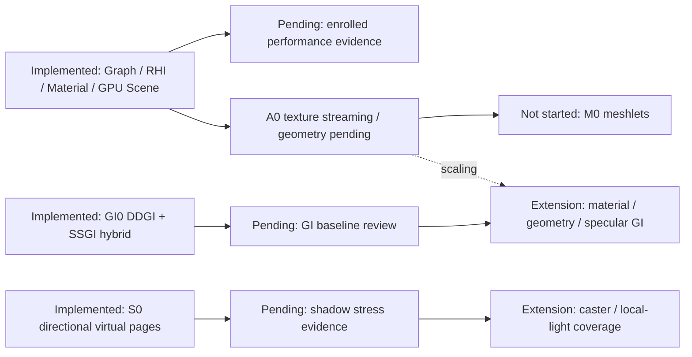

# Modern WebGPU rendering roadmap

Status reviewed against source commit `6433334c` on 2026-09-20. This page tracks remaining work;
[rendering architecture](./RENDERING_ARCHITECTURE.md) describes the implementation. The
[earlier survey and completed work packages](./archive/MODERN_WEBGPU_RENDERING_ROADMAP.md) are
historical. For cross-engine priorities and evidence gates, use [the main roadmap](./ROADMAP.md).

Planning update: 2026-09-22. REFL0 now has a bounded portable implementation; DECAL0, TRANS0, RG1,
MAT1 and DEFORM0 remain unstarted requirements. They do not change the delivered capability table or
declare new public APIs.

## Delivered slices and remaining boundaries

“Implemented” means a bounded source implementation with tests, not a newly verified release or
performance result. DDGI is still [Unreleased](./VERSIONS.md).

| ID   | Status                                      | Current contract                                                                                                                  | Remaining work                                                                                                                                        |
| ---- | ------------------------------------------- | --------------------------------------------------------------------------------------------------------------------------------- | ----------------------------------------------------------------------------------------------------------------------------------------------------- |
| F0   | Implemented                                 | Graph texture subresource views and renderer-owned history.                                                                       | History remains single-sample/mip/layer 2D color; broader validity needs a separate design. RG1 owns schedule and compatible transient-texture reuse. |
| F1   | Implemented                                 | Capability-gated f16/subgroups, query/timestamp ring and graph diagnostics.                                                       | New optional capabilities only with compiler/backend validation; no invented subgroup-size-control gate.                                              |
| D0   | Implemented                                 | Reversed-Z, camera-relative coordinates, submission-aware current/previous transforms.                                            | Preserve the common depth, UV and history ABI in all extensions.                                                                                      |
| MAT0 | Implemented                                 | Definition/Instance, semantic passes, shared GPU PBR records, manifest/warmup and diagnostics.                                    | MAT1 covers cloth/thin-surface/SSS slices; other families and unified schemas remain content-driven.                                                  |
| G0   | Implemented; evidence pending               | Resident object/material data, Hi-Z culling, bucket LOD, compaction, fixed indirect buckets.                                      | Enroll the existing 110k-object scale fixture on the physical rig.                                                                                    |
| L0   | Implemented; evidence pending               | Depth-driven 3D clusters, bounded allocator, PBR/shadows/LTC, direct storage for compatible deformed/layered/transparent content. | Unknown families and mixed incompatible transparent queues retain shared Forward boundaries; comparative performance still needs enrollment.          |
| T0   | Implemented                                 | Motion/reactive, TAA/TAAU, dynamic resolution; separate transparent/transmission/GPU-particle short histories.                    | Broader masks, exposure compensation, thin features and memory/quality tiers.                                                                         |
| E0   | Implemented                                 | GPU histogram/adaptation/history; parameterized filmic display.                                                                   | Arbitrary authored metering masks and expanded diagnostics.                                                                                           |
| Q0   | Implemented                                 | Portable GTAO/SSGI and WebGPU Clustered Hi-Z SSR.                                                                                 | Offscreen specular is separate GI work; transparent/offscreen geometry is not screen-trace input.                                                     |
| S0   | Implemented; evidence pending               | Stable atlas cache, caster cull, budget/cadence/pages; opt-in directional virtual clipmaps, GPU requests/remapping/LRU.           | Physical stress evidence, wider caster and local-light coverage.                                                                                      |
| V0   | Implemented slice                           | Froxels, height/local fog, physical atmosphere/clouds and cloud shadows.                                                          | Shared atlas shadows in froxels and transparent volumetric history.                                                                                   |
| A0   | Texture slice implemented; evidence pending | Optional addon: KTX2/Basis workers, bounded leases/mip residency and fenced uploads.                                              | Physical workload budgets; sparse/range loading and geometry pages remain.                                                                            |
| M0   | Not started                                 | Existing GPU Scene/bucket LOD can be reused.                                                                                      | Offline meshlets/cluster LOD, material bins and geometry streaming after A0.                                                                          |
| GI0  | Initial slice implemented; evidence pending | Rigid opaque PBR software BVH, DDGI probes, dynamic lights and signed SSGI hybrid.                                                | Performance baseline; broader material/geometry, specular transport and optional SDF representation.                                                  |

## Dependency and evidence order

The initial DDGI and directional virtual-shadow slices do not depend on unfinished A0/M0 work.
Streaming becomes a scaling dependency for larger scene representations. Functional extensions and
performance enrollment must have different status rows so already delivered capabilities are not
scheduled again.

## A0: resource streaming

The initial texture slice is implemented in `@hilo/addon-assets`; see
[its contract](./ASSET_STREAMING.md). Whole-file fetch with mip-suffix replacement is explicit.
Geometry streaming and physical-device performance enrollment remain open; the list below describes
the complete A0 work package.

Inputs: versioned compressed assets, device format capabilities, visibility/LOD demand and explicit
memory/upload/in-flight budgets. Outputs: cancelable requests and observable mip/geometry residency
using the shared resource owner and recovery recipes.

1. Introduce KTX2/Basis with capability-driven transcoding and worker decode; retain KTX1 behavior.
2. Define stable asset identity, cancellation, priority, bounded queues and mip residency.
3. Bound decode/upload work and memory independently; diagnostics must explain evictions and stalls.
4. Rebuild residency after device loss without replacing public resource identity.
5. Add geometry pages/meshopt only after texture residency and budgets are demonstrated.

Acceptance needs low-bandwidth cold start, camera teleport, cancellation, memory pressure and
recovery with actual assets. A format loader alone is not a completed streaming subsystem.

## M0: meshlet and cluster geometry

Inputs: static rigid geometry, offline cluster bounds/error data, A0 residency and shared material
handles. Outputs: GPU-visible cluster ranges and fixed bounded indirect buckets in the existing
Render Graph/RHI path.

Define the offline format/version first, then cluster frustum/cone/Hi-Z tests, LOD selection,
material binning and page demand. Prove culling and bandwidth benefits on real content. Do not claim
native mesh/task shaders, sparse residency, unbounded bindless or Nanite equivalence.
Skinned/morphed content requires a separate contract, not an unmeasured fallback hidden in the path.

## S0, V0 and GI0 extensions

S0 currently covers rigid GPU Scene directional virtual casters/receivers. Non-virtual casters,
Spot/Point and WebGL2 use the shared stable atlas. Missing/deferred virtual pages fall back to
stable CSM. Preserve exact identity, submission-aware page tables, failure rollback and recovery
before expanding coverage.

V0 has bounded screen-space caster visibility and cloud shadows. Shared shadow-atlas froxel sampling
is the next lighting slice: consume the shared atlas through declared graph resources and a defined
light/matrix/index ABI, then prove that offscreen moving casters correctly occlude the light volume.
Declare supported directional/local-light cases and budgets explicitly. Transparent-media history
remains a separate later slice. Neither is implied by the implemented surface shadow consumer. See
[volumetrics](./VOLUMETRIC_LIGHTING.md).

GI0's first world-space slice is documented in [DDGI](./DYNAMIC_GLOBAL_ILLUMINATION.md). Prioritize
texture-aware diffuse/emissive transport, alpha-mask occlusion and common rigid instancing, with
fixtures that distinguish textured transport from the existing explicit material-factor
approximation. Keep unsupported geometry fail-closed until its own slice is implemented; skinned
geometry requires separate acceleration-structure update and budget evidence. Local reflection-probe
fallback is REFL0; broader offscreen specular ray transport and SDF clipmaps remain independent GI0
extensions with transport, temporal, update and memory evidence. An SDF baker must define
thin/two-sided/masked surfaces, format/version, worker/CI artifacts, teleport and recovery. Require
real consumers before exposing a generic scene representation provider. The progressive compute
path-tracing example is not a real-time dynamic GI performance result.

## Planned rendering work packages

| ID      | Priority                   | Status            | Dependencies / reuse                                                                                                           |
| ------- | -------------------------- | ----------------- | ------------------------------------------------------------------------------------------------------------------------------ |
| REFL0   | P1                         | Implemented slice | Existing PBR environment sampling, SSR response/baseline composition, graph subresource views and resource recipes.            |
| DECAL0  | P1                         | Not started       | Shared material surface/attribute ABI, scene depth, graph passes and temporal invalidation.                                    |
| TRANS0  | P1                         | Not started       | Shared transparent ordering, HDR composition, particles and existing transparent temporal controllers.                         |
| RG1     | P1, measurement-driven     | Not started       | F0 graph validation/lifetime model and existing CPU/GPU diagnostics; PERF-SRP evidence must stay independently reviewable.     |
| MAT1    | P2, content-driven         | Not started       | Material Definition/Instance, semantic roles and shared BRDF/texture slots; additional passes only for a selected SSS profile. |
| DEFORM0 | P2, character-scale-driven | Not started       | Compute/storage/vertex graph accesses, shared skin/morph inputs and D0 current/previous transform contracts.                   |

All slices use the shared renderer -> Render Graph -> portable RHI path. Portable raster keeps one
GLSL source and the existing Naga lowering; compute acceleration is capability-gated WebGPU. An
unsupported requested feature fails at creation/validation rather than silently changing quality.
Unenabled features must not allocate intermediate targets, histories or frame work.

### REFL0: local reflection probes

**Implemented boundary.** Static cubemaps, box correction, at most two probes per material, SSR
baseline integration and budgeted atomic dynamic capture are implemented on both backends. See the
[current contract](./LOCAL_REFLECTIONS.md) for visibility, direct-Clustered, temporal and memory
boundaries. Dedicated physical-device performance enrollment remains pending. The acceptance
criteria below describe the feature; broader capture visibility and automatic scene updates are
future extensions.

**Scope.** Add bounded local reflection volumes with authored/static cubemaps, parallax correction,
roughness-prefiltered mip levels and deterministic probe selection/blending. Reuse the environment
specular baseline consumed by SSR so a hit replaces the matching fallback contribution instead of
adding its energy twice. Start with static probes, then add graph-recorded dynamic captures with
face/filter/update budgets. This is distinct from the diffuse DDGI probe field.

**Lifecycle.** Publish a dynamic capture only after all required faces and filtering work complete
successfully; a failed or partial capture must not replace the last committed result. Define atlas
or array capacity, probe ownership, eviction, recovery and capture visibility/recursion policy. Do
not assume unlimited bindless textures or broaden the current history recipe implicitly.

**Acceptance.** Use connected rooms, a reflective object moving between volumes, offscreen
reflectors and roughness sweeps. Verify blend continuity, correct parallax, SSR hit/miss
transitions, capture rollback and recovery, plus bounded capture time and resident memory.

### DECAL0: PBR decals

**Scope.** Project atlas-backed decals onto opaque receivers with explicit layer, projection-volume,
angle and distance filters. The first slice changes base color, normal and roughness, with stable
overlap ordering. Transparent receivers and attached skinned decals need separate contracts.

**Integration.** Apply decal surface changes consistently to PBR lighting and the attributes read by
GTAO/SSR. Define the required producer/pass order without converting the renderer into a second
deferred stack. Moving/changing projectors and receivers must trigger the appropriate temporal
rejection; they cannot leave persistent trails merely because object transforms stayed unchanged.

**Acceptance.** Cover intersecting projectors, thin geometry, grazing views, receiver masks and
camera/object motion. Prove attribute/color agreement and bounded draw/atlas/overdraw cost on the
declared backend profile, with actual shader translation and pixel evidence.

### TRANS0: transparency quality

**Scope.** Classify sorted alpha, additive, transmitting and suitable approximate-OIT content, and
expose ordering/overdraw costs. An opt-in weighted-blended OIT slice can target smoke and compatible
particle effects. Its approximation limits must be explicit; it does not provide exact layered
glass, refraction or colored transmission. Keep glass on a separately specified sorted
depth/thickness/refraction path until a better bounded contract is validated.

**Integration.** Preserve global ordering where required and use the existing HDR, reactive and
short-history composition boundaries. Material/particle definitions declare eligibility; do not
silently switch an incompatible material to OIT. Validate blend/attachment capabilities before
runtime creation and bound accumulation targets, passes and bandwidth.

**Acceptance.** Compare intersecting layers, dense smoke, particles mixed with transparent meshes,
high-opacity surfaces and camera motion. Include a sorted/reference result, documented approximation
error, no double composition and correct resize/recovery/history rejection.

### RG1: graph compilation and transient memory

**Scope.** Measure graph compile/record time and peak transient allocations first. Reuse validated
execution schedules only while their topology and relevant descriptors remain compatible. Reuse
compatible physical textures for logical transient resources with disjoint lifetimes; this is not a
promise of native heap aliasing or sparse residency.

**Invalidation.** Pass/access changes, extents, formats, sample counts and device generation must
invalidate the relevant cached plan. Leased public contexts, frame parameters and submission
transactions remain frame-local. Imported, persistent/history and in-flight resources cannot be
recycled as though they were disposable transients. Validation still completes before the RHI frame.

**Acceptance.** Compare identical multi-effect workloads with and without reuse, recording CPU
compile/record cost and peak allocated bytes. Exercise topology churn, resize, multi-camera,
discarded frames and device recovery. Reject overlapping lifetimes and preserve deterministic
resource ownership; claim savings only from the reviewed comparison.

### MAT1: cloth, thin surfaces and subsurface scattering

**Scope.** Deliver sheen/cloth and thin-surface diffuse transmission as small shared material
slices, then evaluate profile-based skin/wax subsurface scattering separately. Define parameter
units, thickness, energy conservation and supported glTF mappings. Retain one Definition/Instance
and semantic-pass system; a material does not own graph pass ordering.

**Integration.** Share surface/BRDF code across portable and compatible clustered consumers. Define
how each family contributes to depth, shadow, motion, material attributes, reflection response and
GI, including explicit unsupported combinations. SSS intermediates and profile resources are opt-in.

**Acceptance.** Use cloth at grazing angles, backlit leaves/thin sheets and controlled skin/wax
thickness fixtures. Check direct/IBL response, mixed-material edges, animation/history stability,
shader parity and memory/quality budgets. This work item narrows Material-extension; it does not
reopen already delivered MAT0 work.

### DEFORM0: reusable GPU deformation

**Scope.** Add an opt-in WebGPU compute skin/morph path that writes reusable position/normal/tangent
streams for shared depth, shadow, motion and color draws. Existing palette/upload caches are
prerequisites, not evidence that deformed vertex output is already shared between these passes.
Begin with a declared skeletal/morph subset and representative animated-character workloads.

**Lifecycle.** Preserve current/previous pose validity, visibility gaps, bounds, multi-camera reuse
and shadow participation. Commit output generations only after submission; failures and device loss
rebuild the required state. Define cache identity, eviction and memory budgets. A reused vertex
buffer alone does not make deformed geometry eligible for DDGI or virtual shadow casters.

**Acceptance.** Compare output against the existing vertex deformation path, including non-uniform
transforms, morph weights, motion vectors, multiple shadows/cameras and recovery. Measure compute,
extra vertex bandwidth and resident memory as well as saved repeated deformation work. Enable the
profile only where the complete workload demonstrates a benefit.

## Recommended rendering sequence

For scene lighting and appearance: **GI0 asset coverage / V0 shared atlas shadows -> DECAL0 ->
TRANS0**. REFL0 has a bounded portable implementation with separately tracked visibility, temporal
and performance extensions. This is priority guidance, not a dependency requiring unrelated features
to ship together. RG1 proceeds from measured CPU or transient-memory pressure; MAT1 and DEFORM0 are
driven by actual material and character content. A0 -> M0 continues as the independent
streaming/geometry lane. Existing physical-GPU performance gates remain mandatory evidence for their
respective workloads; these planned additions do not mark them complete.

## Evidence gates

| Gate             | Existing fixture or protocol                                          | What remains                                                                                           |
| ---------------- | --------------------------------------------------------------------- | ------------------------------------------------------------------------------------------------------ |
| G0/L0 scale      | [scale browser test](../test/ui/clustered-forward-plus-scale.spec.ts) | Rig-enrolled CPU record, GPU pass, upload and resident-memory measurements with repeatability/budgets. |
| S0 pressure      | [shadow residency test](../test/ui/shadow-residency-sanctum.spec.ts)  | Fast camera/caster pressure and page overflow on enrolled physical hardware.                           |
| GI0              | [DDGI candidate protocol](../benchmarks/ddgi/README.md)               | Isolated committed-source capture and independent baseline/budget review.                              |
| General renderer | [immutable RHI protocol](../benchmarks/rhi/README.md)                 | Preserve existing baselines; new workloads need their own accepted generation.                         |

Software-GPU/browser correctness, local smoke and physical-GPU cross-commit performance are
distinct. Never relabel one as another or restore a retired renderer for same-commit A/B
comparisons. Functional changes still require contract tests, real shader/backend execution,
pixel/lifecycle coverage and the [engineering checks](./ENGINEERING.md).

## Related current contracts

- [Material system](./MATERIAL_SYSTEM.md), [SRP](./SCRIPTABLE_RENDER_PIPELINE.md),
  [compute/storage](./COMPUTE_AND_STORAGE.md).
- [Temporal rendering](./TEMPORAL_RENDERING.md),
  [PBR/post-processing](./PBR_AND_POST_PROCESSING.md).
- [GTAO](./GROUND_TRUTH_AMBIENT_OCCLUSION.md), [SSR](./SCREEN_SPACE_REFLECTIONS.md),
  [SSGI](./SCREEN_SPACE_GLOBAL_ILLUMINATION.md).
- [Weather](./PHYSICAL_ATMOSPHERE_AND_WEATHER.md), [DDGI](./DYNAMIC_GLOBAL_ILLUMINATION.md).
