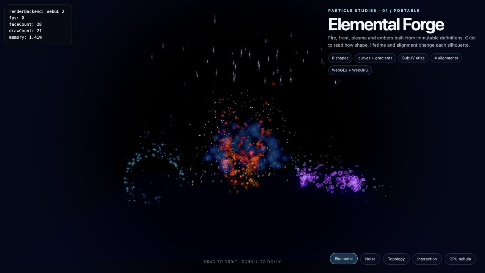
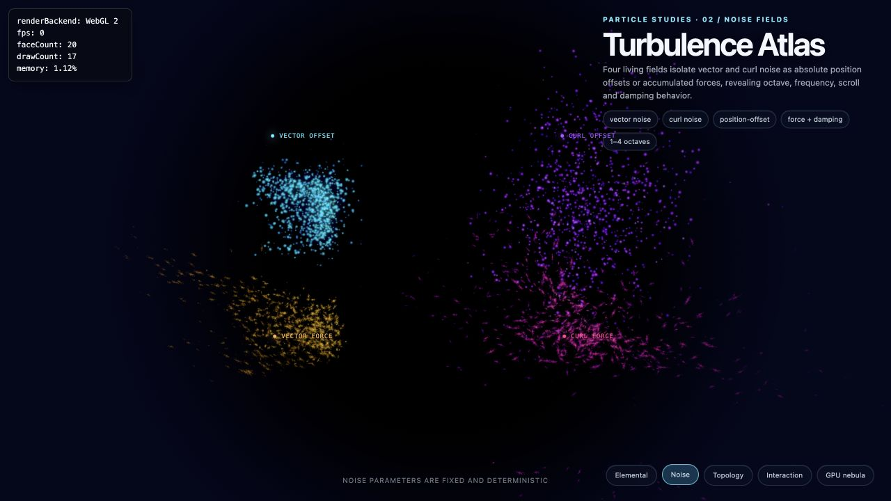
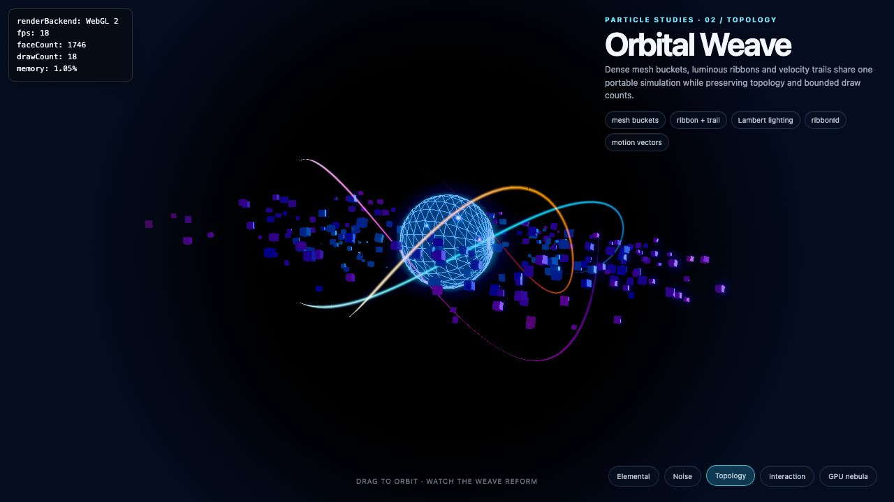
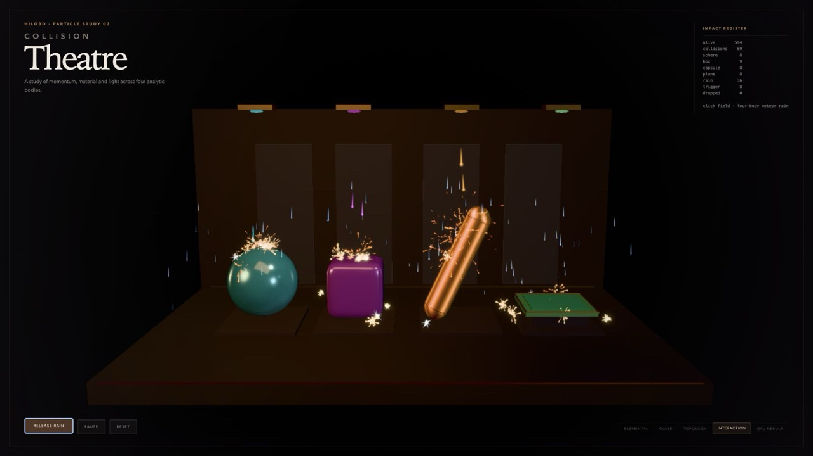
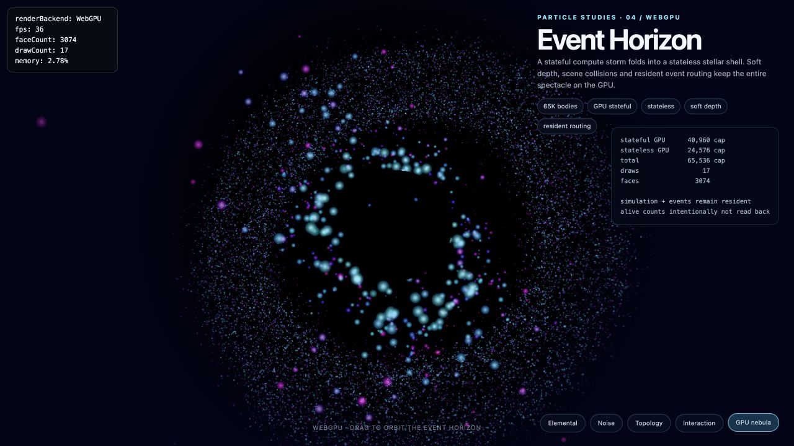

# Particle system

Hilo3D exposes one versioned particle asset model for portable CPU simulation, stateful WebGPU
simulation, and lightweight stateless reconstruction. P0-P5 are implemented: immutable definitions
compile to a liveness-based SoA plan, CPU emitters render through one instanced `Mesh`, WebGPU
stateful emitters record persistent simulation and storage raster through the Render Graph, and
stateless emitters rebuild renderer attributes from absolute time without cross-frame particle
state. P4 adds analytic/depth interaction, soft particles, bounded events, typed channels, and
GPU-resident sub-emitter routing. P5 adds mesh buckets, ribbon/trail topology, controlled Lambert
scene lighting, per-view ordering, temporal composition rules, and opt-in opaque/masked mesh motion
vectors.

## Public workflow

```ts
import { ParticleCurve, ParticleGradient, ParticleSystem, ParticleSystemDefinition } from 'hilo3d';

const definition = ParticleSystemDefinition.create({
    emitters: [
        {
            name: 'fire',
            capacity: 8192,
            execution: 'auto',
            emission: {
                rateOverTime: 900,
                bursts: [{ time: 0, count: 128 }]
            },
            shape: {
                type: 'cone',
                radius: 0.3,
                angle: 18,
                length: 0.8,
                distribution: 'volume'
            },
            initialize: {
                lifetime: { min: 0.8, max: 1.6 },
                speed: { min: 0.7, max: 1.8 },
                size: { min: 0.04, max: 0.12 },
                color: [1, 0.4, 0.08, 1]
            },
            modules: [
                { type: 'gravity', force: [0, 0.35, 0] },
                { type: 'drag', coefficient: 0.12 },
                {
                    type: 'size-over-lifetime',
                    curve: new ParticleCurve([
                        { time: 0, value: 0.2 },
                        { time: 0.25, value: 1 },
                        { time: 1, value: 0 }
                    ])
                },
                {
                    type: 'color-over-lifetime',
                    gradient: new ParticleGradient([
                        { time: 0, color: [1, 0.8, 0.2, 1] },
                        { time: 1, color: [0.25, 0.02, 0.01, 0] }
                    ])
                }
            ],
            renderers: [{ type: 'sprite', blend: 'additive', depthWrite: false }]
        }
    ]
});

const particles = new ParticleSystem({ definition, seed: 42 }).addTo(stage);
particles
    .emit(32)
    .pause()
    .simulate(1 / 60)
    .play();
```

## Maintained visual examples

The example gallery groups particle coverage by the behavior an author is trying to learn rather
than by implementation phase. Together the five pages exercise the complete P0-P5 rendering and
interaction surface while keeping each source file readable:

| Example                                                                      | Primary coverage                                                                                                                                                                                                                                                                                                               |
| ---------------------------------------------------------------------------- | ------------------------------------------------------------------------------------------------------------------------------------------------------------------------------------------------------------------------------------------------------------------------------------------------------------------------------ |
| [`particle_elemental_forge.ts`](../examples/particle_elemental_forge.ts)     | Point/line/box/disc/sphere/hemisphere/cone/torus distributions, time and burst emission, lifetime curves, gradients, by-speed values, SubUV animation, sprite alignments, sorting, blending, camera modifiers, custom channels, and kill conditions.                                                                           |
| [`particle_noise_fields.ts`](../examples/particle_noise_fields.ts)           | Vector and curl noise, position-offset and force modes, one to four octaves, frequency, lacunarity, persistence, scroll velocity, damping, deterministic seeds, and stateless versus CPU stateful execution.                                                                                                                   |
| [`particle_orbital_weave.ts`](../examples/particle_orbital_weave.ts)         | Mesh buckets, opaque motion-vector eligibility, coherent world-space ribbon/trail sampling, view/world-up facing, repeat UVs, topology-safe ordering, conform/orbit motion, and portable instanced draws.                                                                                                                      |
| [`particle_collision_theatre.ts`](../examples/particle_collision_theatre.ts) | Four color-coded, staggered low-frequency plane/sphere/box/capsule streams, slender projectile trails, short rebounds, dense fire-spark impacts, triggers, bounded event aggregates, batched sub-emitters, typed application channels, and click-triggered full-field meteor rain that collides with every analytic primitive. |
| [`particle_gpu_nebula.ts`](../examples/particle_gpu_nebula.ts)               | Explicit WebGPU stateful simulation, stateless reconstruction, large capacities, distance sorting, soft particles, scene-depth and analytic collision, GPU-resident sub-emitter routing, fixed bounds, and readback-free runtime diagnostics.                                                                                  |

The pages use procedural textures so their presentation does not depend on a network service or an
unreviewed binary asset. They are part of the recursively discovered WebGL 2/WebGPU example release
matrix; the Event Horizon page is explicitly WebGPU-only because it requires compute, storage
raster, sampled depth, and indirect draws.

### Visual gallery

| Elemental Forge                                                      | Turbulence Atlas                                                      |
| -------------------------------------------------------------------- | --------------------------------------------------------------------- |
|     |         |
| **Orbital Weave**                                                    | **Collision Theatre**                                                 |
|         |  |
| **Event Horizon (WebGPU)**                                           |                                                                       |
|  |                                                                       |

Definitions and their emitter/module/renderer records are immutable snapshots. Changing input
objects after `ParticleSystemDefinition.create()` cannot mutate an existing compiled runtime. Create
a new definition when topology changes. `ParticleCurve`, `ParticleGradient`, and typed
`ParticleParameter` tokens are immutable as well. Bind a shared `ParticleParameterSet` through the
`ParticleSystem` constructor; changing emission-rate or spawn-initialization values affects later
spawns on CPU, stateless, and stateful WebGPU command paths without recompiling the plan. Because
runtime-bound motion/size can invalidate conservative culling, parameterized initialization requires
manual bounds.

## Execution policy

| `execution` | Implemented behavior                                                                                                                                                                             |
| ----------- | ------------------------------------------------------------------------------------------------------------------------------------------------------------------------------------------------ |
| `auto`      | Selects stateless when every fixed module is reconstructible; otherwise a WebGPU environment may select GPU stateful above `preferGPUAboveCapacity`, with CPU stateful as the portable fallback. |
| `cpu`       | Dense CPU SoA simulation and a shared portable GLSL ES 3.00 instanced sprite path on WebGL 2 and WebGPU.                                                                                         |
| `gpu`       | Stateful WebGPU compute/storage/indirect path. Explicit WebGL 2 compilation fails before a frame begins.                                                                                         |
| `stateless` | Requires every module to be stateless-compatible and reports the exact blocking module/reason before a frame; the portable generator works on WebGL 2 and WebGPU.                                |

Pass `{ compilationEnvironment: { backend: 'webgpu' } }` to `ParticleSystem` when an emitter
explicitly requests `gpu`. GPU definitions cannot use dynamic bounds. Vector fields require manual
bounds because the compiler cannot infer a conservative extent from arbitrary texture contents.

`aliveCount` intentionally reports only CPU-resident particles. GPU emitters do not read alive
counts, sort keys, state, or indirect arguments back to JavaScript in the production loop.

## Implemented P0-P5 modules

- Lifecycle and spawn: duration, loop, delay, prewarm, fixed step, time scale, rate over time, rate
  over distance, burst, and manual emission.
- Shapes: point, line/edge, box, circle/disc, sphere/hemisphere, cone, and torus/donut with the
  applicable surface/volume, arc, and thickness controls.
- Initialization: position, direction, speed, lifetime, mass, color, size, and rotation using
  constants or deterministic ranges. `meshIndex` and `ribbonId` select fixed renderer topology at
  spawn without adding script callbacks.
- Motion: velocity, force, gravity, wind, drag, limit velocity, inherited emitter velocity, lifetime
  by emitter speed, radial/orbital/vortex force, point/line attraction, rotation around a point,
  sphere conformance, vector field, and deterministic vector/curl noise.
- Visual values: color/alpha/size/rotation over lifetime, color/size/rotation by speed,
  texture-sheet lifetime/speed/FPS modes, camera offset/fade, screen-space size, and typed custom
  channels.
- Kill: age/capacity plus speed, distance, plane, box, and sphere conditions.
- Interaction: CPU/WebGPU analytic plane, sphere, axis-aligned box, and capsule collision; CPU
  trigger enter/inside/exit state; and WebGPU scene-depth collision.

The compiler rejects backend combinations without an implementation. Vector fields and scene-depth
interaction require explicit GPU execution, triggers require CPU execution, and GPU emitters support
`drop-new` overflow only. Camera offset/fade/screen-size modules are renderer operations and require
sprite-only emitters.

The sprite renderer supports view, world-up, velocity, and stretched alignment; alpha,
premultiplied-alpha, and additive composition; depth test/write; pivot and texture sheets; render
order; and `none`, distance, youngest, or oldest CPU sorting. GPU distance sorting uses Bitonic for
power-of-two capacities up to 4096 and a distance-bucket profile for larger or non-power-of-two
capacities. Soft sprites sample the Forward scene depth through the constrained storage-raster
shader, perform their depth comparison in the fragment stage, and omit a depth attachment from that
pass. `softParticle.distance` and optional `contrast` control the fade; `depthWrite: true` is
rejected before graph compilation.

## Mesh, ribbon/trail, and advanced composition

`type: 'mesh'` accepts 1–16 immutable triangle-list `Geometry` assets. CPU/stateless plans create
one dense instance stream and one child `Mesh` per asset bucket. Stateful WebGPU plans scatter dense
renderer indices into fixed per-mesh buckets with atomics, finalize one indirect command per asset,
and pull an expanded triangle stream from renderer-owned storage. The draw count is therefore
bounded by authored mesh assets, never by alive particles. Omit `initialize.meshIndex` to distribute
by stable particle ID, or provide a non-negative integer/range that fits every mesh renderer.

`type: 'ribbon'` and `type: 'trail'` group particles by `initialize.ribbonId`. The portable path
heap-sorts `(ribbonId, stableId)` indices and compacts adjacent members into a dense instanced
segment stream. WebGPU initializes a per-view topology index, Bitonic-sorts it without moving
particle state, atomically compacts valid adjacent segments, and emits one indirect draw. Width,
view/world-up facing, stretch/repeat UVs, texture, controlled Lambert lighting, and sampled-depth
softness are supported. Particle distance sorting is intentionally rejected on ribbon/trail
definitions because it would break link topology; sort renderer groups with `renderOrder` instead.

Mesh and ribbon lighting deliberately consumes ambient light plus at most four directional scene
lights, without particle shadows, point/spot lights, or a second backend-specific material model.
`ParticleCompilationEnvironment.advancedQuality` can explicitly disable ribbons, lit particles, or
motion vectors; a definition requiring a disabled tier fails before a frame instead of changing its
look on WebGL 2.

The supported composition matrix is:

| Output                          | Queue/composition                                               | Soft depth                                                 | TAA/motion contract                                        | Bloom    |
| ------------------------------- | --------------------------------------------------------------- | ---------------------------------------------------------- | ---------------------------------------------------------- | -------- |
| Sprite/ribbon/trail transparent | after opaque temporal resolve, in linear scene color            | WebGPU sampled current depth; no depth attachment feedback | no opaque history; reactive by queue placement             | included |
| CPU mesh opaque/masked          | ordinary shared opaque queue                                    | not applicable                                             | optional `motionVectors`; transparent coverage is rejected | included |
| GPU mesh opaque/masked          | built-in `after-opaque` particle stage before temporal features | not applicable                                             | no motion-vector API; requesting it fails                  | included |
| Mesh transparent                | shared transparent stage                                        | not exposed                                                | no opaque history                                          | included |

`composition` currently accepts only `'scene'`: particles are composed in linear scene color before
Bloom/tone mapping. Per-particle global interleaving with arbitrary transparent meshes is not
promised. Sprite/mesh distance sort is per Camera; the shared renderer refreshes portable instance
streams before each camera invocation, while WebGPU builds view-local ordering in the graph.

## Interaction and bounded events

CPU simulation writes birth, death, collision, and trigger records to compact typed-array rings. No
per-particle JavaScript callback runs in the simulation loop. `await system.readEvents(limit)`
materializes a bounded aggregate after simulation, including per-name counts, remaining records, and
dropped-event diagnostics. Emitter `eventCapacity`/`eventOverflow` and system
`eventReadbackCapacity` make both queue limits explicit.

`sub-emitter` modules route matching CPU events to an existing emitter as batched spawn commands.
For GPU-to-GPU routes, simulation/initialize kernels capture compact records in renderer-owned
buffers and a later Render Graph compute pass writes the target emitter's active state directly. The
spawned target particles participate from the following simulation frame; event counts and particle
state never cross a CPU readback boundary. GPU-to-CPU routes fail compilation.

`ParticleEventChannel<Payload>` is the application-facing typed service path. Its fixed schema
accepts float/uint/boolean/vector/color fields, validates payloads, applies `drop-new` or
`drop-oldest`, exposes capacity diagnostics, and can drain position/velocity bursts into a resident
`ParticleSystem` without constructing short-lived systems.

## Stateless reconstruction and scalability

Every compiled emitter retains per-module stateless metadata with one of three outcomes: `exact`,
`approximated`, or `stateful-only`. Lifetime/color/size/rotation/SubUV LUTs, constant
velocity/force/gravity/wind/drag, and position-offset noise use absolute age directly. Bounded
fixed-sample reconstruction covers limit velocity, orbital/vortex/attraction/conform families.
Feedback noise, vector fields, conditional kill modules, inherited emitter velocity, and
rate-over-distance remain stateful-only and identify their reason in the compilation diagnostic.

The CPU stateless runtime retains only emitter time, seed, parameters, and bounded manual-spawn
metadata. It rebuilds the dense renderer input for the active lifetime interval and reports zero
`persistentStateByteLength`; it does not retain position/velocity arrays as simulation history. On
WebGPU, point-shaped, continuous-rate, sprite-only stateless definitions using the supported
analytic motion subset run a Render Graph compute generator that writes renderer data and indirect
arguments without allocating CPU particle arrays, CPU writer meshes, or a persistent GPU
particle-state buffer. The generator is rerun from absolute time after device recovery. Definitions
outside that bounded subset remain on the portable CPU path; manual emission lazily materializes CPU
reconstruction at the current emitter age until `stop()`/`restart()` clears its retained manual
metadata and restores GPU-only execution.

`ParticleBudgetManager.apply()` resolves all supplied systems together and immediately applies the
result to their live runtimes. Particle limits and scheduled spawn-rate scaling are enforced on CPU,
stateless GPU, and stateful GPU paths; stateful WebGPU uses bounded atomic output slots. Sorting,
soft-particle fading, analytic collision, and ribbon construction/drawing follow the selected
quality flags. Stable `budgetId` and `budgetPriority` values provide deterministic cross-system
ordering, and each decision retains explicit degradation reasons.

`ParticleSystemPool` reuses stopped instances only when their complete construction parameters
match. A failed over-capacity release leaves the instance active; successful reuse resets simulation
and authored node state and restores the authored autoplay state. Pooled construction does not
accept `parent`; attach each leased system explicitly after acquisition.

## Runtime and renderer contract

`ParticleSystem` is a scene `Node`, not a collection of per-particle objects. Its public controls
are `play()`, `pause()`, `stop()`, `restart()`, `simulate()`, `emit()`, and `sendEvent()`.
Fixed-step CPU simulation is reproducible for the same definition, seed, emission commands, and time
steps.

CPU emitters update dense interleaved sprite, mesh-bucket, or ribbon-segment streams and issue one
draw per renderer/bucket. GPU emitters retain double-buffered state, alive/dead indices, spawn
commands, renderer data, counters, and indirect arguments as renderer-owned resources. Simulation
records at most once per application frame; sorting and raster are camera-specific. Submission
success commits the staged clock and buffer generation, while a discarded frame rolls them back.

On WebGPU device restoration, GPU emitter resources are recreated from backend-neutral definitions
and the deterministic seed. The P2 recovery policy restarts the emitter from its initial clock;
public `ParticleSystem` and definition identities remain unchanged. CPU state remains resident and
is re-uploaded through normal resource recovery.

The default Forward pipeline owns the built-in GPU particle feature. It is inert on WebGL 2 and when
a scene has no GPU particle emitters. GPU simulation, event capture/routing, compaction, sort,
renderer-data build, and indirect raster all declare their storage, sampled depth, indirect, and
attachment access through the Render Graph. Scene-depth collision reads depth from compute. Soft
sprites and soft ribbons use sampled depth without attaching it to the same pass, so the graph
contains no sampled-depth/attachment feedback edge.

## Current boundary

P6 remains outside this implementation. In particular, there is no serialization upgrade pipeline,
capture cache, baking API, or graph editor yet. GPU event observation is intentionally limited to
resident routing; application-visible GPU diagnostics remain aggregate and asynchronous rather than
a production-loop particle readback. The public fixed module union rejects arbitrary callbacks and
arbitrary shader source by design.

The existing [`compute_particles.ts`](../examples/compute_particles.ts) showcase intentionally keeps
its specialized implementation for now. It will be migrated only after the remaining particle
feature phases are complete, so P0-P5 do not reduce or reshape that fixture prematurely.
