# Physical atmosphere and weather

Hilo3D's WebGPU high-end profile can opt into one submission-aware weather chain through
`ClusteredForwardPlusPipelineFactory.atmosphere`. The implementation remains inside the shared
Render Graph and portable RHI. It does not expose native WebGPU resources and it creates no passes
or resources when disabled.

## Frame order

```mermaid
flowchart LR
    D["Opaque depth"] --> L["Atmosphere LUTs + weather map"]
    L --> S["Screen-space cloud visibility"]
    S --> P["Clustered PBR directional light"]
    P --> A["Sky + aerial perspective"]
    A --> C["Quality-tier cloud march + temporal resolve"]
    C --> F["Cloud-aware froxel injection and shafts"]
    F --> T["TAA / transparent / bloom"]
    T --> E["Histogram exposure + filmic display"]
```

The prerequisite phase records after opaque depth is available and before surface lighting. This
lets the same cloud-visibility texture modulate only directional-light radiance in registered GPU
PBR buckets and directional scattering in the froxel volume. Local point and spot lights, material
emission, and ambient light are intentionally not treated as sunlight.

## Physical atmosphere

`AtmosphereWeatherController` packs the camera, previous view-projection, planet, sun, Rayleigh,
Mie, ozone, ground-albedo, and cloud state into one renderer-local storage record. It produces:

- a cached 256×64 transmittance LUT;
- a cached 32×32 multiple-scattering approximation;
- a per-frame 192×108 sky-view LUT with manual bilinear reconstruction;
- depth-bounded aerial perspective and a physical sun disc in linear HDR.

Static atmosphere options own the cached LUT generation. Mutable `AtmosphereWeatherState` values
drive solar direction, time, cloud amount, wind, and storm shaping without recreating pipelines.
Discontinuous authored changes call `invalidateHistory()`.

## Volumetric clouds and cloud shadows

Clouds run at the selected quality tier's fractional resolution; `low`/`medium`/`high`/`ultra`
currently use 0.25/0.375/0.625/0.75 of the internal scene resolution. A procedural weather map
supplies coverage, type, storm, and precipitation fields. The density march combines
value/Perlin-like fBm with Worley cells, height-dependent erosion, wind advection, and a
frame-varying blue-noise rank. Quadratically distributed samples concentrate work near the first
visible cloud layer. Secondary sun samples, atmosphere transmittance, multiple scattering, sky
ambient, Henyey–Greenstein phase, silver lining, storm self-darkening, and bounded lightning pulses
produce the HDR source term.

Cloud radiance/transmittance and representative depth use double-buffered history. Reprojection uses
the previous view-projection, rejects invalid depth/camera/state history, clamps the previous sample
to the current neighborhood, and commits history only after a successful frame submission. Scene
depth and the planet reject cloud contribution behind opaque surfaces or through the ground.

The lower-cost cloud-shadow march reconstructs each visible world position, integrates toward the
sun through the same weather field, and writes filterable `rgba16float` visibility. Registered PBR
surfaces and froxel directional light consume that shared result, so cloud breaks generate coherent
surface motion and volumetric shafts.

## Histogram exposure and filmic display

`AutoExposure` and the integrated Clustered option construct a 256-bin log-luminance histogram on
the GPU, discard configurable dark and bright percentiles, solve a middle-gray exposure, and adapt
asymmetrically in EV space. The 1×1 `rgba16float` exposure history is submission-aware and requires
no per-frame CPU readback; diagnostics are explicitly requested. Bloom and authored emissive energy
are metered together before the display transform.

`ColorUber` exposes a configurable `filmic` curve in addition to neutral PBR, ACES, Reinhard, and no
tone mapping. Clustered Forward+ exposes `aces` and a compact filmic curve; Stormfront Observatory
uses filmic display with automatic exposure.

## Boundaries

- The integrated physical atmosphere/cloud path is WebGPU-only because it requires Direct WGSL
  compute and storage textures. Portable Forward can still use `AutoExposure` as a feature when the
  selected device satisfies its declared requirements.
- Cloud visibility currently covers registered GPU PBR buckets and froxel directional scattering.
  Ordinary Forward compatibility objects receive the later aerial/cloud composition but do not
  sample the cloud visibility texture during their material light loop.
- Dynamic resolution updates atmosphere composition, cloud current/history, and cloud-shadow extents
  from the runtime scene scale every frame. A scale change recreates size-dependent cloud history
  through the normal submission-aware history recipe rather than retaining the pipeline's initial
  scale.
- Atmosphere LUTs are two-dimensional approximations rather than Bruneton-style spectral 4D LUTs.
  The public coefficients and ordering are stable; additional spectral channels remain future work.
- Transparent media do not write cloud history or shadow the cloud march.

## Evidence

`examples/stormfront_observatory.html` is the authored integration fixture. It exposes solar time,
cloud amount, wind speed, storm intensity, quality tiers, all intermediate debug views, camera
composition controls, and live exposure diagnostics. Renderer unit tests cover option validation and
fail-closed device requirements plus runtime scene-scale propagation; the example is also part of
the WebGPU release matrix.
