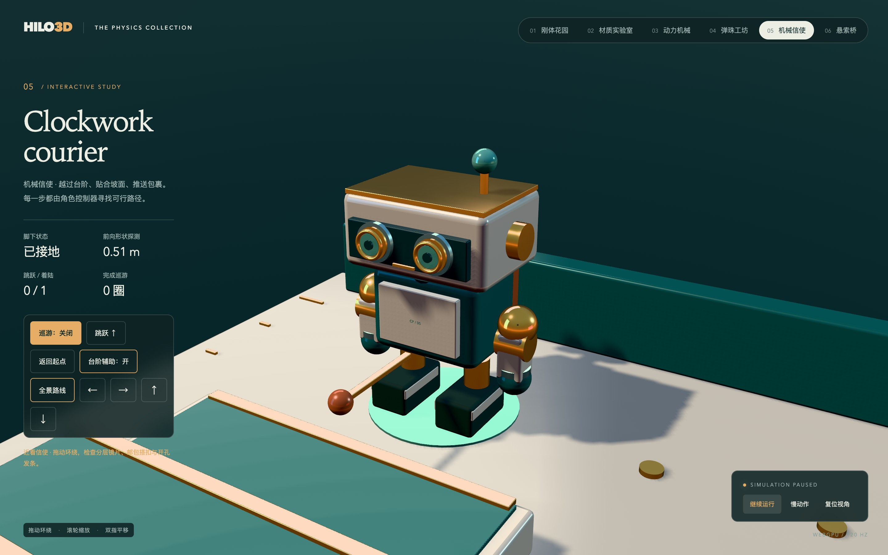
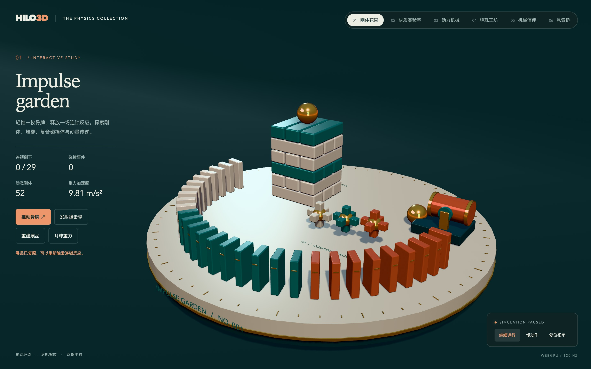
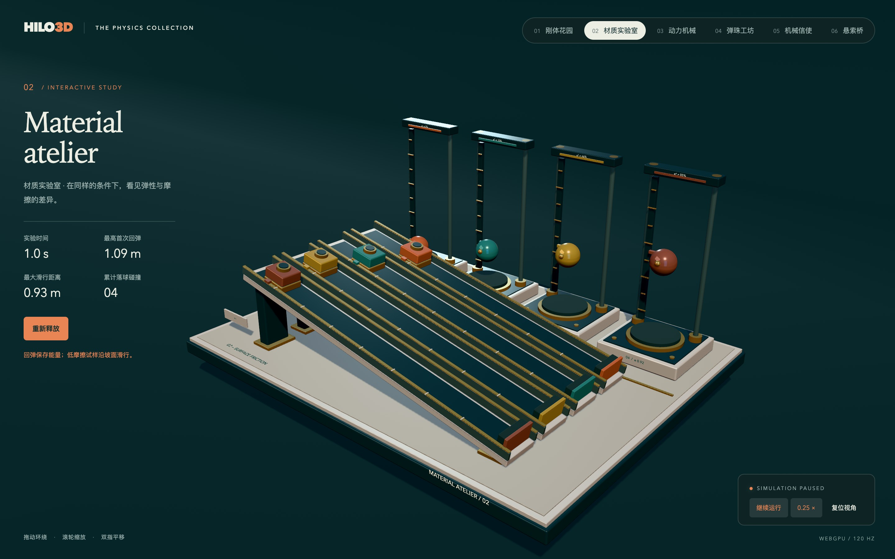
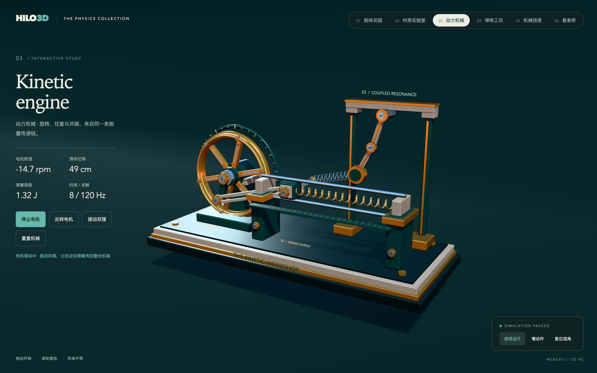
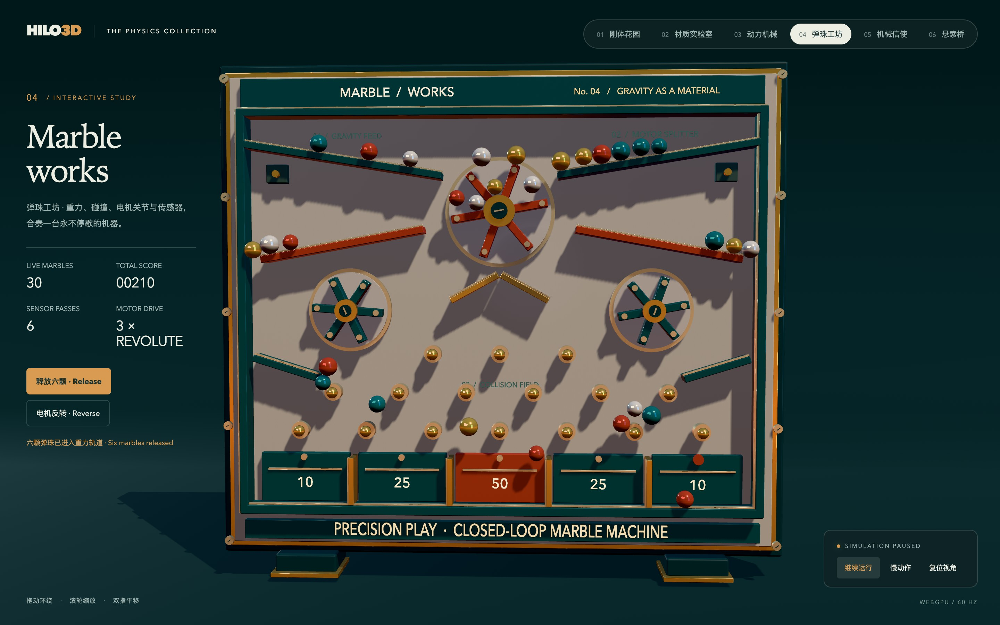
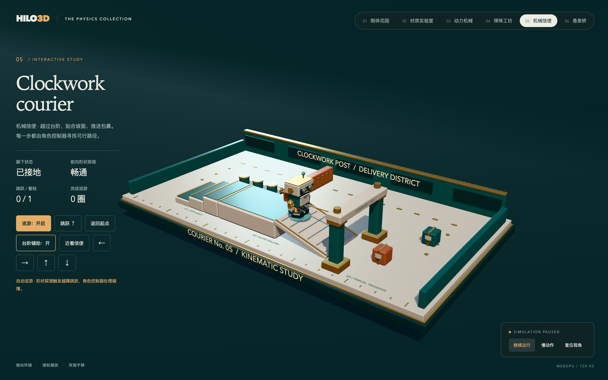
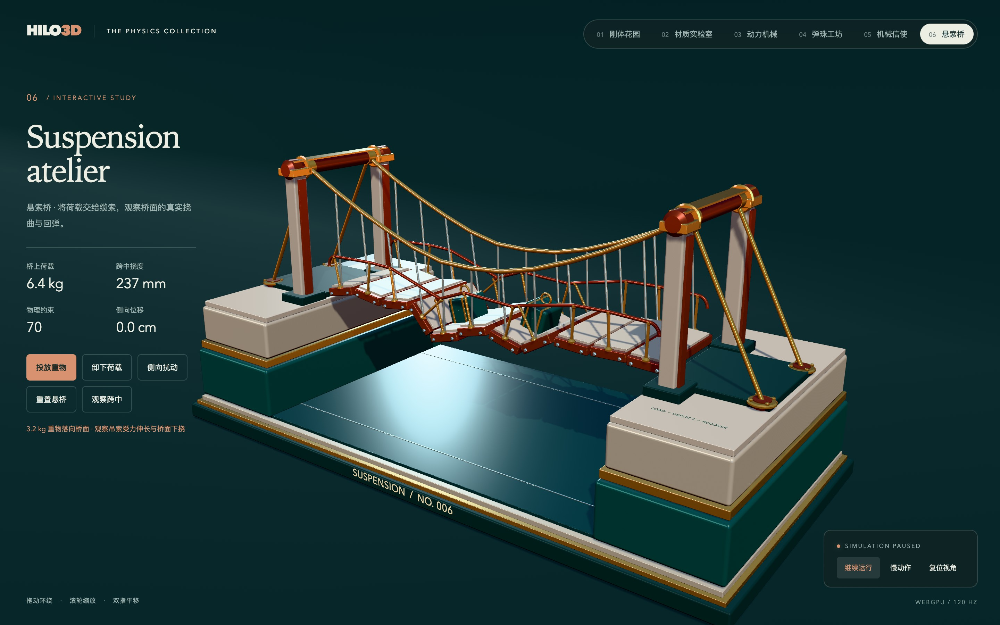
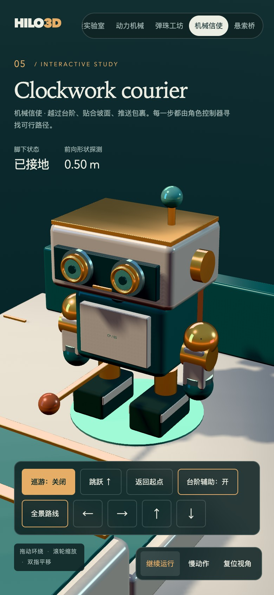
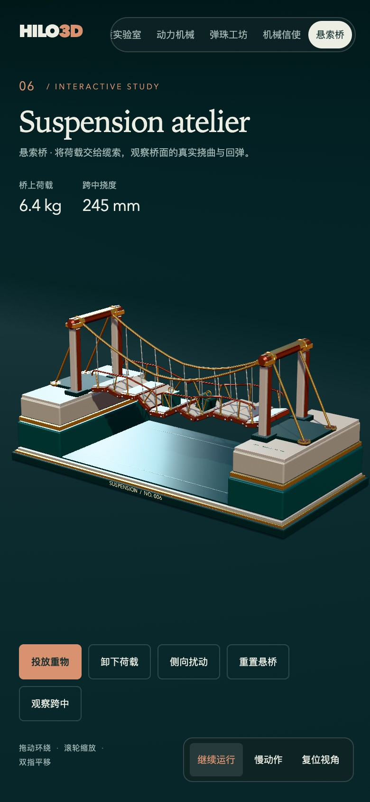

# Physics collection：六座可操作的物理展品

这组示例由两个基础实验和四个组合应用构成。物理来自可选的 `@hilo/addon-physics` Rapier Stage
System；展示使用同一套 Hilo3D 渲染前端，支持 `webgl2` 和
`webgpu`。世界所有权、固定步长和变换同步遵循
[物理架构](./PHYSICS_ARCHITECTURE.md)，本组示例没有扩展引擎物理 API。

## 审阅截图

以下画面由 Chromium / Metal WebGPU 在 DPR
2 下原生捕获，操作展品后暂停并逐张审阅构图、材质与界面。桌面视口为 1440 × 900，手机视口为 390 ×
844；截图是视觉审阅资料，不是自动截图测试或性能基线。拍摄参数与场景状态见
[截图说明](./assets/physics/README.md)。

机械信使近景：分层镜片、陶瓷机身与黄铜关节。

六座展品 · 桌面全景

**01 · 刚体花园：完整骨牌、堆叠与复合刚体。**

**02 · 材质实验室：首次回弹与摩擦滑行差异。**

**03 · 动力机械：飞轮、连杆、滑块、双摆与弹簧联动。**

**04 · 弹珠工坊：轨道球流与传感计分。**

**05 · 机械信使：台阶、斜坡、通道与包裹配送路线。**

**06 · 悬索桥：两件重物加载后的桥面挠曲。**

手机布局 · 机械信使近景与悬索桥全景

## 展品与操作

| 章节                               | 页面                                                               | 观察内容                                                                                                | 场景操作                                                                              |
| ---------------------------------- | ------------------------------------------------------------------ | ------------------------------------------------------------------------------------------------------- | ------------------------------------------------------------------------------------- |
| 01 · Impulse garden / 刚体花园     | [rapier3d.html](../examples/physics/rapier3d.html)                 | 29 枚骨牌的连锁碰撞、交错堆叠、CCD 撞击球、一个刚体上的三个复合碰撞体；事件计数和倒牌数量来自物理世界。 | 推动骨牌、发射撞击球、重建展品、切换地球/月球重力；双击刚体通过物理射线查询施加冲量。 |
| 02 · Material atelier / 材质实验室 | [rapier_materials.html](../examples/physics/rapier_materials.html) | 后排四座独立落球仪比较恢复系数，前排四条 12° 斜坡比较摩擦；标尺随真实球高和滑行距离移动。               | 重新释放全部八个试样，观察首次回弹和滑行距离。                                        |
| 03 · Kinetic engine / 动力机械     | [rapier_joints.html](../examples/physics/rapier_joints.html)       | 电动飞轮经两端转动关节和连杆驱动棱柱关节滑块；回位弹簧储能，第二根弹簧把滑块与双摆耦合。                | 启停/反转电机、拨动双摆、重置机械；读取实测转速、位移与计算的弹簧势能。               |
| 04 · Marble works / 弹珠工坊       | [rapier2d_marble.html](../examples/physics/rapier2d_marble.html)   | 30 颗弹珠经过重力轨道、三个电动转子、钉阵和五个传感计分区；转子同时使用复合碰撞体与转动关节。           | 重新释放六颗现有弹珠、反转三个电机；观察传感通过次数、总分和自动回收。                |
| 05 · Clockwork courier / 机械信使  | [rapier_character.html](../examples/physics/rapier_character.html) | 胶囊角色控制器沿配送路线越阶、贴坡、穿门、推箱与跳跃；前向形状扫描和地面射线提供实际碰撞读数。          | 自动巡游、WASD/方向键与触屏方向按钮、跳跃、台阶辅助开关、返回起点及近景观察。         |
| 06 · Suspension atelier / 悬索桥   | [rapier_bridge.html](../examples/physics/rapier_bridge.html)       | 11 段动态桥面、22 个主缆节点与 70 个关节共同传递载荷；桥面挠曲、缆索和栏杆跟随真实刚体。                | 投放最多四件重物、卸载、侧向扰动和复位，对比荷载与实际跨中挠度。                      |

所有页面共用暂停、0.25 倍慢动作、复位视角和章节导航。相机环绕、缩放与平移使用公共
`OrbitControls`。暂停保留世界及其刚体，慢动作设置物理世界的 `timeScale`；除弹珠工坊使用 60
Hz 外，其余五章使用 120 Hz 固定步长。页面右下角显示当前后端与实际固定步频。

从仓库运行 `npm run examples:dev`，在对应页面后添加 `?backend=webgl2` 或 `?backend=webgpu`
可明确选择渲染后端。章节导航保留该选择；明确选择 WebGPU 时仍遵守引擎失败即报错的约定。

## 从单项实验到组合应用

材质实验室的球半径、释放高度和撞击面一致，恢复系数为 0.12、0.42、0.68、0.92；球被约束为竖直运动。仪器上
`e²`
表示理想首次反弹的能量比例，固定步长求解与读数采样会产生小幅误差。滑块的形状和起点一致，摩擦系数为 0.02、0.12、0.26、0.72，斜坡为 1，通过
`multiply`
组合。滑块保留自由转动，避免锁轴改变接触求解后的摩擦表现；低摩擦试样滑向止挡，高摩擦试样留在起点。物理工厂与参数位于
[materialExperiments.ts](../examples/physics/materialExperiments.ts)。

刚体花园把冲量、碰撞、静摩擦和复合形状组合为可重建的桌面实验。动力机械进一步使用关节组成闭合曲柄滑块机构，并通过弹簧传递扰动。其零件在轴承处允许视觉相交，零件间碰撞被过滤，由关节负责机械约束；它展示的是约束传动，不是完整机械接触仿真。

弹珠工坊使用真正的二维世界，柜体厚度和弹珠的三维外观仅用于展示。传感器只触发计分，不阻挡弹珠。同一颗球每轮只计一次分；计分后、逸出边界后或驻留超过 16 个模拟秒时，应用把现有刚体送回入口。这个回收策略维持固定球数，不包含物理升降机，也不代表能量守恒的封闭机械系统。

机械信使的胶囊碰撞体由公共角色控制器校正位移，路线只是移动意图，不会强行把刚体搬过障碍。输入 System 在更新前根据
`PhysicsWorld`
的累计时间计算本帧实际模拟间隔，提交经过碰撞检查的运动目标，再由原有调度器在固定子步间分配目标。应用负责重力、跳跃和自动路线策略；开启/关闭台阶辅助会重建角色控制器，保持同一刚体及碰撞体。脚步和外观朝向由实际位移派生，不改变角色碰撞体；地面与前向读数来自真实 ray/shape-cast 查询。[characterExperiment.ts](../examples/physics/characterExperiment.ts)
与展示页、CPU 验收共用这些规则。

悬索桥采用关节约束相邻桥段，两侧动态主缆链通过弹性吊索连接桥面；加载后桥面位移由刚体和约束求解产生。主缆、吊索和扶手在渲染前读取已经插值的实际锚点；四件重物有明确数量上限，卸载会移除物理对象并回收视觉。它是刻意放大变形便于观察的微缩约束实验，不是土木结构的工程计算模型。[bridgeExperiment.ts](../examples/physics/bridgeExperiment.ts)
提供场景与测试共用的构建、加载及复位逻辑。

## 美术与物理分离

[showcase.ts](../examples/physics/showcase.ts) 与 [showcase.css](../examples/physics/showcase.css)
统一陶瓷、黄铜、青绿和橙红的展馆视觉：倒角几何、环境反射、方向光阴影、色调映射、画布铭牌和响应式控制面板。几何与材质在初始化阶段创建并复用；场景不编写独立后端渲染逻辑或新增着色器。摄影背景只接收阴影，印刷铭牌不投射阴影，避免这些布景产生不符合用途的遮挡。六章导航在窄屏上横向滚动，并自动将当前章节保持可见。

运动零件通过 `bindNode3D` / `bindNode2D`
绑定物理世界，装饰螺钉、刻度、支架和柜体无需逐件成为碰撞体。复合视觉使用未缩放的父节点绑定刚体，避免装饰缩放影响同步合同。动力机械的弹簧外形在
`beforeRender` 阶段读取已经插值的节点姿态，连接真实约束锚点；弹力本身来自物理弹簧关节。DOM 的
`data-physics-scene`、模拟步数及各场景读数为交互检查提供可观察状态，不能单独证明帧已经正确渲染。

## 验证与证据范围

[physics-scenes.contract.test.ts](../test/ui/physics-scenes.contract.test.ts) 在 Node 中运行真实
`Rapier3DBackend`，直接调用展示页共用的材质物理工厂。四项测试覆盖首次回弹的顺序与数值容差、低/高摩擦的分离表现、暂停与四分之一时钟、重播时姿态/速度/碰撞计数及对象数量。运行
`npm run test:ui:contract`
可将它与既有示例目录合同一起检查。 CPU 合同配置复用引擎的 Vite 源码 aliases、着色器加载器和版本定义，因此干净 checkout 在
`npm ci` 后即可执行，不依赖本机遗留的核心或 addon `dist`。

本次重做已运行该文件的四项 CPU 合同并全部通过，也完成了材质页、工厂和合同测试的局部严格 TypeScript、ESLint 和 Prettier 检查。这些 CPU 检查不验证光照、相机、移动端排版、标签方向或 WebGL2/WebGPU 管线。

新增的 [character-scene.contract.test.ts](../test/ui/character-scene.contract.test.ts)
用真实 Rapier 验证配送回路、越阶辅助差异、跳跃着陆、沿墙滑动与时钟/复位策略；[bridge-scene.contract.test.ts](../test/ui/bridge-scene.contract.test.ts)
验证加载挠度、卸载恢复、重物数量上限、侧摆和暂停/慢动作/复位。它们直接使用对应展示页的物理工厂，不复制另一份简化求解器。

浏览器验收使用 [physics.spec.ts](../test/ui/physics.spec.ts)
的专门门禁：六个场景分别在 WebGL2、WebGPU 上验证初始化、真实模拟进展、暂停/慢动作和场景交互，另有弹珠工坊、机械信使和悬索桥三项移动端布局与操作检查。它保留 native
draw/queue/acquisition 计数、GPU 错误采集、页面生命周期检查及 Canvas
PNG 像素断言，示例目录合同负责确认专门门禁覆盖全部六页的双后端组合。运行
`npx playwright test test/ui/physics.spec.ts --project=chromium` 可单独执行；常规 `test:ui:webgl2` /
`test:ui:webgpu`
命令也包含该门禁。十五项浏览器测试的实际运行结果应记录在变更交付中，不能由 CPU 测试或测试文件存在推断为通过。

本机排查发现，Playwright 的持续画面采集（视频或 trace
screencast）与 SwiftShader 软件渲染同时运行时，通用门禁可能在首帧采样或 WebGPU 初始化阶段超时：一次 WebGL 健康快照调用阻塞超过 22 秒，另一次已观察到 722 次有效 native
draw 仍跨过轮询期限。相同软件 GPU 参数与健康探针的无录像对照可以持续提交有效帧，且未记录 GPU 验证错误。因此这组专门门禁关闭视频及 trace 的连续截图，同时保留 DOM/操作/网络 trace、失败截图和逐页 PNG 像素检查；这项采集策略减少持续画面采集对软件渲染的扰动，不豁免帧进展、交互或 GPU 错误断言。

上述排查属于本机测试采集条件的诊断。它不是跨设备性能基线，也不能证明跨浏览器确定性或完整发布质量。截图和单次冒烟运行同样不能替代持续交互与双后端验收。
