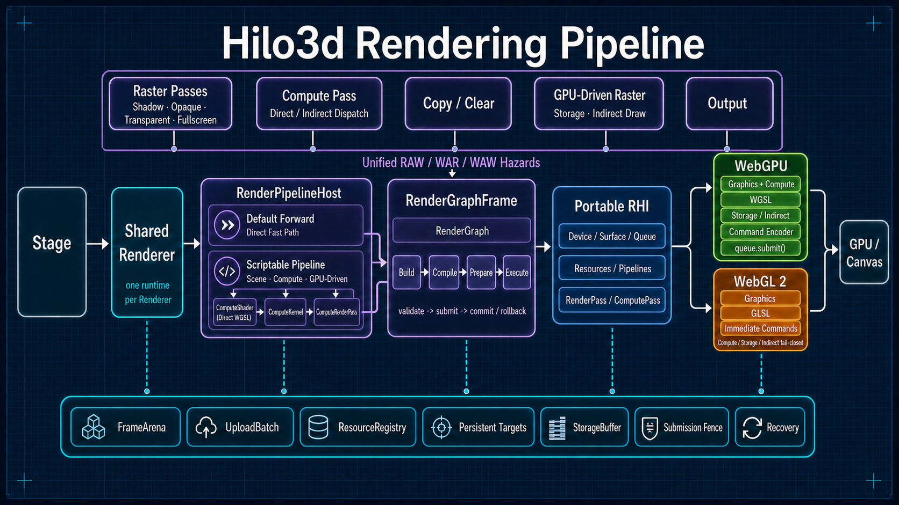
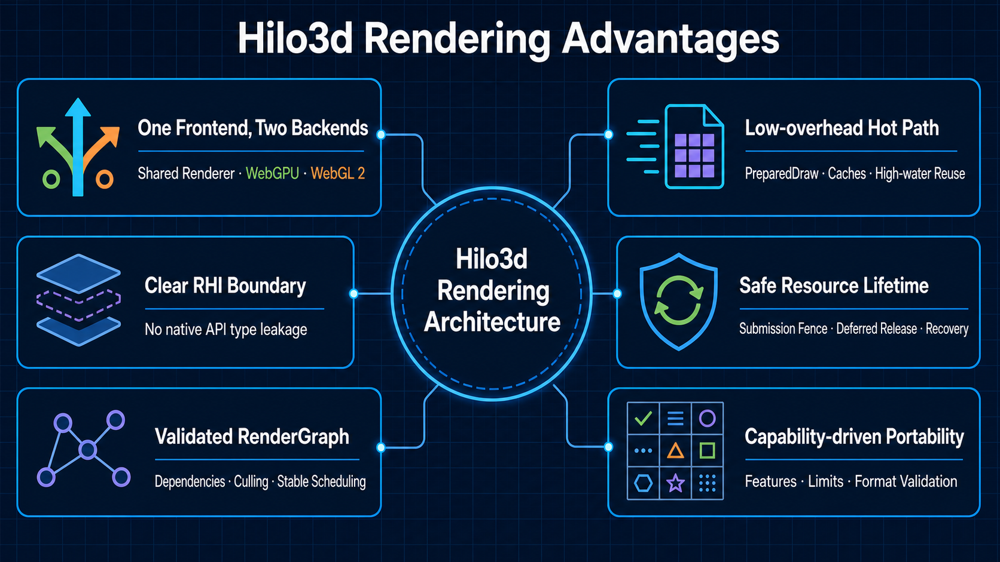

# Hilo3d 当前渲染架构：Stage、RenderGraph、RHI、Compute 与双后端

> 本文基于当前仓库生产代码整理，描述已经落地的运行时链路，而不是重构规划中的目标状态。

## 结论先行

Hilo3d 当前采用的是“**一套共享渲染前端 + 一个可脚本化 PipelineHost + 一套后端无关的 RenderGraph + 一套 WebGPU 风格的可移植 RHI，以及 WebGPU/WebGL
2 两个具体后端**”架构。普通 raster 继续由两个后端实现；storage、compute 和 GPU-driven
raster 使用同一前端、同一个 Render Graph 与同一个 RHI command scope，但执行能力明确限定为 WebGPU。

它的关键价值不是简单地把 WebGL
API 换成另一组接口，而是把场景遍历、可见性判断、排序与实例化、Pass 组织、资源上传、Shader/Draw 准备、生命周期和恢复都放在共享层；后端只负责把同一份 RHI 资源与命令合同翻译成原生 WebGPU 或 WebGL
2 行为。因此，大多数渲染功能只需实现一次，双后端差异被限制在明确边界内。



## 1. 一帧是怎样完成的

### 1.1 Stage：应用与渲染器之间的入口

`Stage.tick(dt)` 先递归更新场景节点，再按 `Camera.priority` 从低到高组合
`Stage.cameras`。单 Camera 保留 `renderer.render(stage, camera, true)` 快路径；多 Camera 通过一次
`renderer.renderFrame()` 把全部 Camera 记录进同一个 Render Graph/RHI submission。`Stage.camera`
仍是最低优先级主 Camera 的兼容别名。

每个 Camera 独立配置 `visibility`、`clearColor`、`clearDepth` 和
`clearStencil`。共享场景 planner 只收集满足 `(camera.visibility & node.layer) !== 0`
的 Mesh 与 Light；后绘制的 Camera 默认可以 load 前一 Camera 的 color，从而组合 3D 世界与
`Camera2D`/Sprite UI。2D 系统的完整合同见 [`2D_RENDERING.md`](./2D_RENDERING.md)。

后端选择发生在创建阶段，而不是每次渲染时：

- `Stage` 与 `Renderer` 只通过异步 `Stage.create()` / `Renderer.create()` 创建。
- `auto` 策略默认先探测 WebGPU，不支持时选择 WebGL 2；显式 WebGL 2 也使用相同的异步创建边界。
- 显式指定 `webgpu` 不会静默回退。
- `preserveDrawingBuffer`，以及 `alpha: true + premultipliedAlpha: false` 这类 WebGL
  2 专属组合，会让 `auto` 直接选择 WebGL 2。
- Pipeline factory 的静态 requirements 会在探测前完成快照。`storage-buffer`、`storage-texture`、
  `compute-pass`、`indirect-draw`、storage texture format 和 compute/storage
  limits 都会把候选后端限定为 WebGPU；与显式 WebGL 2 或 WebGL
  2 专属 Canvas 选项冲突时，创建阶段直接失败。
- `auto`
  一旦因为上述 requirement 选择 WebGPU，后续 adapter、device、Naga 或 pipeline 初始化失败都不会回退 WebGL
  2。公开的 compute/storage capability 只在实际 WebGPU
  feature、format 与 limit 条件同时满足时为 true；不兼容设备在 runtime 创建前 fail-closed。
- `Renderer.create()` 直接返回初始化完成的
  `SharedRendererDriver`，帧热路径中没有额外 Proxy 或逐调用后端分发。

相关代码：[`Stage.ts`](../src/core/Stage.ts)、[`Renderer.ts`](../src/render/Renderer.ts)、[`RendererFactory.ts`](../src/render/internal/RendererFactory.ts)、[`RenderPipelineBackendSelection.ts`](../src/render/internal/RenderPipelineBackendSelection.ts)。

### 1.2 SharedRendererDriver：两套后端共享一条上层流水线

`SharedRendererDriver` 是生产环境中 WebGPU 与 WebGL 2 共用的 Renderer 前端。一次普通场景渲染会经历：

1. 更新场景世界矩阵和 Camera 的 View-Projection 矩阵。
2. 单次遍历收集 `visible` 且通过当前 Camera layer mask 的 Mesh 与 Light。
3. 进行视锥裁剪，构建不透明、透明和显式 Instancing 队列。
4. 不透明物体按 `renderOrder / material / geometry`
   聚类，减少状态切换；透明物体保留上游给出的后向前顺序。
5. 规划 Shadow Atlas，并准备 Shadow Pass。
6. 把 Mesh 编译为可复用的 `PreparedDraw`：Pipeline、BindGroup、Vertex/Index
   Buffer、动态状态和 Draw 参数都在执行前准备完毕。
7. 把 Shadow、Main、Transparent、PostProcess、Present 或离屏 RenderTarget
   Pass 加入同一个应用帧 RenderGraph。

方向光阴影在同一 Shadow Atlas/Render Graph/RHI 链路内支持 1–4 级 CSM。默认 `cascadeCount: 1`
保持原单投影行为；启用多级后，共享前端按主 Camera 的 view-space near/far 计算 practical
splits（透视 Camera 由 `cascadeSplitLambda` 在 uniform/logarithmic 间插值，正交 Camera 使用 uniform
splits），用 `cascadeMaxDistance` 限制最远阴影范围，并为每段拟合 Orthographic shadow
Camera。`stabilizeCascades` 默认把投影中心吸附到 atlas tile texel；fragment shader 在 view
depth 上选择 cascade，并在 `cascadeBlend` 区间同时采样相邻两级以隐藏接缝。`shadowStrength` 默认 `1`
保留 PCF 采样的物理可见度，0–4 范围可在 shared
shader 中强化或减弱部分覆盖半影，而不增加 backend 分支。显式 `cameraInfo`
仍服务单级兼容路径，与多级 cascade 组合会在 graph/RHI frame 开始前失败。

LightBlock 为每个方向光保留 4 个稳定的逻辑 matrix/rect slot，Spot 与 Point 的 ABI
base 不随当前 cascade 数变化；物理 atlas 只创建实际启用的 slice。这样运行时从 4 级改为 2 级不会改变其他灯光的 shader 索引，也不需要 backend 分支。扩展后的 LightBlock 为 16,288
bytes，仍低于 WebGL 2 保证的 16,384-byte minimum uniform-block
capacity；WebGPU 使用相同 std140 布局和 GLSL→Naga→WGSL 产物。

Shadow Atlas 现在还包含首版 S0 内容缓存。共享层按 atlas allocation、slice placement、light
view-projection，以及 caster identity、transform、geometry stream、material/texture
revision 和 skin/morph
deformation 做精确快照；不使用可能碰撞的 hash。静态 slice 在后续有效帧中不再记录 Shadow
Pass，刚体 caster/light 的变化只失效相交的 light slice；geometry
bounds 变化、skin 和 morph 则保守失效全部相关 slice。脏 slice 通过同一 GLSL→Naga→WGSL/RHI 路径的 depth-only
fullscreen triangle 在 viewport/scissor 内局部清理，Render Pass 使用 `load`
保留其他 tile，避免整张 atlas clear 破坏缓存。内容 revision 只在有效 submission 后提交，graph
build/prepare/execute 失败会回滚并在下一帧重试；atlas resize、detach、资源释放和 device/context
recovery 都会明确失效。Clustered GPU Scene 中的 rigid caster 由 compute 按 shadow
slice 裁剪并写入固定 bucket indirect draw；不满足 GPU Scene 合同的 caster 仍走共享 CPU depth
path。high-end profile 依据 receiver 覆盖缩放 local
light 与远级联分辨率，以 1/2/4/8 帧 cadence 更新 CSM，并由确定性 slice/page
budget 延后 caster-only 失效。每个 slice 再拆为 128 像素固定物理页，逐页 scissor 重绘；页 revision、residency 和失败回滚均在有效 submission 后提交，旧页在缺页期间继续提供确定内容。注册
`RendererDiagnostics` 后，`caches.shadowAtlas`
提供累计hit/miss/replacement/live-slice，`frame.shadow*` 提供 slice/page
request、update、defer、resident 和 overflow 观测。

当前页层仍使用 stable atlas 内的固定物理映射；尚未实现 GPU receiver/depth page
request、任意 physical-page remap/page table 或 directional clipmap，因此不宣称等价于完整 Virtual
Shadow Maps。

Sprite 仍是 Mesh：共享单位 quad、按 atlas Texture 共享 SpriteMaterial，先按 Node 级
`sortingLayer / zIndex / stable scene traversal` 确定显示顺序，再仅对相邻兼容项合批，并把 UV
rect、size/anchor、tint 与 transform 编译成 portable instance batch。WebGL 2 使用 instance vertex
stream，WebGPU 使用固定 InstanceBlock 加 Sprite instance
stream；没有 2D 专用 backend 或第二套 shader 树。普通 Forward 与离屏路径也消费同一份 direct/instance-batch
ordered item list；透明 batch 只能合并深度排序后相邻的兼容项，不能跨 direct draw、`renderOrder`
或 blending 顺序移动。

普通前向渲染至少包含 Main Pass；存在透明物体时增加 Transparent
Pass；存在投影灯光时在它们之前加入 Shadow
Pass。后处理、显式 Present、离屏渲染和 Readback 也通过同一 RenderGraph 组合，而不是绕过 RHI 走后端私有流程。

相关代码：[`SharedRendererDriver.ts`](../src/render/internal/SharedRendererDriver.ts)、[`RenderGraphFramePlan.ts`](../src/render/RenderGraphFramePlan.ts)、[`RenderList.ts`](../src/render/RenderList.ts)、[`MeshDrawListPlanner.ts`](../src/render/renderer/MeshDrawListPlanner.ts)、[`ForwardRenderer.ts`](../src/render/renderer/ForwardRenderer.ts)。

### 1.2.1 材质前端与语义 Pass

`Mesh.material` 引用 `MaterialInstance`。实例持有不可变
`MaterialDefinition`，Definition 固定 family、Shader topology、static features、texture-slot
schema、语义 role 与 pipeline state；实例只保存运行时参数、per-slot
texture/UV/transform/encoding/channel、stable material
ID 和数据 revision。参数变化不改变 Definition 或 Shader resource
layout，需要改变 topology 时构造另一个材质实例。

Render Pipeline 请求 `forward`、`depth-only`、`shadow-caster`、`motion-vector`、
`material-attributes` 或 `picking` role，材质不拥有 graph pass 顺序。Shadow Atlas 直接编译
`shadow-caster`，不创建 proxy material；role 缺失或 target output 不匹配会在 RHI
frame 前失败。内置 Basic/PBR/Geometry 的 `motion-vector` pass 接受 single-sample `rgba16float`
target，并可在 location 1 同时写 single-sample `r8unorm` authored reactive mask：motion
XY 是 current-to-previous UV velocity，Z 是 expected previous `log2(1 + viewDepth)`，W 是 current
`log2(1 + viewDepth)`。它复用 current/previous camera、model、instance、skin、morph 与 coverage
ABI；首次出现、显隐/提交间断或任一 transform history 失效时写 invalid history
marker，不能消费陈旧 pose；reactive 值来自材质的 `temporalReactiveFactor`（0–1）。内置
`material-attributes` pass 固定接受 single-sample `rgba16float`，输出 octahedral view
normal、perceptual roughness、metallic 与 reflection receiver flag；portable Forward
GTAO 与 Clustered Hi-Z SSR/GTAO/SSGI 按需消费它。GTAO 以相同 attributes 和 logarithmic motion
depth 执行 horizon visibility、temporal rejection、edge-aware filter 与 depth/normal
upsample；SSGI 在 opaque 后复用或生成 attributes/motion，执行随机 view-space diffuse ray
trace、YCoCg variance-clipped temporal resolve、depth/normal/luminance-aware a-trous
filter、bilateral
upsample 与线性 HDR 合成；SSR 用它们约束 confidence-aware 多尺度空间 filter。未启用对应 effect 时不创建 attribute、AO/GI/filter
target、history 或 fallback pass。

portable material UBO 分为 448-byte `MaterialBlock` 与 1,920-byte
`MaterialTextureBlock`，二者按最终 std140 bytes 独立更新。WebGPU material group 的 binding
0/1 对应这两个 block，sampled texture/sampler 从 binding 2 开始；WebGL2 使用同一固定 block
registry。attribute、uniform、texture 和 built-in
slot 使用公开的类型化 semantic 常量，不以任意字符串作为公共绑定合同。完整设计、breaking
changes 与 GPU material database 路线见
[`MATERIAL_SYSTEM_MODERNIZATION.md`](./MATERIAL_SYSTEM_MODERNIZATION.md)。

WebGPU high-end 路径复用 renderer-local `SharedMaterialRecordDatabase`。数据库按 material
identity 去重，保留公共 `materialId` 并分配按 family/layout 分类的 dense
handle；`MaterialInstance.revision` 驱动 record 重打包，相邻 dirty record 合并上传。staged
revision 和 texture-slot dirtiness 只在成功 submission 后提交，失败帧重试；renderer-owned
`cpu-shadow` buffer 在 device recovery 后重建而不替换材质或 handle identity。首个
`builtin-pbr-storage-v4` record 由 GPU Scene 与 clustered indirect draw 共享；除 surface
scalar 外，它为每个内置 PBR texture slot 保存独立 UV matrix、UV set、encoding、presence 与 channel
mapping，并在 surface record 的保留分量保存 authored reactive factor。logical geometry
bucket 与 material handle 在对象 record 中保持为两个独立字段。

### 1.3 RenderPipelineHost：统一的可脚本化编排

每个 Renderer 拥有一个 `RenderPipelineHost` 和一个 renderer-local `RenderPipeline`
runtime。创建时未传 `renderPipeline` 时也由进程级 `ForwardRenderPipelineFactory`
为该 Renderer 创建独立 runtime；默认 Forward 与显式 factory 使用同一个同步 `record()`
边界和 frame-scoped `RenderPipelineContext`，不存在绕过 Render Graph/RHI 的 direct recorder：

- `cull()` 与 `createRendererList()` 复用 shared renderer 的场景收集、排序、instancing 和 mesh
  processor；
- `prepareScene()` 只更新 scene world matrix 与 active camera，不构造 CPU render list；GPU-driven
  pipeline 可先完成一次自有 scene collection，仅在确有 compatibility mesh 时再调用一次 `cull()`；
- `recordShadows()` 复用同一 Shadow Atlas、LightBlock、resource owner 和恢复链路；
- `ScriptableRenderGraph` 可创建 transient texture/buffer，导入 output、RenderTarget、renderer-owned
  `StorageBuffer` 和 sampled engine `Texture`，获取 recovery-aware persistent target、按 stable
  key 释放单个 persistent target，并添加 scene/fullscreen/copy/compute/GPU-driven pass；单 key
  release 仅在有效 submission 后提交，失败帧会回滚；
- graph buffer 的 storage、vertex、index、copy、indirect、read-write 和 clear access 都在 `setup`
  显式声明。资源 usage 由存活 pass 汇总，imported `StorageBuffer` 必须提供 usage
  superset；copy/clear source、destination 和 byte range 在 RHI frame 开始前验证；
- sampled 与 copy usage 分离；copy 在 setup 声明确切 source/destination pair，并在
  `queue.beginFrame()` 前用实际 RHI texture descriptor 完成验证；
- fullscreen 输入使用固定线性 sampler，因此 capability 明确区分 sampleable 与 `filterable-sampled`；
- fullscreen bind-group descriptor/entry 使用高水位复用，但绑定 graph-transient view 的 native bind
  group 保持 frame lifetime，并由 submission fence 后确定性销毁；
- compute、GPU-driven 与 fullscreen 的 prepare 只 enlist 共享 buffer/texture/resource-use
  transaction，不重复刷新 scene
  matrix、camera、LightManager 或内置语义块；renderer-list、shadow 和普通 mesh
  pass 首次出现时才激活完整 scene semantics，后续相机/viewport pass 继续用 `beginContextPass()`
  切换语义而不重启资源事务；
- pipeline invocation 与 feature/setup/prepare/execute callback 的公开 facade 都绑定不可复用 lease
  shell；内部高水位 storage 可跨帧复用，但旧引用不会在后续 callback 重新有效。各阶段必须同步，返回 Promise-like 或在回调外使用 context/handle 会中止并回滚整帧；
- renderer-list 的 Mesh `beforeRender` 在首个声明该 Mesh 的 list 准备 draw
  snapshot 前触发，保证矩阵、材质和 UBO 修改作用于当前帧；Mesh `afterRender` 与公共 face
  count 以 execute 中实际 draw 为准，被 graph
  culling 删除或条件跳过的 list 不产生成功事件/face，重复 depth/override/color
  draw 不重复累计公共 face；
- 每个 scriptable invocation 开始时先解除上一 invocation 的 shadow scene binding，省略
  `recordShadows()` 不会复活旧 atlas/LightBlock；
- factory 可异步创建 runtime，但每个 Renderer 必须获得独立 runtime；同一个 runtime 不能附着到两个 Renderer。

带 feature 的 `ForwardRenderPipelineFactory` 在构造时快照配置并合并静态 capabilities/limits/format
requirements；每个 feature 配置在 Renderer 创建时产生独立且只能附着一次的 runtime。feature
context 暴露内置 forward/shadow 共用的 `cullingResults`，因此附加 Scene
Pass 无需重新 cull，也不会与 Shadow Atlas 的场景 identity 分叉。feature 声明需要采样 scene
color/depth 时创建对应中间资源；其中 scene color 使用公共 fullscreen 线性采样 ABI，因此要求
`filterable-sampled` format。默认 factory 也通过同一 Render Graph 路径把 surface scene
color 保留在 renderer-owned linear composition target，到最终 output
pass 才执行一次准确的 linear-to-sRGB transfer。多相机的 surface
`load`、透明混合和共享 depth/stencil 都继续作用于该线性 composition target，不采样 presentation
surface。持久 composition target 固定为 single-sample；单相机 MSAA 使用 transient
attachment 并 resolve 到该目标，多相机 stack 则统一 single-sample，避免跨 Camera 加载已 resolve 的多采样内容。离屏 RenderTarget 不隐式套用 display
transfer。

内置 HDR 组合由 `PostProcessRenderPipelineFactory` 提供：attachment-zero scene color 使用
`rgba16float`，opaque queue 完成后由 graph `TextureCopyPass` 捕获 opaque scene
texture，再把该 texture 作为 pass-global binding 交给 transparent PBR transmission/volume draw。可选
`GroundTruthAmbientOcclusion` 在 opaque 前复用共享 culling，记录 depth、material
attributes 与 motion/log-depth，随后执行 rotated horizon search、submission-aware temporal
resolve、两级 edge-aware filter 和 bounded bilateral upsample。full-resolution
bent-normal/visibility 通过 pass-global binding 只进入 opaque
PBR 的 ambient/IBL；普通 Forward 的同一 portable raster 实现覆盖 WebGPU/WebGL 2，完整合同见
[`GROUND_TRUTH_AMBIENT_OCCLUSION.md`](./GROUND_TRUTH_AMBIENT_OCCLUSION.md)。可选 `TemporalAA`
在 opaque 后记录 `rgba16float` motion/log-depth，并用 `rgba16float` 双缓冲 color history 和
`r32float` 双缓冲 log-view-depth history 完成 reprojection、relative-depth disocclusion、YCoCg
variance clipping 与 reactive resolve。motion pass 的第二个 `r8unorm` MRT 保存
`MaterialInstance.temporalReactiveFactor`，resolve 对它执行 3×3 conservative
dilation，并与亮度 heuristic 取最大值抑制不稳定 shading 的 history。默认 `renderScale=1`
是原生分辨率 TAA；固定或动态 0.5–1 的 sub-native scale 会同步缩放 opaque
color/depth/motion、Hi-Z 与 cluster viewport，用 Catmull-Rom 重建当前帧，并写 output-resolution
color/depth history、resolved color 和供后续 scene pass 使用的 full-resolution depth。resolved
opaque color 随后接受 transparent/transmission composition；Clustered
Forward+ 再以透明 motion、reactive coverage 和当前深度驱动独立的 color/mask/depth
history，使用深度一致性、衰减与 resurrection 抑制拖影。GPU
particle 在输出分辨率独立合成并使用自己的短 history；opaque/masked particle 还保守写满 reactive
coverage。UI 始终留在全部时域 resolve 之后。Clustered Forward+ opt-in TAA 时把 GPU Scene
motion 融入 depth prepass，以前一已提交帧的 visibility buffer 拒绝重现物体的陈旧 history；fallback
opaque/masked 在 opaque resolve 前补写同一 motion target。`dynamicResolution` 仅在 WebGPU
`timestamp-query` 可用时创建：控制器异步消费逐 Graph pass
GPU 时间，使用 EWMA、迟滞、量化步进、warmup 与 settling window，在声明的 min/max 内调整 scene
scale；比例变化会失效 TAA、Hi-Z、SSR、SSGI/GTAO、volumetric 与 atmosphere/cloud 的尺寸相关 history，但 UI/透明合成和最终 output 保持原生分辨率。之后
`Bloom` 在 tone mapping 前记录 soft-knee/Karis prefilter、13-tap downsample pyramid、tent
upsample 与线性 composite；`ColorUber` 最后统一完成 grading、tone
mapping、linear-to-sRGB 与 dithering，并把输出编码标记为 `srgb`，避免 surface output
pass 重复转换。float scene target 会选择 linear-output material
variant，禁止材质 shader 提前执行 gamma encode 或旧的局部 tone mapping。完整颜色与材质合同见
[`PBR_AND_POST_PROCESSING.md`](./PBR_AND_POST_PROCESSING.md)。

scriptable output 同时暴露只读、后端无关的 color/depth/stencil load/store/clear
policy。带 feature 的 Forward pipeline 把该 policy 分配到首个和末个 Scene
Pass；中间队列 Pass 强制 store/load 以保持内容。当 filterable sampled scene
color 需要中间纹理且 output 选择 `load`
时，先把旧 output 搬入中间纹理；若中间 color 无法无损搬运 multisample/non-filterable 内容，则在 RHI
frame 开始前明确失败。scene color sampling 只允许在 opaque writer 之后。内置
`ForwardRenderPipelineFeature.requirements.sampledDepth` 会创建 single-sample、sampleable
depth；公共 fullscreen ABI 对普通 depth `sampler2D` 自动选择 non-filtering sampler，并在 WebGPU
lowering 中专门化为 numeric depth texture。comparison
sampling 仍要求显式 comparison 合同。场景内容决定是否采样深度的 feature 可通过 runtime
`requiresSampledDepth(context)`
在 attachment 分配前逐帧升级该要求；静态 requirements 仍负责创建阶段的 backend/capability gate。

WebGPU high-end profile 现在提供公开的
`ClusteredForwardPlusPipelineFactory`。应用注册稳定的 geometry/material/LOD
bucket 后，runtime 在创建阶段通过 `RenderPipelineCreateContext.createStorageBuffer()`
建立 renderer-owned object、geometry、light、visible、indirect、cluster 和 diagnostics
database，并通过共享 `SharedMaterialRecordDatabase` 建立去重的 PBR material
record；帧内 dirty 数据必须通过 `RenderPipelineContext.writeStorageBuffer()` 在 graph
import 前提交。注册的不透明普通 `Mesh` 仍使用共享 Scene 遍历和矩阵更新，但不创建 CPU renderer
list 或 `PreparedDraw`：compute 完成 frustum/previous-Hi-Z cull、projected-radius LOD、bucket
compact 和 indirect arguments，随后同一 Render Graph 记录 depth、current Hi-Z、3D cluster
allocator、storage-aware GGX PBR、HDR Bloom 与 ACES display。可选 `groundTruthAmbientOcclusion`
复用 GPU Scene material attributes 与 fused
motion/depth，要求同时启用 TemporalAA 以共享 camera-cut/history validity；horizon/temporal/filter
controller 与普通 Forward 相同。可选 `screenSpaceReflections` 在 opaque 后构建 HDR radiance
cone、使用 current RG32F min/max Hi-Z hierarchical trace，经过 motion/depth temporal
rejection 后在线性 HDR 合成。可选 `volumetricLighting` 随后让 local-light
cluster 覆盖完整相机体积，把 directional/point/spot light、height fog 与 sphere/box local
fog 注入 tiled froxel atlas；每个 froxel column 只做一次 cumulative radiative
integration，再以 opaque depth 常数次重建 radiance/transmittance，经 previous-view
reprojection 与 depth/reactive temporal resolve 后，以 `scene * transmittance + scattering`
在线性 HDR 合成。SSGI、SSR 与体积光都在 TAA/TAAU 和 transparent 之前完成；完整合同见
[`SCREEN_SPACE_REFLECTIONS.md`](./SCREEN_SPACE_REFLECTIONS.md) 与
[`VOLUMETRIC_LIGHTING.md`](./VOLUMETRIC_LIGHTING.md)。WebGPU 不支持 multi-draw-indirect-count，因此 runtime 对每个固定 LOD
bucket 发一个 indirect draw，GPU 为不可见 bucket 写零 instance count；这些 bucket
draw 在共享层分别合并到一个 depth render pass 和一个 color render
pass，仍可逐 draw 切换 pipeline、bind group、vertex/index
buffer，但不再为每个 bucket 重开 attachment。可见对象先写 selected-bucket table，再通过 bucket
prefix 产生连续 range offset，最终压缩到一份与 `maxObjects` 同阶的 visible table，不再按 object ×
physical-bucket 放大。所有 indexed-indirect command 的 `firstInstance` 保持为零；每个 bucket
draw 通过 256-byte 对齐的只读 storage range 取得自己的 compact base，再与本地 `gl_InstanceIndex`
相加，因此 baseline 不依赖 WebGPU 可选的 `indirect-first-instance` feature。Hi-Z 对 standard
depth 的 RG32F Hi-Z 同时保存区块 `min/max`；previous-frame occlusion 对 standard 读取最远值
`max`、对 reversed 读取最远值 `min`，SSR 读取完整区间。Previous-frame Hi-Z 和 current-frame SSR
pyramid 都在 ordinary Forward opaque 的 `depth-only` fallback prepass 之后构建，因此未进入 GPU Scene
bucket 的 layered PBR、alpha-mask 和其他兼容对象也拥有可追踪深度。Previous-frame
occlusion 同时读取已提交的 previous
view/projection/depth 参数，不把上一帧 VP 与当前帧投影约定混用。颜色阶段 load 深度预通过结果，物体 record 携带 model
basis 的 inverse-transpose normal matrix，因此 non-uniform scale 不改变法线方向。depth
prepass 与 color pass 通过同一段 byte-identical clip-space transform 计算
`gl_Position`，避免相机移动时跨 shader 浮点舍入差异被 reversed-depth
test 放大成缺面。相机的 view-projection 或 depth 参数相对已提交帧发生变化时，runtime 会暂时关闭一帧 previous-frame
Hi-Z 遮挡判定以避免视角移动造成 disocclusion 误剔除，同时仍生成当帧 pyramid，使静止后的下一帧即可恢复遮挡剔除。对象只有在 transform 和 bounds
revision 都相对提交帧稳定时才允许使用 previous-frame Hi-Z；动态对象至少跳过一帧。logical
bucket 的 bounds 是 base geometry 与全部 LOD geometry 的保守 union，并在 position
revision 变化时刷新。静止帧从包围球最近深度和 view-space 包围立方体的八个角计算保守的屏幕投影，避免偏离画面中心时低估范围；半分辨率 history 按工厂声明的最大 viewport 专门化，最多 13 级覆盖允许的 8192-pixel
viewport。GPU Scene 的 frustum 阶段使用 view-space side
plane 的完整法线长度计算球体半径，不以 projection scale 近似斜平面距离；`Mesh.frustumTest = false`
与普通 renderer list 一样关闭该 mesh 的视锥剔除。普通 Forward PBR 与 clustered storage variant 共用
`pbr_surface.glsl` 和 `pbr_brdf.glsl`；后者只把 light provider 换成 cluster
grid/list，不复制材质模型。GPU Scene geometry database 可携带 UV0/UV1 与对应 tangent stream，sampled
engine `Texture` 通过 graph import 复用 renderer 的上传、恢复与 submission 生命周期。

pipeline runtime 的 `frameSubmitted()` / `frameDiscarded()` 是 CPU-side temporal
state 的事务边界；current/previous object/camera transform 只在 RHI
submission 已存在后提交，录制或提交前失败则丢弃 staged revision。当前 factory 限定 single-sample
perspective camera；固定 indirect bucket 限于 opaque/alpha-mask、unskinned、indexed triangle
PBR；GPU fast path 接受 scalar
factor 以及 base-color/metallic/roughness/combined-MR/occlusion/emission/normal 2D
map，支持每纹理槽独立的 UV0/UV1、UV transform、encoding、channel 与 sampler
mutation；alpha-mask 的 depth、motion、material-attributes 与 color pass 共用 base-color/opacity
coverage 语义。符合内置 PBR 合同的 skin/morph 与完整 layered glTF opaque 通过 GPU Scene
object/material record 进入 clustered direct storage
lane；整个透明队列均兼容时，按全局 back-to-front 顺序进入同一 clustered-native light
list。Transmission、自定义材质或粒子与透明 Mesh 混排时整条透明队列 fail
closed，避免跨 native/compatibility
pass 改写排序。未注册 mesh、对象容量 overflow，以及注册 bucket 在运行时发生的不兼容 material/geometry/raster-state
replacement 会在同一帧迁移到共享 Forward compatibility path；恢复兼容后可重新进入 GPU
Scene。fallback 使用显式 mesh identity
exclusion 避免重复绘制，按 opaque/transparent 分开排序并复用共享 shadow 录制。compatibility
opaque/transparent 与 GPU Scene color 都写同一 linear `rgba16float` scene
color/depth；transmission 读取 HDR opaque copy，最后统一经过 separable horizontal/vertical
Bloom 与一次 ACES display；`bloomStrength: 0` 不创建 Bloom transient
texture，也不记录其 pass。方向光走独立全局列表，不复制到每个 cluster；局部光与 near
plane 相交时使用保守 full-screen tile bounds，空 depth tile 使用 invalid slice range；index
budget 通过 sentinel + `atomicMin` 插入链确定性保留最低 light id。AreaLight 作为 global
light 使用与 ordinary Forward 相同的 RGBA32F LTC
LUT 和显式 LOD 查询，不按点光近似；directional、spot 与 point shadow
light 继续由共享 renderer 录制唯一 shadow atlas，再把同一 graph texture、shadow-first light
order、bias/cascade/matrix 数据返回 pipeline。clustered PBR 按物体 `receiveShadows`
标志使用 standard/reversed-depth comparison sampler 做 3×3 PCF，不复制 atlas、不绕过 Render
Graph，也不因启用阴影而整相机回退。Spot light record 提供解析式 cookie scale/offset/intensity/
softness 与归一化轴向 IES fit；所有灯光和 receiver 使用 uint32 light-layer mask，在 shader 入口 fail
closed。该合同不伪装成任意 cookie texture atlas 或原始 `.ies` 文件导入。材质 variant
manifest 在异步 factory 创建时 warmup Naga/pipeline，运行时新 variant 受固定预算与 submission
transaction 约束，并通过 diagnostics 暴露 warm、active、rejected 和耗时。初始 bucket 声明不合法、非 perspective/multisample
output 或不支持的 WebGPU 设备仍 fail-closed，不会静默退化到 WebGL 2。factory 的 required
limits 覆盖 object/geometry/visible/cluster/light-index 全部 buffer 与最坏 dispatch
dimension，在 runtime 分配前完成设备准入。

设备恢复必须保留 runtime 创建时可见的完整公共 capability 超集，包括 limits 和全部公共 format/use/sample-count 查询；能力缩减会使恢复明确失败，而不是让旧 runtime 在后续 pass 中延迟出错。

相关代码：[`RenderPipelineHost.ts`](../src/render/internal/RenderPipelineHost.ts)、[`pipeline/`](../src/render/pipeline)、[`ScriptableRenderPipelineContext.ts`](../src/render/internal/ScriptableRenderPipelineContext.ts)。

### 1.4 WebGPU Compute 与 GPU-driven raster

Compute 不是 `Material`。它使用三个后端中立、不可变的 CPU 配置对象：

- `ComputeShader` 保存 Direct WGSL、entry point、workgroup size 和显式 binding ABI；
- `ComputeKernel` 保存 shader 与不可变 override constants；
- `ComputeRenderPass` 从 shader ABI 推导 graph
  access，在 prepare 阶段解析资源并复用显式 layout/pipeline/bind
  group，在 execute 阶段只发 direct 或 indirect dispatch。

compute binding 覆盖 uniform buffer、readonly/read-write storage buffer、显式 texture
view、filtering/non-filtering/comparison sampler 和完整覆盖的 write-only storage texture
view。`ScriptableRenderGraph.createTextureView()` 可选择 mip、array
layer、dimension、format 和 depth/stencil
aspect；sampled、storage、attachment 与 copy 共用这一个 view
identity。跨帧纹理由 renderer-owned 双/三缓冲 history recipe 管理；当前 history
recipe 明确限定为单 sample、单 mip、单 layer 的 2D color texture，使任一提交成功的 current
writer 都能完整初始化下一帧 history。跨帧 buffer 继续使用 renderer-owned
`StorageBuffer`。后者是公共逻辑资源，CPU 写入走统一 upload transaction，异步读取走 graph
copy、submission fence 和 staging map；每个 Renderer 同时只允许一个 pending storage-buffer
readback，调用方应串行等待。`cpu-shadow` 与 `reinitialize`
恢复策略明确区分“恢复 CPU 快照”和“恢复后必须由完整 GPU
writer 重新初始化”。GPU 写入只在有效 submission 后提交内容分歧，后续相同 CPU
bytes 仍会重新上传，避免 CPU shadow 错误掩盖 GPU 修改。

WebGPU 常规 buffer/texture upload 使用可复用 mapped staging arena。Apple mobile WebKit 的 mapped
upload 路径存在呈现稳定性问题，因此仅该平台在任何 command-buffer 工作开始前分别改用
`GPUQueue.writeBuffer` 和 `GPUQueue.writeTexture`。源数据先复制到复用的零偏移 scratch，以保持 frame
arena 子视图和 texture row
layout 的字节范围；每个在途 submission 保留独立的高水位 scratch 槽位，fence 完成后才回收，避免后续 UBO、顶点或 cubemap 写入覆盖较早的数据。一旦开始编码 copy、mipmap、render 或 compute 命令，后续写入仍回到 staging
copy，保留严格的命令顺序。

这是 Apple mobile WebKit 实现兼容路径，不是 WebGPU 标准限制；规范同时定义了
[immediate queue writes](https://gpuweb.github.io/gpuweb/#copies) 和 mapped `COPY_SRC` staging
buffer。相关 WebKit 报告包括 iOS 26 的
[整 canvas 闪烁](https://bugs.webkit.org/show_bug.cgi?id=301627) 和 mapped upload
[状态处理差异](https://bugs.webkit.org/show_bug.cgi?id=293062)。前者报告在 iOS
26.4 已修复，但 Hilo3D 在 iOS
26.5.2 仍复现 upload 数据陈旧或归零，因此不将两者视为已确认的同一根因。

`StorageGraphicsShader` 是独立的 WebGPU-only graphics source contract：vertex/fragment 仍由受控 GLSL
ES 3.10 storage subset 经统一预处理和 Naga 转为 WGSL，不接受手写 graphics WGSL；首版只允许 readonly
storage。其 Material/Scene texture reflection 仍保留 2D-array/3D/cube 与 sint/uint 类型表达，但
`GPUDrivenRenderPass` 绑定显式 graph texture view，并在 shader reflection、view dimension、sample
type 与 format 不兼容时于 prepare 阶段拒绝。`GPUDrivenRenderPass` 把这种 shader 与普通 `Material`
的 blend/depth/cull raster state 组合，并支持 vertex pulling、显式 vertex/index buffer、direct
draw、draw indirect 和 indexed draw indirect。compute、copy 与 raster 都通过同一 graph
access 建边，不读取 GPU 产生的 count、排序结果或 indirect arguments。普通 `sampler2D` 可以由显式
`sampleType: 'depth'` ABI 专门化为 WGSL numeric depth
texture；这条路径复用通用 GLSL→Naga 深度专门化，只允许 depth
texture 支持的 load/sample 操作，仍要求同名 texture/sampler binding。

Scriptable compute 与 GPU-driven raster 的 bind
group 采用两级生命周期：layout 和全部绑定资源都能反查到 `ResourceRegistry`
逻辑 handle 时，`ScriptableBindGroupResourceCache` 按 owner、group
slot、layout、资源 identity 与 buffer range 精确复用可恢复的 persistent bind
group；任何 frame/transient graph 资源都会使该 group 确定性回退到 submission-fenced frame bind
group。缓存不会把瞬态 texture/view 留到下一帧，也不会因为 descriptor 对象每帧重建而丢失稳定命中；device
generation 切换后，persistent recipe 使用同一逻辑 handle 重建原生 bind group。

普通 renderer list 也可以通过 `SceneRenderPass.storageShaderVariant` 使用 pass-global readonly
storage。固定 group 3 由整个 pass 共用，group 0–2 继续服务现有 pass/material/mesh
ABI；场景遍历、裁剪、排序、Material/Geometry/UBO 准备和 Mesh 事件仍走 shared renderer。storage-aware
variant 当前不合并 instanced batch，而是确定性展开为逐 Mesh direct
draw，保证正确性且不建立第二套场景渲染器。

Direct WGSL compiler 会反射并验证 entry point、literal workgroup size、workgroup storage、binding
ABI 与 pipeline override。Direct WGSL `f16` 先由 Naga
frontend 解析原始源码，再把 token-safe 的等价 f32 特化送入当前 `web-naga`
validator/writer；原始 f16 源码仍是 WebGPU artifact，并在 RHI 检查设备已启用 `shader-f16`
后进入原生 shader module/pipeline validation。不支持该 feature 的设备必须由 pipeline 根据
`supportsFeature('shader-f16')` 选择 f32 kernel，不能静默降级同一 shader。

WebGL 2 对 compute pipeline、storage binding 和 indirect draw 提供的是明确的 negative
implementation：在任何 native GL compute/storage 模拟之前失败，不使用 texture-backed SSBO、transform
feedback、fragment compute 或 CPU fallback。完整公共合同、目标场景组合方式与首发边界见
[`COMPUTE_STORAGE_IMPLEMENTATION_PLAN.md`](./COMPUTE_STORAGE_IMPLEMENTATION_PLAN.md)。

公共粒子系统复用同一条生产路径。CPU plan 把 liveness 编译后的 dense SoA 写入一个显式 per-instance
vertex stream，并由普通 `MeshDrawProcessor` 发出单次 direct instanced draw；WebGPU stateful
plan 由默认 Forward 的内建 feature 在透明场景之后记录 persistent state、alive/dead compact、spawn
initialize、per-view sort、renderer-data build 和 indirect storage raster。P3 stateless
plan 在兼容模块集上按 absolute emitter time 重建当帧 renderer input，compiled plan 的 persistent
state byte length 为零；WebGPU generator 只声明 parameter、renderer-data 与 indirect buffer，device
recovery 采用 `regenerate` 而不恢复 state/alive/dead list。全部 buffer/attachment 访问进入 Render
Graph，stateful simulation 每 application frame 最多推进一次，提交成功才提交 double-buffer
generation 与时钟。P4 在相同链路加入 analytic/scene-depth collision、GPU event
capture/route，以及只采样 Forward depth、在 fragment 内执行 depth compare 且不绑定同 pass depth
attachment 的 Soft Particle；GPU sub-emitter 的 event count 与 target state 不经过 CPU
readback。P5 在 portable path 增加按 Camera 刷新的 mesh instance bucket 与 ribbon segment instance
stream；WebGPU path 增加 GPU mesh-index scatter/per-asset indirect、独立 ribbon topology
index 的 Bitonic sort、segment compact 和 indirect draw。opaque/masked GPU mesh 在内建
`after-opaque` feature 中记录，transparent sprite/mesh/ribbon 在 `after-transparent`
记录，均先于同 injection point 的用户 Bloom；opaque feature 通过逐帧 `requiresSplitScene()`
只在可见 GPU opaque/masked emitter 存在时拆开 opaque/transparent scene
pass，空场景不付出额外 pass。CPU opaque/masked mesh 继续进入普通 renderer
list，只有显式启用时才提供 motion-vector role。lit particle 只打包 ambient 加最多四个 directional
light，不复制完整场景光照栈。Soft ribbon 与 Soft sprite 一样只采样当前 depth、不把 depth 作为同 pass
attachment。WebGL 2 上 GPU
feature 保持惰性，高级 GPU/quality 需求在编译期 fail-closed。公共合同与 P0-P5 边界见
[`PARTICLE_SYSTEM.md`](./PARTICLE_SYSTEM.md)。

相关代码：[`compute/`](../src/render/compute)、[`StorageBuffer.ts`](../src/render/StorageBuffer.ts)、[`storage/`](../src/render/storage)、[`ComputeRenderPass.ts`](../src/render/pipeline/passes/ComputeRenderPass.ts)、[`GPUDrivenRenderPass.ts`](../src/render/pipeline/passes/GPUDrivenRenderPass.ts)、[`ScriptableComputeDispatch.ts`](../src/render/renderer/ScriptableComputeDispatch.ts)、[`ScriptableGPUDrivenDraw.ts`](../src/render/renderer/ScriptableGPUDrivenDraw.ts)、[`compute_gpu_driven.ts`](../examples/compute_gpu_driven.ts)、[`compute_particles.ts`](../examples/compute_particles.ts)、[`compute_raytracing.ts`](../examples/compute_raytracing.ts)。

### 1.5 RenderGraphFrame：一帧的事务边界

`RenderGraphFrame` 把一帧固定为完整的同步事务：

```text
reset arena/uploads
    -> build graph
    -> compile graph
    -> validate uploads
    -> allocate/import live resources
    -> prepare passes
    -> begin RHI frame
    -> flush uploads
    -> execute passes
    -> submit
    -> commit resource revisions
```

如果 Build、Compile、Prepare 或 Execute 任一阶段失败，上传批次和资源使用记录会回滚；只有获得有效
`RHISubmission`
后，缓存 revision 与资源“本帧已使用”状态才会提交。这避免了“CPU 侧认为更新成功，但 GPU 命令并未提交”的状态撕裂。

`FrameArena`、`RHIUploadBatch`、Pass 参数、Builder/Compiler/Executor
Workspace 都采用高水位复用：容量增长到历史峰值后，稳态帧尽量复用已有数组、对象和 TypedArray，减少 GC 压力。

相关代码：[`RenderGraphFrame.ts`](../src/render/frame/RenderGraphFrame.ts)、[`FrameArena.ts`](../src/render/frame/FrameArena.ts)、[`RHIUploadBatch.ts`](../src/render/frame/RHIUploadBatch.ts)、[`FrameResourceUseTracker.ts`](../src/render/renderer/FrameResourceUseTracker.ts)。

## 2. RenderGraph 设计

### 2.1 图模型：声明“需要什么”，而不是立即操作 GPU

RenderGraph 使用数字 Handle 表示 Texture、Buffer 和 Pass。资源分为：

| 资源类型    | 含义                        | 典型用途                                                                 |
| ----------- | --------------------------- | ------------------------------------------------------------------------ |
| `transient` | 图执行器创建和管理          | MSAA Color、临时 Depth、compute scratch、间接参数、Readback Buffer       |
| `imported`  | 外部持久资源或延迟 Provider | Surface Texture、RenderTarget Attachment、renderer-owned `StorageBuffer` |
| `extracted` | 执行后把所有权交给调用方    | 自动创建的 Readback/Staging 资源                                         |

Pass 模板被严格分成三阶段：

- `setup`：只声明资源读写、Attachment、显式依赖和 Side Effect；不拥有 Device，也不能发命令。
- `prepare`：所有存活资源已经创建或导入，但 RHI
  Frame 尚未开始；用于提前准备 Pipeline、Framebuffer、Vertex Input 等后端对象。
- `execute`：唯一可以访问 `RHICommandContext` 并发出 RHI 命令的阶段。

Surface 使用延迟 Provider 导入。只有图编译后仍被存活 Pass 使用时，Executor 才调用
`surface.getCurrentTexture()`，从而把帧级 Surface Texture 的获取推迟到最后的安全时间点。

相关代码：[`RenderGraphBuilder.ts`](../src/render/graph/RenderGraphBuilder.ts)、[`RenderGraphResource.ts`](../src/render/graph/RenderGraphResource.ts)、[`SurfaceGraphBridge.ts`](../src/render/renderer/SurfaceGraphBridge.ts)。

### 2.2 编译：先证明图合法，再触碰 GPU

Compiler 是纯 CPU 阶段，主要完成：

1. 按实际 Device `capabilities` 规范化并校验 Buffer/Texture Descriptor。
2. 根据 texture/buffer 的 storage、vertex、index、copy、indirect、Attachment 和显式依赖统一建立 RAW、WAR、WAW 顺序；compute、copy 与 raster 不使用独立 hazard 系统。
3. 拒绝未初始化读取、Discard 后读取、同 Pass 非可移植读写反馈、Attachment 尺寸/采样数不匹配和依赖环。storage
   buffer 只有通过窄化的 `readWriteBuffer()` 才能合法原地读写；storage
   texture 仍不允许 sampled/write feedback。
4. 使用稳定拓扑排序得到可复现的 Pass 顺序；没有依赖关系时保留插入顺序。
5. 以标记输出和 Side Effect Pass 为根做反向可达分析，裁掉不会影响结果的 Pass 与资源。
6. 计算存活资源的 `firstUse / lastUse` 生命周期区间。

这意味着大量错误会在创建临时 GPU 资源和 `queue.beginFrame()` 之前失败，两个后端获得相同的错误边界。

相关代码：[`RenderGraphCompiler.ts`](../src/render/graph/RenderGraphCompiler.ts)、[`RenderGraphValidation.ts`](../src/render/graph/RenderGraphValidation.ts)。

### 2.3 执行：资源准备、Pass 执行与提交围栏

Executor 的顺序是：

1. 为存活资源租用 Workspace。
2. 从按 Descriptor 分桶的瞬态资源池取资源，或调用 Imported Provider。
3. 逐 Pass 执行 `prepare`，此时没有 CommandContext，确保原生对象创建不落入 Draw 热路径。
4. `graphicsQueue.beginFrame()`。
5. 在第一个 Pass 前统一 Flush `RHIUploadBatch`。
6. 按编译后的稳定顺序执行 copy、render 和 compute Pass；一个 command context 同时只允许一个 open
   render/compute pass。
7. `graphicsQueue.endFrame()` 得到 `RHISubmission`。
8. 等提交完成后再把瞬态资源归还池、释放 Workspace；提交失败则丢弃相关资源。

当前实现已经具备生命周期分析和跨帧瞬态资源池，但池中资源会保持占用直到对应 Submission 完成；本文不把“根据
`firstUse / lastUse` 在同一帧内做物理内存别名”列为当前已实现能力。

相关代码：[`RenderGraphExecutor.ts`](../src/render/graph/RenderGraphExecutor.ts)、[`RenderGraph.ts`](../src/render/graph/RenderGraph.ts)。

### 2.4 可选 CPU/GPU 时间线

Canvas 注册 `RendererDiagnostics`，或活动 RenderPipeline 声明内部 timing consumer（例如
`TemporalAA.dynamicResolution`）时，`RenderGraphFrame` 才创建帧级 timeline
recorder。它记录 record、compile、prepare、execute 四个 CPU 区间、逐 Pass CPU 时间以及编译后的资源
`firstUse / lastUse`。启用 `timestamp-query`
的 WebGPU 设备还会为每个声明了原生 render/compute 类别的 Graph Pass 自动写入起止 timestamp，经
`QUERY_RESOLVE -> COPY_DST|MAP_READ` 三槽 ring 异步回读；生产帧从不等待 map，槽位占满只把该帧标记为
`saturated`。没有 diagnostics 且 pipeline 不消费 timing 时，不创建 QuerySet/resolve/readback 资源，也不在逐 draw 路径增加分支；dynamic-resolution
runtime 被替换或销毁后，旧 submission 的异步 snapshot 仍只投递给捕获它的旧 runtime，不能污染恢复后的 controller。

RHI 同时提供 submission-aware `RHIQuerySet`、pass timestamp
writes、显式 resolve，以及 command、render pass、compute pass 的 debug
group/marker。WebGPU 转发原生命令；WebGL 2 对 query/timestamp 明确 fail-fast，debug
annotation 保留嵌套验证但不伪造扩展能力。

相关代码：[`RenderGraphTimeline.ts`](../src/render/graph/RenderGraphTimeline.ts)、[`RenderGraphGPUProfiler.ts`](../src/render/graph/RenderGraphGPUProfiler.ts)、[`RHIQueryValidation.ts`](../src/render/rhi/core/RHIQueryValidation.ts)。

## 3. RHI 设计

### 3.1 WebGPU 风格、可移植子集

RHI 的对象模型接近 WebGPU：`Device / Queue / CommandContext / RenderPass / ComputePass / Surface / Buffer / Texture / QuerySet / Sampler / Shader / BindGroup / GraphicsPipeline / ComputePipeline`。但它不是 WebGPU
API 的简单拷贝。普通 raster 合同是 WebGPU 与 WebGL 2 的可移植子集；WebGPU-only compute/storage/
indirect 合同仍定义在 backend-neutral core 中，并要求不支持的 WebGL 2 后端在 native
call 前明确拒绝。

RHI Core 不依赖任一具体后端，也不允许原生 `GPU*` 或 `WebGL*`
类型跨越边界。上层只能依据统一 Descriptor、Usage Flags、Format、Capabilities 和命令合同编程。

相关代码：[`core/`](../src/render/rhi/core)、[`RHIArchitecture.test.ts`](../test/spec/rhi/portable/RHIArchitecture.test.ts)。

### 3.2 Device 与 Surface 分离

Device 负责资源、Pipeline、Queue、能力和丢失状态；Surface 负责 Canvas 配置、当帧纹理获取和显式
`present()` 边界。

这个拆分带来几个直接收益：

- Device 可以先于 Surface 存在，渲染资源不与默认帧缓冲绑定。
- Surface Texture 明确是 `frame` 生命周期，`present()` 后立即失效。
- Offscreen RenderTarget、Readback 和 Canvas 呈现共享同一套资源/命令语义。
- WebGPU 的隐式浏览器呈现与 WebGL 2 的默认帧缓冲行为被收敛为一致的显式生命周期边界。

相关代码：[`RHIResources.ts`](../src/render/rhi/core/RHIResources.ts)、[`RHISurface.ts`](../src/render/rhi/core/RHISurface.ts)。

### 3.3 显式 Queue 与帧状态机

当前 RHI 暴露一个互斥 Frame Scope：

```text
queue.beginFrame()
    -> upload/copy/clear/render pass/compute pass commands
    -> queue.endFrame() -> RHISubmission

失败路径：queue.abortFrame()
```

`RHICommandContext` 允许 copy/clear 在 pass 外执行，并保证 render pass 与 compute
pass 不会同时打开；direct/indirect dispatch、draw/drawIndexed
indirect 分别只能出现在正确 pass 内。后端可以立即执行或延迟编码，但上层无法观察或依赖这一差异。`RHISubmission.done`
是资源原生生命周期的围栏：逻辑 `destroy()` 可以立即生效，真正的原生释放必须等所有引用它的提交结束。

相关代码：[`RHICommands.ts`](../src/render/rhi/core/RHICommands.ts)、[`RHIQueue.ts`](../src/render/rhi/core/RHIQueue.ts)。

### 3.4 能力驱动与统一验证

每个 Device 创建一个不可变 `RHICapabilities`
快照，包括 Feature、Limit 和逐 Format 的 sampled/filterable/renderable/blendable/storage/sampleCounts 信息。

所有 Descriptor 和跨资源操作先经过共享验证层：

- 资源 Usage、尺寸、对齐和格式能力。
- BindGroup/Pipeline Layout 兼容性。
- compute workgroup/dispatch limits、storage binding 数量与 range/dynamic alignment、storage texture
  format/access/sample count、clear/indirect usage/offset/range，以及 pass 状态机。
- Attachment 子资源、load/store、read-only
  aspect 与 Pipeline 写入兼容性，以及 Copy、Mipmap 和 Map 约束。
- Device Ownership、Device Generation、Destroyed 状态。

因此，上层不会用“先调用后端，再从原生错误猜能力”的方式分支；同一非法输入在两套后端上尽量得到同一类
`RHIValidationError`。

相关代码：[`RHICapabilities.ts`](../src/render/rhi/core/RHICapabilities.ts)、[`RHIValidation.ts`](../src/render/rhi/core/RHIValidation.ts)、[`RHICopyValidation.ts`](../src/render/rhi/core/RHICopyValidation.ts)。

### 3.5 Shader 产物在 RHI 之上完成分流

普通引擎材质仍以 GLSL ES 3.00 为唯一来源，`ShaderArtifactCompiler`
在进入 RHI 前生成后端专用 Artifact：

- WebGL 2：保留 GLSL，补齐 Uniform Block 与 Combined Sampler 的可移植 Binding 计划。
- WebGPU：通过 Naga 将 GLSL 转译为 WGSL，并生成同一套 Binding、Vertex Input、Fragment Output
  Reflection。

RHI 只接收已经带后端判别、代码、入口、Reflection 和 Cache Key 的 Shader
Artifact。这样 Shader 语言差异不会污染 RenderGraph 或 RHI 命令层。

WebGPU compute 是一个有意的独立 source contract：`ComputeShader` 接受 Direct WGSL，
`WgslComputeShaderCompiler` 必须先用 Naga WGSL frontend 校验语法、entry point、workgroup
metadata 与显式 binding ABI，再形成 RHI artifact。它不经过 GLSL 转换，也不改变普通 graphics
shader 的单一 GLSL 来源。f16 原始源码通过 Naga frontend，validator/writer 使用等价 f32 特化规避当前
`web-naga` writer 缺陷；原始源码仍必须通过 capability gate 和真实 WebGPU pipeline。buffer
binding 的 exact minimum 则按 WGSL store type 的 `SizeOf` 推导，runtime
array 按一个元素计算。storage-aware raster 则使用 `StorageGraphicsShaderCompiler` 的受控 GLSL ES
3.10 readonly storage subset，仍经 engine preprocessing、Vulkan GLSL
4.50 和 Naga 生成 WGSL；仓库不维护手写 graphics WGSL 镜像。当该受控 shader 的显式 ABI 把普通 float
sampler 标记为 numeric depth 时，compiler 在 Naga 后复用统一 depth specialization，把 WGSL
sampled-float texture 与标量返回值改写为 depth texture 合同。

WebGPU mipmap utility 同样在设备创建前从 GLSL ES 3.00 经 Naga 准备为 Shader
Artifact，再注入具体设备。共享 Renderer 复用已初始化的材质 compiler；低层 `RHIFactory`
不反向启动 shader 编译，而是把 mipmap Artifact 作为 WebGPU device create
options 的必填依赖，使该能力在类型和运行时合同中都显式可见。Shader
module、layout 和 sampler 在设备创建阶段建立，按 format 复用的 pipeline 与逐 mip/layer view、bind
group 在 texture allocation 阶段准备；`generateMipmaps()` 的 execute 路径只编码 render
pass，不创建这些原生对象。

相关代码：[`ShaderArtifactCompiler.ts`](../src/render/renderer/ShaderArtifactCompiler.ts)、[`GlslToWgsl.ts`](../src/render/shader/GlslToWgsl.ts)、[`WgslComputeCompiler.ts`](../src/render/shader/WgslComputeCompiler.ts)、[`StorageGraphicsShaderCompiler.ts`](../src/render/shader/StorageGraphicsShaderCompiler.ts)、[`NagaModule.ts`](../src/render/shader/NagaModule.ts)。

### 3.6 坐标与纹理行方向合同

共享前端使用一套明确的坐标合同，业务代码不能用“当前后端是 WebGPU”作为临时翻转条件：

- public projection 保持 OpenGL `[-1, 1]` clip Z；WebGPU shader artifact 仍只在统一编译边界映射到
  `[0, 1]`。`Camera.depthMode='standard'` 把 near/far 映射到 `-1/+1`，`reversed` 映射到
  `+1/-1`；Perspective `far:null` 使用无限远投影。
- depth mode 同时决定 attachment clear（standard `1`、reversed `0`）、material
  compare 方向、sampled-depth comparison sampler、shadow bias 符号和 picking
  target。RenderTarget 明确保存 `depthMode`，与 active
  Camera 不匹配时在 graph 执行前失败；多 camera 只有 depth mode 相同才能 load 前一 camera 的 surface
  depth。
- `cameraRelative:true`（high-end profile 自动启用）按 application
  frame 的首个主 Camera 选择一个共享 render origin。GPU camera/model/instance
  translation 减去该 origin；CPU world matrix、scene
  identity、frustum、project/unproject 和交互坐标不改写。共享 origin 使同一帧的 shadow、overlay 与多 camera
  pass 可以引用同一 object-frequency UBO。
- current/previous camera、model、instance、joint palette 与 morph weight 随 upload
  transaction 提交；首次出现或 `Node.invalidateTransformHistory()`
  后 previous=current，失败帧回滚，device recovery 使旧 generation 无效。

- world、view、clip 与交互物理空间都以 `+Y` 向上；DOM pointer 的 `+Y` 向下只在输入边界转换一次。
- glTF UV、引擎管理的 2D Texture、CubeTexture 各 face、texture
  upload/update 和公开 readback 都把第 0 行定义为顶部。WebGL
  2 的底部原生 sampler/FBO 行方向由上传、readback 与共享 shader helper 消化，不暴露给材质或 glTF
  loader。
- 普通材质采样通过 `hiloTextureUV()` 把 top-left logical UV 转成 native sampler UV；WebGL 2 在 cube
  face 上传与拷贝边界适配行方向，cube 环境采样因此通过 `hiloTextureCubeDirection()`
  保持连续的原始方向，避免破坏跨 face 的 seamless filtering。base
  color、normal、metallic/roughness、anisotropy、clearcoat、BRDF LUT、LTC
  lookup、Sprite、粒子、ribbon/trail 与贴图 mesh 都服从这一规则。任何直接接收 logical UV 的
  `texture()`/`textureLod()`
  调用都是合同违规；只有明确记录为 backend-native 的坐标可以跳过 helper，并且必须由上下不对称的 WebGL
  2/WebGPU 方向性 fixture 证明行方向一致。2D Sprite 因共享 PlaneGeometry 与 atlas
  rect 的正负高度语义，在 vertex 阶段完成且只完成一次 WebGPU native V 归一化；`Texture.flipY`
  两种策略都必须进入同一个方向性 fixture。
- fullscreen quad 自身仍以 bottom-left geometry UV 表达，因此 scene/render-target
  sampling 使用不同的
  `hiloRenderTargetUV()`；不能在 vertex、fragment、present 和单个 effect 中重复翻转。
- Shadow Atlas 的 rect 始终以 top-left 正向 scale/offset 保存；light-space
  projection 在映射进 rect 前通过同一个 `hiloRenderTargetUV()` 转成 backend-native render-target
  sampler 坐标。不能把 WebGPU 所需的 V 翻转预先写进共享 LightBlock，否则 WebGL 2 会再次翻转投影。
- `gl_FragCoord` 是 backend-native 输入。需要 ShaderToy 式 bottom-left screen
  coordinate 时必须把 attachment size 传给
  `hiloBottomLeftFragCoord()`。不依赖方向的随机 dither 可以继续直接使用 native fragment position。
- compute/storage image 的 row 0 是顶部；compute presenter 只在 storage-row 到 fullscreen native
  UV 的边界转换一次。CPU readback 仍返回 top-to-bottom rows。
- 普通 Forward/ShaderMaterial scene color 必须保持线性，surface
  output 负责唯一一次 linear-to-sRGB。自定义 RenderTarget pipeline 若已经完成 display
  transform，必须在 presentation options 中声明
  `colorEncoding: 'srgb'`；未声明时按线性输入处理，不能依赖 backend 或 attachment
  format 猜测内容编码。

这套合同覆盖 ShaderToy、Life Game、Bloom/Color Uber、opaque scene texture transmission、Shadow
Atlas、compute particles、compute path tracer、普通 glTF 材质与 cube
IBL。方向性 fixture 同时验证 WebGL 2/WebGPU 的 render-target copy、managed 2D texture、cube-face
top/bottom 和不对称投影阴影，避免某个 example 修正后另一个路径再次反向。

相关代码：[`Camera.ts`](../src/camera/Camera.ts)、[`DepthConvention.ts`](../src/render/renderer/DepthConvention.ts)、[`BuiltInUniformBlockManager.ts`](../src/render/BuiltInUniformBlockManager.ts)、[`portableCoordinates.glsl`](../src/shader/method/portableCoordinates.glsl)、[`uv.frag`](../src/shader/chunk/uv.frag)、[`textureEnvMap.glsl`](../src/shader/method/textureEnvMap.glsl)、[`fullscreen-orientation.ts`](../test/ui/fixtures/fullscreen-orientation.ts)、[`shadow-orientation.ts`](../test/ui/fixtures/shadow-orientation.ts)。

## 4. WebGPU / WebGL 2 双后端如何实现同一合同

| 维度             | WebGPU 后端                                            | WebGL 2 后端                                         | 共享层看到的内容                     |
| ---------------- | ------------------------------------------------------ | ---------------------------------------------------- | ------------------------------------ |
| Device 创建      | 异步请求 Adapter/Device                                | 同步获取 WebGL2 Context                              | `RHIDevice` + `ready`                |
| 命令模型         | `GPUCommandEncoder` 延迟编码，`queue.submit()`         | RHI 命令调用时立即执行 GL API，帧尾 `gl.flush()`     | `beginFrame/endFrame/abortFrame`     |
| Pipeline/Binding | 原生 graphics/compute Pipeline、BindGroup/Layout       | Graphics Program；compute/storage 创建前 fail-closed | 显式 RHI pipeline/layout/binding     |
| Compute/Indirect | ComputePass、dispatch、clear、draw indirect 一跳映射   | 不模拟 compute/storage/indirect；native GL 前拒绝    | 同一 graph、command scope 与验证合同 |
| Vertex Input     | 原生 Pipeline Vertex State                             | 精确绑定包对应的 VAO Cache                           | `PreparedDraw` Vertex/Index Binding  |
| Render Target    | 原生 Texture View / RenderPass                         | Default/Offscreen FBO 与 DrawBuffer Cache            | Attachment Descriptor                |
| Surface          | `GPUCanvasContext.getCurrentTexture()`，浏览器隐式呈现 | 默认 Framebuffer 的帧级包装                          | `getCurrentTexture()` + `present()`  |
| Shader           | WGSL ShaderModule                                      | GLSL Shader/Program                                  | `RHIShaderArtifact` + Reflection     |
| 上传             | 可复用 Mapped Upload Page，编码 Copy                   | PBO/直接 GL 上传路径                                 | `RHIUploadBatch`                     |
| 提交完成         | `onSubmittedWorkDone()`                                | 同步命令模型下的 Submission 边界                     | `RHISubmission.done`                 |

WebGPU 后端基本把 RHI 对象映射到原生 WebGPU 对象，并显式保留一帧引用直到提交完成。WebGL
2 后端则在内部实现 graphics Pipeline、BindGroup、RenderPass 和 Surface 语义，用 State
Tracker、VAO、Framebuffer、Sampler 等缓存把状态机 API 适配为同一个显式合同。

两者的差异只存在于 [`backends/webgpu/`](../src/render/rhi/backends/webgpu) 和
[`backends/webgl2/`](../src/render/rhi/backends/webgl2)
内。生产工厂只从这两个 RHI 后端目录创建设备；旧 RHI wrapper 与 feature driver 已删除，仓库只有
`SharedRendererDriver` 这一条生产渲染路径。

## 5. 资源、缓存与恢复

### 5.1 热路径准备与缓存

`PreparedDraw` 是后端无关、分配稳定的 Draw Packet。它通过 Geometry、Material Variant、Render
State、Resource Binding、Target 和 Device Generation
revision 判断是否复用。执行时只顺序读取已准备好的 Pipeline、BindGroup、Buffer 和 Draw 参数。

共享层还维护 Buffer、Texture、Shader、Pipeline、BindGroup、Uniform Binding、RenderTarget 和 Shadow
Atlas 等缓存；compute/storage 路径另有 `StorageBufferResourceCache`、compute pipeline/sampler
cache、storage graphics/GPU-driven pipeline cache、只接纳 registry-stable 依赖的 scriptable
bind-group cache 和复用的 dispatch/draw state。后端再维护与原生 API 相关的 Vertex
Input、Framebuffer 和状态缓存；WebGPU 持久/瞬态 Texture 的默认全资源 native Texture
View 也按 Texture 复用，同时仍为每次 RHI `createView()` 返回独立逻辑对象。`frame` 生命周期的 Surface
Texture View 不跨帧复用，因为 `present()` 后对应 Canvas Texture 已失效。诊断计数器统一记录 Cache
Hit/Miss、Pipeline/BindGroup/Vertex Buffer Switch、Native State Call 和 Transient
Allocation，并分别公开 indirect draw、dispatch、精确 direct workgroup、buffer clear、compute
pipeline/bind-group switch；indirect dispatch 不从 CPU 猜测 workgroup 数。

Mesh processor 的资源事务与场景语义激活是两个有序阶段。只使用其 buffer、texture 和 resource-use
cache 的 scriptable pass 可先走 resource-only 阶段；如果同一帧稍后出现真实 mesh
draw，再补一次 application-frame semantics。这样既保持 submission
commit/rollback 和 device-loss 恢复边界不变，也避免多 pass
pipeline 为每个 bucket 重复遍历场景并打包全部灯光。Clustered
Forward+ 进一步把同 attachment 的 fixed-bucket indirect draws 汇入高水位复用的内部 batch
pass：Render Graph 仍声明全部 storage/vertex/index/indirect 依赖并准备独立 draw
packet，但 depth/color 各只打开一次原生 render pass。普通 WebGPU instance batch 按 Mesh identity 与
`worldMatrixVersion` 缓存 inverse-transpose normal matrix；静止 batch 不再每帧清空并重算全部 normal
matrix，diagnostics 可观测累计重算数。

### 5.2 提交感知的生命周期

`ResourceRegistry`
保存逻辑资源 Handle 和可重建 Recipe，不把原生 Handle 暴露给业务层。`SubmissionResourceTracker`
只在连续的已提交帧完成后回收零引用资源；失败的提交也会结束原生所有权，但错误仍通过公开 Promise 传播。device
loss 恢复成功且全部稳定 cache 已同步后，recovery
coordinator 会在 renderer 共用的 mesh、fullscreen 和 shadow submission
tracker 以及 compute/storage 使用跟踪全部到达 idle 边界后，确认并清除这次旧 generation 已经处理的 submission-fence 失败；tracker/collection 内部失败不会被清除，后续
`waitForIdle()` 也只观察恢复后的新 fence 失败。

这解决了典型的 GPU 异步生命周期问题：CPU 已经不再引用某资源，不代表 GPU 已经执行完使用它的命令。

### 5.3 Device/Context 丢失恢复

WebGL Context Lost 或 WebGPU Device Lost 后，`RHIRecoveryCoordinator`
会关闭资源访问闸门、创建同后端替代 Device、按 Recipe 重建资源、重新创建并配置 Surface，再同步 Texture/Buffer/Fullscreen/RenderTarget/StorageBuffer/compute/GPU-driven 等缓存。恢复前的 Device
Generation 会让旧对象确定性失效，避免误用陈旧原生资源。

`StorageBuffer` 的公共 identity 在恢复后保持不变，但内容语义由创建时策略决定：`cpu-shadow`
重建最近 CPU 快照，不声称保留之后的 GPU 写入；只在 GPU 上发生过变化的 `cpu-shadow`
资源会回到初始或最后一次 CPU 写入状态，而不是丢失前的设备端状态。`reinitialize`
重建设备 allocation 后保持未初始化，直到 graph 中的完整 writer 成功提交。读取、indirect 使用或依赖旧内容的 partial
read-write 会在此之前失败。

替代 Device 在接管 registry 前会重新验证 pipeline 静态 requirements 和创建时可见的公共能力下限；能力缩减会让恢复明确失败，而不是带着不兼容 runtime 继续执行。显式
`releaseGPUResources()` 会清除 pipeline persistent target 记录，后续帧再按同一 backend-neutral
recipe 重建。

相关代码：[`ResourceRegistry.ts`](../src/render/renderer/ResourceRegistry.ts)、[`SubmissionResourceTracker.ts`](../src/render/renderer/SubmissionResourceTracker.ts)、[`RHIRecoveryCoordinator.ts`](../src/render/renderer/RHIRecoveryCoordinator.ts)。

## 6. 当前渲染架构的优势



### 6.1 一次实现，两端一致

场景遍历、灯光与阴影、Pass、材质、资源准备和 Draw
List 都只有一份实现。增加新 Pass 或优化排序策略时，默认同时作用于 WebGPU 与 WebGL
2，减少功能漂移和双份维护成本。WebGPU-only
compute 也复用这套前端、graph、事务和恢复机制；所谓“only”只限定执行后端，不建立第二套 renderer。

### 6.2 后端差异有清晰边界

RHI
Core 无原生 API 类型，Renderer 热路径也不根据后端逐 Draw 分支。具体后端只实现资源、命令、Surface 和原生缓存；问题更容易定位，模块也更容易单独测试。

### 6.3 图级正确性优先

RenderGraph 在 GPU 执行前统一检查依赖、资源初始化、Attachment 兼容性和能力约束，并裁掉无效 Pass。相比手工串联命令，这种设计更适合继续扩展 Shadow、Post
Process、多 RenderTarget 和 Readback 流程。

### 6.4 稳态低分配、低状态开销

FrameArena、高水位 Workspace、Pass
Storage、PreparedDraw 和多层 Cache 把创建对象、Descriptor 归一化、Shader/Pipeline/BindGroup/Vertex
Input 准备尽量移出 Draw 热路径。不透明物体聚类和 Instancing 进一步减少 Pipeline 与资源切换。

### 6.5 生命周期与异常路径完整

上传有事务回滚，资源释放受 Submission Fence 保护，Surface Texture 有显式失效边界，Device
Generation 阻止陈旧对象复用，Context/Device
Lost 有统一恢复协调。这些能力对长时间运行、动态资源和复杂后处理场景尤其重要。

### 6.6 为继续演进保留结构空间

RenderGraph 的声明/编译/执行分层、Capabilities 驱动的 RHI，以及 Shared
Renderer 的组合式 Pass，使未来加入新的图优化、调试可视化或更多可移植 GPU 能力时，不需要重新拆分 WebGPU/WebGL
2 两套上层渲染器。

## 7. 当前边界与使用注意

- RHI 已有互斥 render/compute pass、direct/indirect dispatch、clear 和 indirect
  draw 合同，但仍只有一个 frame command scope，不提供 async
  compute、多 queue、用户 barrier 或 native encoder escape hatch。
- `storage-buffer`、`storage-texture`、`compute-pass` 与 `indirect-draw` 是 WebGPU-only
  capability。显式或自动选择 WebGL 2 时不会模拟或静默跳过；pipeline
  requirements 会在创建阶段排除不兼容后端。
- graph texture 把物理 texture 与显式 view 分离；mip、array layer、dimension、compatible
  format 和 depth/stencil aspect 都进入 subresource
  hazard。不同 subresource 可以在同 pass 使用，重叠的 sampled/write feedback 继续 fail-closed。
- storage texture binding 仍是 write-only 且必须完整覆盖所选单 mip view；跨帧 texture 使用
  `acquireHistoryTexture()` 的 renderer-owned 双/三缓冲 recipe；当前 recipe
  fail-closed 为单 sample、单 mip、单 layer 的 2D color
  texture。history 只在有效 submission 且 current 确有 writer 时轮换；resize/format/quality
  revision、显式 invalidation 和 device
  recovery 都递增 generation 并使旧内容失效。跨帧 buffer 继续通过 `importStorageBuffer()`
  导入；engine-managed sampled 2D texture 通过 `importTexture()` 导入，并沿用 `TextureResourceCache`
  的上传、sampler-independent image identity、恢复与 submission transaction。
- 每个 Renderer 同时只处理一个 `StorageBuffer.read()`；并发 readback 会明确拒绝。`cpu-shadow`
  恢复 CPU 快照而不保留 GPU mutation；需要保留或重算 GPU-only 状态时选择合适策略并显式重建。
- `SceneRenderPass` 已能让普通 renderer list 在 group 3 读取 pass-global storage；命中 instancing
  batch 时会展开为 direct per-mesh draw。需要 storage
  instancing 的后续优化不能改变这个确定性正确性合同。
- 自定义 SRP 可以直接使用 `ClusteredForwardPlusPipelineFactory` 获得已注册 opaque PBR bucket 的 GPU
  Scene、Hi-Z、3D cluster allocator 和共享 surface/BRDF 的 storage PBR；常用 metallic/roughness
  PBR 贴图已原生进入 GPU path，clustered variant 只替换 light iteration。内置 Forward
  feature 已支持 portable sampled depth，但不会把任意 layered/transparent
  material 自动改写为 clustered
  variant。未注册、runtime-incompatible、deformed、transparent 或超过 GPU
  Scene 容量的 mesh 使用共享 Forward compatibility path；renderer list 的 identity
  exclusion 保证 GPU-managed mesh 不会被重复绘制。
- G0/L0 renderer browser fixture 直接构造普通 `Mesh` 与动态局部光，覆盖 dirty
  database、previous-frame Hi-Z cull/LOD/compact、fixed bucket indirect depth/color、depth-driven 3D
  cluster count/prefix/write、HDR/Bloom/ACES 和按需 diagnostics；readback 不参与 draw 或 light
  allocation。独立 scale fixture 覆盖 100k static + 10k dynamic、256 lights 和 device
  recovery 的规模正确性；fixture 将连续提交的 CPU frame-record 时间与 batch GPU
  completion 分开报告，不在每个采样帧内
  `waitForIdle()`。可比较的物理 GPU 性能回归阈值仍使用单独的受控基线协议。
- 旧的 WebGPU-only effect 页面同时是可展示 example 与真实浏览器验收：depth prepass → sampled-depth
  tile cull → Scene group-3 storage、Gaussian cull/reorder/indirect draw，以及 1024 粒子 Hilo3D
  wordmark 的 fractal value/curl noise、呼吸、涡旋、回归、compact、GPU indirect additive
  glow。Forward+/Gaussian 算法仍是 acceptance-scale，整个页面也不是生产性能 baseline。
- 独立交互式粒子页面使用 65,536 个持久 storage body，其中 4096 个组成连续可读的 Hilo3D word
  lattice，61,440 个组成独立的分层星空、极光/星云与 cyber-dune deep field；std140
  pointer/time 控制块、三 octave value/curl
  noise、回归/轨道/鼠标力场、低频流星头部碰撞和尾迹力场与边界碰撞共用一次 compute。compute 同帧生成两组 draw
  arguments，deep field、velocity halo 和 luminous core 由 Render Graph 中三次 storage-aware
  indirect `GPUDrivenRenderPass` 完成，不走原生 WebGPU bypass 或粒子状态 readback。
- Direct WGSL `f16` 已进入 Naga frontend、等价 f32 validator/writer、RHI feature gate 与真实 WebGPU
  pipeline 的闭环；workgroup memory、barrier、atomic 与受验证的 scalar override 继续使用同一路径。
- compute buffer 的 `minBindingSize` 由 WGSL store type 精确推导；runtime
  array 按标准要求替换为一个 element。调用方仍可声明更强下界，但低于 shader-derived
  minimum 会在创建任何 native pipeline 前拒绝。
- RenderGraph 每帧重新 Build/Compile，依靠高水位存储复用降低成本；当前没有跨帧复用完整的 Compiled
  Graph。
- 已有 Pass 裁剪、资源生命周期区间和跨帧瞬态资源池，但没有宣称同帧物理内存别名复用。
- WebGL
  2 的立即执行与 WebGPU 的延迟提交无法在原生层完全相同，RHI 保证的是上层可观察合同和错误边界一致。
- WebGPU Shader 路径依赖异步初始化 Naga Translator，因此显式 WebGPU 创建必须等待 `ready`。
- WebGPU 没有 `preserveDrawingBuffer`
  等价物；需要保留结果时应使用显式 RenderTarget、Copy 或 Readback Pass。

## 8. 核心代码索引

| 关注点                         | 入口                                                                                                                                                                     |
| ------------------------------ | ------------------------------------------------------------------------------------------------------------------------------------------------------------------------ |
| Stage 与后端策略               | [`Stage.ts`](../src/core/Stage.ts)                                                                                                                                       |
| 公共 Renderer 与一次性后端选择 | [`Renderer.ts`](../src/render/Renderer.ts)、[`RendererFactory.ts`](../src/render/internal/RendererFactory.ts)                                                            |
| Compute/storage 后端选择       | [`RenderPipelineBackendSelection.ts`](../src/render/internal/RenderPipelineBackendSelection.ts)                                                                          |
| 双后端共享渲染前端             | [`SharedRendererDriver.ts`](../src/render/internal/SharedRendererDriver.ts)                                                                                              |
| PipelineHost 与公共 SRP        | [`RenderPipelineHost.ts`](../src/render/internal/RenderPipelineHost.ts)、[`pipeline/`](../src/render/pipeline)                                                           |
| Compute/storage 公共配置       | [`compute/`](../src/render/compute)、[`StorageBuffer.ts`](../src/render/StorageBuffer.ts)、[`storage/`](../src/render/storage)                                           |
| Compute/GPU-driven 运行时      | [`ScriptableComputeDispatch.ts`](../src/render/renderer/ScriptableComputeDispatch.ts)、[`ScriptableGPUDrivenDraw.ts`](../src/render/renderer/ScriptableGPUDrivenDraw.ts) |
| 场景与可见队列                 | [`RenderGraphFramePlan.ts`](../src/render/RenderGraphFramePlan.ts)、[`RenderList.ts`](../src/render/RenderList.ts)                                                       |
| 帧事务                         | [`frame/`](../src/render/frame)                                                                                                                                          |
| RenderGraph                    | [`graph/`](../src/render/graph)                                                                                                                                          |
| Draw/Pass/材质数据库/资源准备  | [`renderer/`](../src/render/renderer)                                                                                                                                    |
| RHI Core                       | [`rhi/core/`](../src/render/rhi/core)                                                                                                                                    |
| RHI Factory                    | [`RHIFactory.ts`](../src/render/rhi/RHIFactory.ts)                                                                                                                       |
| WebGPU 后端                    | [`backends/webgpu/`](../src/render/rhi/backends/webgpu)                                                                                                                  |
| WebGL 2 后端                   | [`backends/webgl2/`](../src/render/rhi/backends/webgl2)                                                                                                                  |

## 9. 两张配图的生成规格

两张配图均通过 Codex 内置 `imagegen` 模式生成，并保存为项目内 PNG。

### 渲染流程图

```text
Use case: infographic-diagram
Asset type: Hilo3d architecture documentation diagram
Primary request: show the current Hilo3d rendering flow from Stage through Shared Renderer, RenderPipelineHost and RenderGraphFrame, then portable RHI, WebGPU/WebGL 2 and GPU/Canvas; include the WebGPU-only compute, storage and GPU-driven raster path without introducing a second renderer or graph
Composition/framing: 16:9 landscape, left-to-right main flow; peer raster, compute, copy/clear, GPU-driven raster and output Pass groups independently connected to one unified RAW/WAR/WAW dependency bus above; shared frame/resource lifecycle lane below
Style/medium: clean vector-like technical infographic, dark navy background, cyan and violet accents, crisp English technical labels
Constraints: accurately show Stage -> Shared Renderer -> RenderPipelineHost -> RenderGraphFrame -> Portable RHI -> WebGPU/WebGL 2; show "Default Forward / Direct Fast Path" and "Scriptable Pipeline / Scene · Compute · GPU-Driven" as two host paths converging into one RenderGraphFrame; associate "ComputeShader (Direct WGSL) -> ComputeKernel -> ComputeRenderPass" with the scriptable path; show RenderGraph inside RenderGraphFrame with Build, Compile, Prepare and Execute; show RenderPass / ComputePass in Portable RHI; show Graphics + Compute, Storage / Indirect and queue.submit() only in WebGPU; show WebGL 2 graphics plus "Compute / Storage / Indirect: fail-closed" rather than an emulation path; include Persistent Targets, StorageBuffer, Submission Fence and Recovery in the shared lifecycle lane; render the labels exactly as "RenderPipelineHost", "RenderGraphFrame", "RenderGraph" and "Portable RHI"; do not show a fixed raster -> compute -> copy order, a second graph, backend-specific SRP branches or any deprecated standalone frame label; no watermark
```

### 渲染优势图

```text
Use case: infographic-diagram
Asset type: Hilo3d architecture advantages infographic
Primary request: summarize six proven advantages of the current rendering architecture: shared dual-backend frontend, clear RHI boundary, validated RenderGraph, low-overhead hot path, submission-safe lifecycle and capability-driven portability
Composition/framing: 16:9 landscape, central Hilo3d architecture hub with six balanced benefit cards
Style/medium: clean vector-like engineering infographic, dark navy background, cyan/blue/violet accents, concise English technical labels
Constraints: use only the six supplied advantages; avoid unverifiable performance numbers; no watermark
```
