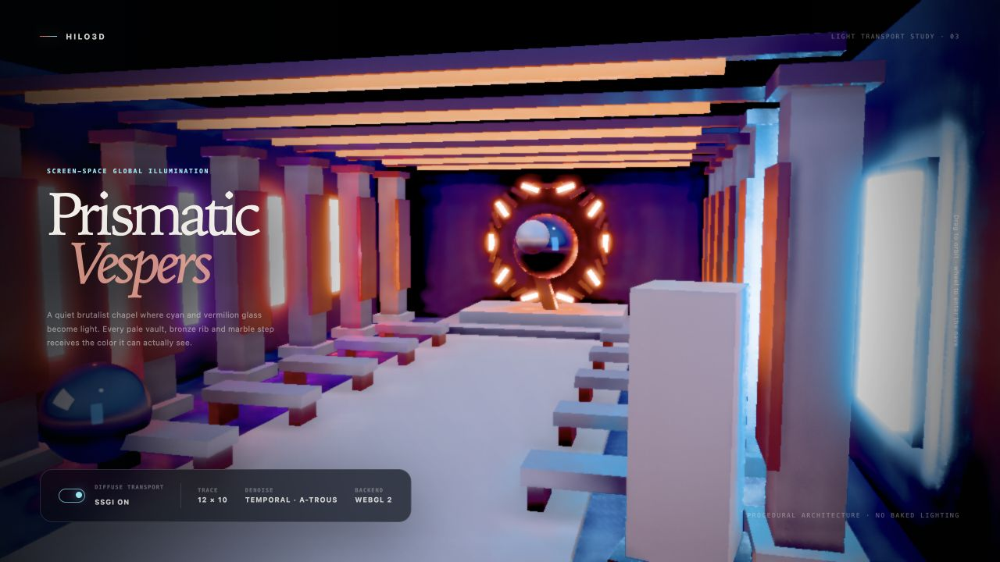
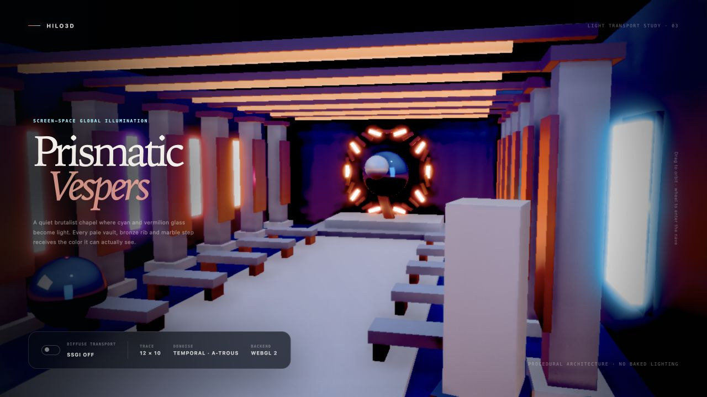

# Screen-space global illumination

Hilo3D 的 SSGI 是默认关闭、按需付费的屏幕空间漫反射全局光照 feature。普通 Forward 在 WebGPU 与 WebGL
2 上使用同一份 GLSL ES 3.00、Render Graph、portable RHI 和时序 controller；WebGPU Clustered
Forward+ 复用同一 controller，但消费 GPU
Scene 已有的 material-attributes 和融合 motion/log-depth 输出。实现不读取后端 framebuffer，不增加手写 WGSL 分支，也不在 shader 里调用隐式导数依赖的非一致采样。

## 公共入口

Turnkey HDR Forward 管线通过 `PostProcessRenderPipelineFactory` 启用：

```ts
new Hilo3d.PostProcessRenderPipelineFactory({
    screenSpaceGlobalIllumination: {
        resolutionScale: 0.5,
        rayCount: 8,
        stepCount: 8,
        maxRayDistance: 4,
        thickness: 0.18,
        distanceFadeStart: 0.72,
        intensity: 1,
        saturation: 1.1,
        maxRadiance: 8,
        historyWeight: 0.92,
        depthThreshold: 0.025,
        normalThreshold: 0.82,
        denoisePasses: 3
    }
});
```

也可以把 `new ScreenSpaceGlobalIllumination(options)` 放进
`ForwardRenderPipelineFactory.features`。Clustered Forward+ 使用同名 `screenSpaceGlobalIllumination`
option；该路径要求同时启用 `temporalAA`，以复用 GPU Scene 的 motion/log-depth 和 camera-cut
validity。未配置或显式设为 `false` 时不创建 attribute、motion、trace、filter、history 或 composite
resource。

所有 option 在 factory 构造时完成有限区间校验。`rayCount` 只接受 4/6/8/12，`stepCount`
只接受6/8/10/12，`denoisePasses`
只接受 1/2/3，避免运行时动态循环和未预算的 shader 变体。建议预算为：

| 质量用途       | resolutionScale | rays × steps | denoise |
| -------------- | --------------- | ------------ | ------- |
| 性能优先       | 0.5             | 4 × 6        | 1       |
| 默认生产       | 0.5             | 8 × 8        | 3       |
| 静态展示/摄影  | 0.5–0.75        | 12 × 10      | 3       |
| 小视口参考画面 | 1               | 12 × 12      | 3       |

## 帧编排与数据合同

普通 Forward 的 SSGI 路径固定记录：

```text
opaque color + depth
  -> reuse or produce material attributes (oct view normal + roughness/metallic flags)
  -> reuse or produce motion + logarithmic view depth
  -> stochastic view-space diffuse ray trace at resolutionScale
  -> submission-aware YCoCg variance-clipped temporal resolve
  -> 1–3 depth/normal/luminance-aware a-trous filters
  -> bounded depth/normal bilateral upsample
  -> additive linear-HDR diffuse composition
  -> transparent / Bloom / Color Uber / output
```

GTAO 位于 opaque 前并公开当帧 material-attributes 和 motion-depth；后续 SSGI/TAA 会复用同一 graph
handle。仅启用 SSGI 时，attribute 和 motion semantic pass 在 opaque 后以 load
depth 记录。Clustered 路径在未启用 GTAO 时由 opaque
MRT 写 attributes，启用 GTAO 时则复用独立 attribute pass；普通 Forward
fallback 继续通过共享 material semantic pass 覆盖。

trace 在 view-space normal 半球内使用逐帧旋转的低差异方向，以二次步长沿投影射线访问 scene
depth。命中必须满足 view-space thickness、最大距离、屏幕边缘衰减、receiver cosine 和反向 emitter
cosine。线性 HDR scene color 是 radiance source；`maxRadiance` 在单样本亮度上做有限 firefly
clamp，随后才应用 transport saturation 和距离权重。所有动态 texture
access 使用显式 LOD，因此经 Vulkan GLSL 4.50 → Naga → WGSL 后不依赖非一致控制流中的隐式导数。

SSGI history/output packing 为：

| Channel | 内容                                             |
| ------- | ------------------------------------------------ |
| RGB     | 非负线性 HDR diffuse transported radiance        |
| A       | `log2(1 + viewDepth)`；背景为负值 invalid marker |

## 时域、降噪与生命周期

history 按 Camera identity 双缓冲，只在成功 submission 后交换。以下情况重新初始化：

- 首帧、resize 或 history descriptor 变化；
- camera transform history 失效、显著 projection 变化或提交间断；
- Clustered GPU Scene 报告 camera cut/history invalid；
- device/context recovery。

resolve 使用 current-to-previous velocity、relative log-depth reject、normal similarity 和 3×3 YCoCg
neighborhood variance clip。像素速度和 current/history luminance delta 会降低 history
weight，减少移动物体拖影与发光体残影。a-trous
filter 同时约束 normal、log-depth 与 luminance；双边 upsample 以全分辨率 normal/motion
depth 选择低分辨率邻域。失败帧不提交 projection、transform revision、history
index 或 eviction；长时间不使用的 Camera history 通过 graph API 回收。

## 合成边界与限制

SSGI 在 transparent 前加入 attachment-zero 线性 HDR scene
color，因此透明物体接收合成后的背景，但不参与当前帧 radiance/depth/normal trace。Bloom 和 Color
Uber 继续消费合成后的 HDR 颜色。当前明确边界：

- 只追踪 opaque/masked surface；透明、折射和体积介质不是几何命中源；
- 屏幕外、被前景遮挡和 depth buffer 中不存在的几何不会贡献，这是 screen-space GI 的确定限制；
- `material-attributes` 当前不包含独立 diffuse albedo，transport 使用可见 scene
  radiance 做保守的加法漫反射近似；多次反弹、离屏 probes 和材质精确 BRDF
  transport 属于未来独立合同；
- 当前要求 full-output viewport；split viewport/multi-camera atlas 需要独立 history region 合同；
- 强烈的薄表面漏光应通过更小 `thickness`、更短 `maxRayDistance`
  或更高 resolutionScale 调整，不能用无限 thickness 掩盖；
- Clustered 路径仍是 WebGPU high-end profile；普通 Forward 的 SSGI 支持 WebGPU 与 WebGL 2。

## 示例与发布门槛

[`screen_space_global_illumination_chapel.html`](../examples/screen_space_global_illumination_chapel.html)
是程序化 Prismatic
Vespers 礼拜堂。左右 cyan/vermilion/violet 发光窗、浅色石材、青铜肋骨、长椅缝隙、祭坛球体和中轴台阶专门暴露彩色 diffuse
bounce、接触区 history 稳定性与深度边缘 upsample。按钮用相同场景、镜头和后端重载
`ssgi=true|false`，`backend=webgl2|webgpu` 显式选择后端；自动化模式固定相机并预热 history。

发布覆盖至少包含：option/requirements 单元测试、Forward 双后端 graph/history 生命周期、Clustered
option/requirements、Naga/WGSL pipeline validation、案例双后端非黑屏与 GPU error
gate，以及同机位 SSGI on/off 截图审查。

### 视觉对比基线

两张截图使用同一 WebGL
2 后端、固定相机、曝光与预热帧数；它们既用于 PR 视觉审查，也作为后续艺术与算法调优的参考证据。

| SSGI enabled                                                             | SSGI disabled                                                     |
| ------------------------------------------------------------------------ | ----------------------------------------------------------------- |
|  |  |
