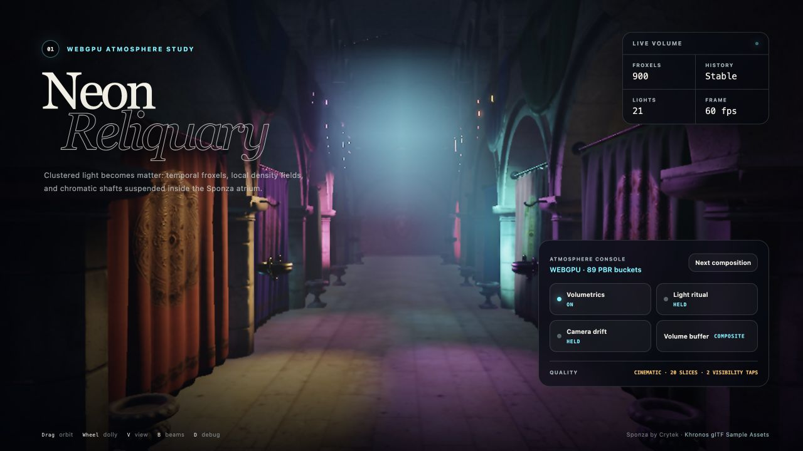

# Froxel volumetric lighting

Hilo3D 的生产体积光是 `ClusteredForwardPlusPipelineFactory` 的 WebGPU
high-end 可选路径。它默认关闭；关闭时不会扩大 3D cluster 覆盖范围，也不会创建 froxel
atlas、积分目标、时域 history、局部雾体 buffer 或额外 pass。



```ts
const pipeline = new Hilo3d.ClusteredForwardPlusPipelineFactory({
    buckets,
    temporalAA: { renderScale: 0.75 },
    volumetricLighting: {
        quality: 'high',
        density: 0.025,
        baseHeight: 0,
        heightFalloff: 0.12,
        maxDistance: 120,
        albedo: new Hilo3d.Color(0.92, 0.96, 1),
        anisotropy: 0.35,
        ambientStrength: 0.12,
        historyWeight: 0.9,
        depthThreshold: 0.04,
        localVolumes: [
            {
                shape: 'sphere',
                center: new Hilo3d.Vector3(0, 2, 0),
                radius: 5,
                density: 0.08,
                albedo: new Hilo3d.Color(0.3, 0.7, 1)
            }
        ]
    }
});
```

`quality` 接受 `low | medium | high | ultra`，并为未显式填写的 reconstruction
resolution 和 screen-space visibility budget 提供固定默认值。`resolutionScale`、`shadowSteps`
仍可独立覆盖。所有参数在 factory 构造时完成有限区间校验；配置冲突或设备能力不足会 fail-closed，不会静默关闭体积光或切换到 CPU/fragment 模拟。

## 帧内数据流

生产帧固定执行：

1. GPU Scene/ordinary fallback 共用 depth prepass；
2. local light 的全视锥 3D cluster count → prefix → bounded index write；
3. directional、point、spot light 与 global/local density 注入 camera-aligned froxel；
4. 每个 XY froxel column 沿对数 Z slice 只做一次 cumulative radiative-transfer integration；
5. 根据 opaque scene depth 以常数次 atlas 读取重建当前像素的 radiance/transmittance；
6. previous view-projection reprojection、scene-depth rejection、3×3 neighborhood clamp 与 reactive
   history blend；
7. 以 `scene * transmittance + in-scattering` 在线性 HDR 合成；
8. 可选 TAA/TAAU；
9. ordinary transparent fallback、Bloom 与 display transform。

因此 Bloom 消费体积高光，TAA/TAAU 可以稳定最终边缘；transparent 当前在体积合成之后绘制，不进入体积 history，也不会被当前 opaque-depth 积分重复衰减。这是显式的第一版透明策略，不把缺少透明深度/velocity 的结果伪装成正确体积遮挡。

所有 pass 和资源依赖都由同一 Render Graph 声明。storage texture、history、buffer upload、device
recovery 与 destruction 继续经过 portable RHI；功能代码不访问原生 `GPUDevice`、encoder 或 texture。

## Froxel 与 cluster 合同

普通 Clustered Forward+ 可以用 opaque depth bounds 跳过没有表面的 cluster
slice；体积光不能这样做，因为空气中的散射即使没有表面也必须存在。启用体积光后，同一个 bounded
allocator 会为完整相机体积建立 local light list。directional
light 仍使用稳定的全局前缀，不重复写入每个 cluster。

froxel XY 由 surface cluster tile grid 乘 `resolutionScale` 得到，并以 froxel 中心映射回完整 cluster
light list；因此降低体积分辨率不会降低 surface shading 的 cluster 精度。Z 使用 Camera
near/far 的对数切片。物理纹理把 Z slice 平铺进一个接近方形的 `rgba16float` 2D
atlas；布局按最大 viewport、tile size 与 `zSlices` 计算并进入 `maxTextureDimension2D`
创建期要求。这样不扩大当前 Direct WGSL compute 的完整 2D subresource ABI，也不会产生最高
`tileY × zSlices` 的狭长超限纹理。每个 texel 保存：

| Channel | 内容                                    |
| ------- | --------------------------------------- |
| RGB     | 单位长度的线性 HDR in-scattering source |
| A       | 单位长度 extinction coefficient         |

第二张同布局 atlas 沿每个 XY froxel column 累积 radiance/transmittance。每个 Z
segment 只计算一次指数透射 `exp(-extinction × segmentLength)` 和解析 homogeneous
integral；屏幕重建根据 opaque depth 在相邻累计 slice 间插值，不再为每个像素重复 ray
march。累计 radiance、density 和 transmittance 都有有限边界，零 extinction 分支不会产生除零或 NaN。

## 密度、局部雾体与光照

global medium 使用 `density × exp(-heightFalloff × max(worldY - baseHeight, 0))`。局部雾体支持：

- world-space sphere；
- axis-aligned world-space box；
- 独立 density、single-scattering albedo 与 smooth edge falloff；
- 录帧时读取 `center`/`halfExtents`，因此应用可复用对象 identity 并动画这些向量。

point/spot attenuation 与 surface Clustered PBR 使用相同的 range、constant/linear/quadratic
attenuation 和 spot cone 参数。phase function 使用有界 Henyey–Greenstein anisotropy；ambient
injection 只读取同一帧已打包的 ambient light，不创建隐藏的环境常量。

`shadowSteps` 对 froxel-to-light segment 执行 bounded screen-space depth
visibility。它能让当前 Camera 可见的动态遮挡物切断方向光和局部光束，并随质量档控制成本；离屏或被当前 Camera 完全遮住的 caster 不在这个 screen-space 合同内，确定性按可见处理。当前 Clustered
surface path 对显式 `Light.shadow` 仍保留 exact Forward fallback，体积路径不会谎称已消费 shared
shadow atlas。后续 atlas/virtual-shadow 接入必须增加明确的 atlas resource、matrix/index
ABI 和独立像素证据，不能暗中替换这里的 screen-space visibility。

## 时域与生命周期

体积 history 是双缓冲 `rgba16float` integrated radiance/transmittance 加双缓冲 `r32float` scene
device depth。每个像素取积分区间中的代表位置，通过 committed previous
view-projection 重投影；previous/current scene depth 负责 disocclusion
reject，当前 3×3 邻域限制旧 radiance，光照或透射突变会降低 history weight。

首次启用、Camera identity/revision cut、resize、history descriptor 改变和 device
generation 变化都会重新初始化。history current slot、CPU previous Camera
state、diagnostics 与 persistent buffer
revision 只在有效 submission 后提交；record/compile/prepare/execute/submit 失败会回滚，旧 history 留给下一次合法帧重试。

## 质量与诊断

| Preset | reconstruction scale | visibility samples |
| ------ | -------------------- | ------------------ |
| low    | 0.25                 | 1                  |
| medium | 0.375                | 2                  |
| high   | 0.5                  | 3                  |
| ultra  | 0.75                 | 5                  |

`ClusteredForwardPlusPipelineFactory.readDiagnostics()` 额外返回最后一次有效提交的
`volumetricFroxelCount` 与 `volumetricHistoryUsed`。`debugView: 'radiance' | 'transmittance'`
可以在正常 display transform 前替换 HDR scene，用于检查光注入和 extinction；`none` 是默认生产合成。

质量档只改变 froxel XY、重建和可见性预算，不改变 density、albedo、light units 或颜色空间。froxel
XY 同时由 `tileSize` 与 `resolutionScale` 决定，Z 密度由 pipeline 的 `zSlices`
决定；因此超大场景必须把 cluster index budget、viewport
limit 与体积质量作为一组预算，并通过 overflow diagnostics 验证，而不是在 overflow 时随机丢灯。

## 上线证据

- `test/spec/renderer/ClusteredForwardPlus.test.ts`：option、limit、format、local volume、完整 3D
  cluster contract，以及真实 WebGPU 的 compute/storage/history/HDR pass 链；
- `documentation/RENDERING_ARCHITECTURE.md`：生产帧顺序、fallback 与生命周期总合同；
- `examples/volumetric_neon_reliquary.html`：仓库内 Khronos Sponza、89 个 PBR bucket、8 个 animated
  spot light、12 个 floor light、7 个 local fog volume、40px surface cluster、0.375-scale froxel
  XY、20 Z slice、0.72 TAAU、Bloom、camera tour 与 radiance/transmittance debug 的完整 Neon
  Reliquary 案例；
- `test/ui/volumetric-lighting.spec.ts`：物理 GPU
  lane 的静止帧收敛、on/off 像素差异、非零 froxel、history reuse、zero cluster
  overflow、console/page/GPU validation error 门禁。SwiftShader 对这组 compute
  pipeline 的创建时间超过 portable lane 门限，因此像素证据明确留在 native WebGPU
  lane；便携 contract 由上面的 renderer/RHI 测试负责，不把软件编译超时伪装成画面通过。
